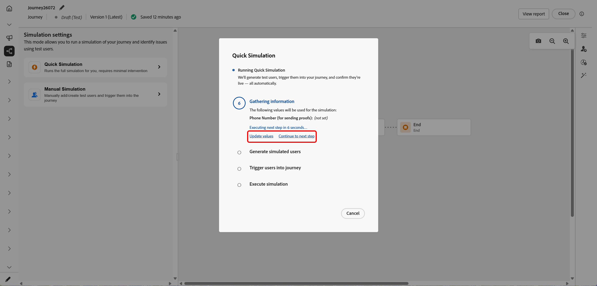

# Simuler votre parcours{#simulate-journey}

Utilisez **[!UICONTROL Simulation]** pour valider votre parcours avec des **utilisateurs simulés** avant de procéder à la publication. Cette page vous guide tout au long des étapes **[!UICONTROL Simulation rapide]** et **[!UICONTROL Simulation manuelle]**, de la création et de l’envoi d’utilisateurs simulés, du déclenchement d’événements unitaires lorsque votre parcours en a besoin, ainsi que de la révision du journal **[!UICONTROL Résultats]**.

Pour obtenir un aperçu par type de parcours, voir [Prise en main de la simulation de Parcours ](simulate-journey-gs.md).

## Types de simulation {#simulation-types}

Après l’activation, les parcours par lots avec entrée d’audience lue offrent deux manières d’exécuter une simulation :

* La **[!UICONTROL simulation rapide]** s’exécute de bout en bout avec les utilisateurs générés et les valeurs par défaut. Notez que la simulation rapide n’est pas disponible avec les parcours unitaires.

* La **[!UICONTROL simulation manuelle]** vous permet de choisir les utilisateurs, d’envoyer la commande, les payloads d’événement et les remplacements d’attente étape par étape.

### Simulation rapide {#quick-simulation}

Sur un parcours par lots dans **[!UICONTROL Simulation]**, **[!UICONTROL Simulation rapide]** exécute le parcours avec les utilisateurs générés et les paramètres préremplis.

1. Sélectionnez **[!UICONTROL Simulation rapide]**.

1. Examinez les champs que Adobe Journey Optimizer a collectés pour l’exécution. Cliquez sur **[!UICONTROL Mettre à jour les valeurs]** pour modifier les paramètres de l’épreuve ou du canal, ou continuez sans apporter de modifications.

   

1. Si vous avez ouvert **[!UICONTROL Mettre à jour les valeurs]**, modifiez les paramètres, par exemple l’adresse utilisée pour les BAT des messages, puis confirmez pour démarrer la simulation.

   

1. Adobe Journey Optimizer génère des utilisateurs simulés à partir de la définition du parcours et déclenche chaque utilisateur dans le parcours.

1. Une fois l’exécution terminée, cliquez sur **[!UICONTROL Afficher les résultats]** pour consulter les chemins d’accès, les erreurs et les branches découvertes. Voir [Afficher les résultats](#viewing-results).

   

### Simulation manuelle {#manual-simulation}

Choisissez **[!UICONTROL Simulation manuelle]** lorsque vous devez sélectionner chaque utilisateur simulé, contrôler l’ordre d’envoi, configurer les payloads de l’événement et remplacer les durées **[!UICONTROL d’attente]** de l’exécution. Ce flux s’applique aux parcours par lots et unitaires.

Continuez avec [Créer et gérer des utilisateurs simulés](#test-users), [Déclencher vos événements](#firing_events) et [Afficher les résultats](#viewing-results).

## Création et gestion d’utilisateurs simulés {#test-users}

>[!IMPORTANT]
>
>Vous avez besoin d’au moins de l’une des autorisations suivantes pour accéder à la fonction **[!UICONTROL Simulation]** : **Simuler des parcours**, **Publier des parcours** ou **Approuver et publier des parcours**. [En savoir plus](../administration/permissions.md)

Les utilisateurs simulés sont des entités temporaires de type profil que vous définissez dans **[!UICONTROL Paramètres de simulation]**. Cette section explique comment les créer, les enregistrer pour les réutiliser, les ajuster ou les supprimer de la liste et les envoyer dans le parcours.

1. Commencez par remplir la liste **[!UICONTROL Tester les utilisateurs]** :

   +++ Générer des utilisateurs à l’aide de l’IA

   Adobe Journey Optimizer génère un ensemble d’utilisateurs simulés à partir de la définition du parcours.

   Pour les parcours disposant d’un nœud E-mail ou SMS, l’IA vous invite à confirmer l’adresse e-mail ou le numéro de téléphone à utiliser. Une fois que vous avez terminé, cliquez sur **[!UICONTROL Générer]**.

   

   +++

   +++ Parcourir l’inventaire

   Choisissez **[!UICONTROL Parcourir l’inventaire]** pour ajouter des utilisateurs simulés que vous avez déjà enregistrés, par exemple, les utilisateurs que vous avez créés à partir d’un formulaire ou d’un fichier JSON, ou les utilisateurs que vous avez conservés après une exécution de génération d’IA.

   

   +++

   +++ Créer à partir d’un formulaire

   1. Saisissez un **[!UICONTROL Nom d’affichage]** et **[!UICONTROL Description]** pour identifier cet utilisateur simulé.

      

   1. Sélectionnez ensuite les attributs du schéma d’union à renseigner pour cet utilisateur.

   1. Cliquez sur **[!UICONTROL Ajouter une appartenance à une audience]** pour simuler les appartenances à un segment.

   1. Cliquez sur **[!UICONTROL Ajouter un profil]** pour créer plusieurs utilisateurs simulés au cours d’une seule session.

   1. Dans le menu, utilisez **[!UICONTROL Dupliquer]** pour copier un utilisateur, **[!UICONTROL Appliquer à tous]** pour copier les attributs d’un utilisateur vers tous les autres utilisateurs de la session ou **[!UICONTROL Supprimer]** pour supprimer un utilisateur.

      

   1. Cliquez sur **[!UICONTROL Enregistrer]** lorsque vous avez terminé de configurer les utilisateurs de cette session.

   +++

   +++ Créer à partir de JSON

   Définissez de nouveaux utilisateurs simulés en mettant à jour les champs correspondants avec vos données utilisateur simulées.

   

   +++

1. Les utilisateurs simulés que vous avez créés apparaissent dans la liste **[!UICONTROL Tester les utilisateurs]**. Pour chaque entrée, sélectionnez l’une des options suivantes :

   *  : mettez à jour les détails de l’utilisateur simulé.
   *  : exécutez la simulation pour cet utilisateur simulé uniquement.
   *  : supprimez l’utilisateur de cette liste. L’utilisateur simulé n’est pas supprimé et reste disponible dans la sélection Utilisateurs simulés .

   

1. Pour modifier la liste après votre sélection, cliquez sur **[!UICONTROL Gérer les utilisateurs]** pour ajouter d’autres utilisateurs simulés, à partir de l’inventaire ou en créant de nouveaux. Pour supprimer chaque utilisateur de la liste **[!UICONTROL Tester les utilisateurs]** pour cette exécution, choisissez **[!UICONTROL Effacer tous les utilisateurs]**.

   

1. Si votre parcours comprend une activité **[!UICONTROL Attente]**, ouvrez l’onglet **[!UICONTROL Paramètres de test]** pour définir précisément la durée de cette attente pendant la simulation. Par exemple, si l’activité active **[!UICONTROL Attente]** est configurée pendant plusieurs jours, vous pouvez la remplacer par 10 secondes afin que l’utilisateur simulé ne passe que cette durée sur le nœud avant de passer à l’activité suivante.

1. Cliquez sur **[!UICONTROL Envoyer tout]** pour envoyer chaque utilisateur simulé dans la liste du parcours, ou cliquez sur  sur une ligne pour envoyer uniquement cet utilisateur. Un message de confirmation `Simulated users have entered the journey successfully.` s’affiche lorsque les utilisateurs simulés rejoignent le parcours avec succès.

   

1. Si le parcours comprend des événements unitaires, vous devez sélectionner l’événement à déclencher. Voir [ Déclencher vos événements](#firing_events).

1. Accédez à l’onglet **[!UICONTROL Résultats]** pour ouvrir le journal d’exécution et consulter l’exécution de chaque étape. Pour plus d’informations, voir [Affichage des résultats](#viewing-results).

Après avoir validé le parcours dans **[!UICONTROL Simulation]**, consultez le journal **[!UICONTROL Résultats]**. Si des erreurs s’affichent, laissez **[!UICONTROL Simulation]**, apportez les modifications requises au parcours et exécutez à nouveau **[!UICONTROL Simulation]** jusqu’à ce que l’exécution semble correcte. Vous pouvez ensuite publier le parcours. Voir [Publier votre parcours ](../building-journeys/publish-journey.md).

## Déclencher vos événements {#firing_events}

Si votre parcours comprend un ou plusieurs événements unitaires, vous pouvez les déclencher lorsque la Simulation est active.

1. Dans **[!UICONTROL Sélectionner le type d’événement]**, sélectionnez l’événement à déclencher pour cette simulation.

   

1. Pour appliquer la même modification à chaque utilisateur de la liste, utilisez l’option **[!UICONTROL Gérer les événements]** pour :

   * **[!UICONTROL Générez des valeurs d’événement]** pour permettre à Adobe Journey Optimizer de générer la payload à l’aide de l’IA. Lorsque des valeurs sont générées, l’utilisateur est marqué **[!UICONTROL Prêt à envoyer]**.
   * **[!UICONTROL Modifier la date de l’événement]** pour modifier la payload de cet utilisateur simulé uniquement.

   

1. Configurez la payload d’événement pour chaque utilisateur en cliquant sur l’ en regard d’un utilisateur pour :

   * **[!UICONTROL Générez des valeurs d’événement]** pour permettre à Adobe Journey Optimizer de générer la payload à l’aide de l’IA. Lorsque des valeurs sont générées, l’utilisateur est marqué **[!UICONTROL Prêt à envoyer]**.
   * **[!UICONTROL Modifier la date de l’événement]** pour modifier la payload de cet utilisateur simulé uniquement.

   

1. Dans **[!UICONTROL Tester les événements]**, sélectionnez **[!UICONTROL Envoyer tout]** pour envoyer dans le parcours chaque utilisateur simulé répertorié sous **[!UICONTROL Tester les utilisateurs]** ou sélectionnez  pour qu’un seul utilisateur exécute la simulation pour cet utilisateur uniquement.

   

1. Une fois les événements déclenchés, la zone de travail se met à jour pour refléter la progression de chaque utilisateur. Cliquez sur n’importe quelle ligne de la liste **[!UICONTROL Tester les utilisateurs]** pour afficher le nouveau chemin emprunté par l’utilisateur dans le parcours.

1. Accédez à l’onglet **[!UICONTROL Résultats]** pour ouvrir le journal d’exécution et consulter l’exécution de chaque étape. Pour plus d’informations, voir [Affichage des résultats](#viewing-results).

## Affichage des résultats {#viewing-results}

L’onglet **[!UICONTROL Résultats]** vous permet d’afficher les résultats du test. Dans le menu déroulant **[!UICONTROL Tester l’utilisateur]**, sélectionnez l’utilisateur simulé dont vous souhaitez contrôler l’exécution.

Sélectionnez **[!UICONTROL Tous]** pour afficher les résultats agrégés pour chaque utilisateur simulé dans l’exécution. Cette vue vous permet d’analyser la simulation complète en un coup d’œil, les activités, les résultats et les erreurs, sans sélectionner un seul utilisateur simulé au préalable.

Pour chaque activité, le journal peut indiquer si l’utilisateur simulé est entré ou sorti de l’étape, ainsi que les erreurs survenues pendant la simulation.

Pour les activités **Attente**, le journal comprend deux valeurs liées à la durée :

* **Durée définie** : durée spécifiée sur l&#39;activité **Attente** pour le parcours publié et appliquée une fois le parcours actif. Le journal enregistre si la simulation applique un remplacement à partir des paramètres de test, par exemple 10 secondes, plutôt que de se fier uniquement à la valeur définie sur le parcours.
* **Durée réelle** : temps écoulé pendant lequel l’utilisateur simulé est resté sur l’activité **Attente**. Cette valeur est définie à partir de l’onglet **[!UICONTROL Paramètres de test]**.

Lorsque des erreurs apparaissent dans le journal, laissez **Simulation**, apportez les modifications requises au parcours et exécutez à nouveau **Simulation**. Une fois la validation réussie, publiez le parcours. Voir [Publier votre parcours ](../building-journeys/publish-journey.md).
