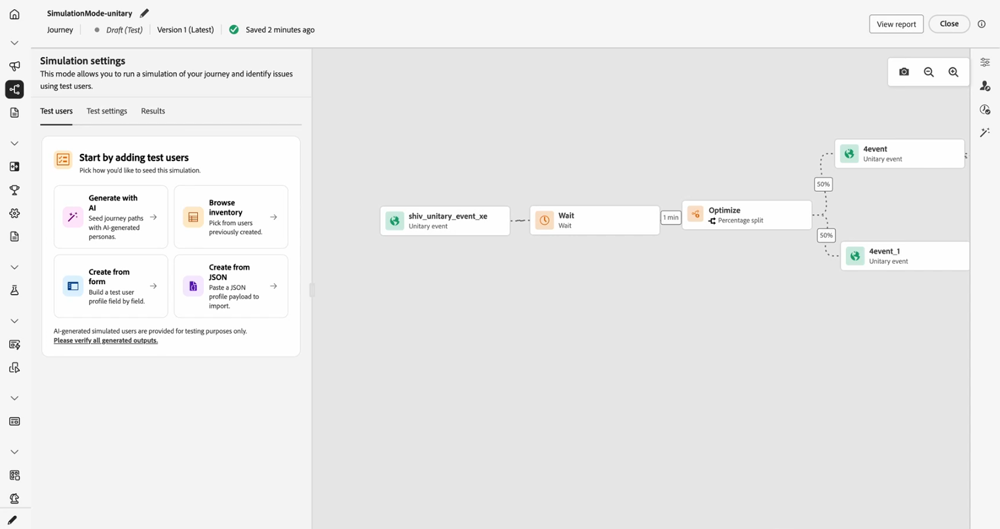

# Prise en main de la simulation de Parcours {#simulate-journey-gs}

Vous pouvez définir le parcours sur **[!UICONTROL Simulation]** en plus de **Brouillon**, **Mode test** et **En direct**. Dans la simulation, vous testez avec des **utilisateurs simulés** : entités temporaires de type profil que vous ajoutez, sans utiliser de profils de test persistants dans Adobe Experience Platform.

Adobe Journey Optimizer propose deux méthodes pour tester et valider votre parcours :

* **[Simulation](#test-users)** : utilisez la fonctionnalité de parcours **[!UICONTROL Simulation]** et les utilisateurs simulés pour des exécutions rapides sans profils précréés dans Adobe Experience Platform.

* **[Mode test](testing-the-journey.md)** : utilisez des profils persistants marqués comme profils de test dans Adobe Experience Platform, réutilisables entre les sessions. Choisissez cette approche lorsque vous avez besoin de données cohérentes et prédéfinies. [Découvrez comment créer des profils de test](../audience/creating-test-profiles.md).

## Simulation par type de parcours {#by-journey-type}

Le panneau **[!UICONTROL Simulation]** affiche uniquement les étapes dont votre parcours a besoin. Cela dépend de la manière dont les profils entrent dans le parcours. À partir de ces facteurs, Adobe Journey Optimizer fait apparaître différentes expériences de simulation. Développez chaque type ci-dessous pour voir en quoi l’exécution diffère et quels panneaux vous utilisez.

Pour plus d’informations, voir [&#x200B; Simuler votre parcours &#x200B;](simulate-journey.md).

+++ Parcours par lots avec une audience lue

Le parcours est déclenché par une **lecture d’audience**. La zone de travail ne comporte aucune activité d’événement unitaire, les profils se déplacent uniquement entre les conditions, les attentes et les actions de canal.

Avec parcours batch avec une audience lue **, vous pouvez accéder à la simulation rapide ou à la simulation manuelle.**

+++

+++ Parcours par lots avec audience lue et événements unitaires

Parcours de déclenchement de segment qui comprend un ou plusieurs événements unitaires le long du chemin d’accès. Après avoir envoyé des utilisateurs, vous déclenchez des événements pour les utilisateurs qui attendent au niveau d’un nœud d’événement.

Avec parcours batch avec une audience lue et des événements unitaires **, vous pouvez accéder à la simulation rapide ou à la simulation manuelle.**

+++

+++ Parcours unitaire

Le parcours **commence** par un événement unitaire, et non par une audience lue. Un utilisateur simulé ne saisit pas le parcours tant que cet événement de début n’a pas été déclenché pour lui.

Avec parcours unitaire **, vous accédez directement au menu Simulation manuelle .**

+++

## Lancer la simulation {#launch}

Passez le parcours à **[!UICONTROL Simulation]** pour le tester avec des utilisateurs et utilisatrices simulés. Les tâches détaillées sont présentées dans la section [&#x200B; Simuler votre parcours &#x200B;](simulate-journey.md).

1. Dans le parcours, cliquez sur **[!UICONTROL Simuler]** et choisissez **[!UICONTROL Simuler]**.

   

1. Attendez la fin de l’activation. Lorsque le parcours passe à **[!UICONTROL Simulation]**, les commandes du panneau sont désactivées et réactivées automatiquement une fois l’activation terminée.

## Limites {#limitations}

Dans cette version, la **[!UICONTROL Simulation]** peut ne pas prendre en charge toutes les activités, tous les canaux ou toutes les intégrations pris en charge par le **[!UICONTROL mode Test]** ou un parcours en direct. En outre, le comportement peut changer à mesure que la fonctionnalité se développe. Utilisez cet article pour les workflows pris en charge.

Pour en savoir plus sur les limites de la simulation, consultez les listes déroulantes ci-dessous.

+++ Restrictions au niveau du nœud

Si un parcours contient l’un des nœuds suivants, il ne peut pas être démarré dans **[!UICONTROL Simulation]**. Le parcours doit être modifié ou le nœud correspondant supprimé avant que la simulation puisse s’exécuter.

| Nœud restreint | Notes |
| --- | --- |
| Événements métier | Les parcours commençant par un événement métier ne peuvent pas être exécutés dans **[!UICONTROL Simulation]**. |
| ID supplémentaire (plusieurs reprises) | Une rentrée simultanée (plusieurs instances actives pour le même utilisateur simulé) empêche le démarrage de **[!UICONTROL Simulation]**. |
| Nœud de décision de contenu | Cette activité doit être supprimée ou modifiée avant de pouvoir simuler le parcours. |
| Recherche de jeu de données | Les recherches de jeux de données client par clé ne sont pas prises en charge. Les parcours qui incluent cette activité ne peuvent pas être exécutés dans **[!UICONTROL Simulation]**. |
| Expérimentation de chemin (Optimiser — Variante d’expérience) | Non pris en charge dans **[!UICONTROL Simulation]**. Vous pouvez toujours utiliser l’option **[!UICONTROL Optimiser]** pour les flux qui résidaient auparavant sous **[!UICONTROL Condition]** (par exemple, les conditions de source de données). |
| Ciblage des chemins (optimisation, variante de règle de ciblage) | Non pris en charge dans **[!UICONTROL Simulation]**. |
| Enrichissement des attributs d’audience externe | Les parcours qui utilisent des attributs personnalisés provenant de sources d’audience externes ne démarrent pas dans **[!UICONTROL Simulation]** lorsque cette validation est activée. |

+++

 

+++ Limites fonctionnelles

Les fonctionnalités suivantes ne sont pas prises en charge dans **[!UICONTROL Simulation]**.

| Fonctionnalité | Notes |
| --- | --- |
| Critères de sortie | Les critères de sortie ne sont pas appliqués lorsque vous exécutez **[!UICONTROL Simulation]**. |
| [!DNL Adobe Journey Optimizer] la prise de décision au sein d’une action (par exemple, le contenu d’un e-mail avec la prise de décision Adobe Journey Optimizer) | Les épreuves d’action pour le contenu qui utilise [!DNL Adobe Journey Optimizer] decisioning ne sont pas générées. |
| Simuler une réponse d’action personnalisée | [!UICONTROL Actions personnalisées] effectuez par défaut un véritable appel sortant. La simulation de la réponse afin qu’aucun appel externe ne s’exécute n’est pas prise en charge. |
| Évaluation des politiques de consentement | Le consentement ne peut pas être simulé au niveau de l’utilisateur simulé. |
| plafonnement et arbitrage des parcours | Non pris en charge dans **[!UICONTROL Simulation]**. |
| Capping de la fréquence (par canal ou type de communication) | Non pris en charge dans **[!UICONTROL Simulation]**. |
| Gestion, suppression et listes autorisées du processus d’opt-out | Suit la configuration du routage des messages là où elle s’applique. |
| Sous-domaine dynamique et attributs dynamiques dans les configurations de canal | Suit la configuration du routage des messages là où elle s’applique. |
| Optimisation de l’heure d’envoi (STO) | Non pris en charge dans **[!UICONTROL Simulation]**. |
| Outil Sandbox (copie d’utilisateurs simulés dans des sandbox) | Non pris en charge. |
| Envoi de vagues dans les parcours | Non pris en charge. |
| Heures creuses | Non pris en charge. |
| Gestion, suppression et listes autorisées du processus d’opt-out | Non pris en charge. |
| Sous-domaine dynamique et attributs dynamiques dans les configurations de canal | Non pris en charge. |
| Privacy Service | Les utilisateurs simulés ne sont pas des profils persistants conformes au RGPD. N’incluez pas de données client réelles dans les utilisateurs simulés. |

+++

 

+++ Mécanismes de sécurisation quantitatifs 

Ces mécanismes de sécurisation s’appliquent à **[!UICONTROL Simulation]**. Les limites numériques sont appliquées dans l’interface du parcours et au moment de l’exécution. Les limites peuvent changer dans une version ultérieure. Si vous vous approchez d’un plafond, vérifiez le comportement dans votre sandbox.

| Mécanisme de sécurisation | Limite | Notes |
| --- | --- | --- |
| Nombre maximal d’utilisateurs simulés pouvant être sélectionnés et déclenchés dans un lot (parcours par lots, flux déclenchés par un événement et flux de qualification d’audience) | 20 | Comptabilisé pour chaque **[!UICONTROL Envoyer tout]** ou **[!UICONTROL Déclencher les événements sélectionnés]** ; pas de limite cumulée pour l’ensemble du parcours. |
| Nombre maximal d’utilisateurs simulés uniques testés au cours d’une seule exécution de simulation | 100 | Atteindre **100** utilisateurs uniques en un seul bloc d’exécution **[!UICONTROL Sélectionner des utilisateurs simulés]** pour les nouveaux utilisateurs simulés. Si vous êtes à **90**, vous pouvez ajouter au plus 10 **&#x200B;**&#x200B;avant le même bloc. |
| Nombre maximal de parcours pouvant être exécutés en même temps dans un sandbox **[!UICONTROL Simulation]** | 20 | La limite est partagée par chaque parcours **[!UICONTROL Simulation]** à la fois dans ce sandbox. |
| Nombre maximal d’utilisateurs actifs simulés dans un sandbox | 2,000 | Nombre maximal d’utilisateurs simulés pouvant exister simultanément dans le sandbox. Adobe peut ajuster cette limite en fonction des commentaires des clients. |
| Préremplissage De L’Événement (Navigateur Uniquement) | — | Vous pouvez préremplir les champs de payload d’événement uniquement dans l’interface utilisateur de la simulation basée sur un navigateur. Les valeurs préremplies restent dans ce navigateur et ne sont pas synchronisées avec d’autres navigateurs, appareils ou sessions, de sorte que vous pouvez voir différentes données de préremplissage à chaque emplacement que vous testez. |

+++
