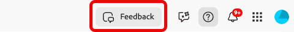
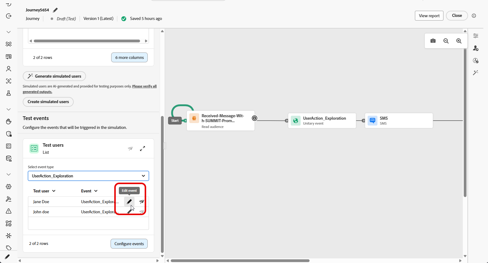

# Simuler votre parcours{#testing_the_journey}

>[!IMPORTANT]
>
> Cette fonctionnalité est disponible pour tous les clients en tant que disponibilité limitée avec des fonctionnalités essentielles.

Vous pouvez définir le parcours sur **[!UICONTROL Simulation]** en plus de **Brouillon**, **Mode test** et **En direct**. Dans la simulation, vous testez avec des **utilisateurs simulés** : entités temporaires de type profil que vous ajoutez, sans utiliser de profils de test persistants dans Adobe Experience Platform.

Adobe Journey Optimizer propose deux méthodes pour tester et valider votre parcours :

* **[Simulation](#test-users)** : utilisez la fonctionnalité de parcours **[!UICONTROL Simulation]** et les utilisateurs simulés pour des exécutions rapides sans profils précréés dans Adobe Experience Platform.

* **[Mode test](testing-the-journey.md)** : utilisez des profils persistants marqués comme profils de test dans Adobe Experience Platform, réutilisables entre les sessions. Choisissez cette approche lorsque vous avez besoin de données cohérentes et prédéfinies. [Découvrez comment créer des profils de test](../audience/creating-test-profiles.md).

Notez que Parcours Simulation est en **disponibilité limitée**. Pour partager vos commentaires et nous aider à améliorer l’expérience, ouvrez **[!UICONTROL Commentaires]** dans la barre supérieure.

## Création et gestion d’utilisateurs simulés {#test-users}

>[!IMPORTANT]
>
>Vous avez besoin de l’autorisation **Simuler des parcours** pour accéder à la fonctionnalité **[!UICONTROL Simulation]**. [En savoir plus](../administration/permissions.md)

Les utilisateurs simulés sont des entités temporaires de type profil que vous définissez dans **[!UICONTROL Paramètres de simulation]**. Cette section explique comment les créer, à partir de l’interface utilisateur ou d’un fichier JSON, les enregistrer pour les réutiliser, les ajuster ou les supprimer de la liste et les envoyer dans le parcours.

### Création d’utilisateurs simulés

Les étapes suivantes vous montrent comment créer des utilisateurs simulés à partir de l’interface utilisateur ou en important un fichier JSON.

1. Dans votre Parcours, ouvrez **[!UICONTROL Simuler]** et choisissez **[!UICONTROL Simuler]**.

   

1. Cliquez sur **[!UICONTROL Créer des utilisateurs simulés]** pour créer des utilisateurs et choisissez de créer des utilisateurs à partir de l’interface utilisateur ou de les importer à partir de JSON.

   Pour réutiliser les utilisateurs simulés à la place, cliquez sur **[!UICONTROL Sélectionner des utilisateurs simulés]** et sélectionnez les entrées que vous avez enregistrées précédemment.

   

1. Si vous créez des utilisateurs simulés à partir de JSON, mettez à jour les champs correspondants avec vos données d’utilisateur simulées.

1. Si vous créez des utilisateurs simulés à partir de l’interface utilisateur, saisissez un **[!UICONTROL Nom d’affichage]** et un **[!UICONTROL Description]** pour identifier cet utilisateur simulé. Sélectionnez ensuite les attributs du schéma d’union à renseigner pour cet utilisateur.

   

1. Cliquez sur ajouter **[!UICONTROL appartenance à une audience]** pour simuler les appartenances à un segment.

1. Cliquez sur **[!UICONTROL Ajouter un profil]** pour créer plusieurs utilisateurs simulés au cours d’une seule session.

1. Pour chaque utilisateur simulé que vous avez ajouté au cours de cette session, vous pouvez utiliser les actions suivantes :

   * **[!UICONTROL Dupliquer]** : ajoute un nouvel utilisateur simulé qui réplique la configuration terminée d’une entrée existante, vous pouvez ensuite modifier le doublon si nécessaire.
   * **[!UICONTROL Appliquer à tous]** : propage les valeurs ou paramètres d’attribut d’un utilisateur simulé à tous les autres utilisateurs simulés de la liste.
   * **[!UICONTROL Supprimer]** : supprime la personne simulée sélectionnée de la liste.

1. Cliquez sur **[!UICONTROL Enregistrer]** pour stocker un ou plusieurs utilisateurs simulés en vue d’une utilisation ultérieure.

1. Après l’enregistrement, les utilisateurs simulés que vous avez créés apparaissent dans la liste **[!UICONTROL Tester les utilisateurs]**. Pour chaque entrée, ouvrez le menu d’options et sélectionnez l’une des options suivantes :

   *  : mettez à jour les détails de l’utilisateur simulé.
   *  : exécutez la simulation pour cet utilisateur simulé uniquement.
   *  : supprimez l’utilisateur de cette liste. L’utilisateur simulé n’est pas supprimé et reste disponible dans la sélection Utilisateurs simulés .

   

1. Si votre parcours comprend une activité **[!UICONTROL Attente]**, ouvrez l’onglet **[!UICONTROL Paramètres de test]** pour définir précisément la durée de cette attente pendant la simulation.

1. Cliquez sur **[!UICONTROL Envoyer tout]** pour envoyer dans le parcours tous les utilisateurs simulés figurant dans la liste. Un message de confirmation `Simulated users have been sent successfully.` s’affiche lorsque les utilisateurs simulés rejoignent le parcours avec succès.

   

1. Accédez à l’onglet **[!UICONTROL Résultats]** pour ouvrir les résultats d’exécution et passer en revue l’exécution de chaque étape. Pour plus d’informations, voir [Affichage des résultats](#viewing-logs).

Après avoir validé le parcours dans **[!UICONTROL Simulation]**, consultez le journal **[!UICONTROL Résultats]**. Si des erreurs s’affichent, laissez **[!UICONTROL Simulation]**, apportez les modifications requises au parcours et exécutez à nouveau **[!UICONTROL Simulation]** jusqu’à ce que l’exécution semble correcte. Vous pouvez ensuite publier le parcours. Voir [Publier votre parcours &#x200B;](../building-journeys/publish-journey.md).

### Sélectionner des utilisateurs simulés

Les utilisateurs simulés créés manuellement sont stockés et peuvent être sélectionnés dans cette liste lorsque la simulation est activée sur d’autres parcours.

1. Définissez le parcours sur **[!UICONTROL Simulation]**. Ouvrez le point d’entrée **[!UICONTROL Simuler]** et choisissez **[!UICONTROL Simulation]** afin que le parcours utilise la fonction Simulation, par exemple avec le mode Test ou Actif, selon votre espace de travail.

   

1. Dans le panneau **[!UICONTROL Paramètres de simulation]**, vous pouvez sélectionner les utilisateurs simulés précédemment créés en cliquant sur **[!UICONTROL Sélectionner des utilisateurs simulés]**.

   

1. Faites votre choix dans la liste des utilisateurs simulés qui ont été précédemment créés et enregistrés.

1. Une fois les utilisateurs simulés sélectionnés, ils sont désormais disponibles dans la liste **[!UICONTROL Tester les utilisateurs]**. Dans le menu d’options, choisissez l’une des options suivantes :

   *  pour modifier les utilisateurs et modifier ses détails.
   *  pour envoyer la simulation à un seul utilisateur simulé.
   *  pour effacer les utilisateurs simulés de la liste. Notez que l’effacer ne la supprime pas, elle peut toujours être sélectionnée dans la liste Utilisateurs simulés .

   

1. Cliquez sur **[!UICONTROL Envoyer tout]** pour envoyer dans le parcours tous les utilisateurs simulés figurant dans la liste. Un message de confirmation `Simulated users entered the journey successfully.` s’affiche lorsque les utilisateurs simulés rejoignent le parcours avec succès.

   

1. Cliquez sur **[!UICONTROL Afficher le journal]** pour ouvrir le journal d’exécution et consulter l’exécution de chaque étape. Pour plus d&#39;informations, voir [Afficher les résultats](#viewing-logs).

Après avoir validé le parcours dans **[!UICONTROL Simulation]**, consultez le journal **[!UICONTROL Résultats]**. Si des erreurs s’affichent, laissez **[!UICONTROL Simulation]**, apportez les modifications requises au parcours et exécutez à nouveau **[!UICONTROL Simulation]** jusqu’à ce que l’exécution semble correcte. Vous pouvez ensuite publier le parcours. Voir [Publier votre parcours &#x200B;](../building-journeys/publish-journey.md).

## Déclencher vos événements {#firing_events}

Si votre parcours comprend un ou plusieurs événements, vous pouvez les déclencher lorsque la simulation est active.

1. Dans **[!UICONTROL Sélectionner le type d’événement]**, sélectionnez l’événement à déclencher pour cette simulation.

   

1. Cliquez sur  pour ajuster l’événement pour cet utilisateur simulé.

   

1. Dans le menu déroulant Utilisateur simulé , sélectionnez l’utilisateur simulé et terminez la configuration de l’événement et de la manière dont il est généré.

   

1. Cliquez sur **[!UICONTROL Déclencher les événements sélectionnés]**.

   Un message de confirmation `Events triggered successfully` s’affiche lorsque les utilisateurs simulés rejoignent le parcours avec succès.

1. Cliquez sur **[!UICONTROL Afficher le journal]** pour ouvrir le journal d’exécution et consulter l’exécution de chaque étape. Pour plus d&#39;informations, voir [Afficher les résultats](#viewing-logs).

## Affichage des résultats {#viewing-logs}

L’onglet **[!UICONTROL Résultats]** vous permet d’afficher les résultats du test. Utilisez le sélecteur d’affichage pour choisir la manière de parcourir le journal :

* **Tous les utilisateurs simulés** : sélectionnez **[!UICONTROL Tous]** pour afficher les résultats agrégés pour chaque utilisateur simulé dans l’exécution. Cette vue vous permet d’analyser la simulation complète en un coup d’œil, l’activité, les résultats et les erreurs, sans sélectionner un seul utilisateur simulé au préalable.

* **Un utilisateur simulé** : dans le menu déroulant **[!UICONTROL Tester l’utilisateur]**, sélectionnez l’utilisateur simulé dont vous souhaitez inspecter l’exécution.

Pour chaque activité, le journal peut indiquer si l’utilisateur simulé est entré ou sorti de l’étape, ainsi que les erreurs survenues pendant la simulation.

Pour les activités **Attente**, le journal comprend deux valeurs liées à la durée :

* **Durée définie** : durée spécifiée sur l&#39;activité **Attente** pour le parcours publié et appliquée une fois le parcours actif. Le journal enregistre si la simulation applique un remplacement à partir des paramètres de test, par exemple 10 secondes, plutôt que de se fier uniquement à la valeur définie sur le parcours.
* **Durée réelle** : temps écoulé pendant lequel l’utilisateur simulé est resté sur l’activité **Attente**. Cette valeur est définie à partir de l’onglet **[!UICONTROL Paramètres de test]**.

Lorsque des erreurs apparaissent dans le journal, laissez **Simulation**, apportez les modifications requises au parcours et exécutez à nouveau **Simulation**. Une fois la validation réussie, publiez le parcours. Voir [Publier votre parcours &#x200B;](../building-journeys/publish-journey.md).

## Limites {#limitations}

Dans cette version, la **[!UICONTROL Simulation]** peut ne pas prendre en charge toutes les activités, tous les canaux ou toutes les intégrations pris en charge par le **[!UICONTROL mode Test]** ou un parcours en direct. En outre, le comportement peut changer à mesure que la fonctionnalité se développe. Suivez les procédures décrites dans cet article pour connaître les workflows pris en charge.

Pour en savoir plus sur les limites de la simulation, consultez les listes déroulantes ci-dessous.

+++ Restrictions au niveau du nœud

Si un parcours contient l’un des nœuds suivants, il ne peut pas être démarré dans **[!UICONTROL Simulation]**. Le parcours doit être modifié ou le nœud correspondant supprimé avant que la simulation puisse s’exécuter.

| Nœud restreint | Notes |
| --- | --- |
| Événements métier | Les parcours commençant par un événement métier ne peuvent pas être exécutés dans **[!UICONTROL Simulation]**. |
| ID supplémentaire (plusieurs reprises) | Une rentrée simultanée (plusieurs instances actives pour le même utilisateur simulé) empêche le démarrage de **[!UICONTROL Simulation]**. |
| Nœud de décision de contenu | Cette activité doit être supprimée ou modifiée avant de pouvoir simuler le parcours. |
| Recherche de jeu de données | Les recherches de jeux de données client par clé ne sont pas prises en charge. Les parcours qui incluent cette activité ne peuvent pas être exécutés dans **[!UICONTROL Simulation]**. |
| Expérimentation de chemin (Optimiser — Variante d’expérience) | Non pris en charge dans **[!UICONTROL Simulation]**. Vous pouvez toujours utiliser l’option **[!UICONTROL Optimiser]** pour les flux qui résidaient auparavant sous **[!UICONTROL Condition]** (par exemple, les conditions de source de données). |
| Ciblage des chemins (optimisation, variante de règle de ciblage) | Non pris en charge dans **[!UICONTROL Simulation]**. |
| Enrichissement des attributs d’audience externe | Les parcours qui utilisent des attributs personnalisés provenant de sources d’audience externes ne démarrent pas dans **[!UICONTROL Simulation]** lorsque cette validation est activée. |

+++

 

+++ Limites fonctionnelles

Les fonctionnalités suivantes ne sont pas prises en charge dans **[!UICONTROL Simulation]**.

| Fonctionnalité | Notes |
| --- | --- |
| Critères de sortie | Les critères de sortie ne sont pas appliqués lorsque vous exécutez **[!UICONTROL Simulation]**. |
| [!DNL Adobe Journey Optimizer] la prise de décision au sein d’une action (par exemple, le contenu d’un e-mail avec la prise de décision Adobe Journey Optimizer) | Les épreuves d’action pour le contenu qui utilise [!DNL Adobe Journey Optimizer] decisioning ne sont pas générées. |
| Simuler une réponse d’action personnalisée | [!UICONTROL Actions personnalisées] effectuez par défaut un véritable appel sortant. La simulation de la réponse afin qu’aucun appel externe ne s’exécute n’est pas prise en charge. |
| Évaluation des politiques de consentement | Le consentement ne peut pas être simulé au niveau de l’utilisateur simulé. |
| plafonnement et arbitrage des parcours | Non pris en charge dans **[!UICONTROL Simulation]**. |
| Capping de la fréquence (par canal ou type de communication) | Non pris en charge dans **[!UICONTROL Simulation]**. |
| Gestion, suppression et listes autorisées du processus d’opt-out | Suit la configuration du routage des messages là où elle s’applique. |
| Sous-domaine dynamique et attributs dynamiques dans les configurations de canal | Suit la configuration du routage des messages là où elle s’applique. |
| Optimisation de l’heure d’envoi (STO) | Non pris en charge dans **[!UICONTROL Simulation]**. |
| Outil Sandbox (copie d’utilisateurs simulés dans des sandbox) | Non pris en charge. |
| Envoi de vagues dans les parcours | Non pris en charge. |
| Heures creuses | Non pris en charge. |
| Gestion, suppression et listes autorisées du processus d’opt-out | Non pris en charge. |
| Sous-domaine dynamique et attributs dynamiques dans les configurations de canal | Non pris en charge. |
| Privacy Service | Les utilisateurs simulés ne sont pas des profils persistants conformes au RGPD. N’incluez pas de données client réelles dans les utilisateurs simulés. |

+++

 

+++ Mécanismes de sécurisation quantitatifs 

Ces mécanismes de sécurisation s’appliquent à **[!UICONTROL Simulation]**. Les limites numériques sont appliquées dans l’interface du parcours et au moment de l’exécution. Les limites peuvent changer dans une version ultérieure. Si vous vous approchez d’un plafond, vérifiez le comportement dans votre sandbox.

| Mécanisme de sécurisation | Limite | Notes |
| --- | --- | --- |
| Nombre maximal d’utilisateurs simulés pouvant être sélectionnés et déclenchés dans un lot (parcours par lots, flux déclenchés par un événement et flux de qualification d’audience) | 20 | Comptabilisé pour chaque **[!UICONTROL Envoyer tout]** ou **[!UICONTROL Déclencher les événements sélectionnés]** ; pas de limite cumulée pour l’ensemble du parcours. |
| Nombre maximal d’utilisateurs simulés uniques testés au cours d’une seule exécution de simulation | 100 | Atteindre **100** utilisateurs uniques en un seul bloc d’exécution **[!UICONTROL Sélectionner des utilisateurs simulés]** pour les nouveaux utilisateurs simulés. Si vous êtes à **90**, vous pouvez ajouter au plus 10 **&#x200B;**&#x200B;avant le même bloc. |
| Nombre maximal de parcours pouvant être exécutés en même temps dans un sandbox **[!UICONTROL Simulation]** | 20 | La limite est partagée par chaque parcours **[!UICONTROL Simulation]** à la fois dans ce sandbox. |
| Nombre maximal d’utilisateurs actifs simulés dans un sandbox | 2,000 | Nombre maximal d’utilisateurs simulés pouvant exister simultanément dans le sandbox. Adobe peut ajuster cette limite en fonction des commentaires des clients. |
| Préremplissage De L’Événement (Navigateur Uniquement) | — | Le préremplissage des événements est pris en charge dans le navigateur uniquement. Les données d’événement préremplies sont spécifiques au navigateur. |

+++
