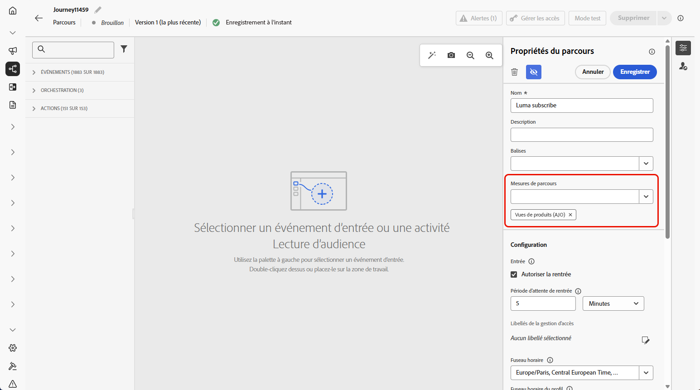
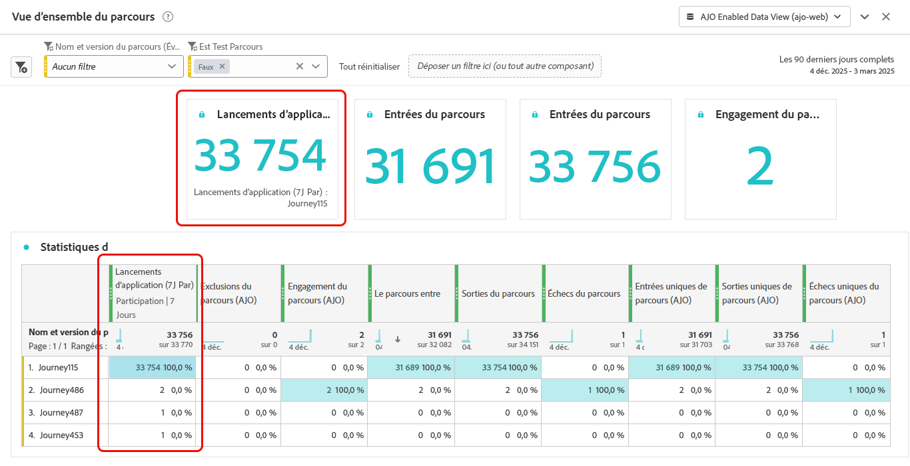

# Configurer et suivre les mesures de votre parcours {#success-metrics}

Bénéficiez d’une visibilité claire sur l’efficacité de vos parcours client avec les mesures de parcours. Cette fonctionnalité vous permet de suivre les performances par rapport aux KPI définis, de découvrir des informations sur ce qui fonctionne et d’identifier les domaines à optimiser. En mesurant l’impact en temps réel, vous pouvez favoriser l’amélioration continue et prendre des décisions informées qui augmentent l’engagement des clientes et clients.

## Conditions préalables {#prerequisites}

Avant d’utiliser vos mesures de parcours, vous devez ajouter un jeu de données qui inclut les `Commerce Details`, les `Web` et les `Mobile` [groupes de champs](https://experienceleague.adobe.com/docs/experience-platform/xdm/tutorials/create-schema-ui.html?lang=fr#field-group){target="_blank"} sous Configuration > Création de rapports dans [!DNL Adobe Experience Platform].

Ces groupes de champs doivent être sélectionnés parmi les options intégrées, et non à partir de groupes personnalisés. Consultez la section [Ajouter des jeux de données](../reports/reporting-configuration.md#add-datasets).

## Mesures disponibles {#metrics}

La liste des mesures varie en fonction des [groupes de champs](https://experienceleague.adobe.com/docs/experience-platform/xdm/tutorials/create-schema-ui.html?lang=fr#field-group){target="_blank"} inclus dans votre jeu de données.

Si votre jeu de données n’est pas configuré, seules les mesures suivantes seront disponibles : **[!UICONTROL Clic]**, **[!UICONTROL Clic unique]**, **[!UICONTROL Taux de clics]** et **[!UICONTROL Taux d’ouverture]**.

Notez qu’avec une licence Customer Journey Analytics, vous pouvez créer des mesures de succès personnalisées. [En savoir plus](https://experienceleague.adobe.com/fr/docs/analytics-platform/using/cja-components/cja-calcmetrics/cm-workflow/participation-metric)

| Mesures | Groupe de champs associé |
|-|-|
| Clics | Aucun groupe de champs requis |
| Clics uniques | Aucun groupe de champs requis |
| Taux de clics (CTR) | Aucun groupe de champs requis |
| Taux d’ouverture par clic (CTOR) | Aucun groupe de champs requis |
| Pages vues | Groupe de champs web |
| Lancements d’application | Groupe de champs mobile |
| Premiers lancements d’application | Groupe de champs mobile |
| Installations de l’application | Groupe de champs mobile |
| Mises à niveau d’application | Groupe de champs mobile |
| Achats | Groupe de champs Détails commerciaux |
| Passages en caisse | Groupe de champs Détails commerciaux |
| Ajouts au panier | Groupe de champs Détails commerciaux |
| Ouvertures de panier | Groupe de champs Détails commerciaux |
| Vues du panier | Groupe de champs Détails commerciaux |
| Suppressions du panier | Groupe de champs Détails commerciaux |
| Produits vus | Groupe de champs Détails commerciaux |
| Enregistrer pour plus tard | Groupe de champs Détails commerciaux |

## Attribution {#attribution}

Chaque mesure est fournie avec une attribution définie qui détermine les points de contact ou interactions qui ont contribué à un résultat spécifique.

* **Attribution de mesures avec la licence Journey Optimizer** :

  Avec la licence Journey Optimizer uniquement, l’intervalle de recherche en amont disponible maximal pour toute mesure sélectionnée est défini sur 7 jours. Pour ces mesures, le modèle d’attribution est défini par défaut sur **Dernier contact**, c’est-à-dire la dernière interaction avant la conversion.

  Par exemple, vous pouvez suivre si un achat a été effectué après qu’un client ou une cliente a interagi avec votre parcours au cours des 7 derniers jours.

* **Attribution de mesures avec la licence Customer Journey Analytics** :

  Avec les licences Journey Optimizer et Customer Journey Analytics, vous pouvez créer des mesures personnalisées avec des paramètres d’attribution spécifiques ou modifier les attributions des mesures intégrées.

  En savoir plus sur les [modèles d’attribution](https://experienceleague.adobe.com/fr/docs/analytics-platform/using/cja-dataviews/component-settings/attribution#attribution-models)

## Attribuer les mesures de votre parcours {#assign}

>[!IMPORTANT]
>
>Une seule mesure de parcours est autorisée par parcours.

Pour commencer à effectuer le suivi des mesures de votre parcours, procédez comme suit :

1. Dans le menu **[!UICONTROL Parcours]**, cliquez sur **[!UICONTROL Créer un parcours]**.

1. Modifiez le volet de configuration du parcours pour définir le nom du parcours et ses propriétés. Découvrez comment définir les propriétés de votre parcours sur [cette page](../building-journeys/journey-properties.md).

1. Choisissez les **[!UICONTROL mesures de parcours]** qui seront utilisées pour mesurer l’efficacité de votre parcours.

   Notez que les mesures s’appliquent au parcours lui-même et à tous les éléments du parcours.

   

1. Cliquez sur **[!UICONTROL Enregistrer]**.

1. Concevez votre parcours avec les **[!UICONTROL Activités]** nécessaires.

1. Testez et publiez le parcours.

1. Ouvrez votre rapport de parcours pour suivre les performances des mesures de succès attribuées.

   Les mesures que vous avez choisies s’affichent dans les KPI du rapport et le tableau des statistiques du parcours.

   

