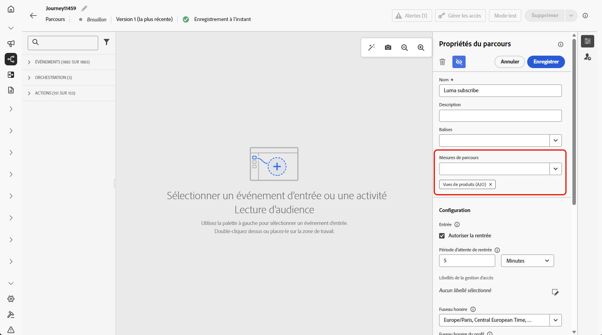

# Configurer et suivre les mesures de votre parcours {#success-metrics}

>[!BEGINSHADEBOX]

**Sur cette page :** découvrez comment configurer et affecter des mesures de parcours pour effectuer le suivi des performances par rapport à vos KPI et mesurer l’efficacité de vos parcours client en temps réel.

>[!ENDSHADEBOX]

Bénéficiez d’une visibilité claire sur l’efficacité de vos parcours client avec les mesures de parcours. Cette fonctionnalité vous permet de suivre les performances par rapport aux KPI définis, de découvrir des informations sur ce qui fonctionne et d’identifier les domaines à optimiser. En mesurant l’impact en temps réel, vous pouvez favoriser l’amélioration continue et prendre des décisions informées qui augmentent l’engagement des clientes et clients.

## Conditions préalables {#prerequisites}

Avant d’utiliser vos mesures de parcours, vous devez ajouter un jeu de données qui inclut les `Commerce Details`, les `Web` et les `Mobile` [groupes de champs](https://experienceleague.adobe.com/docs/experience-platform/xdm/tutorials/create-schema-ui.html?lang=fr#field-group){target="_blank"} sous Configuration > Création de rapports dans [!DNL Adobe Experience Platform].

Ces groupes de champs doivent être sélectionnés parmi les options intégrées, et non à partir de groupes personnalisés. Consultez la section [Ajouter des jeux de données](../reports/reporting-configuration.md#add-datasets).

## Mesures disponibles {#metrics}

La liste des mesures varie en fonction des [groupes de champs](https://experienceleague.adobe.com/docs/experience-platform/xdm/tutorials/create-schema-ui.html?lang=fr#field-group){target="_blank"} inclus dans votre jeu de données.

Si votre jeu de données n’est pas configuré, seules les mesures suivantes seront disponibles : **[!UICONTROL Clic]**, **[!UICONTROL Clic unique]**, **[!UICONTROL Taux de clics]** et **[!UICONTROL Taux d’ouverture]**.

Notez qu’avec une licence Customer Journey Analytics, vous pouvez créer des mesures de succès personnalisées. [En savoir plus](https://experienceleague.adobe.com/fr/docs/analytics-platform/using/cja-components/cja-calcmetrics/cm-workflow/participation-metric)

| Mesures | Groupe de champs associé |
|-|-|
| Clics | Aucun groupe de champs requis |
| Clics uniques | Aucun groupe de champs requis |
| Taux de clics (CTR) | Aucun groupe de champs requis |
| Taux d’ouverture par clic (CTOR) | Aucun groupe de champs requis |
| Pages vues | Groupe de champs web |
| Lancements d’application | Groupe de champs mobile |
| Premiers lancements d’application | Groupe de champs mobile |
| Installations de l’application | Groupe de champs mobile |
| Mises à niveau d’application | Groupe de champs mobile |
| Achats | Groupe de champs Détails commerciaux |
| Passages en caisse | Groupe de champs Détails commerciaux |
| Ajouts au panier | Groupe de champs Détails commerciaux |
| Ouvertures de panier | Groupe de champs Détails commerciaux |
| Vues du panier | Groupe de champs Détails commerciaux |
| Suppressions du panier | Groupe de champs Détails commerciaux |
| Produits vus | Groupe de champs Détails commerciaux |
| Enregistrer pour plus tard | Groupe de champs Détails commerciaux |

## Attribution {#attribution}

Chaque mesure est fournie avec une attribution définie qui détermine les points de contact ou interactions qui ont contribué à un résultat spécifique.

* **Attribution de mesures avec la licence Journey Optimizer** :

  Avec la licence Journey Optimizer uniquement, l’intervalle de recherche en amont disponible maximal pour toute mesure sélectionnée est défini sur 7 jours. Pour ces mesures, le modèle d’attribution est défini par défaut sur **Dernier contact**, c’est-à-dire la dernière interaction avant la conversion.

  Par exemple, vous pouvez suivre si un achat a été effectué après qu’un client ou une cliente a interagi avec votre parcours au cours des 7 derniers jours.

* **Attribution de mesures avec la licence Customer Journey Analytics** :

  Avec les licences Journey Optimizer et Customer Journey Analytics, vous pouvez créer des mesures personnalisées avec des paramètres d’attribution spécifiques ou modifier les attributions des mesures intégrées.

  En savoir plus sur les [modèles d’attribution](https://experienceleague.adobe.com/fr/docs/analytics-platform/using/cja-dataviews/component-settings/attribution#attribution-models)

## Attribuer les mesures de votre parcours {#assign}

>[!IMPORTANT]
>
>Une seule mesure de parcours est autorisée par parcours.

Pour commencer à effectuer le suivi des mesures de votre parcours, procédez comme suit :

1. Dans le menu **[!UICONTROL Parcours]**, cliquez sur **[!UICONTROL Créer un parcours]**.

1. Modifiez le volet de configuration du parcours pour définir le nom du parcours et ses propriétés. Découvrez comment définir les propriétés de votre parcours sur [cette page](../building-journeys/journey-properties.md).

1. Choisissez les **[!UICONTROL mesures de parcours]** qui seront utilisées pour mesurer l’efficacité de votre parcours.

   Notez que les mesures s’appliquent au parcours lui-même et à tous les éléments du parcours.

   

1. Cliquez sur **[!UICONTROL Enregistrer]**.

1. Concevez votre parcours avec les **[!UICONTROL Activités]** nécessaires.

1. Testez et publiez le parcours.

1. Ouvrez votre rapport de parcours pour suivre les performances des mesures de succès attribuées.

   Les mesures que vous avez choisies s’affichent dans les KPI du rapport et le tableau des statistiques du parcours.

   

+++ Référence des connaissances sur l’IA

Cette section contient des connaissances structurées destinées à soutenir l’interprétation, la récupération et la réponse aux questions liées à ce sujet.

Pour une compréhension totale, ces informations doivent être combinées avec la documentation de cette page. Aucune des sources n’est conçue pour être autonome. La page décrit la fonctionnalité, tandis que cette section fournit un contexte supplémentaire qui permet de clarifier la terminologie, l’intention, l’applicabilité et les contraintes.

* **TL;DR:** Cette page explique comment configurer et suivre les mesures de succès des parcours dans Adobe Journey Optimizer en attribuant un KPI à un parcours et en examinant ses performances dans les rapports de parcours.

**Intentions:**
* Ajoutez les groupes de champs de jeu de données AEP requis (Détails Commerce, Web, Mobile) comme condition préalable aux mesures de parcours
* Affectation d’une mesure de parcours (KPI) à un parcours lors de la création ou de la configuration du parcours
* Identifiez les mesures disponibles en fonction des groupes de champs de jeux de données configurés
* Interprétation des modèles d’attribution pour les mesures de parcours sous les licences Journey Optimizer et Customer Journey Analytics
* Création de mesures de succès personnalisées à l’aide d’une licence Customer Journey Analytics
* Suivre les performances du parcours par rapport aux indicateurs de performance clés attribués dans les rapports de parcours

**Glossaire:**
* **mesures de Parcours** : indicateurs clés de performance attribués à un parcours pour mesurer son efficacité, visibles dans les rapports de parcours *(spécifiques au produit)*
* **Attribution Dernière touche** : modèle d’attribution par défaut qui attribue le crédit à l’interaction la plus récente avant une conversion
* **Groupe de champs Détails Commerce** : groupe de champs XDM permettant les mesures liées au commerce telles que les achats, les paiements et les événements de panier
* **Intervalle de recherche en amont** : période pendant laquelle l’attribution est évaluée ; défini sur une durée maximale de 7 jours avec la licence Journey Optimizer uniquement

**Mécanismes de sécurisation :**
* Une seule mesure de parcours est autorisée par parcours
* Les groupes de champs du jeu de données (Détails Commerce, Web, Mobile) doivent être sélectionnés à partir des options intégrées, et non des groupes personnalisés, et ajoutés sous Configuration > Création de rapports dans Adobe Experience Platform
* Sans jeu de données configuré, seuls les clics, les clics uniques, le taux de clics publicitaires et le taux d’ouverture sont disponibles
* L’intervalle de recherche en amont maximal est de 7 jours avec une licence Journey Optimizer uniquement
* Les mesures et paramètres d’attribution personnalisés nécessitent une licence Customer Journey Analytics

**Terminologie:**
* Nom canonique : mesures de Parcours — Acronyme : aucun — variantes : mesures de succès, mesures de succès de parcours
* Nom canonique : Taux de clics — Acronyme : CTR — Variantes : aucune
* Nom canonique : Taux d’ouverture de clics publicitaires — Acronyme : CTOR — variantes : aucune
* Synonymes : « mesures de parcours » = « mesures de succès » (utilisé de manière interchangeable dans l’interface utilisateur et la documentation)
* Ne les confondez pas : « attribution de licence Journey Optimizer » ≠ « attribution Customer Journey Analytics » : la licence CJA permet des modèles d’attribution personnalisés et des intervalles de recherche en amont plus longs

**FAQ:**
* **Q : Combien de mesures de parcours puis-je affecter à un seul parcours ?** — Une seule mesure de parcours est autorisée par parcours.
* **Q : Quelles mesures sont disponibles si je n’ai pas configuré de jeu de données avec des groupes de champs ?** — Seuls les clics, les clics uniques, le taux de clics publicitaires et le taux d’ouverture sont disponibles sans configuration supplémentaire du groupe de champs.
* **Q : De quels groupes de champs ai-je besoin pour activer les mesures d’achat et de commerce ?** — Vous devez ajouter le groupe de champs Détails du Commerce à votre jeu de données de rapports dans Adobe Experience Platform.
* **Q : Quel est le modèle d’attribution par défaut pour les mesures de parcours ?** — Dernière touche, qui attribue l’interaction la plus récente avant la conversion, avec un intervalle de recherche en amont de 7 jours maximum sous une licence Journey Optimizer.
* **Q : Puis-je créer des mesures de succès personnalisées ?** — Oui, mais uniquement avec une licence Customer Journey Analytics.
* **Q : Où puis-je voir les résultats des mesures de parcours après leur publication ?** : dans le tableau KPI et statistiques du parcours du rapport de Parcours.

+++
