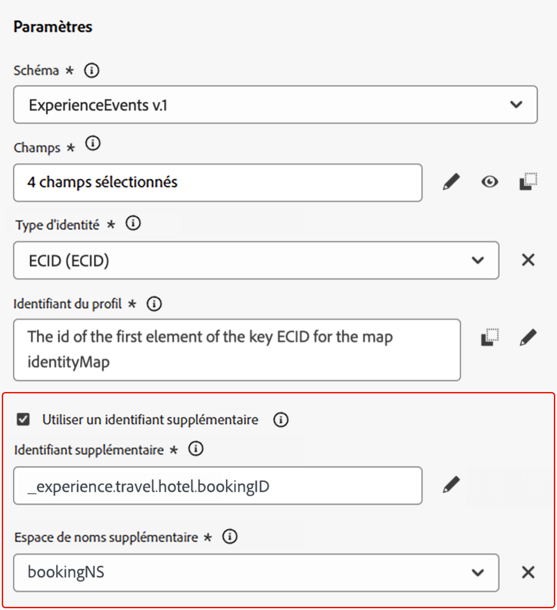
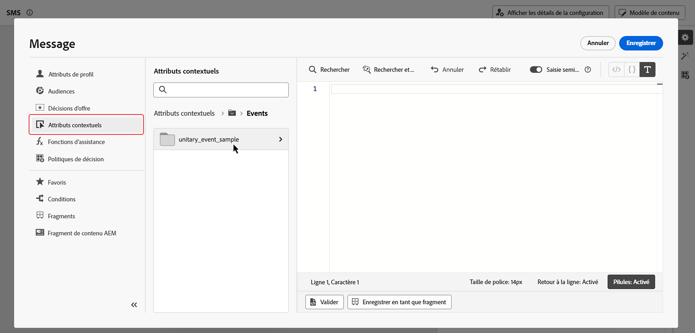

# Utiliser des identifiants supplémentaires dans les parcours {#supplemental-id}

>[!BEGINSHADEBOX]

**Sur cette page :** Découvrez comment utiliser des identifiants supplémentaires (identifiants secondaires tels qu’un identifiant de commande ou de réservation) pour exécuter une instance de parcours distincte par identifiant et personnaliser les messages avec ses attributs.

>[!ENDSHADEBOX]

>[!CONTEXTUALHELP]
>id="ajo_journey_parameters_supplemental_identifier"
>title="Utiliser un identifiant supplémentaire"
>abstract="L’identifiant supplémentaire est un identifiant secondaire qui fournit un contexte supplémentaire pour l’exécution d’un parcours. Pour le définir, sélectionnez n’importe quel attribut non-identité (ou identité non-personne) de l’audience ou de l’événement à utiliser comme identifiant supplémentaire."

<table style="border-collapse: collapse; width: 100%;">
  <tr>
    <td style="vertical-align: top; padding-right: 20px; border: none;">
      <p>Par défaut, les parcours sont exécutés dans le cadre d’un <b>identifiant de profil</b>. Cela signifie que, tant que le profil est actif dans un parcours donné, il ne pourra pas rejoindre à nouveau un autre parcours. Pour éviter cela, Journey Optimizer vous permet de capturer un <b>identifiant supplémentaire</b> tel qu’un identifiant de commande, d’abonnement ou de prescription, en plus de l’identifiant de profil.  
      <p>Dans cet exemple, nous avons ajouté un <b>identifiant de réservation</b> en tant qu’identifiant supplémentaire.</p>
      <p>Ce faisant, les parcours sont exécutés dans le contexte de l’identifiant de profil associé à l’identifiant supplémentaire (ici, l’identifiant de réservation). Une instance du parcours est exécutée pour chaque itération de l’identifiant supplémentaire. Cela permet plusieurs entrées du même ID de profil dans les parcours s’ils ont effectué des réservations différentes.</p>
      <p>En outre, Journey Optimizer vous permet d’utiliser les attributs de l’identifiant supplémentaire (par exemple, le numéro de réservation, la date de renouvellement de l’ordonnance, le type de produit) pour personnaliser les messages, ce qui garantit des communications hautement pertinentes.</p>
    </td>
    <td style="vertical-align: top; border: none; text-align: center; width: 40%;">
      
    </td>
  </tr>
</table>

➡️ [Découvrez cette fonctionnalité en vidéo.](#video)

## Mécanismes de sécurisation et limitations {#guardrails}

* **Parcours pris en charge** : des identifiants supplémentaires sont pris en charge pour les parcours **déclenchés par un événement** et de **lecture d’audience**. Ils ne sont **pas pris en charge** pour les parcours de qualification d’audience (c’est-à-dire les parcours commençant par une activité de qualification d’audience).

* **Actions entrantes** : les identifiants supplémentaires ne sont actuellement pas pris en charge pour les actions entrantes, telles que les actions in-app et web.

* **Limites d’instances simultanées** : les profils ne peuvent pas avoir plus de 10 instances de parcours simultanées.

* **Type de données et structure du schéma** : l’identifiant supplémentaire doit être de type `string`. Il peut s’agir d’un attribut de chaîne indépendant ou d’un attribut de chaîne dans un tableau d’objets. L’attribut de chaîne indépendant entraîne une instance de parcours unique, tandis que l’attribut de chaîne dans un tableau d’objets entraîne une instance de parcours unique par itération du tableau d’objets. Les tableaux et mappages de chaînes ne sont pas pris en charge.

* **Réentrée dans un parcours**

  Le comportement de réentrée d’un parcours avec des identifiants supplémentaires respecte la politique de réentrée existante :

   * Si le parcours ne prend pas en charge la rentrée, la même combinaison d’identifiant de profil + identifiant supplémentaire ne peut pas réintégrer le parcours.
   * Si le parcours prend en charge la rentrée avec une période, la même combinaison d’identifiant de profil + identifiant supplémentaire peut réintégrer après la période définie.

* **DULE (Data Use Labeling and Enforcement)** - Aucune vérification de validation DULE n’est effectuée sur l’ID supplémentaire. Cela signifie que cet attribut n’est pas pris en compte lorsque le parcours recherche des violations de la politique de gouvernance des données.

* **Configuration des événements en aval**

  Si vous utilisez un autre événement en aval dans le parcours, il doit utiliser le même identifiant supplémentaire et posséder le même espace de noms d’identifiant.

* **Parcours de lecture d’audience**

   * **Événements métier** : l’ID supplémentaire est désactivé si vous utilisez un événement métier.
   * **Champs d’événement et de contexte** : l’identifiant supplémentaire ne doit pas provenir d’un champ de contexte d’événement ou de parcours.
   * **Sélection d’attributs** : tout attribut non identitaire (ou identité non personnelle) peut être utilisé comme ID supplémentaire, pour tous les types d’audience (service de profil unifié, importation de fichier CSV et composition d’audience fédérée). Les attributs d’identité basés sur une personne ne sont pas autorisés. Pour les audiences externes, voir [Identifiants supplémentaires avec audiences externes](#external-audiences) pour les modèles de données pris en charge et les exigences de configuration.
   * **Taux de lecture** : pour les parcours d’audience lue à l’aide d’un champ d’ID supplémentaire de type tableau, le taux de lecture de l’activité Lecture d’audience est limité à un maximum de 500 profils par seconde.

## Comportement des critères de sortie avec des ID supplémentaires {#exit-criteria}

Condition préalable : parcours activé pour l’ID supplémentaire (via l’événement unitaire ou les activités de lecture d’audience)

Le tableau ci-dessous explique le comportement des profils dans un parcours activé pour un ID supplémentaire lorsque le critère de sortie est configuré :

| Configuration des critères de sortie | Comportement lorsque le critère de sortie est satisfait |
| ---------------------------- | ---------------------------------- |
| Basé sur un événement d’ID non supplémentaire | Toutes les instances du profil correspondant dans ce parcours sont fermées. |
| En fonction d’un événement d’ID supplémentaire <br/>*Note : l’espace de noms d’ID supplémentaire doit correspondre à celui du nœud initial.* | Seule l’instance de profil + ID supplémentaire correspondante est fermée. |
| En fonction d’une audience | Toutes les instances du profil correspondant dans ce parcours sont fermées. |

## Ajouter un identifiant supplémentaire et l’utiliser dans un parcours {#add}

>[!BEGINTABS]

>[!TAB Parcours déclenché par un événement]

Pour utiliser un identifiant supplémentaire dans un parcours déclenché par un événement, procédez comme suit :

1. **Ajoutez l’ID supplémentaire à l’événement.**

   1. Créez ou modifiez l’événement souhaité. [Découvrez comment configurer un événement unitaire.](../event/about-creating.md)

   1. Dans l’écran de configuration des événements, cochez l’option **[!UICONTROL Utiliser un identifiant supplémentaire]**.

      

   1. Utilisez l’éditeur d’expression pour sélectionner le champ à utiliser comme ID supplémentaire (par exemple, ID de réservation, ID d’abonnement).

      >[!NOTE]
      >
      >Veillez à utiliser l’éditeur d’expression en **[!UICONTROL mode avancé]** pour sélectionner l’attribut.

1. **Ajoutez l’événement au parcours.**

   Faites glisser l’événement personnalisé sur la zone de travail de parcours. Cela déclenche l’entrée de parcours en fonction de l’identifiant de profil et de l’identifiant supplémentaire.

   

>[!TAB Parcours de lecture d’audience]

Pour utiliser un identifiant supplémentaire dans un parcours de lecture d’audience, procédez comme suit :

1. **Ajouter et configurer une activité Lecture d’audience dans le parcours**

   1. Placez une activité **[!UICONTROL Lecture d’audience]** dans votre parcours.

   1. Dans le volet des propriétés de l’activité, activez l’option **[!UICONTROL Utiliser un identifiant supplémentaire]**.

      

   1. Dans le champ **[!UICONTROL Identifiant supplémentaire]**, utilisez l’éditeur d’expression pour sélectionner l’attribut d’identifiant supplémentaire.

   Pour les audiences [importées à partir d’un fichier CSV](https://experienceleague.adobe.com/docs/experience-platform/segmentation/ui/overview.html?lang=fr#import-audience){target="_blank"}, si votre audience CSV contient plusieurs lignes par identifiant de profil, assurez-vous d’abord que l’activation express est activée ; voir [Identifiants supplémentaires avec audiences externes](#external-audiences).

       >[ !REMARQUE]
       >
       >Vérifiez que vous utilisez l’éditeur d’expression en **[!UICONTROL mode avancé]** pour sélectionner l’attribut.
   
>[!ENDTABS]

## Utiliser des attributs d’ID supplémentaires

Utilisez l’éditeur d’expression et l’éditeur de personnalisation pour référencer les attributs de l’identifiant supplémentaire à des fins de personnalisation ou de logique conditionnelle. Les attributs sont accessibles à partir du menu **[!UICONTROL Attributs contextuels]**.



Pour les parcours déclenchés par un événement, si vous utilisez des tableaux (par exemple, plusieurs ordonnances ou contrats d’assurance), utilisez une formule pour extraire des éléments spécifiques.

+++ Voir les exemples

Dans un tableau d’objets avec l’ID supplémentaire comme `bookingNum` et un attribut au même niveau appelé `bookingCountry`, le parcours effectue une itération sur l’objet de tableau en fonction de bookingNum et crée une instance de parcours sur chaque objet.

* L’expression suivante dans l’activité de condition effectue une itération sur le tableau d’objets et vérifie si la valeur de `bookingCountry` est égale à « FR » :

  ```
  @event{<event_name>.<object_path>.<object_array_name>.all(currentEventField.<attribute_path>.bookingNum==${supplementalId}).at(0).<attribute_path>.bookingCountry}=="FR"
  ```

* L’expression suivante dans l’éditeur de personnalisation d’e-mail effectue une itération dans le tableau d’objets, extrait la valeur `bookingCountry` applicable à l’instance de parcours active et l’affiche dans le contenu :

  ```
  {{#each context.journey.events.<event_ID>.<object_path>.<object_array_name> as |l|}} 
  
   {{l.<attribute_path>.bookingCountry}}  
  
  {{/each}}
  ```

* Exemple d’événement de déclenchement du parcours :

  ```
  "bookingList": [
        {
            "bookingInfo": {
                "bookingNum": "x1",
                      "bookingCountry": "US"
            }
        },
        {
            "bookingInfo": {
                "bookingNum": "x2",
                "bookingCountry": "FR"
            }
        }
    ]
  ```

+++

## Arbitrage des pièces d&#39;identité supplémentaires et des parcours {#arbitration}

L’arbitrage des parcours (y compris les limites de simultanéité et le comptage des entrées dans les ensembles de règles) fonctionne au niveau de l’ID de profil, et non au niveau de la paire (ID de profil, ID supplémentaire). Cela signifie qu’une limite d’accès simultané de 1 peut bloquer une seconde instance de parcours pour le même profil, même si elle comporte une valeur d’identifiant supplémentaire différente.

Contactez votre représentant Adobe pour obtenir des conseils sur le comportement d’arbitrage avant de vous fier à des paramètres d’arbitrage spécifiques en production.

**Documentation connexe :**

* [Limitation et arbitrage des parcours](../conflict-prioritization/journey-capping.md)
* [Utiliser des jeux de règles](../conflict-prioritization/rule-sets.md)
* [Gestion des conflits et hiérarchisation](../conflict-prioritization/gs-conflict-prioritization.md)

## Identifiants supplémentaires avec audiences externes {#external-audiences}

Les ID supplémentaires sont pris en charge pour les audiences externes, y compris les audiences [importées à partir d’un fichier CSV](https://experienceleague.adobe.com/docs/experience-platform/segmentation/ui/overview.html?lang=fr#import-audience){target="_blank"} et les audiences créées avec [Composition d’audience fédérée](../audience/get-started-audience-orchestration.md). Lors de la configuration d’un parcours qui lit à partir d’une audience CSV ou de composition d’audience fédérée, vous pouvez désigner n’importe quel attribut non identitaire de cette audience comme ID supplémentaire. Journey Optimizer crée ensuite une instance de parcours distincte par combinaison profil unique + ID supplémentaire.

* Cas d’utilisation 1 : une ligne par paire profil unique + ID supplémentaire

  Il s’agit du principal cas d’utilisation des audiences CSV et de composition d’audiences fédérées. L’audience contient plusieurs lignes, chacune d’elles représentant une combinaison unique d’un profil (par exemple, un client) et d’un identifiant supplémentaire (par exemple, un identifiant de compte ou de commande). Chaque ligne est traitée comme un enregistrement d’activation indépendant.

  | profile_id | account_id *(ID supplémentaire)* | other_attributes |
  | --- | --- | --- |
  | customer_001 | ACC-1001 | ... |
  | customer_001 | ACC-1002 | ... |
  | customer_002 | ACC-2001 | ... |

  Dans cet exemple, `customer_001` possède deux comptes. Journey Optimizer crée une instance de parcours distincte pour chaque paire profil + `account_id` unique.

* Cas d’utilisation 2 : une ligne par profil avec un tableau d’ID supplémentaires

  Ce cas d’utilisation est disponible pour les types d’audience qui prennent en charge les tableaux. Une seule ligne de l’audience contient un profil avec un attribut de tableau contenant plusieurs valeurs d’ID supplémentaires. Journey Optimizer crée une instance de parcours par valeur dans le tableau .

  | profile_id | account_ids *(tableau, ID supplémentaire)* | other_attributes |
  | --- | --- | --- |
  | customer_001 | [ACC-1001, ACC-1002] | ... |
  | customer_002 | [ACC-2001] | ... |

  Dans cet exemple, Journey Optimizer génère deux instances de parcours pour `customer_001` (une par ID de compte) et une instance pour `customer_002`. Cela se comporte de manière cohérente avec le fonctionnement de l’ID supplémentaire pour les audiences du service de profil unifié.

### Configuration {#external-configuration}

Pour les audiences CSV qui utilisent le cas d’utilisation 1 (où l’audience contient intentionnellement plusieurs lignes pour le même ID de profil), vous devez activer l’activation rapide avant de configurer le parcours. Voir les conditions préalables ci-dessous. Pour tous les autres cas, configurez directement le parcours.

+++ Condition préalable : activer l’activation express sur les audiences CSV via l’API

>[!IMPORTANT]
>
>Cette condition préalable s’applique uniquement aux audiences CSV où l’audience contient intentionnellement plusieurs lignes pour le même identifiant de profil (cas d’utilisation 1). L’activation express des audiences de composition d’audiences fédérées est activée par défaut et ne nécessite pas cette étape. L’interface utilisateur d’Audience Portal ne prend pas en charge le paramètre `expressActivation` - vous devez utiliser l’API d’audience externe.

Vous devez activer le `expressActivation` sur l’audience au moment de la création. Journey Optimizer doit alors activer chaque enregistrement indépendamment, sans déduplication par identifiant de profil. Cet indicateur ne peut pas être modifié une fois l’audience créée.

Utilisez l’appel API suivant lors de la création de l’audience :

Point d’entrée :

```http
POST https://platform.adobe.io/data/core/ais/external-audience
```

En-têtes requis :

```http
Authorization: Bearer {ACCESS_TOKEN}
Content-Type: application/json
x-api-key: {API_KEY}
x-gw-ims-org-id: {IMS_ORG}
x-sandbox-name: {SANDBOX_NAME}
```

Corps de la requête (défini sur `expressActivation: true`) :

```json
{
  "name": "my_audience_name",
  "fields": [ ... ],
  "sourceSpec": { ... },
  "audienceType": "people",
  "namespace": "CustomerAudienceUpload",
  "expressActivation": true
}
```

>[!NOTE]
>
>`expressActivation` valeur par défaut est `false`. Elle doit être définie au moment de la création de l’audience et ne peut pas être modifiée après la création. L’activation express est activée par défaut pour toutes les audiences de composition d’audiences fédérées et ne nécessite pas cet indicateur.

Pour en savoir plus, consultez la [documentation sur la création d’une API d’audience externe](https://experienceleague.adobe.com/en/docs/experience-platform/segmentation/tutorials/create-external-audience#create){target="_blank"}.

+++

Pour configurer le parcours :

1. Ouvrez ou créez un parcours avec un nœud **[!UICONTROL Lecture d’audience]**.
1. Dans les paramètres du nœud **[!UICONTROL Lecture d’audience]**, sélectionnez votre audience CSV ou composition d’audience fédérée.
1. Activez l’option **[!UICONTROL Utiliser un identifiant supplémentaire]** puis, dans le champ **[!UICONTROL Identifiant supplémentaire]**, utilisez l’éditeur d’expression en **[!UICONTROL mode avancé]** pour choisir l’attribut que vous souhaitez utiliser comme identifiant secondaire (par exemple, `account_id`, `order_number`).
1. L’attribut sélectionné est traité comme l’ID supplémentaire pour le parcours ; aucun enregistrement d’identité n’est requis.

### Comportement de la déduplication {#external-dedup}

Lorsque l’activation express est activée pour une audience (ce qui est toujours vrai pour la composition d’une audience fédérée, mais doit être défini explicitement pour CSV), Journey Optimizer gère la déduplication en fonction de la configuration du parcours :

| Scénario | Exemples de lignes d’audience | Comportement |
| --- | --- | --- |
| **Parcours avec ID supplémentaire — pas de paires en double (ID de profil, ID supplémentaire)** | (P1, S1), (P1, S2) | Cas d’utilisation prévu. Journey Optimizer crée une instance de parcours distincte par combinaison profil unique + ID supplémentaire. Toutes les lignes sont admises. |
| **Parcours avec ID supplémentaire — il existe des paires en double (ID de profil, ID supplémentaire)** | (P1, S1), (P1, S1), (P1, S2) | Les lignes partageant la même combinaison (ID de profil, ID supplémentaire) sont filtrées par la logique de reprise de parcours normale. Seule la première ligne correspondante par combinaison unique est admise. |
| **Parcours sans ID supplémentaire configuré** | (P1, S1), (P1, S2) | Sans ID supplémentaire, Journey Optimizer traite toutes les lignes du même ID de profil comme s’il s’agissait du même profil. Une seule instance de parcours par ID de profil est admise. Les lignes supplémentaires pour le même profil sont ignorées. |

## Exemples de cas d’utilisation

Ces exemples montrent comment les identifiants supplémentaires prennent en charge plusieurs enregistrements associés.

### **Notifications de renouvellement de politique**

* **Scénario** : une compagnie d’assurance envoie des rappels de renouvellement portant sur chaque contrat d’assurance actif détenu par un client ou une cliente.
* **Exécution** :
   * Profil : « John ».
   * ID supplémentaires : `"AutoPolicy123", "HomePolicy456"`.
   * Le parcours s’exécute séparément pour chaque contrat d’assurance, avec des dates de renouvellement personnalisées, des détails sur la couverture et des informations sur les versements.

### **Gestion des abonnements**

* **Scénario** : un service d’abonnement envoie des messages personnalisés pour chaque abonnement lorsqu’un événement est déclenché pour cet abonnement.
* **Exécution** :
   * Profil : « Jane ».
   * ID supplémentaires : `"Luma Yoga Program ", "Luma Fitness Program"`.
   * Chaque événement comprend un ID d’abonnement et des détails sur cet abonnement. Le parcours s’exécute séparément pour chaque événement/abonnement, ce qui permet d’utiliser des offres de renouvellement personnalisées.

### **Recommandations de produit**

* **Scénario** : une plateforme d’e-commerce envoie des recommandations sur la base de produits spécifiques achetés par un client ou une cliente.
* **Exécution** :
   * Profil : « Alex ».
   * ID supplémentaires : `"productID1234", "productID5678"`.
   * Le parcours s’exécute séparément pour chaque produit, avec des opportunités de montée en gamme personnalisées.

## Vidéo pratique {#video}

Découvrez comment activer et appliquer un identifiant supplémentaire dans [!DNL Adobe Journey Optimizer].

>[!VIDEO](https://video.tv.adobe.com/v/3464792?quality=12)
