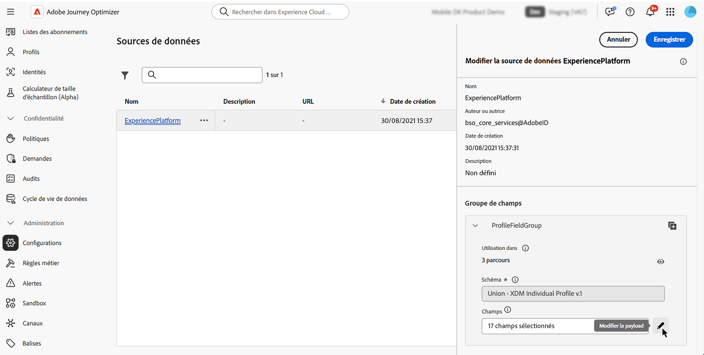

# Utiliser des identifiants supplémentaires dans les parcours {#supplemental-id}

>[!CONTEXTUALHELP]
>id="ajo_journey_parameters_supplemental_identifier"
>title="Utiliser un identifiant supplémentaire"
>abstract="L’identifiant supplémentaire est un identifiant secondaire qui fournit un contexte supplémentaire pour l’exécution d’un parcours. Pour le définir, sélectionnez le champ à utiliser comme identifiant supplémentaire et choisissez un espace de noms à lui associer."

<table style="border-collapse: collapse; width: 100%;">
  <tr>
    <td style="vertical-align: top; padding-right: 20px; border: none;">
      <p>Par défaut, les parcours sont exécutés dans le contexte d’un <b>identifiant de profil</b>. Cela signifie que, tant que le profil est actif dans un parcours donné, il ne pourra pas rejoindre à nouveau un autre parcours. Pour éviter cela, Journey Optimizer vous permet de capturer un <b>identifiant supplémentaire</b>, tel qu’un identifiant de commande, d’abonnement ou d’ordonnance, en plus de l’identifiant de profil.  
      <p>Dans cet exemple, nous avons ajouté un <b>identifiant de réservation</b> en tant qu’identifiant supplémentaire.</p>
      <p>Ce faisant, les parcours sont exécutés dans le contexte de l’identifiant de profil associé à l’identifiant supplémentaire (ici, l’identifiant de réservation). Une instance du parcours est exécutée pour chaque itération de l’identifiant supplémentaire. Cela permet plusieurs entrées du même ID de profil dans les parcours s’ils ont effectué des réservations différentes.</p>
      <p>En outre, Journey Optimizer vous permet d’utiliser les attributs de l’identifiant supplémentaire (par exemple, le numéro de réservation, la date de renouvellement de l’ordonnance, le type de produit) pour personnaliser les messages, ce qui garantit des communications hautement pertinentes.</p>
    </td>
    <td style="vertical-align: top; border: none; text-align: center; width: 40%;">
      
    </td>
  </tr>
</table>

➡️ [Découvrez cette fonctionnalité en vidéo.](#video)

## Mécanismes de sécurisation et limitations {#guardrails}

* **Parcours pris en charge** : des identifiants supplémentaires sont pris en charge pour les parcours **déclenchés par un événement** et de **lecture d’audience**. Ils ne sont **pas pris en charge** pour les parcours de qualification d’audience (c’est-à-dire les parcours commençant par une activité de qualification d’audience).

* **Limites d’instances simultanées** : les profils ne peuvent pas avoir plus de 10 instances de parcours simultanées.

* **Règles de fréquence** : chaque instance de parcours créée à partir de l’utilisation d’identifiants supplémentaires est comptabilisée dans le capping de la fréquence, même si l’utilisation d’identifiants supplémentaires entraîne plusieurs instances de parcours.

* **Type de données et structure du schéma** : l’identifiant supplémentaire doit être de type `string`. Il peut s’agir d’un attribut de chaîne indépendant ou d’un attribut de chaîne dans un tableau d’objets. L’attribut de chaîne indépendant entraîne une instance de parcours unique, tandis que l’attribut de chaîne dans un tableau d’objets entraîne une instance de parcours unique par itération du tableau d’objets. Les tableaux et mappages de chaînes ne sont pas pris en charge.

* **Réentrée dans un parcours**

  Le comportement de réentrée d’un parcours avec des identifiants supplémentaires respecte la politique de réentrée existante :

   * Si le parcours ne prend pas en charge la rentrée, la même combinaison d’identifiant de profil + identifiant supplémentaire ne peut pas réintégrer le parcours.
   * Si le parcours prend en charge la rentrée avec une période, la même combinaison d’identifiant de profil + identifiant supplémentaire peut réintégrer après la période définie.

* **DULE (Data Use Labeling and Enforcement)** - Aucune vérification de validation DULE n’est effectuée sur l’ID supplémentaire. Cela signifie que cet attribut n’est pas pris en compte lorsque le parcours recherche des violations de la politique de gouvernance des données.

* **Configuration des événements en aval**

  Si vous utilisez un autre événement en aval dans le parcours, il doit utiliser le même identifiant supplémentaire et posséder le même espace de noms d’identifiant.

* **Parcours de lecture d’audience**

   * L’ID supplémentaire est désactivé si vous utilisez un événement métier.
   * L’ID supplémentaire doit être un champ du profil (c’est-à-dire, pas un champ d’événement/de contexte).
   * Pour les parcours de lecture d’audience qui utilisent des ID supplémentaires, le taux de lecture de l’activité Lecture d’audience pour chaque instance de parcours est limité à un maximum de 500 profils par seconde.
   * Seules les audiences du service de profil unifié sont prises en charge lors de l’utilisation de parcours Lecture d’audience avec des ID supplémentaires.

## Comportement des critères de sortie avec des ID supplémentaires {#exit-criteria}

Condition préalable : parcours activé pour l’ID supplémentaire (via l’événement unitaire ou les activités de lecture d’audience)

Le tableau ci-dessous explique le comportement des profils dans un parcours activé pour un ID supplémentaire lorsque le critère de sortie est configuré :

| Configuration des critères de sortie | Comportement lorsque le critère de sortie est satisfait |
| ---------------------------- | ---------------------------------- |
| Basé sur un événement d’ID non supplémentaire | Toutes les instances du profil correspondant dans ce parcours sont fermées. |
| En fonction d’un événement d’ID supplémentaire <br/>*Note : l’espace de noms d’ID supplémentaire doit correspondre à celui du nœud initial.* | Seule l’instance de profil + ID supplémentaire correspondante est fermée. |
| En fonction d’une audience | Toutes les instances du profil correspondant dans ce parcours sont fermées. |

## Ajouter un identifiant supplémentaire et l’utiliser dans un parcours {#add}

>[!BEGINTABS]

>[!TAB Parcours déclenché par un événement]

Pour utiliser un identifiant supplémentaire dans un parcours déclenché par un événement, procédez comme suit :

1. **Marquez l’attribut comme identifiant dans le schéma d’événement.**

   1. Accédez au schéma d’événement et localisez l’attribut que vous souhaitez utiliser comme identifiant supplémentaire (par exemple, identifiant de réservation, identifiant d’abonnement) et marquez-le comme identifiant. [Découvrez comment utiliser les schémas.](../data/get-started-schemas.md)

   1. Marquez l’identifiant comme une **[!UICONTROL identité]**.

      

      >[!IMPORTANT]
      >
      >Veillez à ne pas marquer l’attribut comme **identité principale**.

   1. Sélectionnez l’espace de noms à associer à l’identifiant supplémentaire. Il doit s’agir d’un espace de noms d’identifiant qui ne porte pas sur une personne.

      Après avoir appliqué à un schéma l’espace de noms d’identité qui ne porte pas sur une personne, vous devez créer un événement pour utiliser l’identifiant supplémentaire. Les entités existantes ne peuvent pas être actualisées pour reconnaître le nouvel identifiant.

1. **Ajoutez l’ID supplémentaire à l’événement.**

   1. Créez ou modifiez l’événement souhaité. [Découvrez comment configurer un événement unitaire.](../event/about-creating.md)

   1. Dans l’écran de configuration des événements, cochez l’option **[!UICONTROL Utiliser un identifiant supplémentaire]**.

      

   1. Utilisez l’éditeur d’expression pour sélectionner l’attribut que vous avez marqué comme ID supplémentaire.

      >[!NOTE]
      >
      >Veillez à utiliser l’éditeur d’expression en **[!UICONTROL mode avancé]** pour sélectionner l’attribut.

   1. Après avoir sélectionné l’ID supplémentaire, l’espace de noms associé s’affiche en lecture seule dans l’écran de configuration de l’événement.

1. **Ajoutez l’événement au parcours.**

   Faites glisser l’événement personnalisé sur la zone de travail de parcours. Cela déclenche l’entrée de parcours en fonction de l’identifiant de profil et de l’identifiant supplémentaire.

   

>[!TAB Parcours de lecture d’audience]

Pour utiliser un identifiant supplémentaire dans un parcours de lecture d’audience, procédez comme suit :

1. **Marquer l’attribut comme identifiant dans le schéma d’union ou de profil**

   1. Accédez au schéma d’union ou de profil et localisez l’attribut que vous souhaitez utiliser comme identifiant supplémentaire (par exemple, identifiant de réservation, identifiant d’abonnement) et marquez-le comme identifiant. [Découvrez comment utiliser les schémas.](../data/get-started-schemas.md)

   1. Marquez l’identifiant comme une **[!UICONTROL identité]**.

      

      >[!IMPORTANT]
      >
      >Veillez à ne pas marquer l’attribut comme **identité principale**.

   1. Sélectionnez l’espace de noms à associer à l’identifiant supplémentaire. Il doit s’agir d’un espace de noms d’identifiant qui ne porte pas sur une personne.

      Une fois que l’espace de noms d’identité qui ne porte pas sur une personne a été attribué à un schéma, vous devez créer un nouveau groupe de champs pour utiliser l’identifiant supplémentaire. Les entités existantes ne peuvent pas être actualisées pour reconnaître le nouvel identifiant.

<!--1. **Add the supplemental ID field to the data source**

    1. Navigate to the **[!UICONTROL Configuration]** / **[!UICONTROL Data Sources]** menu, then locate the "ExperiencePlatformDataSource" data source.

        

    1. Open the field selector then select the attribute you want to use as a supplemental identifier (e.g., booking ID, subscription ID).-->

1. **Ajouter et configurer une activité Lecture d’audience dans le parcours**

   1. Placez une activité **[!UICONTROL Lecture d’audience]** dans votre parcours.

   1. Dans le volet des propriétés de l’activité, activez l’option **[!UICONTROL Utiliser un identifiant supplémentaire]**.

      

   1. Dans le champ **[!UICONTROL Identifiant supplémentaire]**, utilisez l’éditeur d’expression pour sélectionner l’attribut que vous avez marqué comme ID supplémentaire.

      >[!NOTE]
      >
      >Veillez à utiliser l’éditeur d’expression en **[!UICONTROL mode avancé]** pour sélectionner l’attribut.

   1. Après avoir sélectionné l’ID supplémentaire, l’espace de noms associé s’affiche en lecture seule dans le champs **[!UICONTROL Espace de noms supplémentaire]**.

>[!ENDTABS]

## Utiliser des attributs d’ID supplémentaires

Utilisez l’éditeur d’expression et l’éditeur de personnalisation pour référencer les attributs de l’identifiant supplémentaire à des fins de personnalisation ou de logique conditionnelle. Les attributs sont accessibles à partir du menu **[!UICONTROL Attributs contextuels]**.


Pour les parcours déclenchés par un événement, si vous utilisez des tableaux (par exemple, plusieurs ordonnances ou contrats d’assurance), utilisez une formule pour extraire des éléments spécifiques.

+++ Voir les exemples

Dans un tableau d’objets avec l’ID supplémentaire comme `bookingNum` et un attribut au même niveau appelé `bookingCountry`, le parcours effectue une itération sur l’objet de tableau en fonction de bookingNum et crée une instance de parcours sur chaque objet.

* L’expression suivante dans l’activité de condition effectue une itération sur le tableau d’objets et vérifie si la valeur de `bookingCountry` est égale à « FR » :

  ```
  @event{<event_name>.<object_path>.<object_array_name>.all(currentEventField.<attribute_path>.bookingNum==${supplementalId}).at(0).<attribute_path>.bookingCountry}=="FR"
  ```

* L’expression suivante dans l’éditeur de personnalisation d’e-mail effectue une itération dans le tableau d’objets, extrait la valeur `bookingCountry` applicable à l’instance de parcours active et l’affiche dans le contenu :

  ```
  {{#each context.journey.events.<event_ID>.<object_path>.<object_array_name> as |l|}} 
  
   {{l.<attribute_path>.bookingCountry}}  
  
  {{/each}}
  ```

* Exemple d’événement de déclenchement du parcours :

  ```
  "bookingList": [
        {
            "bookingInfo": {
                "bookingNum": "x1",
                      "bookingCountry": "US"
            }
        },
        {
            "bookingInfo": {
                "bookingNum": "x2",
                "bookingCountry": "FR"
            }
        }
    ]
  ```

+++

## Exemples de cas d’utilisation

Ces exemples montrent comment les identifiants supplémentaires prennent en charge plusieurs enregistrements associés.

### **Notifications de renouvellement des contrats d’assurance**

* **Scénario** : une compagnie d’assurance envoie des rappels de renouvellement portant sur chaque contrat d’assurance actif détenu par un client ou une cliente.
* **Exécution** :
   * Profil : « John ».
   * ID supplémentaires : `"AutoPolicy123", "HomePolicy456"`.
   * Le parcours s’exécute séparément pour chaque contrat d’assurance, avec des dates de renouvellement personnalisées, des détails sur la couverture et des informations sur les versements.

### **Gestion des abonnements**

* **Scénario** : un service d’abonnement envoie des messages personnalisés pour chaque abonnement lorsqu’un événement est déclenché pour cet abonnement.
* **Exécution** :
   * Profil : « Jane ».
   * ID supplémentaires : `"Luma Yoga Program ", "Luma Fitness Program"`.
   * Chaque événement comprend un ID d’abonnement et des détails sur cet abonnement. Le parcours s’exécute séparément pour chaque événement/abonnement, ce qui permet d’utiliser des offres de renouvellement personnalisées.

### **Recommandations de produit**

* **Scénario** : une plateforme d’e-commerce envoie des recommandations sur la base de produits spécifiques achetés par un client ou une cliente.
* **Exécution** :
   * Profil : « Alex ».
   * ID supplémentaires : `"productID1234", "productID5678"`.
   * Le parcours s’exécute séparément pour chaque produit, avec des opportunités de montée en gamme personnalisées.

## Vidéo pratique {#video}

Découvrez comment activer et appliquer un identifiant supplémentaire dans [!DNL Adobe Journey Optimizer].

>[!VIDEO](https://video.tv.adobe.com/v/3464792?quality=12)
