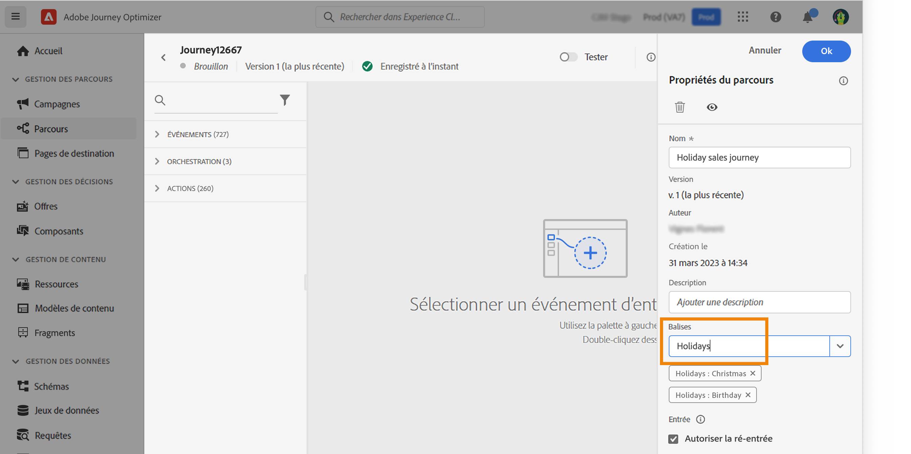
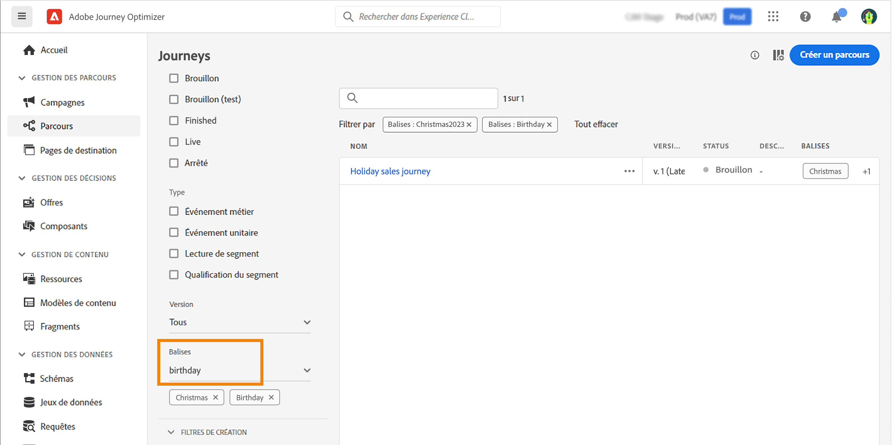
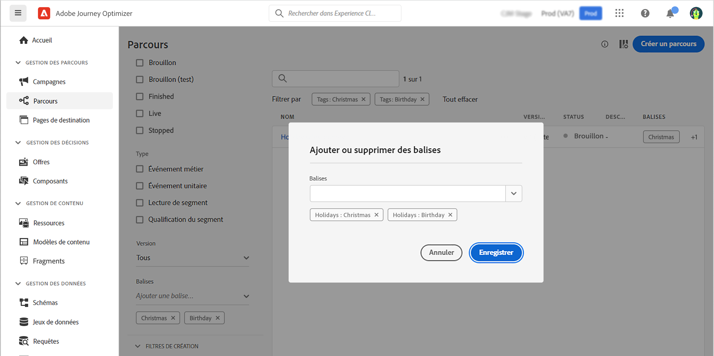

# Gérer les balises dans les parcours {#journey_tags}

En tant qu’utilisateur ou utilisatrice de Journey Optimizer, vous pouvez identifier vos parcours à l’aide de balises. Les balises constituent un moyen simple et rapide de classer des objets afin de faciliter leur recherche.

## Ajouter des balises à un parcours

Le champ **Balises**, dans les propriétés du parcours, vous permet d’ajouter des balises à votre parcours. Vous pouvez sélectionner une balise existante ou créer une nouvelle balise. Commencez à saisir le nom de la balise souhaitée et sélectionnez-la dans la liste. Si elle n’est pas disponible, cliquez sur **Créer** pour créer une balise et l’ajouter à votre parcours. Vous pouvez définir autant de balises que vous le souhaitez.

La liste des balises définies s’affiche sous le champ **Balises**.

>[!NOTE]
>
> Les balises sont sensibles à la casse.
> 
> Si vous dupliquez ou créez une autre version d’un parcours, les balises sont conservées.

## Filtrer les balises

La liste des parcours comporte une colonne dédiée permettant de visualiser facilement les balises.

Un filtre est également disponible pour afficher uniquement les parcours comportant les balises souhaitées.

Vous pouvez ajouter ou supprimer des balises de n’importe quel type de parcours (actif, brouillon, etc.). Cliquez sur l’icône **Plus d’actions** en regard du parcours, puis sélectionnez **Modifier les balises**.

## Gérer les balises

L’administration peut supprimer des balises et les classer par catégorie dans le menu **Balises**, sous **Administration**. Consultez cette [documentation](https://experienceleague.adobe.com/docs/experience-platform/administrative-tags/overview.html?lang=fr).

>[!NOTE]
>
> Les balises définies dans les parcours sont ajoutées à la catégorie intégrée « Non classé ».
