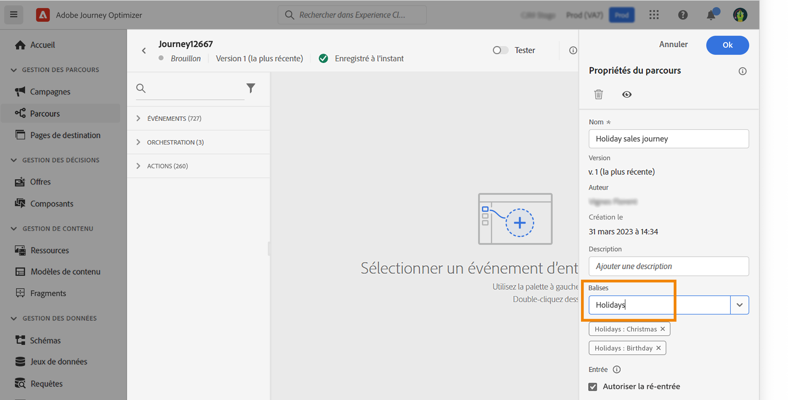
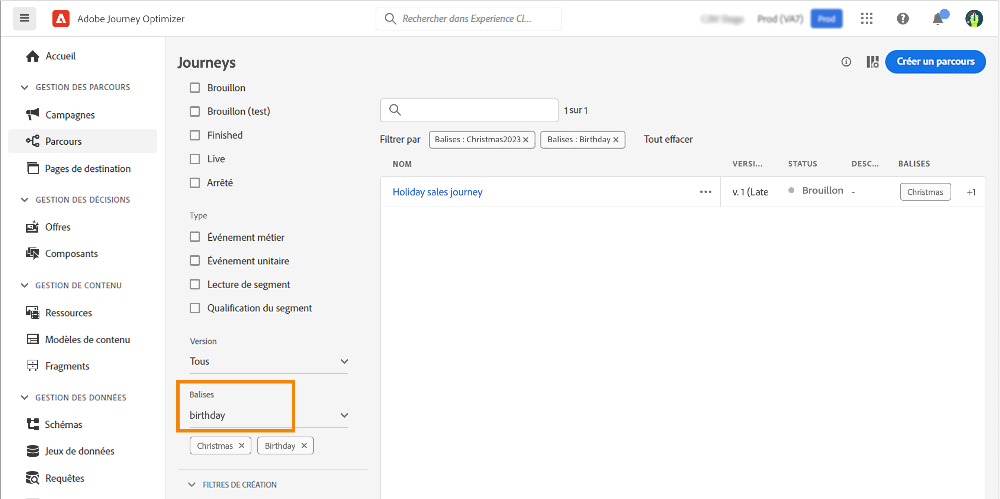
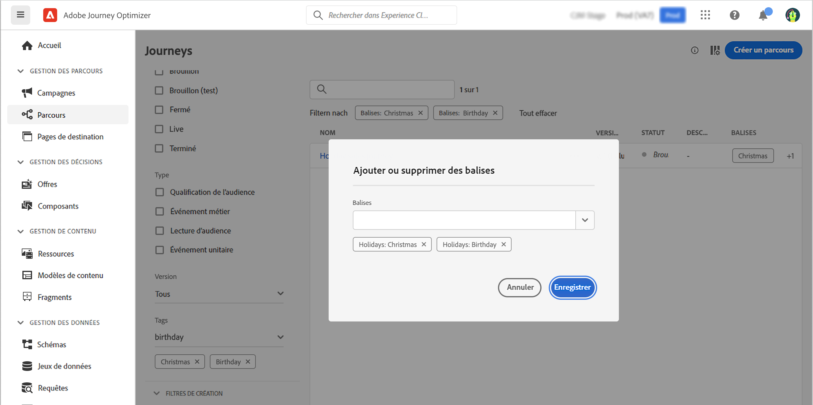

# Gérer les balises dans les parcours {#journey_tags}

>[!BEGINSHADEBOX]

**Sur cette page :** découvrez comment organiser les parcours avec des balises et des catégories de balises afin de classer, filtrer et retrouver vos parcours plus facilement qu’avec des conventions de nommage.

>[!ENDSHADEBOX]

En tant qu’utilisateur ou utilisatrice de Journey Optimizer, vous pouvez identifier vos parcours à l’aide de balises. Les balises constituent un moyen simple et rapide de classer des objets afin de faciliter leur recherche.

## Balises et conventions de nommage {#tags-vs-naming}

Les équipes s’appuient souvent sur des conventions de nommage complexes pour stocker les métadonnées directement dans les noms de parcours, par exemple : *Marketing tout au long du cycle de vie - Éducation - Intégration des clients V2 - Éducation des applications - T3 2025*. Bien qu’elle soit bien intentionnée, cette approche présente une faiblesse majeure : à mesure que le travail s’étend à tous les membres de l’équipe, la convention est rarement appliquée de manière cohérente et les listes parcours deviennent difficiles à parcourir.

**Les catégories de balises** dans Journey Optimizer offrent une meilleure alternative. Au lieu de coder les métadonnées dans le nom, vous joignez des balises classées à chaque parcours (par exemple, équipe, objectif, phase, trimestre) et utilisez des filtres pour les localiser. Les noms de parcours peuvent alors se concentrer sur ce qui compte vraiment : le jalon du client piloté.

Avantages des catégories de balises par rapport aux conventions de nommage :

* **Cohérence** — Les balises sont sélectionnées dans une liste contrôlée et ne sont pas saisies librement.
* **Filtrabilité** : toute combinaison de valeurs de balise peut être utilisée pour découper instantanément la liste de parcours.
* **Clarté** — Les noms de parcours restent courts et axés sur les jalons.
* **Évolutivité** : l’ajout d’une nouvelle dimension de métadonnées implique la création d’une catégorie de balises, et non la réécriture d’une convention de nommage.

Pour obtenir un workflow de configuration recommandé, voir [Configurer des catégories de balises pour la gestion des parcours &#x200B;](#tags-setup) ci-dessous.

## Ajouter des balises à un parcours

Le champ **Balises**, dans les propriétés du parcours, vous permet d’ajouter des balises à votre parcours. Vous pouvez sélectionner une balise existante ou en créer une nouvelle. Commencez à saisir le nom de la balise souhaitée et sélectionnez-la dans la liste. Si elle n’est pas disponible, cliquez sur **Créer** pour créer une balise et l’ajouter à votre parcours. Vous pouvez définir autant de balises que vous le souhaitez.

La liste des balises définies s’affiche sous le champ **Balises**.

>[!NOTE]
>
> Les balises sont sensibles à la casse.
> 
> Si vous dupliquez ou créez une autre version d’un parcours, les balises sont conservées.

## Filtrer les balises

La liste des parcours comporte une colonne dédiée permettant de visualiser facilement les balises.

Un filtre est également disponible pour afficher uniquement les parcours comportant les balises souhaitées.

Vous pouvez ajouter ou supprimer des balises de n’importe quel type de parcours (actif, brouillon, etc.). Cliquez sur l’icône **Plus d’actions** en regard du parcours, puis sélectionnez **Modifier les balises**.

## Gérer les balises

L’administration peut supprimer des balises et les classer par catégorie dans le menu **Balises**, sous **Administration**. Consultez cette [documentation](https://experienceleague.adobe.com/docs/experience-platform/administrative-tags/overview.html?lang=fr).

>[!NOTE]
>
> Les balises définies dans les parcours sont ajoutées à la catégorie intégrée « Non classé ».

## Configurer des catégories de balises pour la gestion des parcours {#tags-setup}

Pour remplacer une convention de nommage complexe par une approche basée sur les balises dans l’ensemble de votre équipe, procédez comme suit.

**Étape 1 — Créer des catégories de balises (Admin)**

Dans **[!UICONTROL Administration]** > **[!UICONTROL Balises]**, créez une catégorie pour chaque attribut de métadonnées que votre équipe code actuellement dans des noms de parcours, par exemple : *Équipe*, *Objectif marketing*, *Campagne*, *Phase*, *Trimestre*.

**Étape 2 — Renseigner chaque catégorie avec des valeurs de balise (Admin)**

Dans chaque catégorie, créez les balises qui représentent toutes les valeurs possibles. Par exemple, la catégorie *Phase* peut contenir : *Sensibilisation*, *Intégration*, *Rétention*, *Reconquête*.

**Étape 3 — Application de balises lors de la création de parcours (utilisateurs)**

À chaque création d’un parcours, sélectionnez la balise appropriée dans chaque catégorie des propriétés du parcours. En règle générale, un parcours comporte une balise par catégorie.

**Étape 4 : nommer les parcours pour le jalon, filtrer par balises**

Veillez à ce que le nom du parcours reste axé sur le jalon client qu’il franchit (par exemple, *Première transaction de fidélité*). Utilisez les filtres de balises dans la liste des parcours pour localiser les parcours à l’aide d’une combinaison de métadonnées, sans recourir à l’analyse de nom.

>[!TIP]
>
>Pour une discussion plus large sur cette approche et ses avantages à grande échelle, consultez [Bonnes pratiques pour les parcours avancés dans Journey Optimizer](https://experienceleague.adobe.com/en/perspectives/best-practices-for-advanced-journeys-in-journey-optimizer){target="_blank"}.

+++ Référence des connaissances sur l’IA

Cette section contient des connaissances structurées destinées à soutenir l’interprétation, la récupération et la réponse aux questions liées à ce sujet.

Pour une compréhension totale, ces informations doivent être combinées avec la documentation de cette page. Aucune des sources n’est conçue pour être autonome. La page décrit la fonctionnalité, tandis que cette section fournit un contexte supplémentaire qui permet de clarifier la terminologie, l’intention, l’applicabilité et les contraintes.

* **TL;DR:** Cette page explique comment ajouter, filtrer et gérer des balises sur des parcours dans Adobe Journey Optimizer. Elle explique également pourquoi les catégories de balises constituent une meilleure alternative aux conventions de dénomination complexes pour organiser des listes de parcours volumineuses.

**Intentions:**
* Ajoutez des balises à un parcours à partir du champ Balises des propriétés du parcours .
* Filtrer la liste des parcours selon une ou plusieurs balises pour localiser rapidement des parcours spécifiques
* Modifier des balises sur des parcours existants quel que soit leur statut (actif, brouillon, etc.) via Autres actions
* Créer et organiser des catégories de balises en tant qu’administrateur pour appliquer des métadonnées cohérentes
* Remplacer une convention de nommage de parcours complexe par une approche structurée basée sur les balises

**Glossaire:**
* **Balises** : libellés associés aux parcours pour les classer et les filtrer. Ils ne respectent pas la casse et sont conservés lorsqu’un parcours est dupliqué ou versionné *(spécifique au produit)*
* **Catégories de balises** : regroupements de valeurs de balise associées créés par les administrateurs sous Administration > Balises, ce qui permet d’activer les *de classification de métadonnées structurées (spécifiques au produit)*
* **Catégorie non classée** : la catégorie par défaut intégrée à laquelle sont automatiquement affectées les balises créées directement dans les parcours *(spécifique au produit)*

**Mécanismes de sécurisation :**
* Les balises ne respectent pas la casse
* Les balises définies dans parcours sont automatiquement ajoutées à la catégorie intégrée « Non classé », sauf si un administrateur les affecte à une catégorie nommée
* Seuls les administrateurs peuvent supprimer des balises et gérer des catégories de balises via le menu Administration > Balises .
* Les balises sont conservées lorsqu’un parcours est dupliqué ou qu’une nouvelle version est créée

**Terminologie:**
* Nom canonique : Balises — Acronyme : none — variantes : balises de parcours, balises d’administration
* Nom canonique : Catégories de balises — Acronyme : aucune — Variantes : groupes de balises
* Ne les confondez pas : « Balises » (libellés de classification de parcours) ≠ « Conventions de dénomination » (métadonnées codées directement dans les noms de parcours)

**FAQ:**
* **Q : Comment ajouter une balise à un parcours ?** — Dans les propriétés du parcours, saisissez le nom de la balise dans le champ Balises et sélectionnez-la dans la liste, ou cliquez sur Créer pour ajouter une nouvelle balise.
* **Q : Puis-je ajouter des balises à un parcours en direct ?** — Oui. Cliquez sur l’icône Plus d’actions en regard du parcours dans la liste et sélectionnez Modifier les balises pour ajouter ou supprimer des balises sur n’importe quel parcours, quel que soit son statut.
* **Q : Les balises sont-elles sensibles à la casse ?** — Non. Les balises ne respectent pas la casse.
* **Q : Qu’advient-il des balises lorsque je duplique un parcours ou que je crée une nouvelle version ?** — Les balises sont conservées dans le duplicata ou la nouvelle version.
* **Q : Qui peut supprimer des balises ou créer des catégories de balises ?** — Seuls les administrateurs peuvent supprimer des balises et gérer des catégories de balises via le menu Administration > Balises .
* **Q : Pourquoi utiliser des catégories de balises plutôt que des conventions de nommage ?** les catégories de balises assurent la cohérence par le biais d’une liste contrôlée, permettent un filtrage multidimensionnel instantané, gardent les noms de parcours courts et axés sur les jalons, et se mettent à l’échelle facilement en ajoutant de nouvelles catégories sans réécrire les règles de nommage.

+++
