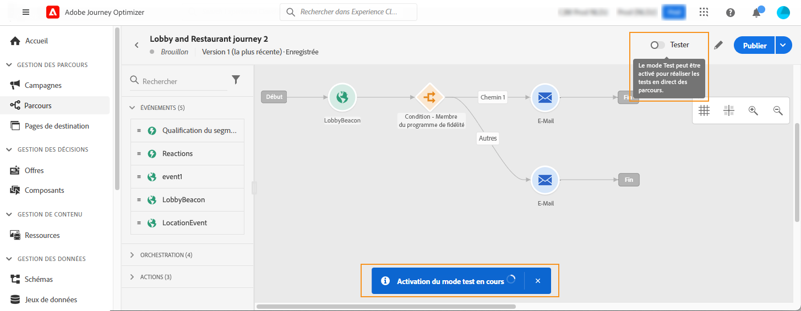
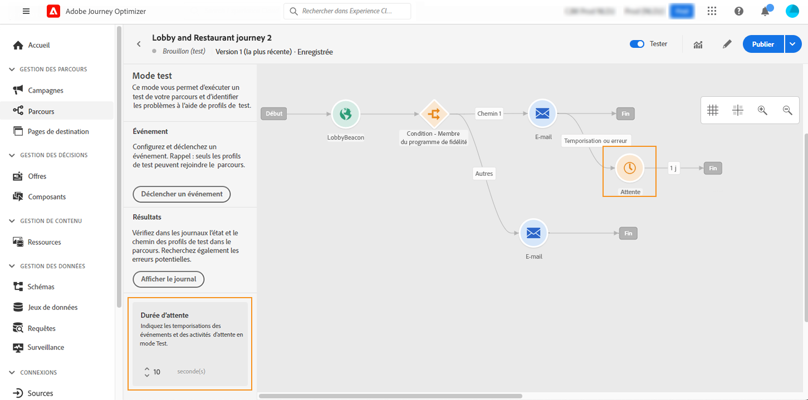
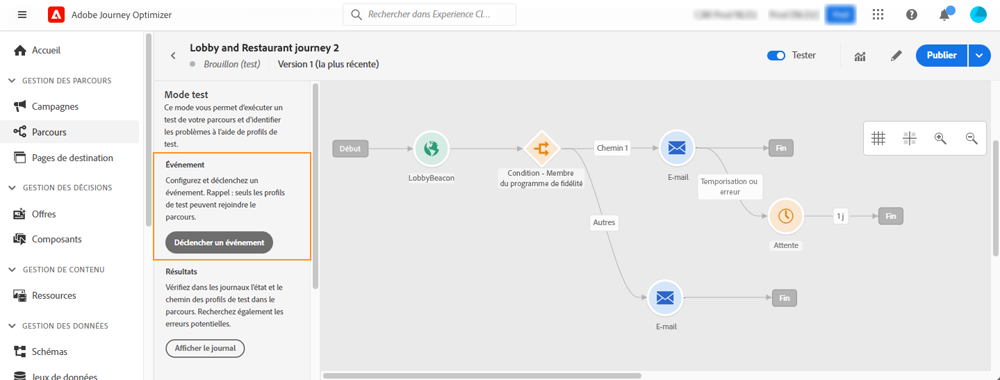
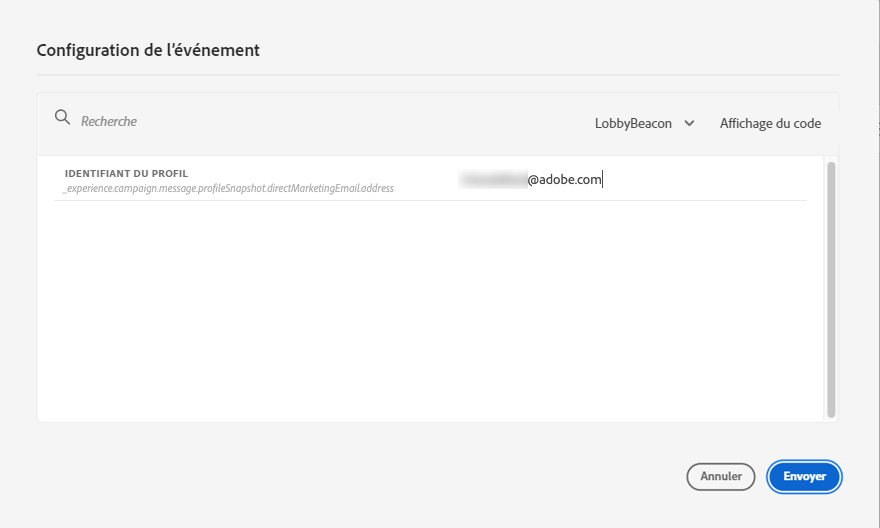
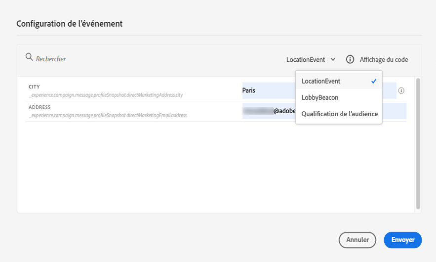
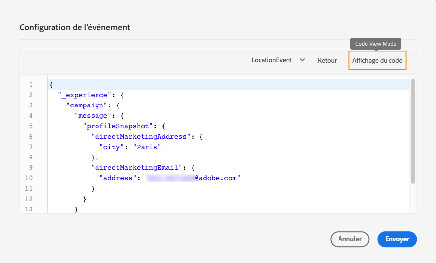
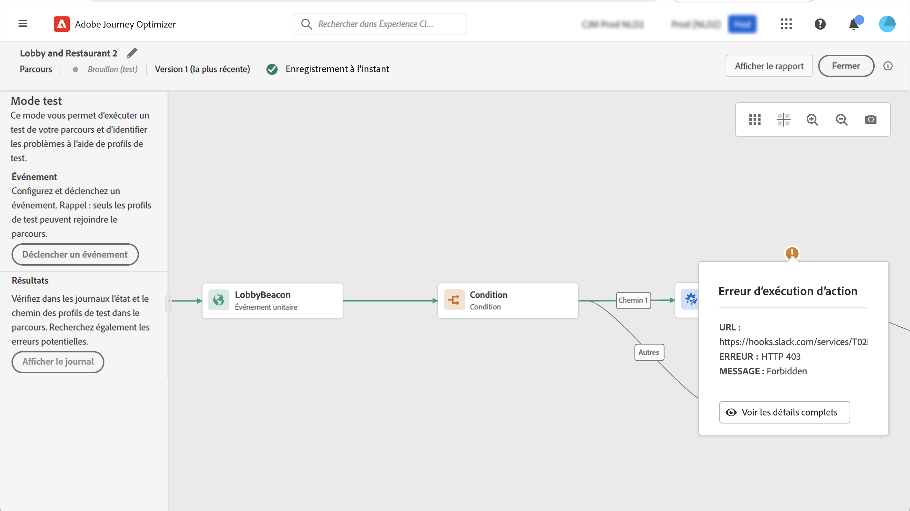
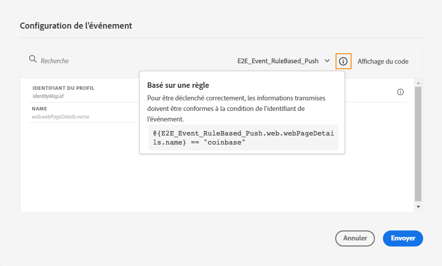
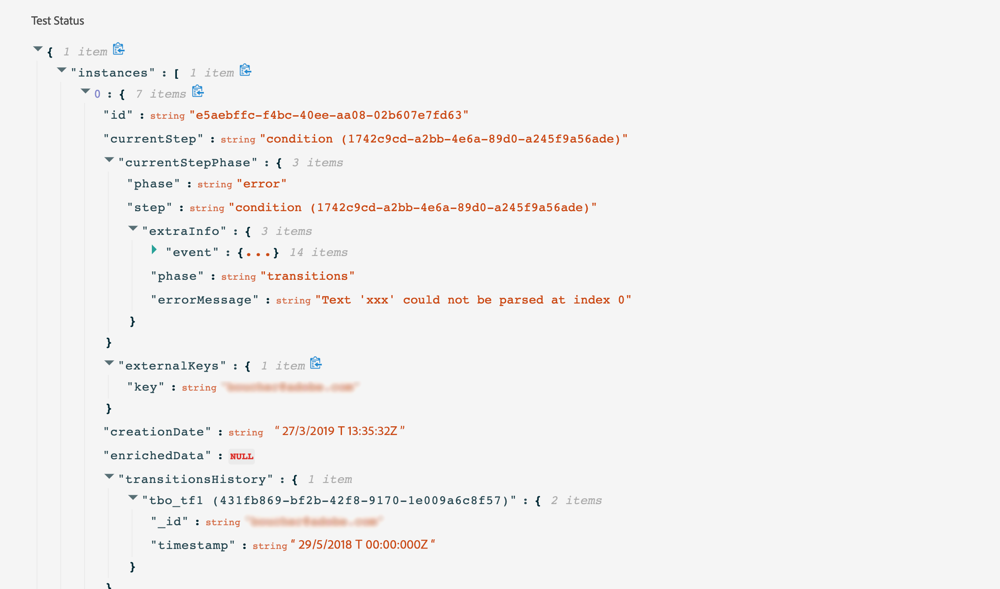

# Tester votre parcours{#testing_the_journey}

>[!CONTEXTUALHELP]
>id="ajo_journey_test"
>title="Tester votre parcours"
>abstract="Utilisez des profils de test pour tester votre parcours avant de le publier. Vous pouvez ainsi analyser le flux des individus dans le parcours et résoudre les problèmes avant la publication."

Une fois que vous avez créé votre parcours, vous pouvez le tester avant de le publier. Journey Optimizer propose un « mode test » pour afficher les profils de test au fur et à mesure de leur progression dans le parcours et ainsi détecter les erreurs potentielles avant leur activation. L’exécution de tests rapides vous permet de vérifier que les parcours fonctionnent correctement afin de pouvoir les publier en toute confiance.

Seuls les profils de test peuvent rejoindre un parcours en mode test. Vous pouvez créer des profils de test ou transformer des profils existants en profils de test. En savoir plus sur les profils de test dans [cette section](../audience/creating-test-profiles.md).

>[!NOTE]
>
>Avant de tester votre parcours, vous devez résoudre toutes les erreurs, le cas échéant. Découvrez comment rechercher des erreurs avant d’effectuer des tests dans [cette section](../building-journeys/troubleshooting.md).

## Remarques importantes {#important_notes}

### Limites générales

* **Profils de test uniquement** : seuls les individus indiqués comme « profils de test » dans le service de profil client en temps réel peuvent rejoindre un parcours en mode test. [Découvrez comment créer des profils de test](../audience/creating-test-profiles.md).
* **Exigence d’espace de noms** : le mode test n’est disponible que pour les brouillons de parcours qui utilisent un espace de noms. Le mode test doit vérifier si une personne qui participe au parcours est un profil de test ou non et doit donc être en mesure d’accéder à Adobe Experience Platform.
* **Limite de profil** : un maximum de 100 profils de test peuvent rejoindre un parcours au cours d’une seule session de test.
* **Déclenchement d’événement** : les événements ne peuvent être déclenchés qu’à partir de l’interface. Les événements ne peuvent pas être déclenchés à partir de systèmes externes à l’aide d’une API.
* **Audiences de chargement personnalisées** : le mode test de parcours ne prend pas en charge l’enrichissement d’attributs d’[audience de chargement personnalisée](../audience/custom-upload.md).

### Comportement pendant et après les tests

* **Désactivation du mode test** : lorsque vous désactivez le mode test, tous les profils présents actuellement dans le parcours ou qui l’ont rejoint précédemment sont supprimés et les rapports sont effacés.
* **Flexibilité de réactivation** : vous pouvez activer et désactiver le mode test autant de fois que nécessaire.
* **Désactivation automatique** : les parcours qui restent inactifs en mode test pendant **plus d’une semaine** reviennent automatiquement au statut Brouillon pour optimiser les performances et empêcher l’utilisation des ressources obsolètes.
* **Modification et publication** : lorsque le mode test est actif, vous ne pouvez pas modifier le parcours. Cependant, vous pouvez publier directement le parcours, sans avoir à désactiver le mode test au préalable.

### Exécution

* **Comportement de partage** : lorsque le parcours atteint un partage, la branche supérieure est toujours sélectionnée. Réorganisez les branches si vous souhaitez tester un autre chemin.
* **Timing des événements** : si le parcours comprend plusieurs événements, déclenchez chaque événement en séquence. L’envoi d’un événement trop tôt (avant la fin du premier nœud d’attente) ou trop tard (après la temporisation configurée) ignore l’événement et envoie le profil vers un chemin de temporisation. Vérifiez toujours que les références aux champs de payload d’événement restent valides en envoyant la payload dans la fenêtre définie.
* **Fenêtre de date active** : assurez-vous que la fenêtre de choix [Dates/heures de début et de fin](journey-properties.md#dates) configurée pour le parcours inclut l’heure actuelle lorsque vous lancez le mode de test. Dans le cas contraire, les événements de test déclenchés sont ignorés silencieusement.
* **Événements de réaction** : pour les événements de réaction avec une temporisation, le temps d’attente minimum et par défaut est de 40 secondes.
* **Jeux de données de test** : les événements déclenchés en mode test sont stockés dans des jeux de données dédiés libellés comme suit : `JOtestmode - <schema of your event>`

<!--
* Fields from related entities are hidden from the test mode.
-->

## Activer le mode test

Pour utiliser le mode test, procédez comme suit :

1. Pour activer le mode test, cliquez sur le bouton **[!UICONTROL Mode test]** dans le coin supérieur droit de l’écran.

   

1. Si le parcours comporte au moins une activité **Attente**, définissez la variable **[!UICONTROL Temps d’attente]** pour définir la durée en mode test de chaque activité d’attente et de chaque expiration d’événement. La durée par défaut est de 10 secondes pour les attentes et les temporisations d’événement. Vous obtiendrez ainsi rapidement les résultats du test.

   

   >[!NOTE]
   >
   >Lorsqu’un événement de réaction est utilisé avec une temporisation dans un parcours, la durée d’attente par défaut ainsi que la valeur minimale sont de 40 secondes. Consultez [cette section](../building-journeys/reaction-events.md).

1. Utilisez le bouton **[!UICONTROL Déclencher un événement]** pour configurer des événements et les envoyer au parcours.

   

1. Configurez les différents champs attendus. Dans le champ **Identifiant de profil**, saisissez la valeur du champ utilisé pour identifier le profil de test. Il peut s’agir, par exemple, de l’adresse e-mail. Veillez à envoyer des événements liés aux profils de test. Consultez [cette section](#firing_events).

   

1. Une fois les événements reçus, cliquez sur le bouton **[!UICONTROL Afficher le journal]** pour afficher les résultats du test et les valider. Consultez [cette section](#viewing_logs).

   

1. En cas d’erreur, désactivez le mode test, modifiez votre parcours et lancez un nouveau test. Une fois les tests terminés, vous pouvez publier votre parcours. Consultez [cette page](../building-journeys/publish-journey.md).

## Déclencher vos événements {#firing_events}

>[!CONTEXTUALHELP]
>id="ajo_journey_test_configuration"
>title="Configuration du mode test"
>abstract="Si votre parcours contient plusieurs événements, sélectionnez-les dans la liste déroulante. Ensuite, pour chaque événement, configurez les champs transmis et l&#39;exécution de l&#39;envoi de l’événement."

Utilisez le bouton **[!UICONTROL Déclencher un événement]** pour configurer un événement qui fera qu’un individu rejoint le parcours.

### Conditions préalables {#trigger-events-prerequisites}

Vous devez, au préalable, savoir quels profils sont identifiés comme profils de test dans Adobe Experience Platform. En effet, le mode test n’autorise ces profils que dans le parcours.

L’événement doit contenir un identifiant. L’identifiant attendu dépend de la configuration de l’événement. Il peut s’agir d’un ECID ou d’une adresse e-mail, par exemple. La valeur de cette clé doit être ajoutée dans le champ **Identifiant du profil**.

Si votre parcours ne parvient pas à activer le mode test avec l’erreur `ERR_MODEL_RULES_16`, assurez-vous que l’événement utilisé inclut un [espace de noms d’identité](../audience/get-started-identity.md) lors de l’utilisation d’une action de canal.

L’espace de noms d’identité est utilisé pour identifier de manière unique les profils de test. Par exemple, si l&#39;e-mail est utilisé pour identifier les profils de test, l’espace de noms d’identité **E-mail** doit être sélectionné. Si l’identifiant unique est le numéro de téléphone, l’espace de noms d’identité **Téléphone** doit être sélectionné.

>[!NOTE]
>
>* Lorsque vous déclenchez un événement en mode test, un événement réel est généré, ce qui signifie qu’il sera également utilisé pour un autre parcours qui écoute cet événement.
>
>* Assurez-vous que chaque événement en mode test est déclenché dans le bon ordre et dans la fenêtre d’attente configurée. Par exemple, en cas d’attente de 60 secondes, le deuxième événement ne doit être déclenché qu’après l’expiration de cette attente de 60 secondes et avant l’expiration de la temporisation.
>

### Configuration des événements {#trigger-events-configuration}

Si votre parcours contient plusieurs événements, sélectionnez-les dans la liste déroulante. Ensuite, pour chaque événement, configurez les champs transmis et l&#39;exécution de l&#39;envoi de l’événement. L’interface vous permet de transmettre les informations appropriées dans le payload de l’événement et de vous assurer que le type d’information est correct. Le mode test enregistre les derniers paramètres utilisés dans une session de test en vue d’une utilisation ultérieure.

L’interface vous permet de transmettre des paramètres d’événement simples. Si vous souhaitez transmettre des collections ou d’autres objets avancés dans l’événement, vous pouvez sélectionner **[!UICONTROL Affichage du code]** pour voir l’intégralité du code de la payload et le modifier. Vous pouvez par exemple copier et coller des informations d’événement préparées par un utilisateur ou une utilisatrice technique.

Un utilisateur ou une utilisatrice technique peut également utiliser cette interface pour composer des payloads d’événement et déclencher des événements sans avoir à utiliser un outil tiers.

Lorsque vous cliquez sur le bouton **[!UICONTROL Envoyer]**, le test commence. La progression de la personne dans le parcours est représentée par un flux visuel. Le chemin devient progressivement vert lorsque la personne se déplace sur le parcours. Si une erreur se produit, un symbole d’avertissement s’affiche à l’étape correspondante. Vous pouvez y placer le curseur pour afficher plus d’informations sur l’erreur et accéder à tous les détails (le cas échéant).

Lorsque vous sélectionnez un autre profil de test dans l’écran de configuration de l’événement et exécutez à nouveau le test, le flux visuel est effacé et affiche le chemin de la nouvelle personne.

Lors de l’ouverture d’un parcours dans le test, le chemin affiché correspond au dernier test exécuté.

## Mode test pour les parcours basés sur des règles {#test-rule-based}

Le mode test est également disponible pour les parcours qui utilisent un événement basé sur des règles. Pour plus d’informations sur les événements de test, consultez [cette page](../event/about-events.md).

Lors du déclenchement d’un événement, l’écran **Configuration de l’événement** vous permet de définir les paramètres d’événement à transmettre au test. Vous pouvez afficher la condition de l’identifiant d’événement en cliquant sur l’icône Info-bulle dans la partie supérieure droite. Une info-bulle est également disponible en regard de chaque champ qui fait partie de l’évaluation des règles.

## Mode test pour événements métier {#test-business}

Lors de l’utilisation d’un [événement métier](../event/about-events.md), utilisez le mode test pour déclencher une entrée de profil de test unique dans le parcours, simuler l’événement et transmettre l’identifiant de profil approprié. Vous devez transmettre les paramètres d’événement et l’identifiant du profil de test qui va rejoindre le parcours au moment du test. En mode test, aucun mode « Affichage du code » n’est disponible pour les parcours en fonction des événements métier.

Notez que lorsque vous déclenchez pour la première fois un événement métier, vous ne pouvez pas modifier la définition de l&#39;événement métier dans la même session de test. Vous pouvez uniquement faire en sorte qu’un même individu ou qu’un autre individu rejoigne le parcours en transmettant le même identifiant ou un autre identifiant. Si vous souhaitez modifier les paramètres de l&#39;événement métier, vous devez arrêter et démarrer à nouveau le mode test.

## Afficher les journaux {#viewing_logs}

>[!CONTEXTUALHELP]
>id="ajo_journey_test_logs"
>title="Journaux du mode test"
>abstract="Le bouton **Afficher le journal** affiche les résultats du test au format JSON. Ces résultats affichent le nombre d’individus à l’intérieur du parcours et leur état."

Le bouton **[!UICONTROL Afficher le journal]** vous permet d’afficher les résultats du test. Cette page affiche des informations actuelles sur le parcours au format JSON. Un bouton vous permet de copier des nœuds entiers. Vous devez actualiser manuellement la page pour mettre à jour les résultats de test du parcours.

>[!NOTE]
>
>Dans les journaux de test, en cas d’erreur lors de l’appel d’un système tiers (source de données ou action), le code d’erreur et la réponse d’erreur s’affichent.

Le nombre de personnes (ou instances) actuellement dans le parcours s’affiche. Voici des informations utiles qui s’affichent pour chaque personne :

* _ID_ : identifiant interne de la personne dans le parcours. Il peut être utilisé à des fins de débogage.
* _currentstep_ : étape à laquelle se trouve la personne dans le parcours. Nous vous recommandons d’ajouter des libellés à vos activités afin de les identifier plus facilement.
* _currentstep_ > phase : statut du parcours de la personne (en cours, terminé, erreur ou expiré). Plus d’informations ci-dessous.
* _currentstep_ > _extraInfo_ : description de l’erreur et autres informations contextuelles.
* _currentstep_ > _fetchErrors_ : informations sur les erreurs de récupération de données qui se sont produites au cours de cette étape.
* _externalKeys_ : valeur de la formule de clé définie dans l’événement.
* _enrichedData_ : données récupérées par le parcours si le parcours utilise des sources de données.
* _transitionHistory_ : liste des étapes suivies par la personne. Pour les événements, le payload s’affiche.
* _actionExecutionErrors_ : informations sur les erreurs qui se sont produites.

Voici les différents statuts du parcours d’une personne :

* _En cours_ : la personne se trouve actuellement dans le parcours.
* _Terminé_ : la personne est à la fin du parcours.
* _Erreur_ : le parcours de la personne a été arrêté en raison d’une erreur.
* _Délai dépassé_ : le parcours de la personne a été arrêté, car l’exécution d’une étape a pris trop de temps.

Lorsqu’un événement est déclenché en mode test, un jeu de données est automatiquement généré avec le nom de la source.

Le mode test crée automatiquement un événement d’expérience et l’envoie à Adobe Experience Platform. Le nom de la source de cet événement d’expérience est « Événements de test Journey Orchestration ».

