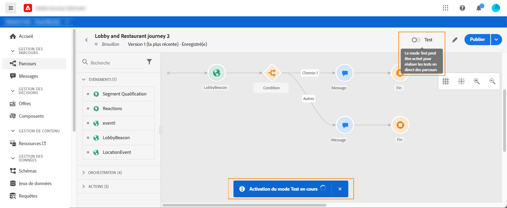
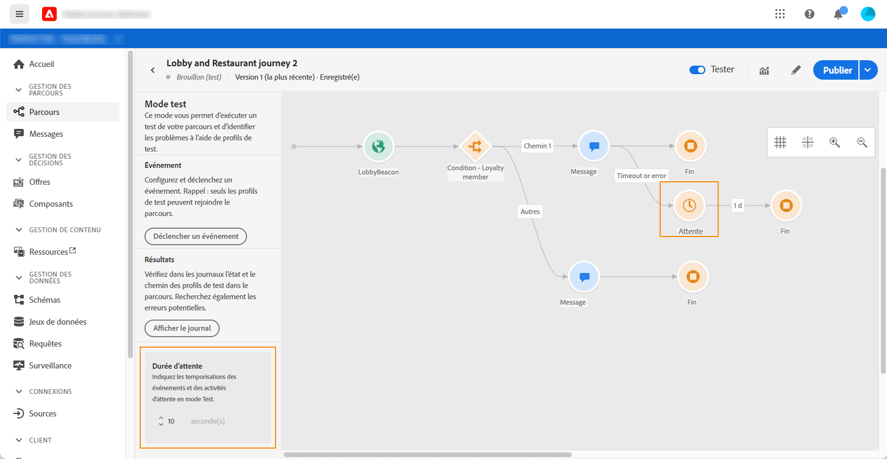
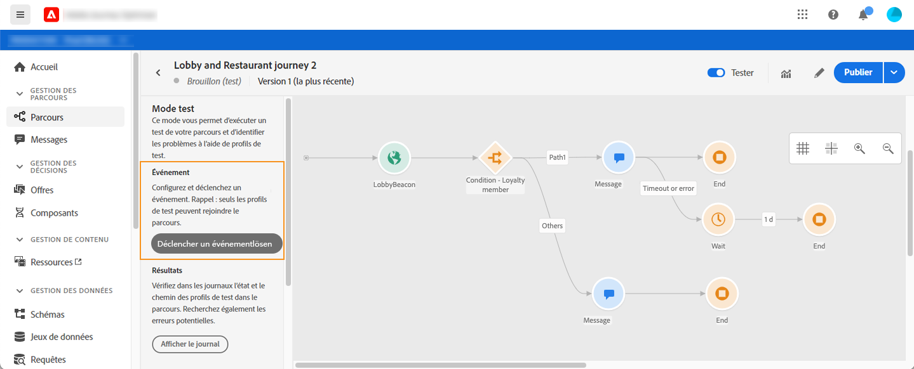
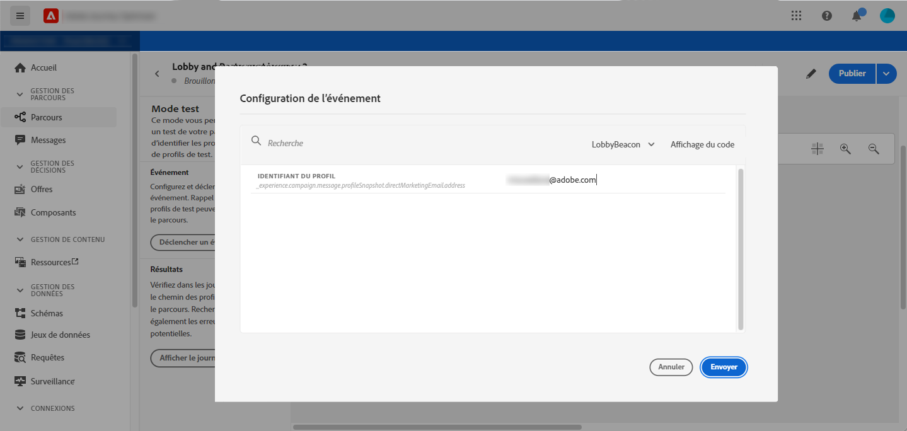
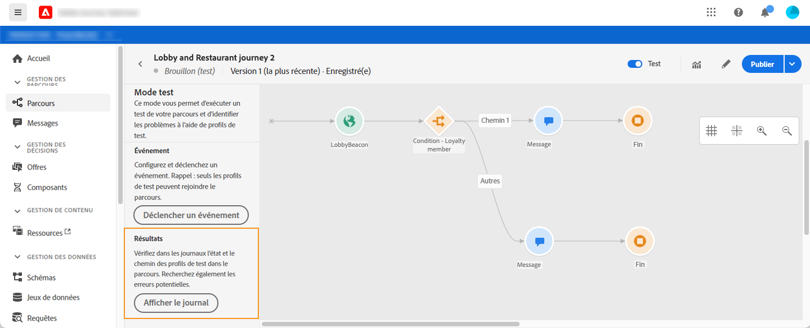
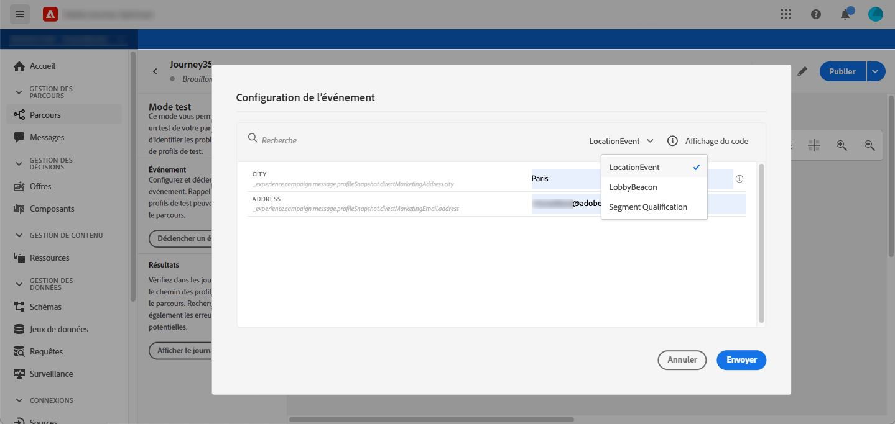
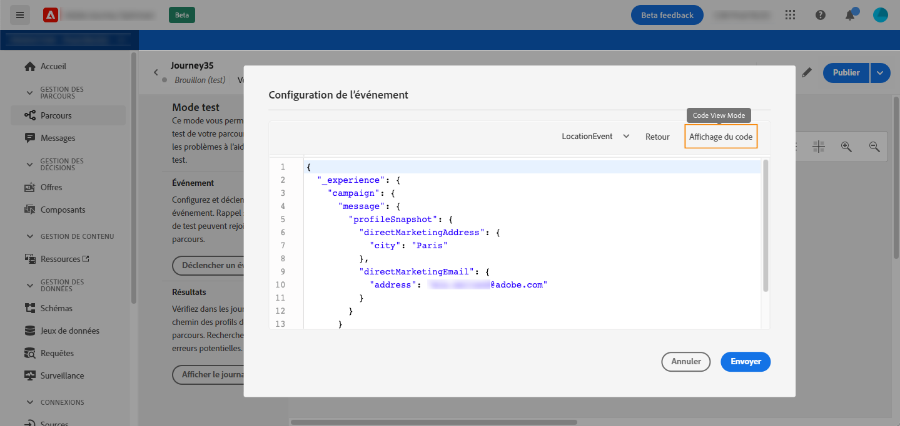
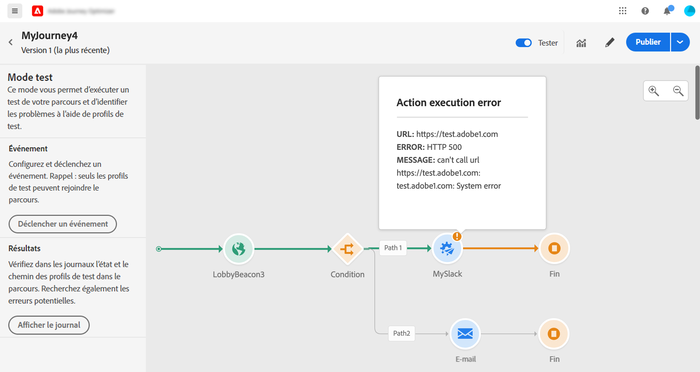
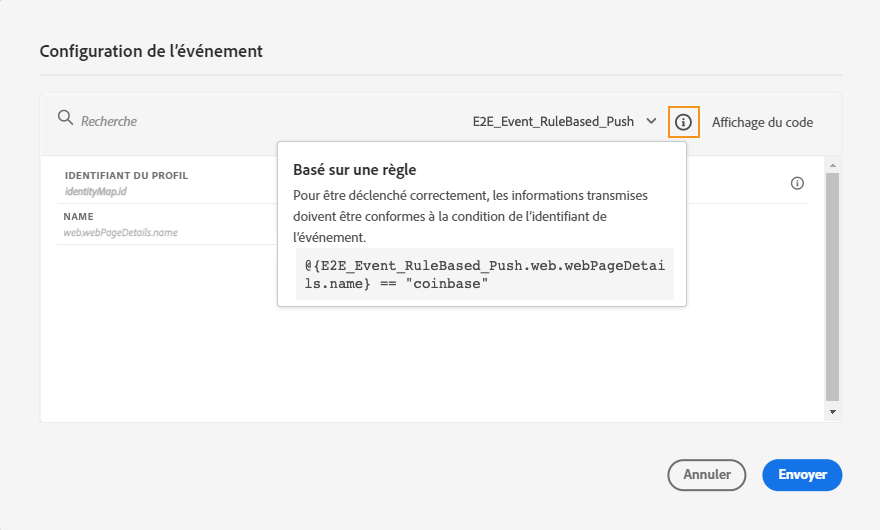
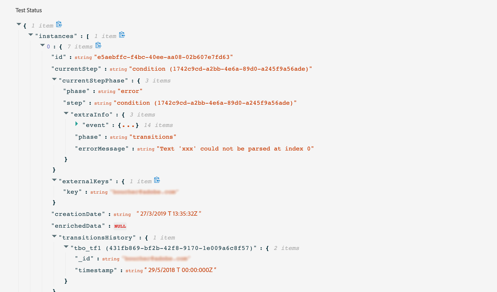

# Test du parcours{#testing_the_journey}

Avant de pouvoir tester votre parcours, vous devez résoudre toutes les erreurs, le cas échéant. Voir [cette section](../building-journeys/troubleshooting.md#section_h3q_kqk_fhb).

Vous avez la possibilité de tester votre parcours avant sa publication, en utilisant des profils de test. Cela vous permet d’analyser le flux des individus dans le parcours et de résoudre les problèmes avant la publication.

Seuls les profils de test peuvent entrer dans un parcours en mode test. Vous pouvez soit créer un nouveau profil de test, soit transformer un profil existant en profil de test. Reportez-vous à cette [section](../building-journeys/creating-test-profiles.md).

Pour utiliser le mode test, procédez comme suit :

1. Avant de tester votre parcours, vérifiez qu’il est valide et qu’il n’y a aucune erreur. Vous ne pourrez pas lancer un test d’un parcours avec des erreurs. Voir [cette section](../building-journeys/troubleshooting.md#section_h3q_kqk_fhb). Un symbole d’avertissement s’affiche en cas d’erreur.

1. Pour activer le mode test, cliquez sur la bascule **[!UICONTROL Test]** située dans le coin supérieur droit.

   

1. Utilisez le paramètre **[!UICONTROL Délai d’attente]**, dans le coin inférieur gauche, pour définir la durée pendant laquelle chaque activité d’attente et chaque délai d’événement dureront en mode test. La durée par défaut est de 10 secondes pour les dépassements de délai d’attente et de événement. Vous obtiendrez ainsi rapidement les résultats des tests. Ce paramètre n’apparaît que si vous avez laissé tomber une ou plusieurs activités d’attente dans votre parcours.

   

   >[!NOTE]
   >
   >Lorsqu’un événement de réaction est utilisé dans un parcours, le temps d’attente par défaut et la valeur minimale sont de 40 secondes. Voir [cette section](../building-journeys/reaction-events.md).

1. Cliquez sur **[!UICONTROL Déclencher un événement]** pour configurer et envoyer des événements au parcours.

   

1. Configurez les différents champs prévus. Dans le champ **Identificateur de Profil**, entrez la valeur du champ utilisé pour identifier le profil de test. Il peut s’agir, par exemple, de l’adresse électronique. Veillez à envoyer les événements liés aux profils de test. Voir [déclenchement de vos événements](#firing_events).

   

1. Une fois les événements reçus, cliquez sur le bouton **[!UICONTROL Afficher le journal]** pour vue le résultat du test et vérifiez-les. Voir [Affichage des journaux](#viewing_logs).

   

1. En cas d’erreur, désactivez le mode de test, modifiez votre parcours et testez-le à nouveau. Lorsque le test est concluant, vous pouvez publier votre parcours. Voir [cette page](../building-journeys/publishing-the-journey.md).

## Remarques importantes {#important_notes}

* Une interface est fournie pour déclencher les événements au parcours testé mais les événements peuvent également être envoyés par des systèmes tiers tels que Postman.
* Seuls les individus signalés comme &quot;profils de test&quot; dans le service de Profil client en temps réel seront autorisés à entrer dans le parcours testé. Reportez-vous à cette [section](../building-journeys/creating-test-profiles.md).
* Le mode test n’est disponible que dans les parcours préliminaires qui utilisent un espace de nommage. Le mode d&#39;essai doit vérifier si une personne qui entre dans le parcours est un profil d&#39;essai ou non et doit donc être en mesure d&#39;atteindre Adobe Experience Platform.
* Le nombre maximal de profils de test pouvant entrer dans un parcours au cours d&#39;une session de test est de 100.
* Lorsque vous désactivez le mode de test, il vide les parcours de toutes les personnes qui y sont entrées dans le passé ou qui y sont actuellement. Il efface aussi le rapports.
* Vous pouvez activer/désactiver le mode test autant de fois que nécessaire.
* Vous ne pouvez pas modifier votre parcours lorsque le mode de test est activé. En mode test, vous pouvez publier directement le parcours, sans avoir à désactiver le mode test avant.

## déclenchement de vos événements {#firing_events}

Le bouton **[!UICONTROL Déclencher un événement]** vous permet de configurer un événement qui fera entrer une personne dans le parcours.

>[!NOTE]
>
>Lorsque vous déclenchez un événement en mode test, un événement réel est généré, ce qui signifie qu’il touche également d’autres parcours qui écoutent ce événement.

Pour cela, vous devez savoir quels profils sont marqués comme profils de test dans Adobe Experience Platform. En effet, le mode test ne permet ces profils que dans le parcours et le événement doit contenir un identifiant. L’ID attendu dépend de la configuration du événement. Il peut s’agir d’un ECID ou d’une adresse électronique, par exemple. La valeur de cette clé doit être ajoutée dans le champ **Identificateur de Profil**.

Si votre parcours contient plusieurs événements, utilisez la liste déroulante pour sélectionner un événement. Ensuite, pour chaque événement, configurez les champs transmis et l’exécution de l’envoi du événement. L’interface vous permet de transmettre les informations appropriées dans la charge utile du événement et de vous assurer que le type d’informations est correct. Le mode test enregistre les derniers paramètres utilisés dans une session de test pour une utilisation ultérieure.

L&#39;interface vous permet de transmettre des paramètres de événement simples. Si vous souhaitez transmettre des collections ou d’autres objets avancés dans le événement, vous pouvez cliquer sur **[!UICONTROL Vue de code]** pour afficher l’intégralité du code de la charge utile et le modifier. Par exemple, vous pouvez copier et coller des informations de événement préparées par un utilisateur technique.

Un utilisateur technique peut également utiliser cette interface pour composer des charges de événement et déclencher des événements sans avoir à utiliser un outil tiers.

Lorsque vous cliquez sur le bouton **[!UICONTROL Envoyer]**, le test commence. La progression de l&#39;individu dans le parcours est représentée par un flux visuel. Le chemin devient progressivement vert au fur et à mesure que l&#39;individu se déplace à travers le parcours. Si une erreur se produit, un symbole d’avertissement s’affiche à l’étape correspondante. Vous pouvez y placer le curseur pour afficher plus d’informations sur l’erreur et accéder à des détails complets (le cas échéant).

Lorsque vous sélectionnez un autre profil de test dans l’écran de configuration du événement et que vous réexécutez le test, le flux visuel est effacé et indique le chemin d’accès de la nouvelle personne.

Lors de l&#39;ouverture d&#39;un parcours dans le test, le chemin affiché correspond au dernier test exécuté.

Le flux visuel fonctionne si le événement est déclenché par l&#39;interface ou de manière externe (à l&#39;aide de Postman, par exemple).

## Mode de test pour les parcours basés sur des règles {#test-rule-based}

Le mode test est également disponible pour les parcours qui utilisent un événement basé sur des règles. Pour plus d&#39;informations sur les événements basés sur des règles, consultez [cette page](../event/about-events.md).

Lors du déclenchement d&#39;un événement, l&#39;écran **configuration de Événement** vous permet de définir les paramètres de événement à transmettre au test. Vous pouvez vue la condition d’ID de événement en cliquant sur l’icône d’info-bulle située dans le coin supérieur droit. Une info-bulle est également disponible en regard de chaque champ qui fait partie de l’évaluation des règles.

Pour plus d&#39;informations sur l&#39;utilisation du mode test, consultez [cette page](../building-journeys/testing-the-journey.md).

## Mode de test pour les événements métier {#test-business}

Lors de l&#39;utilisation d&#39;un événement de fonctionnement (voir [cette section](../event/about-events.md)), le mode test vous permet de déclencher une seule entrée de profil de test dans le parcours, de simuler le événement et de transmettre l&#39;ID de profil approprié. Vous devez transmettre les paramètres de événement et l&#39;identifiant du profil de test qui va entrer le parcours dans le test. Vous ne pouvez pas utiliser l&#39;option **[!UICONTROL Jusqu&#39;à 100 profils à la fois]** qui existe pour d&#39;autres parcours basés sur les segments. En mode test, aucun mode &quot;vue de code&quot; n’est disponible pour les parcours en fonction des événements d’entreprise.

Notez que lorsque vous déclenchez pour la première fois un événement métier, vous ne pouvez pas modifier la définition du événement métier dans la même session de test. Vous pouvez uniquement faire entrer le même individu ou un autre individu dans le parcours en transmettant le même identifiant ou un autre identifiant. Si vous souhaitez modifier les paramètres du événement métier, vous devez arrêter et début à nouveau le mode de test.

## Affichage des journaux {#viewing_logs}

Le bouton **[!UICONTROL Afficher le journal]** vous permet de vue des résultats du test. Cette page affiche les informations actuelles du parcours au format JSON. Un bouton permet de copier des noeuds entiers. Vous devez actualiser manuellement la page pour mettre à jour les résultats de test du parcours.

>[!NOTE]
>
>Dans les journaux de test, en cas d’erreur lors de l’appel d’un système tiers (source de données ou action), le code d’erreur et la réponse à l’erreur s’affichent.

Le nombre d’individus (techniquement, ils sont appelés instances) actuellement dans le parcours s’affiche. Voici des informations utiles qui s’affichent pour chaque individu :

* _Id_ : l’ID interne de la personne dans le parcours. Vous pouvez l’utiliser à des fins de débogage.
* _étape_ actuelle : l&#39;étape où l&#39;individu se trouve dans le parcours. Nous vous recommandons d&#39;ajouter des étiquettes à vos activités afin de les identifier plus facilement.
* _étape_  actuelle> phase : l’état du parcours de la personne (exécution, fin, erreur ou expiration). Voir ci-dessous pour plus d’informations.
* _current_ >  _extraInfo_: description de l’erreur et d’autres informations contextuelles.
* _current_ >  _fetchErrors_: informations sur la récupération des erreurs de données survenues au cours de cette étape.
* _externalKeys_ : valeur de la formule clé définie dans le événement.
* _enrichissementData_ : les données que le parcours a récupérées si le parcours utilise des sources de données.
* _transitionHistory_ : la liste des étapes que l&#39;individu a suivies. Pour les événements, la charge utile s’affiche.
* _actionExecutionErrors_  : informations sur les erreurs survenues.

Voici les différents états du parcours d&#39;un individu :

* _En cours_ : la personne est actuellement au parcours.
* _Terminé_ : la personne est à la fin du parcours.
* _Erreur_ : la personne est arrêtée dans le parcours en raison d&#39;une erreur.
* _Délai d’expiration_ : l&#39;individu est arrêté dans le parcours à cause d&#39;une mesure qui a pris trop de temps.

Lorsqu’un événement est déclenché en mode test, un jeu de données est automatiquement généré avec le nom de la source.

Lorsqu’un événement est déclenché en mode test, un jeu de données est automatiquement généré avec le nom de la source.

Le mode test crée automatiquement un Événement d’expérience et l’envoie à Adobe Experience Platform. Le nom de la source de ce Événement d’expérience est &quot;Événements de test Journey Orchestration&quot;.

Dans le cas de plusieurs événements déclenchés à partir de plusieurs parcours

Il y a un scénario où plusieurs événements sont envoyés à partir de plusieurs parcours qui auront des Schémas différents. Un schéma peut-il mapper sur un jeu de données 1 ? Si ce n&#39;est pas le cas, plusieurs jeux de données seront nécessaires.

La création et le nommage automatiques de ces jeux de données sont effectués si un jeu de données de destination n’est pas inclus dans le événement d’expérience. C&#39;est pourquoi nous voyons aujourd&#39;hui le &quot;jeu de données créé automatiquement pour voyageur&quot;.

Le nommage de notre source entraîne la création automatique. Si nous avons plusieurs événements, nous devrions concaténer et le faire être &quot;Événement d&#39;essai Journey Orchestration - NOM DU SCHÉMA&quot;. Ce paramètre devient automatiquement &quot;Jeu de données généré automatiquement pour le Événement de test du Journey Orchestration - NOM DU SCHÉMA&quot;.
