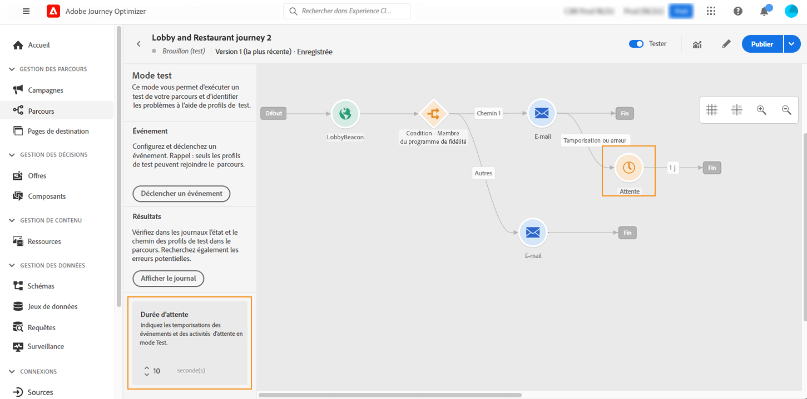
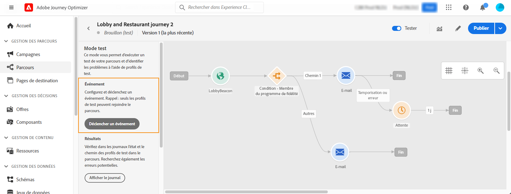
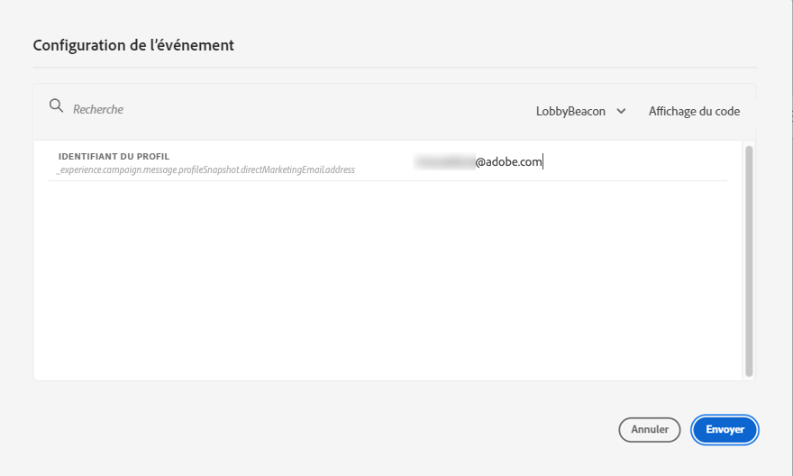
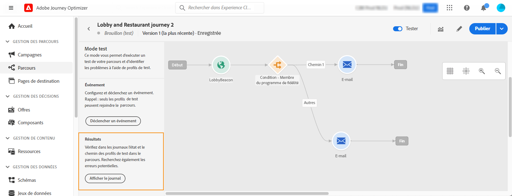
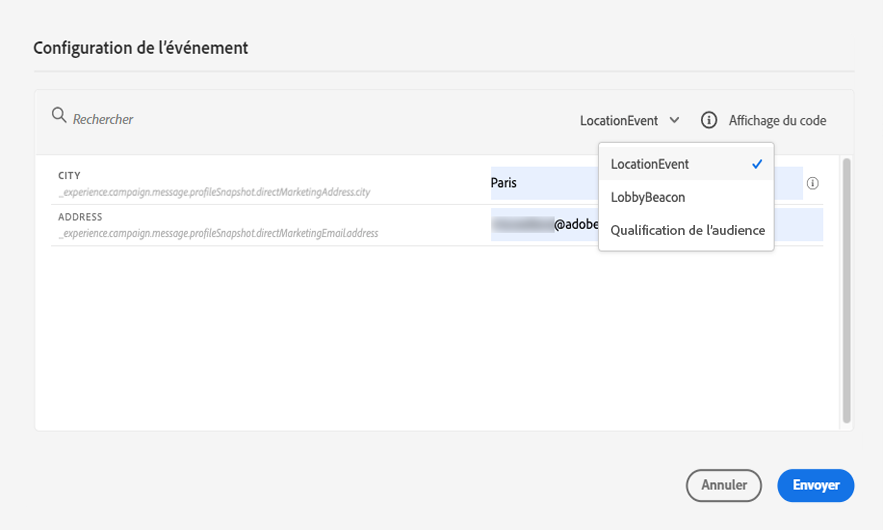
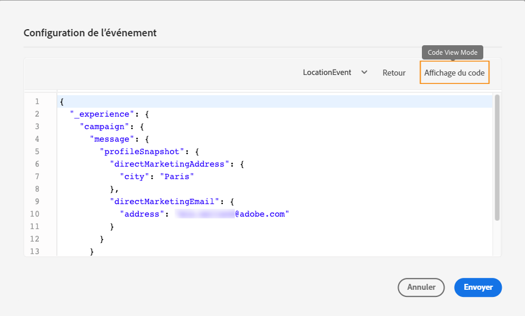
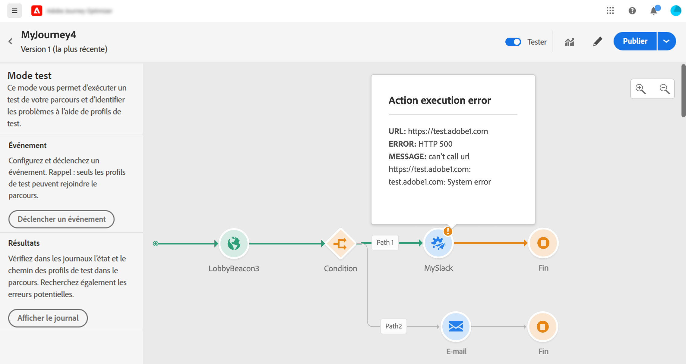
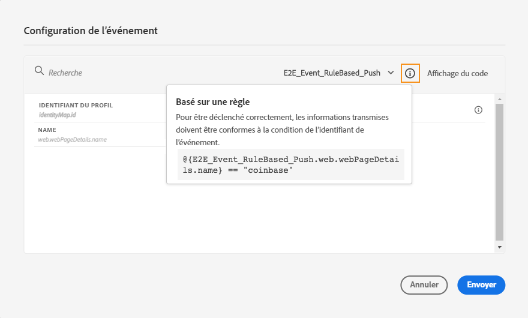
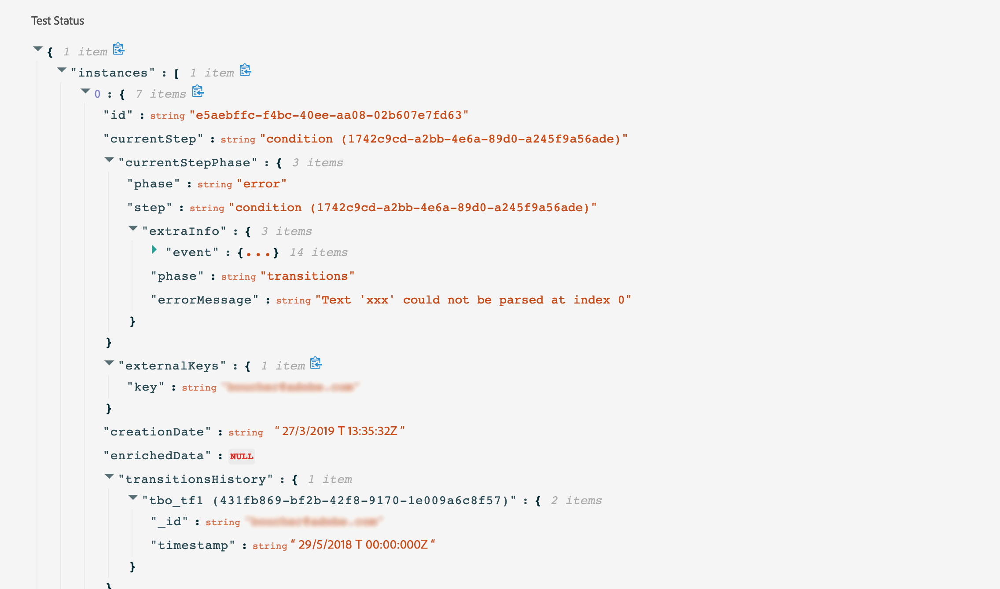

# Tester votre parcours{#testing_the_journey}

>[!BEGINSHADEBOX]

**Sur cette page :** Découvrez comment valider votre parcours avant sa publication à l’aide d’une simulation avec des utilisateurs et utilisatrices simulés ou d’un mode test avec des profils de test pour détecter les erreurs de manière précoce.

>[!ENDSHADEBOX]

>[!CONTEXTUALHELP]
>id="ajo_journey_test"
>title="Tester votre parcours"
>abstract="Les profils de test vous permettent de tester votre parcours avant de le publier. Vous pouvez ainsi analyser le flux des individus dans le parcours et résoudre les problèmes avant la publication."
>additional-url="https://experienceleague.adobe.com/fr/docs/journey-optimizer/using/orchestrate-journeys/create-journey/journey-dry-run" text="Test à blanc du parcours"

Une fois que vous avez créé votre parcours, vous pouvez le tester avant de le publier. [!DNL Adobe Journey Optimizer] propose un « mode test » pour afficher les profils de test lorsqu’ils se déplacent sur le parcours, détectant les erreurs potentielles avant l’activation. L’exécution de tests rapides vous permet de vérifier que les parcours fonctionnent correctement afin de pouvoir les publier en toute confiance.

Seuls les profils de test peuvent rejoindre un parcours en mode test. Vous pouvez créer des profils de test ou transformer des profils existants en profils de test. En savoir plus sur les profils de test dans [cette section](../audience/creating-test-profiles.md).

Adobe Parcours Optimizer propose deux méthodes pour tester et valider votre parcours :

* **[Simulation](simulate-journey.md#test-users)** : définissez le parcours sur **[!UICONTROL Simulation]** et utilisez des utilisateurs simulés (profils temporaires que vous créez ou générez à la volée sans profils précréés dans Adobe Experience Platform).

* **[Mode test](#test-profiles)** : profils persistants explicitement marqués comme profils de test dans Adobe Experience Platform. Ils peuvent être réutilisés au cours de plusieurs sessions de test. Cette méthode est recommandée pour effectuer des tests avec des données de profil prédéfinies cohérentes. [Découvrez comment créer des profils de test](../audience/creating-test-profiles.md).

>[!NOTE]
>
>Avant de tester votre parcours, vous devez résoudre toutes les erreurs, le cas échéant. Découvrez comment rechercher des erreurs avant d’effectuer des tests dans [cette section](../building-journeys/troubleshooting.md). Si les profils de test ne progressent pas en mode test, voir [résolution des problèmes liés aux transitions en mode test](troubleshooting-execution.md#troubleshooting-test-transitions).

## Remarques importantes {#important_notes}

Consultez ces notes avant d’exécuter des tests dans votre parcours.

### Limites générales

* **Profils de test uniquement** : seuls les individus indiqués comme « profils de test » dans le service de profil client en temps réel peuvent rejoindre un parcours en mode test. [Découvrez comment créer des profils de test](../audience/creating-test-profiles.md).
* **Exigence d’espace de noms** : le mode test n’est disponible que pour les brouillons de parcours qui utilisent un espace de noms. Le mode test doit vérifier si une personne qui entre dans le parcours est un profil de test ou non et doit donc être en mesure d’atteindre [!DNL Adobe Experience Platform].
* **Limite de profil** : un maximum de 100 profils de test peuvent rejoindre un parcours au cours d’une seule session de test.
* **Déclenchement d’événement** : les événements ne peuvent être déclenchés qu’à partir de l’interface. Les événements ne peuvent pas être déclenchés à partir de systèmes externes à l’aide d’une API.
* **Audiences de chargement personnalisées** : le mode test de parcours ne prend pas en charge l’enrichissement d’attributs d’[audience de chargement personnalisée](../audience/custom-upload.md).

### Comportement pendant et après les tests

* **Désactivation du mode test** : lorsque vous désactivez le mode test, tous les profils présents actuellement dans le parcours ou qui l’ont rejoint précédemment sont supprimés et les rapports sont effacés.
* **Flexibilité de réactivation** : vous pouvez activer et désactiver le mode test autant de fois que nécessaire.
* **Désactivation automatique** : les parcours qui restent inactifs en mode test pendant **plus d’une semaine** reviennent automatiquement au statut Brouillon pour optimiser les performances et empêcher l’utilisation des ressources obsolètes.
* **Modification et publication** : lorsque le mode test est actif, vous ne pouvez pas modifier le parcours. Cependant, vous pouvez publier directement le parcours, sans avoir à désactiver le mode test au préalable.

### Exécution

* **Comportement de partage** : lorsque le parcours atteint un partage, la branche supérieure est toujours sélectionnée. Réorganisez les branches si vous souhaitez tester un autre chemin.
* **Synchronisation des événements** - Si le parcours comprend plusieurs événements, déclenchez chaque événement en séquence. L’envoi d’un événement trop tôt (avant la fin du premier nœud d’attente) ou trop tard (après la temporisation configurée) ignore l’événement. Le profil sera alors envoyé à un chemin de temporisation. Vérifiez toujours que les références aux champs de payload d&#39;événement restent valides en envoyant la payload dans la fenêtre définie.
* **Fenêtre de date active** - Assurez-vous que la fenêtre [dates/heure de début et de fin](journey-properties.md#dates) configurée pour le parcours inclut l’heure actuelle lors du lancement du mode test. Dans le cas contraire, les événements de test déclenchés sont ignorés silencieusement. Pour en savoir plus sur le dépannage de ce problème, consultez [cette page](troubleshooting-execution.md#troubleshooting-test-transitions).
* **Événements de réaction** : pour les événements de réaction avec une temporisation, le temps d’attente minimum et par défaut est de 40 secondes.
* **Jeux de données de test** : les événements déclenchés en mode test sont stockés dans des jeux de données dédiés libellés comme suit : `JOtestmode - <schema of your event>`
* **Infrastructure partagée** : le mode test s’exécute sur la même infrastructure que la production. Pendant les périodes de trafic élevé, vous pouvez remarquer des retards dans les envois d’e-mails ou le traitement des événements. Dans ce cas, vérifiez les tableaux de bord de trafic de la plateforme ou réessayez vos tests en dehors des heures de pointe.

<!--
* Fields from related entities are hidden from the test mode.
-->

## Activer le mode test

Utilisez la méthode **[!UICONTROL Mode test]** lorsque vous souhaitez tester votre parcours avec des profils de test préexistants que vous avez déjà créés dans Adobe Experience Platform.

1. Pour activer le mode test, cliquez sur le bouton **[!UICONTROL Simuler]**, puis sélectionnez **[!UICONTROL Mode test]**.

   

1. Si le parcours comporte au moins une activité **Attente**, définissez la variable **[!UICONTROL Temps d’attente]** pour définir la durée en mode test de chaque activité d’attente et de chaque délai d’expiration d’événement. La durée par défaut est de 10 secondes pour les attentes et les temporisations d’événement. Vous obtiendrez ainsi rapidement les résultats du test.

   

   >[!NOTE]
   >
   >Lorsqu’un événement de réaction est utilisé avec une temporisation dans un parcours, la durée d’attente par défaut ainsi que la valeur minimale sont de 40 secondes. Consultez [cette section](../building-journeys/reaction-events.md).

1. Utilisez le bouton **[!UICONTROL Déclencher un événement]** pour configurer des événements et les envoyer au parcours.

   

1. Configurez les différents champs attendus. Dans le champ **Identifiant de profil**, saisissez la valeur du champ utilisé pour identifier le profil de test. Il peut s’agir, par exemple, de l’adresse e-mail. Veillez à envoyer des événements liés aux profils de test. Consultez [cette section](#firing_events).

   

1. Une fois les événements reçus, cliquez sur le bouton **[!UICONTROL Afficher le journal]** pour afficher les résultats du test et les valider. Consultez [cette section](#viewing_logs).

   

1. En cas d’erreur, désactivez le mode test, modifiez votre parcours et lancez un nouveau test. Une fois les tests terminés, vous pouvez publier votre parcours. Consultez [cette page](../building-journeys/publish-journey.md).

## Exemple de travail : valider un parcours simple {#test-walkthrough}

L’exemple suivant illustre le test d’un parcours qui commence par un événement unitaire, envoie un e-mail, attend 10 minutes, puis envoie une notification push.

Pour valider le parcours de bout en bout :

1. Activez le mode test en cliquant sur **[!UICONTROL Mode test]** dans le coin supérieur droit. La zone de travail passe en mode test et un bouton **[!UICONTROL Déclencher un événement]** s’affiche.
1. Définissez **[!UICONTROL Temps d’attente]** sur **10 secondes** afin que le nœud d’attente se termine rapidement pendant le test.
1. Cliquez sur **[!UICONTROL Déclencher un événement]**, sélectionnez votre événement et saisissez un identifiant de profil de test (par exemple, l’adresse e-mail d’un profil marqué comme profil de test dans Adobe Experience Platform).
1. Cliquez sur **[!UICONTROL Envoyer]**. Le flux visuel s’affiche sur la zone de travail et devient vert au fur et à mesure que le profil progresse à travers chaque étape.
1. Cliquez sur **[!UICONTROL Afficher le journal]** et confirmez les éléments suivants dans la sortie JSON :
   * `currentstep` correspond à l’activité dans laquelle vous pensez que le profil sera.
   * `phase` affiche `running` lorsque le profil se trouve dans un nœud d’attente et `finished` lorsqu’il atteint la fin.
   * Aucune entrée `actionExecutionErrors` n’est présente.
1. Au bout de 10 secondes, actualisez le journal. Le profil aurait dû avancer au-delà du nœud d’attente et déclencher l’action push.
1. Lorsque toutes les étapes affichent `finished` et qu’aucune erreur n’est consignée, désactivez le mode test et publiez le parcours.

>[!TIP]
>
>Si le profil n’apparaît pas du tout dans le journal, vérifiez les points suivants :
>* L’identifiant de profil que vous avez saisi est marqué comme profil de test dans [!DNL Adobe Experience Platform].
>* Les dates de début et de fin configurées du parcours incluent l’heure actuelle. Les événements déclenchés en dehors de cette fenêtre sont ignorés silencieusement. [En savoir plus](troubleshooting-execution.md#troubleshooting-test-transitions).

## Déclencher vos événements {#firing_events}

>[!CONTEXTUALHELP]
>id="ajo_journey_test_configuration"
>title="Configuration du mode test"
>abstract="Si un parcours contient plusieurs événements, la liste déroulante permet de sélectionner un événement. Pour chaque événement, les champs transmis et l’exécution de l’envoi de l’événement sont configurés."

Utilisez le bouton **[!UICONTROL Déclencher un événement]** pour configurer un événement qui fera qu’un individu rejoint le parcours.

### Conditions préalables {#trigger-events-prerequisites}

Vous devez, au préalable, savoir quels profils sont marqués comme profils de test dans [!DNL Adobe Experience Platform]. En effet, le mode test n’autorise ces profils que dans le parcours.

L’événement doit contenir un identifiant. L’identifiant attendu dépend de la configuration de l’événement. Il peut s’agir d’un ECID ou d’une adresse e-mail, par exemple. La valeur de cette clé doit être ajoutée dans le champ **Identifiant du profil**.

Si votre parcours ne parvient pas à activer le mode test avec l’erreur `ERR_MODEL_RULES_16`, assurez-vous que l’événement utilisé inclut un [espace de noms d’identité](../audience/get-started-identity.md) lors de l’utilisation d’une action de canal.

L’espace de noms d’identité est utilisé pour identifier de manière unique les profils de test. Par exemple, si l&#39;e-mail est utilisé pour identifier les profils de test, l’espace de noms d’identité **E-mail** doit être sélectionné. Si l’identifiant unique est le numéro de téléphone, l’espace de noms d’identité **Téléphone** doit être sélectionné.

>[!NOTE]
>
>* Lorsque vous déclenchez un événement en mode test, un événement réel est généré, ce qui signifie qu’il sera également utilisé par d’autres parcours qui écoutent cet événement.
>
>* Assurez-vous que chaque événement en mode test est déclenché dans le bon ordre et dans la fenêtre d’attente configurée. Par exemple, en cas d’attente de 60 secondes, le deuxième événement ne doit être déclenché qu’après l’expiration de cette attente de 60 secondes et avant l’expiration de la temporisation.
>

### Configuration des événements {#trigger-events-configuration}

Si votre parcours contient plusieurs événements, sélectionnez-les dans la liste déroulante. Ensuite, pour chaque événement, configurez les champs transmis et l&#39;exécution de l&#39;envoi de l’événement. L&#39;interface vous permet de transmettre les informations appropriées dans la payload de l&#39;événement et de vous assurer que le type d&#39;informations est correct. Le mode test enregistre les derniers paramètres utilisés dans une session de test en vue d’une utilisation ultérieure.

L’interface vous permet de transmettre des paramètres d’événement simples. Si vous souhaitez transmettre des collections ou d’autres objets avancés dans l’événement, vous pouvez sélectionner **[!UICONTROL Affichage du code]** pour voir l’intégralité du code de la payload et le modifier. Vous pouvez par exemple copier et coller des informations d’événement préparées par un utilisateur ou une utilisatrice technique.

Un utilisateur ou une utilisatrice technique peut également utiliser cette interface pour composer des payloads d’événement et déclencher des événements sans avoir à utiliser un outil tiers.

Lorsque vous cliquez sur le bouton **[!UICONTROL Envoyer]**, le test commence. La progression de la personne dans le parcours est représentée par un flux visuel. Le chemin devient progressivement vert lorsque la personne se déplace sur le parcours. Si une erreur se produit, un symbole d’avertissement s’affiche à l’étape correspondante. Vous pouvez y placer le curseur pour afficher plus d’informations sur l’erreur et accéder à tous les détails (le cas échéant).

Lorsque vous sélectionnez un autre profil de test dans l’écran de configuration de l’événement et exécutez à nouveau le test, le flux visuel est effacé et affiche le chemin de la nouvelle personne.

Lors de l’ouverture d’un parcours dans le test, le chemin affiché correspond au dernier test exécuté.

## Mode test pour les parcours basés sur des règles {#test-rule-based}

Le mode test est également disponible pour les parcours qui utilisent un événement basé sur des règles. Pour plus d’informations sur les événements de test, consultez [cette page](../event/about-events.md).

Lors du déclenchement d’un événement, l’écran **Configuration de l’événement** vous permet de définir les paramètres d’événement à transmettre au test. Vous pouvez afficher la condition de l’identifiant d’événement en cliquant sur l’icône Info-bulle dans la partie supérieure droite. Une info-bulle est également disponible en regard de chaque champ qui fait partie de l’évaluation des règles.

## Mode test pour événements métier {#test-business}

Lors de l’utilisation d’un [événement métier](../event/about-events.md), utilisez le mode test pour déclencher une entrée de profil de test unique dans le parcours, simuler l’événement et transmettre l’identifiant de profil approprié. Vous devez transmettre les paramètres d’événement et l’identifiant du profil de test qui va rejoindre le parcours au moment du test. En mode test, aucun mode « Affichage du code » n’est disponible pour les parcours en fonction des événements métier.

Notez que lorsque vous déclenchez pour la première fois un événement métier, vous ne pouvez pas modifier la définition de l&#39;événement métier dans la même session de test. Vous pouvez uniquement faire en sorte qu’un même individu ou qu’un autre individu rejoigne le parcours en transmettant le même identifiant ou un autre identifiant. Si vous souhaitez modifier les paramètres de l&#39;événement métier, vous devez arrêter et démarrer à nouveau le mode test.

## Afficher les journaux {#viewing_logs}

>[!CONTEXTUALHELP]
>id="ajo_journey_test_logs"
>title="Journaux du mode test"
>abstract="Le bouton **Afficher le journal** affiche les résultats du test au format JSON. Ces résultats affichent le nombre d’individus à l’intérieur du parcours et leur état."

Le bouton **[!UICONTROL Afficher le journal]** vous permet d’afficher les résultats du test. Cette page affiche des informations actuelles sur le parcours au format JSON. Un bouton vous permet de copier des nœuds entiers. Vous devez actualiser manuellement la page pour mettre à jour les résultats de test du parcours.

>[!NOTE]
>
>Dans les journaux de test, en cas d’erreur lors de l’appel d’un système tiers (source de données ou action), le code d’erreur et la réponse d’erreur s’affichent.

Le nombre d’individus (techniquement appelés instances) actuellement à l’intérieur du parcours s’affiche. Les informations affichées sont les suivantes pour chaque individu :

* _ID_ : identifiant interne de la personne dans le parcours. Il peut être utilisé à des fins de débogage.
* _currentstep_ : étape à laquelle se trouve la personne dans le parcours. Nous vous recommandons d’ajouter des libellés à vos activités afin de les identifier plus facilement.
* _currentstep_ > phase : statut du parcours de la personne (en cours, terminé, erreur ou expiré). Plus d’informations ci-dessous.
* _currentstep_ > _extraInfo_ : description de l’erreur et autres informations contextuelles.
* _currentstep_ > _fetchErrors_ : informations sur les erreurs de récupération de données qui se sont produites au cours de cette étape.
* _externalKeys_ : valeur de la formule de clé définie dans l’événement.
* _enrichedData_ : données récupérées par le parcours si le parcours utilise des sources de données.
* _transitionHistory_ : liste des étapes suivies par la personne. Pour les événements, le payload s’affiche.
* _actionExecutionErrors_ : informations sur les erreurs qui se sont produites.

Voici les différents statuts du parcours d’une personne :

* _En cours_ : la personne se trouve actuellement dans le parcours.
* _Terminé_ : la personne est à la fin du parcours.
* _Erreur_ : le parcours de la personne a été arrêté en raison d’une erreur.
* _Délai dépassé_ : le parcours de la personne a été arrêté, car l’exécution d’une étape a pris trop de temps.

Lorsqu’un événement est déclenché en mode test, un jeu de données est automatiquement généré avec le nom de la source.

Le mode test crée automatiquement un événement d’expérience et l’envoie à [!DNL Adobe Experience Platform]. Le nom de la source de cet événement d’expérience est « Événements de test Journey Orchestration ».

+++ Référence des connaissances sur l’IA

Cette section contient des connaissances structurées destinées à soutenir l’interprétation, la récupération et la réponse aux questions liées à ce sujet.

Pour une compréhension totale, ces informations doivent être combinées avec la documentation de cette page. Aucune des sources n’est conçue pour être autonome. La page décrit la fonctionnalité, tandis que cette section fournit un contexte supplémentaire qui permet de clarifier la terminologie, l’intention, l’applicabilité et les contraintes.

* **TL;DR:** Cette page explique comment utiliser le mode Test dans Adobe Journey Optimizer pour valider un parcours avec des profils de test persistants avant publication, y compris l’activation du mode test, le déclenchement d’événements, la lecture de journaux et la gestion d’événements métier et basés sur des règles.

**Intentions:**
* Activez le mode Test sur un brouillon de parcours afin de le valider avec des profils de test AEP préexistants
* Configuration et déclenchement d’événements pour les profils de test à l’aide de l’interface Déclencher un événement .
* Remplacer les durées d’activité d’attente en mode test pour accélérer la progression du parcours
* Lisez et interprétez la sortie JSON Afficher le journal pour vérifier la progression du profil et identifier les erreurs
* Tester des parcours basés sur des règles et des parcours d’événement métier en mode test
* Comprendre les limites et les différences de comportement du mode Test par rapport à la simulation.

**Glossaire:**
* **Mode test** : état de validation du parcours qui permet aux profils de test AEP persistants de parcourir un brouillon de parcours avant qu’il ne soit publié *(spécifique au produit)*
* **Profils de test** : profils explicitement marqués comme profils de test dans le service de profil client en temps réel Adobe Experience Platform ; le seul type de profil autorisé à entrer un parcours en mode test *(spécifique au produit)*
* **Flux visuel** : représentation de la zone de travail qui devient verte pour afficher le chemin suivi par un profil de test dans le parcours
* **Afficher le journal** : une fonctionnalité de mode test qui affiche l’état d’exécution du parcours au format JSON pour chaque instance de profil de test *(spécifique au produit)*
* **Événements de test Journey Orchestration** : nom de source sous lequel les événements d’expérience du mode test sont stockés dans Adobe Experience Platform

**Mécanismes de sécurisation :**
* Seuls les profils indiqués comme profils de test dans AEP peuvent entrer un parcours en mode test
* Le mode test nécessite que le parcours utilise un espace de noms pour vérifier l&#39;identité du profil de test
* 100 profils de test maximum par session de test unique
* Les événements peuvent uniquement être déclenchés à partir de l’interface utilisateur du mode test. Le déclenchement d’API externe n’est pas pris en charge
* L’enrichissement des attributs d’audience de chargement personnalisé n’est pas pris en charge en mode test
* Les parcours inactifs en mode test depuis plus d’une semaine repassent automatiquement au statut Brouillon .
* Les modifications du parcours sont bloquées lorsque le mode test est actif, mais la publication directe est autorisée
* Lors d’une division, la branche supérieure est toujours sélectionnée ; réorganisez les branches pour tester différents chemins d’accès
* Le délai d’expiration minimal de l’événement de réaction et le temps d’attente par défaut sont de 40 secondes
* Les événements envoyés en dehors de la fenêtre de date de début/fin configurée du parcours sont ignorés silencieusement
* La désactivation du mode test supprime tous les profils du parcours et efface les rapports

**Terminologie:**
* Nom canonique : Mode test — Acronyme : none — variantes : mode test, mode test parcours
* Nom canonique : Profils de test — Acronyme : aucun — Variantes : utilisateurs de test (libellé de l’interface utilisateur de simulation uniquement)
* Synonymes : « Afficher le journal » = journal des résultats de test ; « Flux visuel » = visualisation du chemin de la zone de travail
* Ne les confondez pas : « Mode test » ≠ « Simulation » : le mode test utilise des profils de test AEP persistants ; la simulation utilise des utilisateurs simulés temporaires générés à la volée

**FAQ:**
* **Q : Qui peut entrer un parcours en mode test ?** : seuls les profils explicitement marqués comme profils de test dans le service de profil client en temps réel Adobe Experience Platform.
* **Q : Combien de profils de test peuvent être exécutés au cours d’une seule session de test ?** — Un maximum de 100 profils de test par session de test.
* **Q : Que se passe-t-il lorsque je désactive le mode test ?** — Tous les profils actuellement ou précédemment entrés dans le parcours sont supprimés et les rapports sont effacés.
* **Q : Puis-je modifier un parcours lorsque le mode Test est actif ?** — Non. Le parcours ne peut pas être modifié lorsque le mode test est actif, mais vous pouvez le publier directement sans désactiver le mode test au préalable.
* **Q : Pourquoi mes événements de test sont-ils ignorés silencieusement ?** — Les événements déclenchés en dehors de la fenêtre de date/heure active configurée du parcours sont ignorés silencieusement. Vérifiez que les dates de début et de fin du parcours incluent l’heure actuelle.
* **Q : Qu’indique le champ de phase dans le journal de test ?** — Affiche le statut actuel du profil : en cours d&#39;exécution (actif dans le parcours), terminé (atteint la fin), erreur (arrêté en raison d&#39;une erreur) ou expiré (arrêté en raison d&#39;une temporisation).

+++
