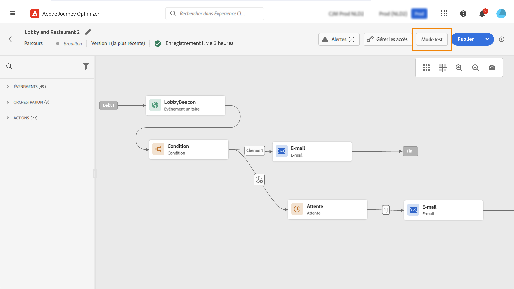
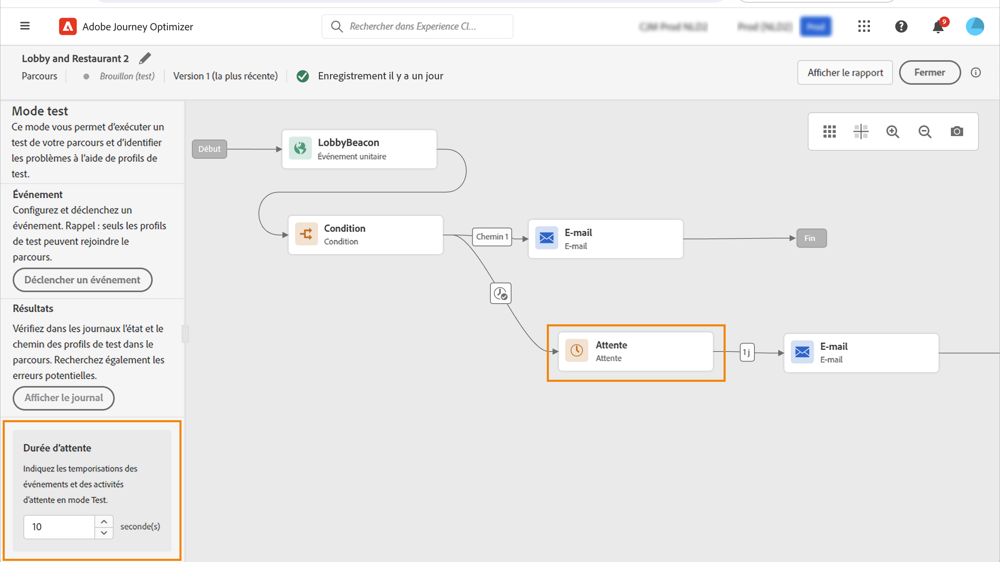
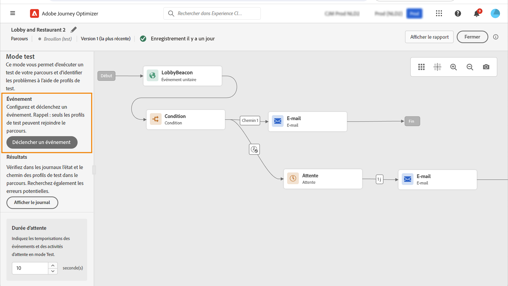

# Tester votre parcours{#testing_the_journey}

>[!CONTEXTUALHELP]
>id="ajo_journey_test"
>title="Tester votre parcours"
>abstract="Utilisez des profils de test pour tester votre parcours avant de le publier. Vous pouvez ainsi analyser le flux des individus dans le parcours et résoudre les problèmes avant la publication."

Utilisez des profils de test pour tester votre parcours avant de le publier. Ce mode vous permet d’exécuter un test sur votre parcours et d’identifier les problèmes à l’aide de profils de test.

Seuls les profils de test peuvent entrer dans un parcours en mode test. Vous pouvez créer de nouveaux profils de test ou transformer des profils existants en profils de test. En savoir plus sur les profils de test dans [cette section](../segment/creating-test-profiles.md).

>[!NOTE]
>
>Avant de tester votre parcours, vous devez résoudre toutes les erreurs, le cas échéant. Découvrez comment vérifier les erreurs avant de les tester dans [cette section](../building-journeys/troubleshooting.md#checking-for-errors-before-testing).

Pour utiliser le mode test, procédez comme suit :

1. Pour activer le mode test, activez la fonction **[!UICONTROL Test]** bascule, situé dans le coin supérieur droit.

   

1. Si le parcours en comporte au moins un **Attente** , définissez la variable **[!UICONTROL Wait time]** pour définir la durée en mode test de chaque activité d’attente et de chaque expiration d’événement. La durée par défaut est de 10 secondes pour les attentes et les dépassements de délai d’événement. Vous obtiendrez ainsi rapidement les résultats du test.

   

   >[!NOTE]
   >
   >Lorsqu’un événement de réaction avec un délai d’expiration est utilisé dans un parcours, la valeur par défaut du temps d’attente et la valeur minimale sont de 40 secondes. Voir [cette section](../building-journeys/reaction-events.md).

1. Utilisez la variable **[!UICONTROL Trigger an event]** pour configurer et envoyer des événements au parcours.

   

1. Configurez les différents champs attendus. Dans le **Identifiant de profil** , saisissez la valeur du champ utilisé pour identifier le profil de test. Il peut s’agir, par exemple, de l’adresse électronique. Veillez à envoyer des événements relatifs aux profils de test. Voir [cette section](#firing_events).

   

1. Une fois les événements reçus, cliquez sur le bouton **[!UICONTROL Show log]** pour afficher le résultat du test et les vérifier. Voir [cette section](#viewing_logs).

   

1. En cas d’erreur, désactivez le mode test, modifiez votre parcours et testez-le à nouveau. Une fois les tests terminés, vous pouvez publier votre parcours. Voir [cette page](../building-journeys/publishing-the-journey.md).

## Remarques importantes {#important_notes}

* Une interface est fournie pour déclencher des événements sur le parcours testé, mais des événements peuvent également être envoyés par des systèmes tiers tels que Postman.
* Seuls les individus identifiés comme &quot;profils de test&quot; dans le service de profil client en temps réel seront autorisés à rejoindre le parcours testé. Consultez cette section [section](../segment/creating-test-profiles.md).
* Le mode test n’est disponible que dans les parcours préliminaires qui utilisent un espace de noms. Le mode test doit vérifier si une personne qui entre dans le parcours est un profil de test ou non et doit donc être en mesure d’atteindre Adobe Experience Platform.
* Le nombre maximal de profils de test pouvant participer à un parcours au cours d’une session de test est de 100.
* Lorsque vous désactivez le mode test, les parcours sont vidés de toutes les personnes qui y sont entrées dans le passé ou qui y sont actuellement actives. Il efface également les rapports.
* Vous pouvez activer/désactiver le mode test autant de fois que nécessaire.
* Vous ne pouvez pas modifier votre parcours lorsque le mode test est activé. En mode test, vous pouvez publier directement le parcours, sans avoir à désactiver le mode test avant.
* Lors de l’atteinte d’une division, la branche supérieure est toujours choisie. Vous pouvez réorganiser la position des branches fractionnées si vous souhaitez que le test choisisse un autre chemin.
* Pour optimiser les performances et éviter l’utilisation obsolète des ressources, tous les parcours en mode test qui n’ont pas été déclenchés depuis une semaine passeront en mode **Version préliminaire** statut.

## Déclencher vos événements {#firing_events}

>[!CONTEXTUALHELP]
>id="ajo_journey_test_configuration"
>title="Configuration du mode test"
>abstract="Si votre parcours contient plusieurs événements, sélectionnez-les à l’aide de la liste déroulante. Ensuite, pour chaque événement, configurez les champs transmis et l’exécution de l’envoi de l’événement."

Utilisez la variable **[!UICONTROL Trigger an event]** pour configurer un événement qui fera entrer une personne dans le parcours.

>[!NOTE]
>
>Lorsque vous déclenchez un événement en mode test, un événement réel est généré, ce qui signifie qu’il sera également utilisé par un autre parcours qui écoute cet événement.

Vous devez, au préalable, savoir quels profils sont marqués comme profils de test dans Adobe Experience Platform. En effet, le mode test autorise uniquement ces profils dans le parcours et l’événement doit contenir un identifiant. L’identifiant attendu dépend de la configuration de l’événement. Il peut s’agir d’un ECID ou d’une adresse électronique, par exemple. La valeur de cette clé doit être ajoutée dans la variable **Identifiant de profil** champ .

Si votre parcours contient plusieurs événements, sélectionnez-les à l’aide de la liste déroulante. Ensuite, pour chaque événement, configurez les champs transmis et l’exécution de l’envoi de l’événement. L’interface vous permet de transmettre les informations appropriées dans la payload de l’événement et de vous assurer que le type d’information est correct. Le mode test enregistre les derniers paramètres utilisés dans une session de test en vue d’une utilisation ultérieure.

L’interface vous permet de transmettre des paramètres d’événement simples. Si vous souhaitez transmettre des collections ou d’autres objets avancés dans l’événement, vous pouvez cliquer sur **[!UICONTROL Code View]** pour afficher le code entier de la payload et le modifier. Vous pouvez, par exemple, copier et coller des informations d’événement préparées par un utilisateur technique.

Un utilisateur technique peut également utiliser cette interface pour composer des payloads d’événement et déclencher des événements sans avoir à utiliser un outil tiers.

Lorsque vous cliquez sur le bouton **[!UICONTROL Send]** , le test commence. La progression de l’individu dans le parcours est représentée par un flux visuel. Le chemin devient progressivement vert au fur et à mesure que l’individu se déplace dans le parcours. Si une erreur se produit, un symbole d’avertissement s’affiche à l’étape correspondante. Vous pouvez y placer le curseur pour afficher plus d’informations sur l’erreur et accéder à tous les détails (le cas échéant).

Lorsque vous sélectionnez un autre profil de test dans l’écran de configuration de l’événement et exécutez à nouveau le test, le flux visuel est effacé et affiche le chemin du nouvel individu.

Lors de l’ouverture d’un parcours dans le test, le chemin affiché correspond au dernier test exécuté.

Le flux visuel fonctionne que l’événement soit déclenché via l’interface ou de manière externe (à l’aide de Postman, par exemple).

## Mode test pour les parcours basés sur des règles {#test-rule-based}

Le mode test est également disponible pour les parcours qui utilisent un événement basé sur des règles. Pour plus d’informations sur les événements basés sur des règles, reportez-vous à la section [cette page](../event/about-events.md).

Lors du déclenchement d’un événement, la variable **Configuration des événements** vous permet de définir les paramètres d’événement à transmettre au test. Vous pouvez afficher la condition d’identifiant d’événement en cliquant sur l’icône d’info-bulle dans le coin supérieur droit. Une info-bulle est également disponible en regard de chaque champ qui fait partie de l’évaluation des règles.

## Mode test pour les événements professionnels {#test-business}

Lors de l’utilisation d’un [événement commercial](../event/about-events.md), utilisez le mode test pour déclencher une entrée de profil de test unique dans le parcours, simuler l’événement et transmettre l’identifiant de profil approprié. Vous devez transmettre les paramètres d’événement et l’identifiant du profil de test qui va entrer dans le parcours en cours de test. Vous ne pouvez pas utiliser la variable **[!UICONTROL Up to 100 profiles at once]** qui existe pour d’autres parcours basés sur des segments. En mode test, aucun mode &quot;Affichage du code&quot; n’est disponible pour les parcours basés sur des événements professionnels.

Notez que lorsque vous déclenchez un événement commercial pour la première fois, vous ne pouvez pas modifier la définition de ce dernier dans la même session de test. Vous pouvez uniquement faire en sorte qu’une même personne ou une autre entre dans le parcours transmettant le même identifiant ou un autre. Si vous souhaitez modifier les paramètres d’événement commercial, vous devez arrêter et redémarrer le mode test.

## Afficher les journaux {#viewing_logs}

>[!CONTEXTUALHELP]
>id="ajo_journey_test_logs"
>title="Journaux du mode test"
>abstract="Le bouton Afficher le journal affiche les résultats du test au format JSON. Ces résultats affichent le nombre d’individus dans le parcours et leur état."

Le **[!UICONTROL Show log]** vous permet d’afficher les résultats du test. Cette page affiche les informations actuelles du parcours au format JSON. Un bouton permet de copier des noeuds entiers. Vous devez actualiser manuellement la page pour mettre à jour les résultats de test du parcours.

>[!NOTE]
>
>Dans les journaux de test, en cas d’erreur lors de l’appel d’un système tiers (source de données ou action), le code d’erreur et la réponse d’erreur s’affichent.

Le nombre d’individus (appelés instances techniquement) actuellement dans le parcours s’affiche. Voici des informations utiles qui s’affichent pour chaque individu :

* _Id_: l’identifiant interne de l’individu dans le parcours. Il peut être utilisé à des fins de débogage.
* _currentstep_: l’étape à laquelle se trouve l’individu dans le parcours. Nous vous recommandons d’ajouter des libellés à vos activités afin de les identifier plus facilement.
* _currentstep_ > phase : l’état du parcours de l’individu (en cours d’exécution, terminé, erreur ou délai d’expiration). Voir ci-dessous pour plus d’informations.
* _currentstep_ > _extraInfo_: description de l’erreur et autres informations contextuelles.
* _currentstep_ > _fetchErrors_: informations sur les erreurs de récupération de données qui se sont produites au cours de cette étape.
* _externalKeys_: la valeur de la formule de clé définie dans l’événement.
* _enrichedData_: les données récupérées par le parcours si ce dernier utilise des sources de données.
* _transitionHistory_: liste des étapes suivies par l’individu. Pour les événements, la charge utile s’affiche.
* _actionExecutionErrors_ : informations sur les erreurs qui se sont produites.

Voici les différents statuts du parcours d’un individu :

* _En cours_: l’individu figure actuellement dans le parcours.
* _Terminé_: l’individu se trouve à la fin du parcours.
* _Erreur_: l’individu est arrêté dans le parcours en raison d’une erreur.
* _Délai dépassé_: l’individu est arrêté dans le parcours en raison d’une étape qui a pris trop de temps.

Lorsqu’un événement est déclenché en mode test, un jeu de données est automatiquement généré avec le nom de la source.

Le mode test crée automatiquement un événement d’expérience et l’envoie à Adobe Experience Platform. Le nom de la source de cet événement d’expérience est &quot;Événements de test Journey Orchestration&quot;.

