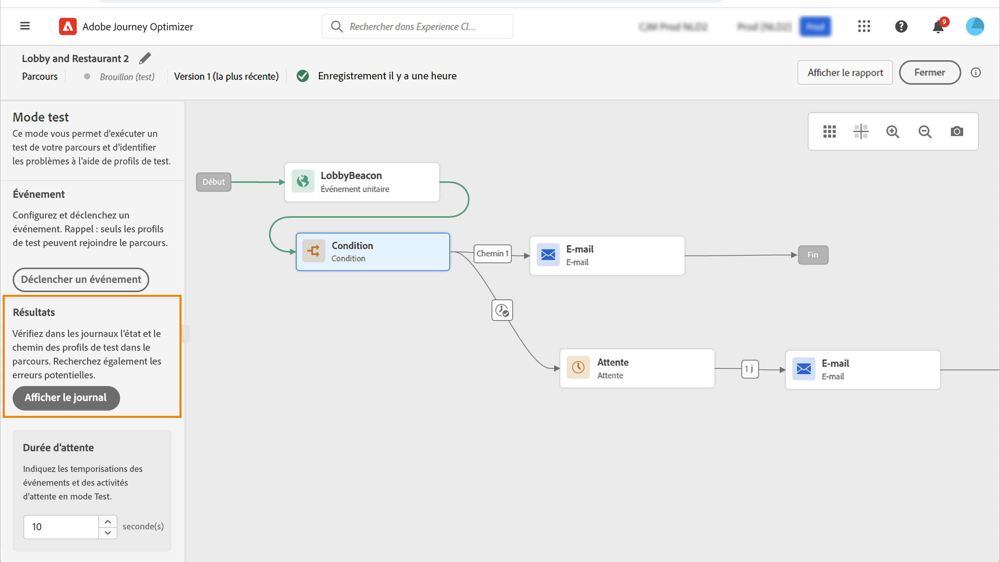

# Tester votre parcours{#testing_the_journey}

>[!CONTEXTUALHELP]
>id="ajo_journey_test"
>title="Tester votre parcours"
>abstract="Utilisez des profils de test pour tester votre parcours avant de le publier. Vous pouvez ainsi analyser le flux des individus dans le parcours et résoudre les problèmes avant la publication."

Utilisez des profils de test pour tester votre parcours avant de le publier. Ce mode permet d’exécuter un test de votre parcours et d’identifier les problèmes à l’aide de profils de test.

Seuls les profils de test peuvent rejoindre un parcours en mode test. Vous pouvez créer des profils de test ou transformer des profils existants en profils de test. En savoir plus sur les profils de test dans [cette section](../audience/creating-test-profiles.md).

>[!NOTE]
>
>Avant de tester votre parcours, vous devez résoudre toutes les erreurs, le cas échéant. Découvrez comment rechercher des erreurs avant d’effectuer des tests dans [cette section](../building-journeys/troubleshooting.md#checking-for-errors-before-testing).

Pour utiliser le mode test, procédez comme suit :

1. Pour activer le mode test, cliquez sur le bouton **[!UICONTROL Mode test]** dans le coin supérieur droit de l’écran.

   

1. Si le parcours comporte au moins une activité **Attente**, définissez la variable **[!UICONTROL Temps d’attente]** pour définir la durée en mode test de chaque activité d’attente et de chaque expiration d’événement. La durée par défaut est de 10 secondes pour les attentes et les temporisations d’événement. Vous obtiendrez ainsi rapidement les résultats du test.

   

   >[!NOTE]
   >
   >Lorsqu’un événement de réaction est utilisé avec une temporisation dans un parcours, la durée d’attente par défaut ainsi que la valeur minimale sont de 40 secondes. Consultez [cette section](../building-journeys/reaction-events.md).

1. Utilisez le bouton **[!UICONTROL Déclencher un événement]** pour configurer des événements et les envoyer au parcours.

   

1. Configurez les différents champs prévus. Dans le champ **Identifiant de profil**, saisissez la valeur du champ utilisé pour identifier le profil de test. Il peut s’agir, par exemple, de l’adresse e-mail. Veillez à envoyer des événements liés aux profils de test. Consultez [cette section](#firing_events).

   

1. Une fois les événements reçus, cliquez sur le bouton **[!UICONTROL Afficher le journal]** pour afficher les résultats du test et les valider. Consultez [cette section](#viewing_logs).

   

1. En cas d’erreur, désactivez le mode test, modifiez votre parcours et lancez un nouveau test. Une fois les tests terminés, vous pouvez publier votre parcours. Voir [cette page](../building-journeys/publishing-the-journey.md).

## Remarques importantes {#important_notes}

* En mode test, vous pouvez déclencher des événements dans l’interface. Les événements ne peuvent pas être déclenchés à partir de systèmes externes à l’aide d’une API.
* Seuls les individus identifiés comme « profils de test » dans le service de profil client en temps réel sont autorisés à rejoindre le parcours testé. Reportez-vous à cette [section](../audience/creating-test-profiles.md).
* Le mode test n’est disponible que dans les parcours dans un état de brouillon qui utilisent un espace de noms. Le mode test doit vérifier si une personne qui participe au parcours est un profil de test ou non et doit donc être en mesure d’accéder à Adobe Experience Platform.
* Le nombre maximum de profils de test pouvant rejoindre un parcours au cours d’une session de test est de 100.
* Lorsque vous désactivez le mode test, les parcours sont vidés de toutes les personnes qui y ont participé précédemment ou qui y sont actuellement actives. Il efface aussi les rapports.
* Vous pouvez activer/désactiver le mode test autant de fois que nécessaire.
* Vous ne pouvez pas modifier votre parcours lorsque le mode test est activé. En mode test, vous pouvez publier directement le parcours, sans avoir à désactiver ce mode au préalable.
* Lors qu&#39;un partage est atteint, la branche supérieure est toujours choisie. Vous pouvez réorganiser la position des branches partagées si vous souhaitez que le test choisisse un autre chemin.
* Pour optimiser les performances et empêcher l’utilisation des ressources obsolètes, tous les parcours en mode test qui n’ont pas été déclenchés pendant une semaine repassent au statut **Brouillon**.
* Les événements déclenchés par le mode test sont stockés dans des jeux de données dédiés. Ces jeux de données sont libellés comme suit : `JOtestmode - <schema of your event>`

<!--
* Fields from related entities are hidden from the test mode.
-->

## Déclencher vos événements {#firing_events}

>[!CONTEXTUALHELP]
>id="ajo_journey_test_configuration"
>title="Configuration du mode test"
>abstract="Si votre parcours contient plusieurs événements, sélectionnez-les dans la liste déroulante. Ensuite, pour chaque événement, configurez les champs transmis et l&#39;exécution de l&#39;envoi de l’événement."

Utilisez le bouton **[!UICONTROL Déclencher un événement]** pour configurer un événement qui fera qu’un individu rejoint le parcours.

>[!NOTE]
>
>Lorsque vous déclenchez un événement en mode test, un événement réel est généré, ce qui signifie qu’il sera également utilisé pour un autre parcours qui écoute cet événement.

Vous devez, au préalable, savoir quels profils sont identifiés comme profils de test dans Adobe Experience Platform. En effet, le mode test autorise uniquement ces profils dans le parcours et l’événement doit contenir un identifiant. L’identifiant attendu dépend de la configuration de l’événement. Il peut s’agir d’un ECID ou d’une adresse e-mail, par exemple. La valeur de cette clé doit être ajoutée dans le champ **Identifiant de profil**.

Si votre parcours contient plusieurs événements, sélectionnez-les dans la liste déroulante. Ensuite, pour chaque événement, configurez les champs transmis et l&#39;exécution de l&#39;envoi de l’événement. L’interface vous permet de transmettre les informations appropriées dans la payload de l’événement et de vous assurer que le type d’information est correct. Le mode test enregistre les derniers paramètres utilisés dans une session de test en vue d’une utilisation ultérieure.

L’interface vous permet de transmettre des paramètres d’événement simples. Si vous souhaitez transmettre des collections ou d’autres objets avancés dans l’événement, vous pouvez cliquer sur **[!UICONTROL Affichage du code]** pour voir l’intégralité du code de la payload et le modifier. Vous pouvez, par exemple, copier et coller des informations d’événement préparées par un utilisateur technique.

Un utilisateur technique peut également se servir de cette interface pour composer des payloads d’événement et déclencher des événements sans recourir à un outil tiers.

Lorsque vous cliquez sur le bouton **[!UICONTROL Envoyer]**, le test commence. La progression de l’individu dans le parcours est représentée par un flux visuel. Le chemin devient progressivement vert à mesure du déplacement de l’individu dans le parcours. Si une erreur se produit, un symbole d’avertissement s’affiche à l’étape correspondante. Vous pouvez y placer le curseur pour afficher des informations plus précises sur l’erreur et accéder aux détails complets (le cas échéant).

Si vous sélectionnez un autre profil de test dans l’écran de configuration d’un événement et que vous exécutez de nouveau le test, le flux visuel est effacé et indique le chemin du nouvel individu.

Lorsque vous ouvrez un parcours en cours de test, le chemin affiché correspond au dernier test exécuté.

## Mode test pour les parcours basés sur des règles {#test-rule-based}

Le mode test est également disponible pour les parcours qui utilisent un événement basé sur des règles. Pour plus d’informations sur les événements basés sur des règles, consultez [cette page](../event/about-events.md).

Lors du déclenchement d’un événement, l’écran de **configuration de l’événement** permet de définir les paramètres d’événement à transmettre au test. Vous pouvez afficher la condition d’identifiant d’événement en cliquant sur l’icône d’info-bulle située dans le coin supérieur droit. Une info-bulle est également disponible en regard de chaque champ qui fait partie de l’évaluation des règles.

## Mode test pour événements métier {#test-business}

Lors de l’utilisation d’un [événement métier](../event/about-events.md), utilisez le mode test pour déclencher une entrée de profil de test unique dans le parcours, simuler l’événement et transmettre l’identifiant de profil approprié. Vous devez transmettre les paramètres d’événement et l’identifiant du profil de test qui va rejoindre le parcours au moment du test. En mode test, aucun mode « Affichage du code » n’est disponible pour les parcours en fonction des événements métier.

Notez que lorsque vous déclenchez pour la première fois un événement métier, vous ne pouvez pas modifier la définition de l&#39;événement métier dans la même session de test. Vous pouvez uniquement faire en sorte qu’un même individu ou qu’un autre individu rejoigne le parcours en transmettant le même identifiant ou un autre identifiant. Si vous souhaitez modifier les paramètres de l&#39;événement métier, vous devez arrêter et démarrer à nouveau le mode test.

## Afficher les journaux {#viewing_logs}

>[!CONTEXTUALHELP]
>id="ajo_journey_test_logs"
>title="Journaux du mode test"
>abstract="Le bouton **Afficher le journal** affiche les résultats du test au format JSON. Ces résultats affichent le nombre d’individus à l’intérieur du parcours et leur état."

Le bouton **[!UICONTROL Afficher le journal]** vous permet d’afficher les résultats du test. Cette page affiche des informations actuelles sur le parcours au format JSON. Un bouton vous permet de copier des nœuds entiers. Vous devez actualiser manuellement la page pour mettre à jour les résultats de test du parcours.

>[!NOTE]
>
>En cas d’erreur lors de l’appel d’un système tiers (source de données ou action), le code d’erreur et la réponse d’erreur s’affichent dans les journaux de test.

Le nombre d’individus (appelés instances d’un point de vue technique) présents actuellement à l’intérieur du parcours est affiché. Voici des informations utiles affichées pour chaque individu :

* _ID_ : identifiant interne de la personne dans le parcours. Il peut être utilisé à des fins de débogage.
* _Currentstep_ : étape du parcours à laquelle se trouve l’individu. Nous vous recommandons d’ajouter des libellés à vos activités afin de les identifier plus facilement.
* _currentstep_ > phase : statut du parcours de la personne (en cours, terminé, erreur ou expiré). Plus d’informations ci-dessous.
* _currentstep_ > _extraInfo_ : description de l’erreur et autres informations contextuelles.
* _Currentstep_ > _fetchErrors_ : informations sur les erreurs de récupération de données qui se sont produites au cours de cette étape.
* _externalKeys_ : valeur de la formule de clé définie dans l’événement.
* _enrichedData_ : données récupérées par le parcours si ce dernier utilise des sources de données.
* _transitionHistory_ : liste des étapes suivies par l’individu. Pour les événements, la payload est affichée.
* _actionExecutionErrors_ : informations sur les erreurs qui se sont produites.

Les différents statuts du parcours d’un individu sont les suivants :

* _En cours_ : l’individu figure actuellement dans le parcours.
* _Terminé_ : l’individu a atteint la fin du parcours.
* _Erreur_ : le parcours de l’individu a été arrêté en raison d’une erreur.
* _Délai dépassé_ : le parcours de l’individu a été arrêté, car l’exécution d’une étape a pris trop de temps.

Lorsqu’un événement est déclenché en mode test, un jeu de données est automatiquement généré avec le nom de la source.

Le mode test crée automatiquement un événement d’expérience et l’envoie à Adobe Experience Platform. Le nom de la source de cet événement d’expérience est « Événements de test Journey Orchestration ».

