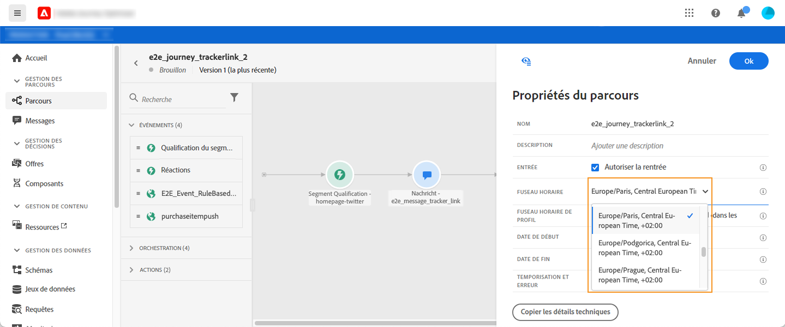
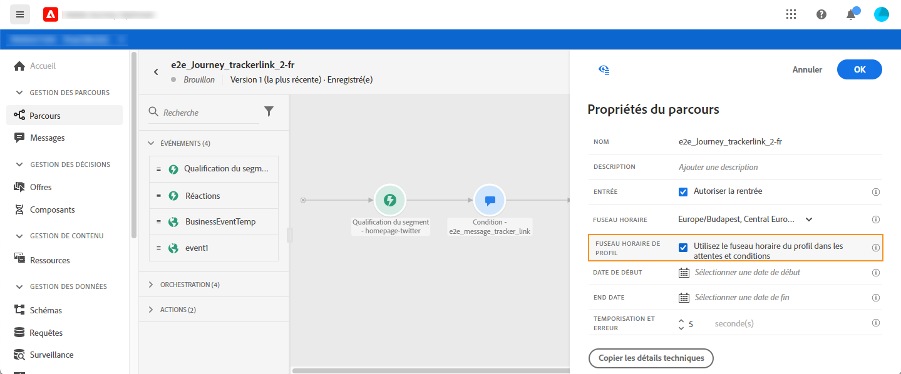

# Gestion des fuseaux horaires {#timezone_management}

Vous pouvez définir un fuseau horaire dans les [propriétés](../building-journeys/journey-gs.md#change-properties) de votre parcours.

Pour accéder aux propriétés, cliquez sur l&#39;icône en forme de crayon dans le coin supérieur droit de l&#39;écran.

Ce fuseau horaire sera utilisé pour chaque activité du parcours contenant un élément temporel tel que :

* [Condition de temps](../building-journeys/condition-activity.md#time_condition)
* [Condition de date](../building-journeys/condition-activity.md#date_condition)
* [Attente personnalisée](../building-journeys/wait-activity.md#custom)
* [Attente à date fixe](../building-journeys/wait-activity.md#fixed_date)

Vous pouvez sélectionner un fuseau horaire ou choisir d&#39;utiliser celui défini dans le profil utilisateur.

>[!NOTE]
>
>Le fuseau horaire du profil fonctionne avec le champ **timeZone** existant dans le groupe de champs **Détails des préférences** .

## Définition d&#39;un fuseau horaire fixe {#fixed-timezone}

Le fuseau horaire peut également être fixe. Effacez le fuseau horaire prédéfini et sélectionnez-en un dans la liste déroulante. Si vous utilisez un fuseau horaire fixe, il sera identique pour tous les individus qui participent au parcours.

Pour ce faire, dans le volet **[!UICONTROL Propriétés du Parcours]**, sélectionnez un fuseau horaire.

## Utilisation de profils pour définir le fuseau horaire du parcours {#timezone-from-profiles}

Si un espace de noms est associé à l&#39;événement d&#39;entrée du parcours, ce qui signifie que ce dernier peut accéder au service de profil client en temps réel d&#39;Adobe Experience Platform, le fuseau horaire est prédéfini avec celui spécifié dans le profil de l&#39;individu qui participe au parcours.

Si un fuseau horaire est défini dans le profil Adobe Experience Platform, il peut être récupéré dans le parcours.

Si le profil de l&#39;individu ne contient pas de fuseau horaire, celui qui sera récupéré sera celui défini dans le champ du fuseau horaire.

Pour ce faire, dans **[!UICONTROL Propriétés]**, cochez **[!UICONTROL Utiliser le fuseau horaire du profil dans les attentes et les conditions]**.

## Utilisation des fuseaux horaires dans les expressions {#timezone-in-expressions}

Les dates de début et de fin d&#39;un parcours ne peuvent pas être liées à un fuseau horaire spécifique. Elles sont automatiquement associées à celui de l&#39;instance.
