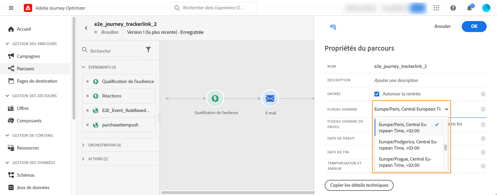
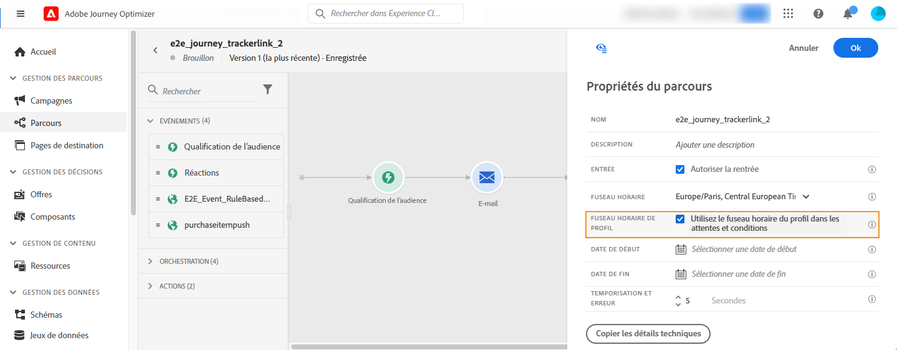

# Gestion des fuseaux horaires {#timezone_management}

>[!BEGINSHADEBOX]

**Sur cette page :** Découvrez comment définir le fuseau horaire d’un parcours (un fuseau horaire fixe ou un fuseau horaire issu de chaque profil) pour contrôler le moment où les activités basées sur l’heure, telles que les conditions horaires, les conditions de date et les attentes personnalisées, s’exécutent.

>[!ENDSHADEBOX]

>[!CONTEXTUALHELP]
>id="ajo_journey_properties_time_zone"
>title="Fuseau horaire du parcours"
>abstract="Le paramètre de fuseau horaire définit le fuseau horaire du parcours. Si vous utilisez un fuseau horaire fixe, il est identique pour toutes les personnes qui entrent dans le parcours."

Vous pouvez définir un fuseau horaire dans les [propriétés](../building-journeys/journey-properties.md#timezone) de votre parcours.

Pour accéder aux propriétés du parcours, cliquez sur l’icône en forme de crayon dans le coin supérieur droit de l’écran.

Ce fuseau horaire sera utilisé pour chaque activité du parcours contenant un élément temporel tel que :

* [Condition de temps](../building-journeys/conditions.md#time_condition)
* [Condition de date](../building-journeys/conditions.md#date_condition)
* [Attente personnalisée](../building-journeys/wait-activity.md#custom)

<!--
* [Fixed date wait](../building-journeys/wait-activity.md#fixed_date)
-->

Vous pouvez sélectionner un [fuseau horaire fixe](#fixed-timezone) ou choisir d’utiliser celui [défini dans le profil d’utilisateur ou d’utilisatrice](#timezone-from-profiles).

## Définir un fuseau horaire fixe {#fixed-timezone}

Le fuseau horaire peut être fixe. Effacez le fuseau horaire prédéfini et sélectionnez-en un dans la liste déroulante. Si vous utilisez un fuseau horaire fixe, il sera identique pour tous les individus qui participent au parcours.

Pour cela, dans le volet **[!UICONTROL Propriétés du parcours]**, sélectionnez un fuseau horaire.

## Utiliser le fuseau horaire du profil {#timezone-from-profiles}

>[!CONTEXTUALHELP]
>id="ajo_journey_properties_profile_time_zone"
>title="Utiliser le fuseau horaire du profil"
>abstract="Cette option utilise le fuseau horaire du profil en temps réel dans les activités **Attente** et **Condition**. Si un fuseau horaire a été défini pour un profil, il est récupéré et utilisé dans le parcours. Dans le cas contraire, le fuseau horaire utilisé est celui défini dans le champ du fuseau horaire du dessus."

Si l’événement d’entrée du parcours comporte un espace de noms, ce qui signifie que le parcours peut accéder au service de profil client en temps réel de [!DNL Adobe Experience Platform], vous pouvez utiliser le fuseau horaire défini au niveau du profil. Pour cela, dans **Propriétés**, cochez la case **Utiliser le fuseau horaire du profil dans les attentes et conditions**. Cette option n’est pas cochée par défaut.

Si un fuseau horaire a été défini pour un profil, il est récupéré et utilisé par le parcours. Dans le cas contraire, le fuseau horaire utilisé est celui défini dans le champ du fuseau horaire.

>[!NOTE]
>
>Le fuseau horaire de profil fonctionne avec le champ **timeZone** existant dans le groupe de champs **Détails des préférences**.

## Utilisation de fuseaux horaires dans les expressions {#timezone-in-expressions}

Les dates de début et de fin d’un parcours ne peuvent pas être liées à un fuseau horaire spécifique. Elles sont automatiquement associées à celui de l&#39;instance.

+++ Référence des connaissances sur l’IA

Cette section contient des connaissances structurées destinées à soutenir l’interprétation, la récupération et la réponse aux questions liées à ce sujet.

Pour une compréhension totale, ces informations doivent être combinées avec la documentation de cette page. Aucune des sources n’est conçue pour être autonome. La page décrit la fonctionnalité, tandis que cette section fournit un contexte supplémentaire qui permet de clarifier la terminologie, l’intention, l’applicabilité et les contraintes.

* **TL;DR:** Cette page explique comment configurer les paramètres de fuseau horaire dans les propriétés de parcours Adobe Journey Optimizer, en choisissant entre un fuseau horaire fixe appliqué à tous les profils ou un fuseau horaire par profil provenant du profil client en temps réel.

**Intentions:**
* Définissez un fuseau horaire fixe sur un parcours afin que tous les profils suivent la même référence horaire pour les conditions et les attentes
* Activez le fuseau horaire par profil afin que les activités Attente et Condition utilisent la préférence de fuseau horaire stockée de chaque individu
* Identifiez les activités de parcours affectées par le paramètre de fuseau horaire du parcours
* Identifier le groupe de champs de profil qui stocke la valeur de fuseau horaire individuelle

**Glossaire:**
* **Fuseau horaire fixe** : fuseau horaire unique sélectionné dans les propriétés du Parcours qui s’applique uniformément à chaque profil entrant dans le *du parcours (spécifique au produit)*
* **Fuseau horaire du profil** : fuseau horaire par individu stocké dans le champ `timeZone` du groupe de champs Détails des préférences, utilisé lorsque l’option « Utiliser le fuseau horaire du profil dans les attentes et conditions » est activée *(spécifique au produit)*
* **Groupe de champs Détails des préférences** : groupe de champs XDM contenant l’attribut `timeZone` utilisé pour la résolution du fuseau horaire au niveau du profil

**Mécanismes de sécurisation :**
* L’option « Utiliser le fuseau horaire du profil dans les attentes et conditions » n’est disponible que lorsque l’événement d’entrée du parcours comporte un espace de noms (c’est-à-dire que le parcours peut atteindre le service de profil client en temps réel)
* Cette option n’est pas cochée par défaut ; le fuseau horaire fixe est utilisé, sauf s’il est activé explicitement
* Si l’option est activée mais qu’aucun fuseau horaire n’est défini sur le profil, le parcours revient au fuseau horaire fixe défini dans les propriétés du parcours
* Les dates de début et de fin du parcours ne peuvent pas être liées à un fuseau horaire spécifique. Elles sont automatiquement associées au fuseau horaire de l’instance

**Terminologie:**
* Nom canonique : Gestion des fuseaux horaires — Acronyme : none — variantes : configuration des fuseaux horaires, fuseau horaire parcours
* Synonymes : « fuseau horaire fixe » = « identique pour tous les individus » ; « fuseau horaire du profil » = « Utiliser le fuseau horaire du profil dans les attentes et conditions »
* Ne pas confondre : « fuseau horaire du parcours » (s’applique aux activités) ≠ « fuseau horaire de l’instance » (s’applique aux dates de début/fin du parcours, défini automatiquement)

**FAQ:**
* **Q : Où puis-je définir le fuseau horaire d’un parcours ?** : dans le volet Propriétés du Parcours, accessible à partir de l&#39;icône représentant un crayon dans le coin supérieur droit de la zone de travail du parcours.
* **Q : Quelles activités utilisent le fuseau horaire du parcours ?** — Conditions de temps, conditions de date et activités d&#39;attente personnalisées.
* **Q : Comment faire pour que chaque profil suive son propre fuseau horaire local ?** — Dans les propriétés du Parcours, activez l’option « Utiliser le fuseau horaire du profil dans les attentes et conditions ». Pour ce faire, le parcours doit disposer d’un espace de noms afin de pouvoir accéder au service de profil client en temps réel.
* **Q : Que se passe-t-il si aucun fuseau horaire n’est défini pour un profil et que l’option de fuseau horaire du profil est activée ?** — Le parcours retourne au fuseau horaire fixe défini dans le champ fuseau horaire des Propriétés du Parcours.
* **Q : Quel champ de profil stocke le fuseau horaire de l’individu ?** — Champ `timeZone` dans le groupe de champs Détails des préférences du schéma de profil.
* **Q : Puis-je définir les dates de début et de fin du parcours selon un fuseau horaire spécifique ?** — Non. Les dates de début et de fin du parcours sont automatiquement associées au fuseau horaire de l’instance et ne peuvent pas être liées à un fuseau horaire personnalisé.

+++
