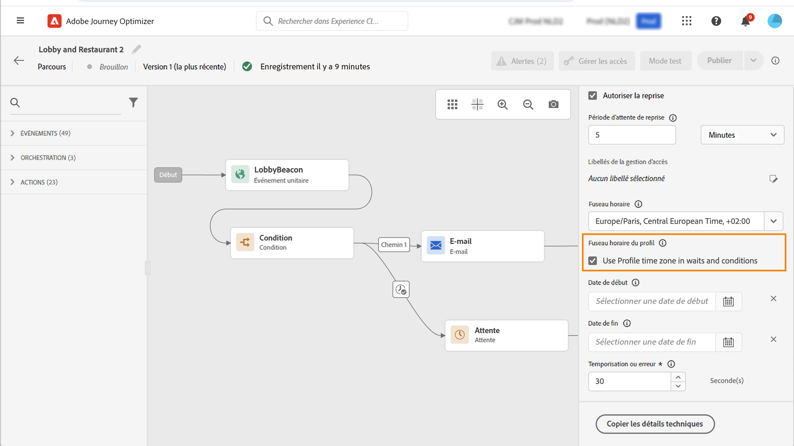

# Gestion des fuseaux horaires {#timezone_management}

>[!CONTEXTUALHELP]
>id="ajo_journey_properties_time_zone"
>title="Fuseau horaire"
>abstract="Sélectionnez le fuseau horaire du parcours. Si vous utilisez un fuseau horaire fixe, il est identique pour toutes les personnes qui entrent dans le parcours."

Vous pouvez définir un fuseau horaire dans les [propriétés](../building-journeys/journey-properties.md#timezone) de votre parcours.

Pour accéder aux propriétés du parcours, cliquez sur l’icône en forme de crayon dans le coin supérieur droit de l’écran.

Ce fuseau horaire sera utilisé pour chaque activité du parcours contenant un élément temporel tel que :

* [Condition de temps](../building-journeys/condition-activity.md#time_condition)
* [Condition de date](../building-journeys/condition-activity.md#date_condition)
* [Attente personnalisée](../building-journeys/wait-activity.md#custom)

<!--
* [Fixed date wait](../building-journeys/wait-activity.md#fixed_date)
-->

Vous pouvez sélectionner un [fuseau horaire fixe](#fixed-timezone) ou choisir d’utiliser celui [défini dans le profil d’utilisateur ou d’utilisatrice](#timezone-from-profiles).

## Définir un fuseau horaire fixe {#fixed-timezone}

Le fuseau horaire peut être fixe. Effacez le fuseau horaire prédéfini et sélectionnez-en un dans la liste déroulante. Si vous utilisez un fuseau horaire fixe, il sera identique pour tous les individus qui participent au parcours.

Pour cela, dans le volet **[!UICONTROL Propriétés du parcours]**, sélectionnez un fuseau horaire.

## Utiliser le fuseau horaire des profils {#timezone-from-profiles}

>[!CONTEXTUALHELP]
>id="ajo_journey_properties_profile_time_zone"
>title="Utiliser le fuseau horaire du profil"
>abstract="Cochez la case pour utiliser le fuseau horaire de profil en temps réel dans les activités d’attente et de condition. Si un fuseau horaire a été défini pour un profil, il est récupéré et utilisé par le parcours. Dans le cas contraire, le fuseau horaire utilisé est celui défini dans le champ du fuseau horaire du dessus."

Si l’événement d’entrée du parcours comporte un espace de noms, ce qui signifie que le parcours peut accéder au service de profil client en temps réel de [!DNL Adobe Experience Platform], vous pouvez utiliser le fuseau horaire défini au niveau du profil. Pour cela, dans **Propriétés**, cochez la case **Utiliser le fuseau horaire du profil dans les attentes et conditions**. Cette option n’est pas cochée par défaut.

Si un fuseau horaire a été défini pour un profil, il est récupéré et utilisé par le parcours. Dans le cas contraire, le fuseau horaire utilisé sera celui défini dans le champ du fuseau horaire.

>[!NOTE]
>
>Le fuseau horaire de profil fonctionne avec le champ **timeZone** existant dans le groupe de champs **Détails des préférences**.

## Utilisation de fuseaux horaires dans les expressions {#timezone-in-expressions}

Les dates de début et de fin d’un parcours ne peuvent pas être liées à un fuseau horaire spécifique. Elles sont automatiquement associées à celui de l&#39;instance.
