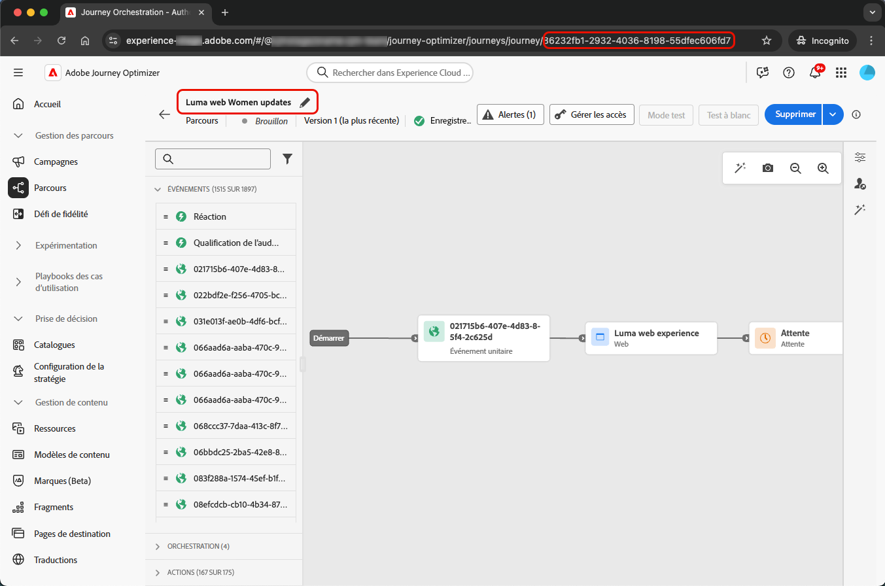
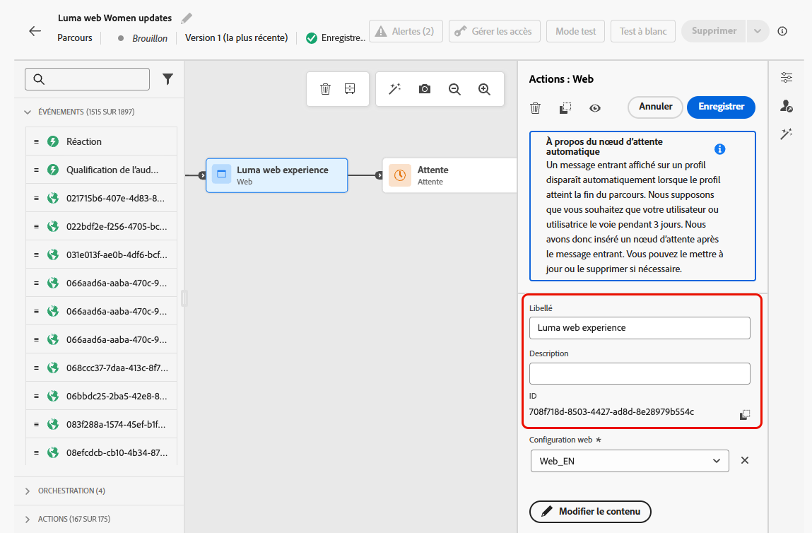
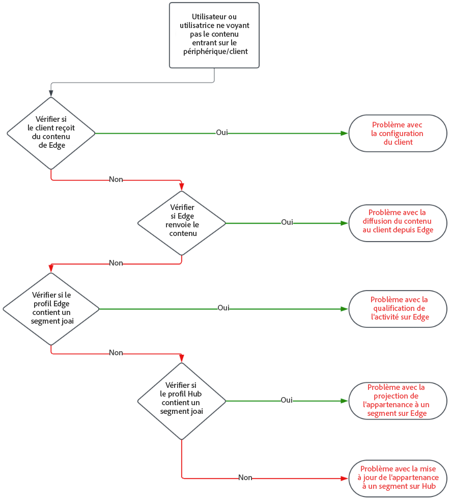
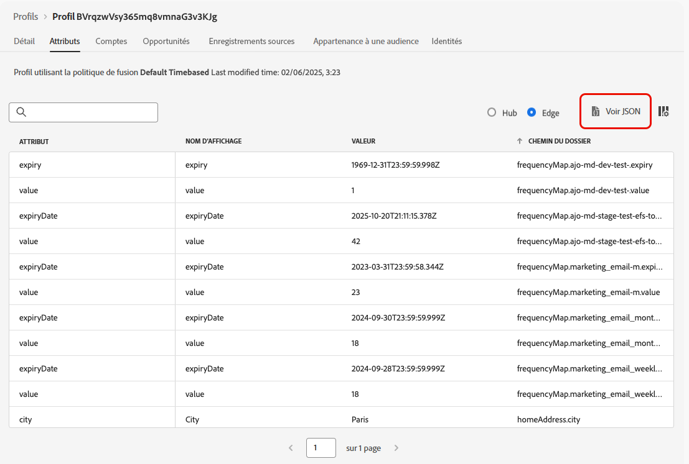
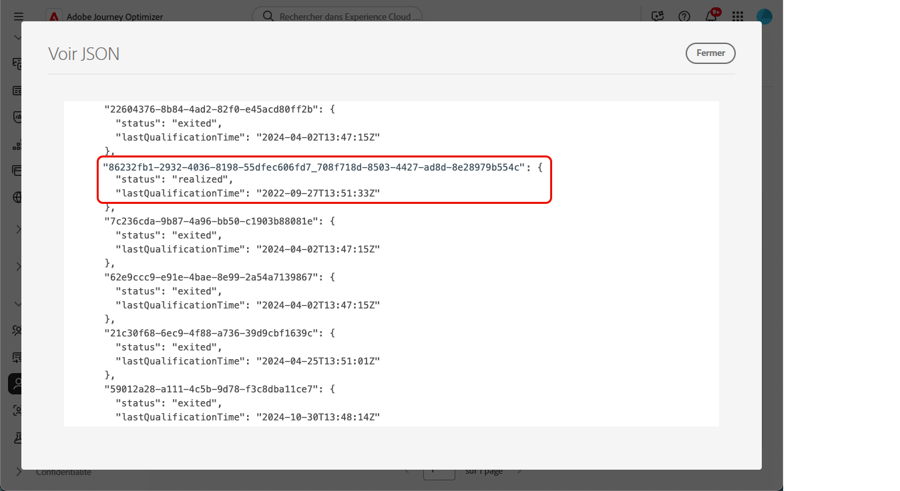

# Résolution des problèmes liés aux actions entrantes dans les parcours {#troubleshooting-inbound-actions}

Les actions entrantes, telles que les expériences in-app, web et basées sur du code, sont des composants essentiels de [!DNL Journey Optimizer], car elles permettent un engagement personnalisé avec les utilisateurs et utilisatrices pendant leur parcours. Cependant, un comportement inattendu, tel qu’un contenu entrant manquant ou une diffusion continue après la sortie d’un profil du parcours, peut se produire.

Ce guide fournit une procédure détaillée pour déboguer les problèmes liés aux actions entrantes dans un parcours, afin que vous puissiez les identifier et les résoudre indépendamment avant de contacter l’assistance.

<!--This guide addresses the two most common scenarios with inbound actions in a journey. They are as follows:

* A profile enters the inbound step, but the user does not receive the expected inbound content.
* A user continues to receive inbound content even after the profile exits the journey.
-->

## Conditions préalables {#prerequisites}

Avant de commencer le dépannage :

1. Configurez une session **Assurance**. Découvrez comment le faire dans la documentation d’[[!DNL Adobe Experience Platform] Assurance](https://experienceleague.adobe.com/fr/docs/experience-platform/assurance/tutorials/using-assurance){target="_blank"}.

1. Accédez au parcours contenant l’action entrante pour récupérer le nom du parcours et l’ID de version.

   >[!NOTE]
   >
   >L’ID de version du parcours se trouve dans l’URL après « journey/ » (par exemple, *86232fb1-2932-4036-8198-55dfec606fd7*).

   

1. Cliquez sur l’action entrante pour en afficher les détails. Récupérez le libellé et l’identifiant de l’action entrante.

   

1. Obtenez l’espace de noms et l’identifiant du profil pour identifier celui qui rencontre des problèmes. Selon votre configuration, l’espace de noms peut être ECID, e-mail ou ID client, par exemple. Découvrez comment rechercher un profil dans la documentation [Experience Platform](https://experienceleague.adobe.com/fr/docs/experience-platform/profile/ui/user-guide#browse-identity){target="_blank"}.

## Scénario 1 : la personne n’a pas reçu le contenu entrant. {#scenario-1}

Dans ce scénario, un profil a rejoint l’action entrante dans le parcours, mais même après 30 minutes, le contenu entrant correspondant ne s’affiche pas dans l’appareil/le client à l’étape de déclenchement de la configuration.

### Contrôles préalables {#pre-checks}

1. **Le jeu de données entrant du parcours est activé pour l’ingestion de profil.**

   L’action entrante utilise le jeu de données **Parcours entrant** pour les mises à jour de profil pendant l’exécution. Assurez-vous que le jeu de données est activé pour les profils dans le sandbox actuel. [En savoir plus sur les jeux de données](../data/get-started-datasets.md)

2. **Identité joai définie dans les identités de la plateforme**

   L’action entrante utilise l’espace de noms **joai** dans le `segmentMembership` de profil pour activer le profil de l’étape entrante. Vérifiez qu’elle a été définie dans les identités de plateforme pour le sandbox. En savoir plus sur le [Service d’identités Experience Platform](https://experienceleague.adobe.com/fr/docs/experience-platform/identity/home){target="_blank"}

### Étapes de débogage {#debugging-steps}

Le graphique ci-dessous montre la séquence des étapes de débogage que vous pouvez suivre :

{width="70%" align="center"}

### Étape 1 : vérifier si l’appareil/le client reçoit le contenu d’Edge Network {#step-1}

Commencez par vérifier si l’appareil ou le client obtient le contenu attendu.

>[!BEGINTABS]

>[!TAB Canal in-app]

1. Accédez à la session [Assurance](https://experienceleague.adobe.com/fr/docs/experience-platform/assurance/tutorials/using-assurance){target="_blank"} et sélectionnez la section **[!UICONTROL Messagerie In-App]** dans le panneau de gauche.

1. Dans l’onglet **[!UICONTROL Messages sur l’appareil]**, cliquez sur la liste déroulante **[!UICONTROL Messages]**.

   {width="80%"}

1. Recherchez un message avec le nom de parcours suivi de « - Message in-app ». S’il est présent, cela signifie que le message in-app est présent sur l’appareil/le client et que le problème peut être lié au déclencheur in-app.

1. Si le message est introuvable, le message in-app n’a pas été reçu par l’appareil/le client. <!--Go to the [next step](#step-2) for further debugging.-->

>[!TAB Canal web]

Rendez-vous sur la page et examinez l’onglet Mise en réseau, ou vérifiez la payload de réponse Edge dans la section **[!UICONTROL Edge Delivery]** de la session [Assurance](https://experienceleague.adobe.com/fr/docs/experience-platform/assurance/tutorials/using-assurance){target="_blank"}.

>[!TAB Canal d’expérience basée sur du code]

Exécutez une requête curl à l’aide de l’[API d’Adobe](https://developer.adobe.com/data-collection-apis/docs/api/) et vérifiez la payload de réponse Edge dans la section **[!UICONTROL Edge Delivery]** de la session [Assurance](https://experienceleague.adobe.com/fr/docs/experience-platform/assurance/tutorials/using-assurance){target="_blank"}.

>[!ENDTABS]

### Étape 2 : vérifier si Edge Network renvoie le contenu {#step-2}

Cette étape permet de s’assurer qu’Edge Network renvoie le contenu entrant attendu pour le rendu sur l’appareil ou le client.

Lorsqu’un profil rejoint une action entrante dans un parcours, il est automatiquement qualifié en segment d’audience spécial (dans l’espace de noms **joai**) correspondant à l’action de parcours entrante.

Lorsqu’un client ou une cliente effectue une requête à Edge Network pour un profil et une surface donnés, le profil est qualifié pour recevoir du contenu pour les actions de parcours entrantes ciblant cette surface, uniquement si le profil est actuellement membre du segment **joai** correspondant.

Pour déboguer le comportement d’Edge Network, procédez comme suit.

1. Ouvrez la vue **[!UICONTROL Edge Delivery]** dans la session Assurance. Cette vue fournit des informations sur l’exécution de l’action entrante sur le serveur Edge Network. Pour en savoir plus, consultez la [documentation Experience Platform](https://experienceleague.adobe.com/fr/docs/experience-platform/assurance/view/edge-delivery){target="_blank"}.

1. Vérifiez si l’activité Edge correspondant à l’action entrante est répertoriée dans les sections **[!UICONTROL Activités qualifiées]** ou **[!UICONTROL Activités non qualifiées]**.

   

   * Si elle se trouve dans la section **Activités qualifiées**, le profil est qualifié pour l’action de parcours entrante et le contenu doit être renvoyé.
   * Si elle se trouve dans la section **Activités non qualifiées**, le profil n’était pas qualifié pour l’action de parcours entrante. Pour plus d’informations, consultez les raisons d’exclusion ci-dessous.
   * Si elle se trouve dans **aucune section**, soit un problème est survenu lors de la publication de l’action de parcours entrante dans Edge Network, soit l’URI de surface demandé ne correspondait pas aux paramètres de configuration du canal pour l’action entrante.

   >[!NOTE]
   >
   >Pour rechercher votre activité Edge dans la session **Assurance**, recherchez l’activité où **[!UICONTROL audienceNamespace]** est **joai** et **[!UICONTROL audienceSegmentId]** est &lt;*JourneyVersionID*>_&lt;*JourneyActionID*> (par exemple, *86232fb1-2932-4036-8198-55dfec606fd7_708f718d-8503-4427-ad8d-8e28979b554c*).

   {width="70%"}

1. Si votre activité se trouve dans la section **[!UICONTROL Activités non qualifiées]** et que la raison de l’exclusion est *Le segment n’est pas actif*, cela signifie que le serveur de diffusion Edge Network ne pense pas que le profil fait partie du segment d’audience **joai** approprié.

   Vous pouvez vérifier si le segment **joai** est présent dans la vue du profil du serveur de diffusion Edge Network en ouvrant l’élément **segmentsMap** de la section Profil et en recherchant la présence de l’identifiant de segment **joai**.

1. Si le serveur de diffusion Edge Network ne voit pas le profil comme se trouvant dans le segment **joai** approprié, passez à l’étape suivante.<!--use the Platform Profile viewer UI to check if the expected **joai** segment is in a realized state in the Edge profile. Learn more in the [Experience Platform Profile UI documentation](https://experienceleague.adobe.com/en/docs/experience-platform/profile/ui/user-guide){target="_blank"}-->

### Étape 3 : vérifier si l’appartenance à l’audience « joai » s’est propagée à Edge Network {#step-3}

Cette étape permet de vérifier que le profil Edge a été correctement mis à jour lorsque le profil a rejoint l’action de parcours entrante et qu’il a été qualifié dans le segment **joai** correspondant.

Lorsqu’un profil est qualifié dans un segment **joai**, il est d’abord mis à jour sur le Hub, puis l’appartenance au segment est projetée vers le profil Edge afin qu’il soit utilisé par le serveur de diffusion Edge Network.

>[!NOTE]
>
>La propagation du Hub vers Edge peut prendre de 15 à 30 minutes à partir du moment où le profil est mis à jour sur le Hub.

Pour vérifier la présence du segment **joai** dans l’attribut `segmentMembership` du profil Edge, procédez comme suit.

1. Accédez au menu **[!UICONTROL Client ou cliente]** > **[!UICONTROL Profils]** dans le volet de navigation de gauche de [!DNL Journey Optimizer] et accédez au profil à l’aide de l’espace de noms et de l’identifiant. En savoir plus sur les [Profils clients en temps réel](../audience/get-started-profiles.md)

1. Sélectionnez l’onglet **[!UICONTROL Attributs]** et choisissez la vue **[!UICONTROL Edge]**.

1. Cliquez sur **[!UICONTROL Vue JSON]** pour ouvrir la vue JSON du profil.

   {width="80%"}

1. Accédez à l’attribut `segmentMembership` et vérifiez si l’identifiant de segment &lt;*JourneyVersionID>*_&lt;*JourneyActionID*> est présent dans l’espace de noms **joai** et si son statut est **[!UICONTROL réalisé]** <!--or existing?-->.

   {width="90%"}

   * S’il est présent, le segment **joai** correspondant à l’action de parcours entrante a été correctement propagé dans le profil Edge.

   * S’il n’est pas affiché dans la vue du profil du serveur de diffusion Edge Network, il y a peut-être un problème lié à la manière dont le serveur de diffusion charge le profil Edge.

1. Si l’identifiant de segment **joai** n’est pas présent ou si son statut est **[!UICONTROL sorti]**, cela signifie qu’il n’a pas (encore) été propagé vers Edge.

   Patientez 15 à 30 minutes pour que les valeurs `segmentMembership` soient propagées du Hub vers Edge. S’il n’est toujours pas présent, passez à l’étape suivante.

<!--The next step is to check whether the audience segment is present in the profile on the Hub.-->

### Étape 4 : vérifier si l’appartenance à l’audience « joai » est présente dans le profil sur le Hub {#step-4}

Cette étape permet de vérifier que le profil Hub a été correctement mis à jour lorsque le profil a rejoint l’action de parcours entrante et qu’il a été qualifié dans le segment **joai** correspondant.

>[!NOTE]
>
>L’ingestion de l’appartenance au segment **joai** dans le profil Hub peut prendre de 15 à 30 minutes à partir du moment où le profil a rejoint l’action de parcours entrante.

Pour vérifier la présence du segment **joai** dans l’attribut `segmentMembership` du profil Hub, procédez comme suit.

1. Accédez au menu **[!UICONTROL Client ou cliente]** > **[!UICONTROL Profils]** dans le volet de navigation de gauche de [!DNL Journey Optimizer] et accédez au profil à l’aide de l’espace de noms et de l’identifiant. En savoir plus sur les [Profils clients en temps réel](../audience/get-started-profiles.md)

1. Sélectionnez l’onglet **[!UICONTROL Attributs]** et choisissez la vue **[!UICONTROL Hub]**.

1. Cliquez sur **[!UICONTROL Vue JSON]** pour ouvrir la vue JSON du profil.

1. Accédez à l’attribut **[!UICONTROL segmentMembership]** et vérifiez si l’identifiant du segment &lt;*JourneyVersionID>*_&lt;*JourneyActionID*> est présent dans l’espace de noms **joai** et si son statut est **[!UICONTROL réalisé]** <!--or existing?-->.

   * S’il est présent, le segment **joai** correspondant à l’action de parcours entrante a été correctement ingéré dans le profil Hub.

   * S’il est introuvable dans le profil Edge après 30 minutes, il y a peut-être un problème lié au système de projection Edge.

1. Si l’identifiant de segment **joai** n’est pas présent ou a le statut **[!UICONTROL sorti]**, cela signifie que le profil n’était pas (encore) correctement qualifié dans le segment d’audience **joai** spécial lors de l’entrée dans l’action de parcours entrante correspondante.

   Patientez 15 à 30 minutes pour que les valeurs `segmentMembership` soient ingérées dans le profil du Hub. S’il n’est toujours pas présent, passez à l’étape suivante.

### Étape 5 : si le client/appareil n’obtient toujours pas le contenu attendu {#step-5}

Si vous avez suivi toutes les étapes ci-dessus et que vous n’obtenez pas le comportement attendu après avoir attendu 30 à 60 minutes que l’appartenance au segment se propage vers Edge Network, contactez l’assistance clientèle d’Adobe ou votre représentant ou représentante Adobe.

Incluez autant de détails que possible à propos des étapes de débogage, tels que :

* l’étape où vous constatez le comportement inattendu ;
* l’identifiant de version du parcours ;
* l’identifiant d’action du parcours ;
* la trace complète d’Assurance ;
* la vue JSON du profil Edge ;
* la vue JSON du profil Hub ;
* etc.

## Scénario 2 : l’utilisateur ou l’utilisatrice reçoit toujours le contenu entrant {#scenario-2}

Ce scénario est l’inverse du [Scénario 1](#scenario-1) : le profil a quitté le parcours, mais l’utilisateur ou l’utilisatrice reçoit toujours le contenu entrant.

Cependant, lorsqu’un profil quitte un parcours, il ne devrait plus être qualifié pour les segments d’audience **joai** correspondant aux actions entrantes du parcours.

Suivez les mêmes étapes de débogage que pour le [Scénario 1](#debugging-steps) afin de vérifier si le profil Hub, le profil Edge et le serveur de diffusion Edge Network reflètent correctement le statut d’appartenance au segment **joai** concerné, et si le client ou la cliente ne reçoit plus le contenu entrant.

<!--

## Reference Section {#reference-section}

- [Assurance Setup Guide](https://experienceleague.adobe.com/en/docs/experience-platform/assurance/tutorials/using-assurance)
- [[!DNL Adobe Experience Platform] Documentation](https://experienceleague.adobe.com/docs/experience-platform/home.html)
- [Streaming Ingestion APIs Troubleshooting](https://experienceleague.adobe.com/docs/experience-platform/ingestion/streaming/troubleshooting.html)

-->
