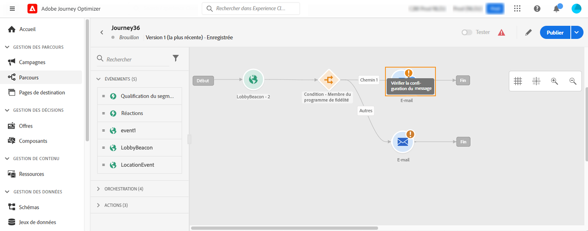
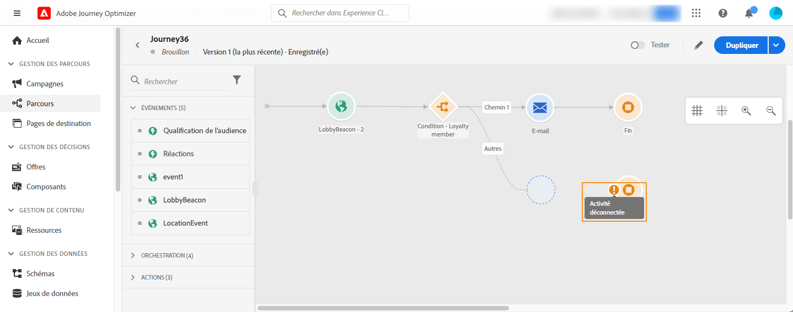
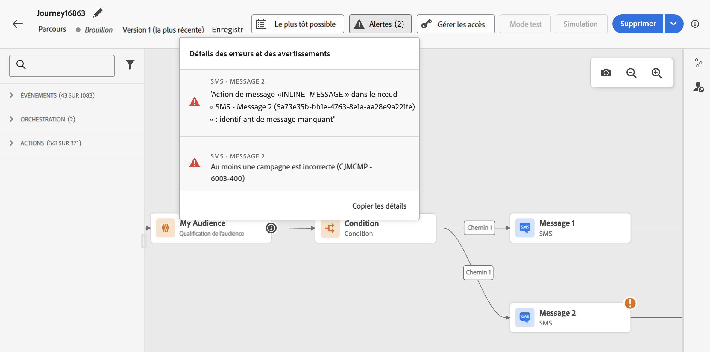

# Résoudre les erreurs avant de tester votre parcours {#troubleshooting}

Cette section décrit comment résoudre les problèmes liés aux parcours avant de les tester ou de les publier. Il est possible d&#39;effectuer les vérifications répertoriées ci-dessous lorsque le parcours est en mode test ou actif. Il est recommandé de les réaliser en mode test, puis d&#39;effectuer la publication. En savoir plus sur le mode test sur [cette page](../building-journeys/testing-the-journey.md).

Découvrez comment résoudre les problèmes liés aux événements de parcours, vérifier si les profils ont rejoint votre parcours, comment ils le parcourent et si des messages sont envoyés [sur cette page](troubleshooting-execution.md). Si aucun profil n’entre dans votre parcours basé sur un événement malgré l’ingestion d’événements, assurez-vous que les types de données de condition d’événement [ correspondent au schéma d’événement](troubleshooting-execution.md#verify-event-identity-and-rule-data-types).

Si vous utilisez des actions entrantes, découvrez comment résoudre les problèmes liés à ces dernières [dans cette page](troubleshooting-inbound.md).

## Erreurs dans les activités {#activity-errors}

Avant de tester et de publier votre parcours, vérifiez que toutes les activités sont correctement configurées. Vous ne pouvez pas effectuer de tests ou de publications si des erreurs sont détectées par le système.

Les erreurs sont représentées par un symbole d&#39;avertissement, affiché sur l&#39;activité elle-même, dans la zone de travail. Placez le curseur sur le point d&#39;exclamation pour afficher le message d&#39;erreur. Si vous sélectionnez l’activité, vous devez voir la ligne contenant l’erreur accompagnée d’un avertissement. Par exemple :

* si un champ obligatoire est vide, une erreur s’affiche ;

  

* dans la zone de travail, un avertissement s’affiche lorsque deux activités sont déconnectées.

  

## Erreurs dans le parcours {#canvas-errors}

Les erreurs sont également visibles à partir du bouton **[!UICONTROL Alertes]**, au-dessus de la zone de travail. Il indique les erreurs détectées par le système et qui empêchent l’activation du mode test ou la publication du parcours.

Le système détecte deux types de problèmes : les **erreurs** et les **avertissements**. Les erreurs bloquent la publication et l&#39;activation des tests. Les avertissements indiquent des problèmes potentiels qui ne bloquent pas l&#39;activation ou la publication des tests. Vous verrez une description du problème et un identifiant de journal des problèmes du type ERR_XXX_XXX. Cela peut aider à identifier le problème.

<!--Most of the time, errors detected by the system are linked to errors visible on the activities but they can also relate to other issues. In all cases, check alerts and resolve the issue using to the error description. If you cannot identify the issue, use the **[!UICONTROL Copy details]** button to store the alerts, and send them to your administrator.-->

Les erreurs et les avertissements globaux du parcours apparaissent en tête de liste. Les erreurs et les avertissements liés à des activités spécifiques sont répertoriés ensuite, par ordre d’activité ou d’apparition dans le parcours, de gauche à droite. Au bas de la liste des alertes, le bouton **[!UICONTROL Copier les détails]** permet de copier des informations techniques sur le parcours, utiles pour résoudre les problèmes.

## Ajouter un chemin d’accès alternatif {#canvas-add-path}

Vous pouvez définir une action de remplacement en cas d’erreur pour les activités de parcours suivantes : **[!UICONTROL Optimiser]** et **[!UICONTROL Action]**.

Lorsqu’une erreur se produit dans une action ou une condition, le parcours d’une personne s’arrête. La seule façon pour qu’il continue consiste à résoudre le problème. Pour éviter d’interrompre le parcours, vous pouvez également cocher l’option **[!UICONTROL Ajouter un chemin alternatif en cas de temporisation ou d’erreur]** dans les propriétés de l’activité. En savoir plus dans [cette section](../building-journeys/using-the-journey-designer.md#paths).
