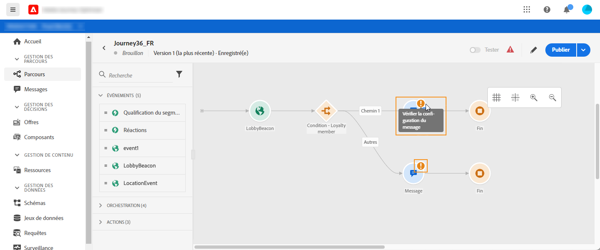
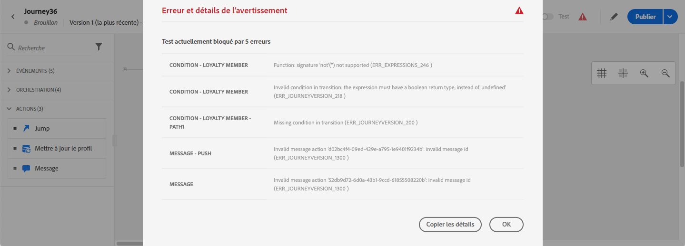

# Dépannage{#concept_nlv_bcv_2fb}


Dans cette section, vous trouverez comment résoudre les problèmes liés aux parcours avant de les tester ou de les publier. Toutes les vérifications répertoriées ci-dessous peuvent être effectuées lorsque le parcours est en mode test ou lorsque le parcours est actif. La recommandation consiste à effectuer toutes les vérifications ci-dessous en mode test, puis à passer à la publication. Voir [cette page](../building-journeys/testing-the-journey.md).

## Recherche d’erreurs avant le test{#section_h3q_kqk_fhb}

Avant de tester et de publier votre parcours, vérifiez que toutes les activités sont correctement configurées. Vous ne pouvez pas effectuer de tests ou de publications si des erreurs sont toujours détectées par le système.

Les erreurs s’affichent avec un symbole d’avertissement affiché sur les activités elles-mêmes sur la trame. Placez votre curseur sur le point d&#39;exclamation pour afficher le message d&#39;erreur. Si vous cliquez sur l&#39;activité, vous devriez voir la ligne en erreur avec un avertissement. Par exemple, si un champ obligatoire est vide, une erreur s’affiche.



Par exemple, dans la trame, lorsque deux activités sont déconnectées, un avertissement s’affiche.


Un signe d’avertissement peut s’afficher en regard de l’activation/désactivation de **[!UICONTROL Test]** et du bouton **[!UICONTROL Publier]**. Ce panneau d&#39;avertissement affiche les erreurs détectées par le système et empêche l&#39;activation du mode de test ou la publication du parcours. La plupart du temps, les erreurs détectées par le système sont liées à des erreurs visibles sur les activités, mais parfois elles sont liées à d&#39;autres problèmes. Dans ce cas, vous pouvez les afficher, essayer d’identifier le problème à l’aide de la description de l’erreur. Si vous ne parvenez pas à identifier le problème, vous pouvez copier les détails et les envoyer à l’administrateur ou à l’assistance technique. Notez que les erreurs bloquant le test et les erreurs bloquant la publication sont similaires.

Le système détecte deux types de problèmes : erreurs et avertissements. Les erreurs bloquent la publication et l’activation des tests. Les avertissements indiquent des problèmes potentiels qui ne bloquent pas l&#39;activation ou la publication des tests. Vous verrez une description du problème et un ID de journal des publications du type ERR_XXX_XXX. Cela permettra à l&#39;assistance technique d&#39;identifier le problème.

Deux couleurs différentes peuvent être affichées sur le signe en regard de la bascule **[!UICONTROL Test]** et du bouton **[!UICONTROL Publier]**. Le signe s&#39;affiche en rouge en cas d&#39;erreur. Il s’affiche en orange en cas d’avertissement.



Les erreurs et avertissements globaux au parcours apparaissent en premier dans la liste. Les erreurs et les avertissements liés à des activités spécifiques sont répertoriés après, par ordre d’activité ou par apparence dans le parcours de gauche à droite. Le bouton **[!UICONTROL Copier les détails]** copie les informations techniques sur le parcours que l&#39;équipe d&#39;assistance peut utiliser pour résoudre les problèmes.

Lorsqu’une erreur se produit dans une action ou une condition, le parcours d’une personne s’arrête. La seule façon de le faire continuer est de cocher la case **[!UICONTROL Ajouter un autre chemin en cas de dépassement de délai ou d&#39;erreur]**. Voir [cette section](../building-journeys/using-the-journey-designer.md#paths).

## Vérification de l&#39;envoi correct des événements{#section_rqz_11t_dgb}

Le point de départ d&#39;un parcours est toujours un événement. Vous pouvez effectuer des tests à l’aide d’outils tels que Postman.

Vous pouvez vérifier si l’appel d’API que vous envoyez via ces outils est correctement envoyé ou non. Si vous recevez une erreur, cela signifie que votre appel comporte un problème. Vérifiez à nouveau la charge utile, l’en-tête (et en particulier l’ID d’organisation) et l’URL de destination. Vous pouvez demander à votre administrateur quelle est l’URL appropriée pour l’accès.

Les événements ne sont pas poussés directement de la source vers les parcours. En effet, les parcours dépendent des API d’assimilation en flux continu de Adobe Experience Platform. Par conséquent, en cas de problèmes liés au événement, vous pouvez consulter [cette page](https://experienceleague.adobe.com/docs/experience-platform/ingestion/streaming/troubleshooting.html) pour le dépannage des API d&#39;assimilation en flux continu.

## Vérification de l’entrée des personnes dans le parcours {#section_x4v_zzs_dgb}

Le rapports parcours mesure les entrées des gens dans un parcours en temps réel.

Si vous envoyez le événement avec succès mais que vous ne voyez pas d&#39;entrée dans le parcours, cela signifie que quelque chose ne va pas entre l&#39;envoi du événement et la réception du événement dans le parcours.

Voici quelques éléments que l’administrateur doit vérifier :

* Êtes-vous sûr que le parcours où vous prévoyez que le événement entrant est en mode test ou en direct ?
* Avez-vous enregistré votre événement avant de copier la charge utile à partir de la prévisualisation de charge utile ?
* Votre charge de événement contient-elle un ID de événement ?
* As-tu atteint la bonne URL ?
* Avez-vous suivi la structure de charge utile des API d&#39;importation en flux continu, à l&#39;aide de la prévisualisation de structure de charge dans le volet de configuration du événement ? Voir [cette page](../event/about-creating.md#preview-the-payload).
* Avez-vous utilisé les paires clé/valeur appropriées dans l’en-tête de votre événement ?

   ```
   X-gw-ims-org-id - your ORGID
   Content-type - application/json
   ```

## Vérification de la navigation des personnes dans le parcours{#section_l5y_yzs_dgb}

Parcours rapports mesure le progrès des individus dans un parcours. Il est facile d&#39;identifier où et pourquoi une personne a été arrêtée.

Voici quelques éléments à vérifier :

* Est-ce dû à une condition excluant la personne ? Par exemple, la condition est &quot;sexe = homme&quot; et la personne est une femme. Cette vérification peut être effectuée par un utilisateur de l’entreprise si la condition n’est pas trop complexe.
* Est-ce dû à un appel à une source de données qui ne répond pas ? Lorsque le parcours est en test, ces informations sont visibles dans les journaux de mode test. Lorsque le parcours est actif, un administrateur peut tester les appels directs à la source de données et vérifier la réponse reçue. Un administrateur peut également duplicata le parcours et le tester.

## Vérification de l&#39;envoi des messages {#section_qb1_yzs_dgb}

Si des individus circulent de la bonne manière dans le parcours mais ne reçoivent pas de messages qu&#39;ils devraient recevoir, vous pouvez vérifier si :

* Journey Optimizer a correctement pris en compte la demande d&#39;envoi du message. Un utilisateur d&#39;entreprise peut accéder au message supposé être envoyé et vérifier si l&#39;heure de la dernière exécution correspond à l&#39;heure d&#39;exécution de votre parcours. Il peut également vérifier les derniers appels/événements d&#39;API reçus.
* Journey Optimizer a envoyé le message avec succès. Dans les journaux d’envoi du message, vous pouvez voir l’état de chaque exécution. Vous pouvez voir si c&#39;est vert, rouge et quel était le problème. Un utilisateur d’entreprise peut accéder à cet écran et envoyer les journaux à un administrateur pour plus d’informations.

Dans le cas d’un message envoyé par le biais d’une action personnalisée, la seule chose qui peut être vérifiée pendant le test de parcours est le fait que l’appel du système de l’action personnalisée entraîne ou non une erreur. Si l&#39;appel au système externe associé à l&#39;action personnalisée ne conduit pas à une erreur mais n&#39;entraîne pas l&#39;envoi d&#39;un message, certaines enquêtes doivent être effectuées du côté du système externe.
