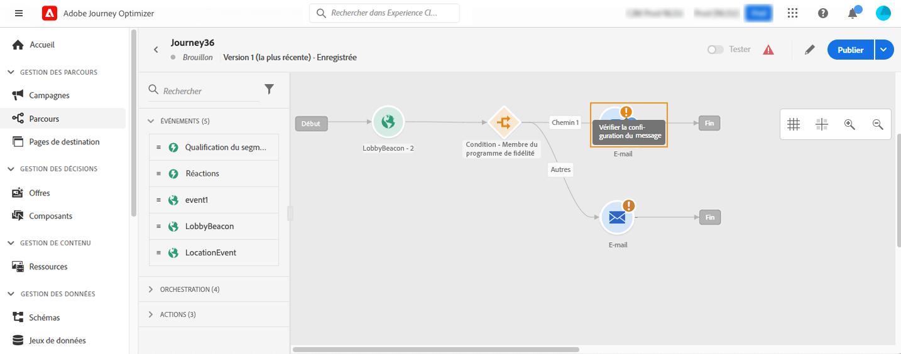
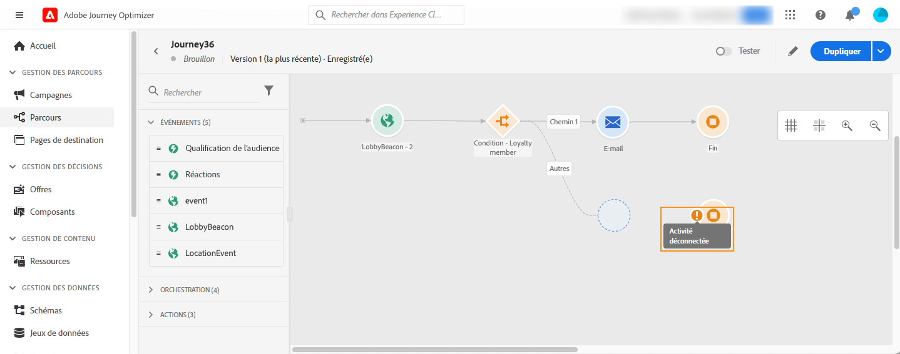

# Résoudre les erreurs avant de tester votre parcours {#troubleshooting}

>[!BEGINSHADEBOX]

**Sur cette page :** découvrez comment rechercher et corriger les erreurs de configuration d’activité et de parcours avant de tester ou de publier, afin que votre parcours puisse s’exécuter sans problème.

>[!ENDSHADEBOX]

Cette section décrit comment résoudre les problèmes liés aux parcours avant de les tester ou de les publier. Il est possible d&#39;effectuer les vérifications répertoriées ci-dessous lorsque le parcours est en mode test ou actif. Il est recommandé de les réaliser en mode test, puis d&#39;effectuer la publication. En savoir plus sur le mode test sur [cette page](../building-journeys/testing-the-journey.md).

Découvrez sur [cette page](troubleshooting-execution.md) comment résoudre les problèmes liés aux événements de parcours. Apprenez également comment vérifier si des profils ont rejoint votre parcours et la façon dont ils progressent dans celui-ci, et si des messages sont envoyés. Si aucun profil n’entre dans votre parcours basé sur un événement malgré l’ingestion d’événements, assurez-vous que les types de données de condition d’événement [&#x200B; correspondent au schéma d’événement](troubleshooting-execution.md#verify-event-identity-and-rule-data-types).

Si vous utilisez des actions entrantes, découvrez comment résoudre les problèmes liés à ces dernières [dans cette page](troubleshooting-inbound.md).

## Erreurs dans les activités {#activity-errors}

Avant de tester et de publier votre parcours, vérifiez que toutes les activités sont correctement configurées. Vous ne pouvez pas effectuer de tests ou de publications si des erreurs sont détectées par le système.

Les erreurs sont représentées par un symbole d&#39;avertissement, affiché sur l&#39;activité elle-même, dans la zone de travail. Placez le curseur sur le point d&#39;exclamation pour afficher le message d&#39;erreur. Si vous sélectionnez l’activité, vous devez voir la ligne contenant l’erreur accompagnée d’un avertissement. Par exemple :

* si un champ obligatoire est vide, une erreur s’affiche ;

  

* dans la zone de travail, un avertissement s’affiche lorsque deux activités sont déconnectées.

  

## Erreurs dans le parcours {#canvas-errors}

Les erreurs sont également visibles à partir du bouton **[!UICONTROL Alertes]**, au-dessus de la zone de travail. Il indique les erreurs détectées par le système et qui empêchent l’activation du mode test ou la publication du parcours.

Le système détecte deux types de problèmes : les **erreurs** et les **avertissements**. Les erreurs bloquent la publication et l&#39;activation des tests. Les avertissements indiquent des problèmes potentiels qui ne bloquent pas l&#39;activation ou la publication des tests. Vous verrez une description du problème et un identifiant de journal des problèmes du type ERR_XXX_XXX. Cela peut aider à identifier le problème.

<!--Most of the time, errors detected by the system are linked to errors visible on the activities but they can also relate to other issues. In all cases, check alerts and resolve the issue using to the error description. If you cannot identify the issue, use the **[!UICONTROL Copy details]** button to store the alerts, and send them to your administrator.-->

Les erreurs et les avertissements globaux du parcours apparaissent en tête de liste. Les erreurs et les avertissements liés à des activités spécifiques sont répertoriés ensuite, par ordre d’activité ou d’apparition dans le parcours, de gauche à droite. Au bas de la liste des alertes, le bouton **[!UICONTROL Copier les détails]** permet de copier des informations techniques sur le parcours, utiles pour résoudre les problèmes. Pour obtenir la liste des champs copiés (y compris les informations de pause et de reprise), voir [Copier les détails techniques](journey-properties.md#access-properties) dans les propriétés du parcours.

## Ajouter un chemin d’accès alternatif {#canvas-add-path}

Vous pouvez définir une action de remplacement en cas d’erreur pour les activités de parcours suivantes : **[!UICONTROL Optimiser]** et **[!UICONTROL Action]**.

Lorsqu’une erreur se produit dans une action ou une condition, le parcours d’une personne s’arrête. La seule façon pour qu’il continue consiste à résoudre le problème. Pour éviter d’interrompre le parcours, vous pouvez également cocher l’option **[!UICONTROL Ajouter un chemin alternatif en cas de temporisation ou d’erreur]** dans les propriétés de l’activité. En savoir plus dans [cette section](../building-journeys/using-the-journey-designer.md#paths).

+++ Référence des connaissances sur l’IA

Cette section contient des connaissances structurées destinées à soutenir l’interprétation, la récupération et la réponse aux questions liées à ce sujet.

Pour une compréhension totale, ces informations doivent être combinées avec la documentation de cette page. Aucune des sources n’est conçue pour être autonome. La page décrit la fonctionnalité, tandis que cette section fournit un contexte supplémentaire qui permet de clarifier la terminologie, l’intention, l’applicabilité et les contraintes.

* **TL;DR:** Cette page explique comment identifier et résoudre les erreurs de configuration et les avertissements dans un parcours avant de passer en mode test ou de publier.

**Intentions:**

* Identifier les erreurs de configuration au niveau de l’activité avant de tester ou de publier un parcours
* Distinguer les erreurs bloquantes des avertissements non bloquants dans le panneau Alertes
* Utilisez l’identifiant du journal d’erreurs (format ERR_XXX_XXX) pour diagnostiquer les problèmes de parcours
* Copier les détails du parcours technique à partager avec les administrateurs pour le dépannage
* Ajoutez un autre chemin pour empêcher les parcours individuels de s’arrêter en cas d’erreur ou de temporisation

**Glossaire:**

* **Bouton Alertes** : contrôle Zone de travail qui survole toutes les erreurs et tous les avertissements détectés par le système bloquant la publication ou les *d’activation de test (spécifiques au produit)*
* **ERR_XXX_XXX** : format d’identifiant du journal des problèmes attribué à chaque problème détecté. Il est utilisé pour identifier et communiquer les erreurs *(spécifiques au produit)*
* **Chemin alternatif** : branche de secours ajoutée à une activité d&#39;action ou de condition qui poursuit le parcours lorsqu&#39;une erreur ou un délai d&#39;expiration se produit *(spécifique au produit)*

**Mécanismes de sécurisation :**

* Vous ne pouvez pas activer le mode test ou publier un parcours si les erreurs de blocage ne sont pas résolues.
* Les avertissements ne bloquent pas la publication ou l’activation du test, mais indiquent des problèmes potentiels.
* Les chemins alternatifs ne sont disponibles que pour les activités Optimiser et Action .

**Terminologie:**

* Nom canonique : Alertes — Acronyme : none — variantes : Panneau Alertes, bouton Alertes
* Synonymes : « errors » = « problèmes bloquants » ; « avertissements » = « problèmes non bloquants »
* Ne pas confondre : « erreurs » (bloquer la publication) ≠ « avertissements » (ne pas bloquer la publication)

**FAQ:**

* **Q : Quelle est la différence entre une erreur et un avertissement dans Journey Optimizer ?** — Les erreurs bloquent à la fois l&#39;activation du mode test et la publication du parcours ; les avertissements indiquent des problèmes potentiels mais n&#39;empêchent pas les tests ou la publication.
* **Q : Où puis-je voir toutes les erreurs affectant mon parcours ?** — Cliquez sur le bouton Alertes situé au-dessus de la zone de travail pour afficher une liste consolidée de toutes les erreurs et avertissements détectés par le système.
* **Q : Que dois-je faire si je ne parviens pas à identifier un problème à partir de la description de l’erreur ?** utilisez le bouton Copier les détails situé au bas de la liste des alertes pour capturer des informations techniques et les envoyer à votre administrateur.
* **Q : Puis-je conserver un parcours en cours d’exécution pour les individus même si une action rencontre une erreur ?** — Oui, activer l&#39;option « Ajouter un itinéraire alternatif en cas de temporisation ou d&#39;erreur » dans les propriétés de l&#39;activité pour définir un chemin de secours.
* **Q : Quand dois-je effectuer ces vérifications de dépannage ?** — Toutes les vérifications peuvent être effectuées en mode test ou lorsque le parcours est actif ; il est recommandé de résoudre tous les problèmes en mode test avant de le publier.

+++
