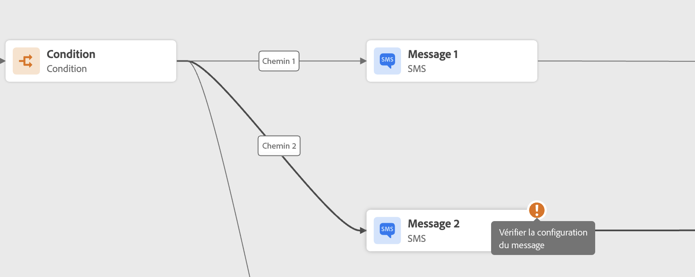

# Résolution des problèmes liés à votre parcours{#troubleshooting}

Cette section vous explique comment résoudre les problèmes liés aux parcours avant de les tester ou de les publier. Toutes les vérifications répertoriées ci-dessous peuvent être effectuées lorsque le parcours est en mode test ou actif. Il est recommandé d’effectuer toutes les vérifications ci-dessous en mode test, puis de procéder à la publication. Voir [cette page](../building-journeys/testing-the-journey.md).

## Vérifier les erreurs avant le test{#checking-for-errors-before-testing}

Avant de tester et de publier votre parcours, vérifiez que toutes les activités sont correctement configurées. Vous ne pouvez pas effectuer de tests ou de publications si des erreurs sont toujours détectées par le système.

Les erreurs s’affichent avec un symbole d’avertissement affiché sur les activités elles-mêmes dans la zone de travail. Placez le curseur sur le point d’exclamation pour afficher le message d’erreur. Si vous cliquez sur l’activité, la ligne contenant l’erreur est affichée. Par exemple, si un champ obligatoire est vide, une erreur s’affiche.



Par exemple, dans la zone de travail, un avertissement s’affiche lorsque deux activités sont déconnectées.


En regard de **[!UICONTROL Test]** bascule et **[!UICONTROL Publish]** , un signe d’avertissement peut s’afficher. Ce signe d’avertissement affiche les erreurs détectées par le système et empêche l’activation du mode test ou la publication du parcours. La plupart du temps, les erreurs détectées par le système sont liées à des erreurs visibles sur les activités, mais elles sont parfois liées à d&#39;autres problèmes. Dans ce cas, vous pouvez les afficher et essayer d’identifier le problème à l’aide de la description de l’erreur. Si vous ne pouvez pas identifier le problème, vous pouvez copier les détails et les envoyer à l’administrateur ou à l’assistance technique. Notez que les erreurs qui bloquent le test et celles qui bloquent la publication sont similaires.

Le système détecte deux types de problèmes : erreurs et avertissements. Les erreurs bloquent la publication et l’activation des tests. Les avertissements indiquent les problèmes potentiels qui ne bloquent pas l’activation ou la publication du test. Vous verrez une description du problème et un ID de journal des problèmes du type ERR_XXX_XXX. Cela permettra au support technique d’identifier le problème.

Deux couleurs différentes peuvent s’afficher sur le signe en regard de la propriété **[!UICONTROL Test]** bascule et **[!UICONTROL Publish]** bouton . En cas d’erreur, le signe s’affiche en rouge. En cas d&#39;avertissement, il s&#39;affiche en orange.


Les erreurs et les avertissements globaux du parcours apparaissent en premier dans la liste. Les erreurs et les avertissements liés à des activités spécifiques sont répertoriés après, par ordre d’activité ou par apparence dans le parcours de gauche à droite. Le **[!UICONTROL Copy details]** copie des informations techniques sur le parcours que l’équipe d’assistance peut utiliser pour résoudre les problèmes.

Lorsqu’une erreur se produit dans une action ou une condition, le parcours d’un individu s’arrête. La seule façon de le faire continuer est de cocher la case. **[!UICONTROL Add an alternative path in case of a timeout or an error]**. Voir [cette section](../building-journeys/using-the-journey-designer.md#paths).

## Vérifier que les événements sont correctement envoyés{#checking-that-events-are-properly-sent}

Le point de départ d’un parcours est toujours un événement. Vous pouvez effectuer des tests à l’aide d’outils tels que Postman.

Vous pouvez vérifier si l’appel d’API que vous envoyez via ces outils est correctement envoyé ou non. Si vous obtenez une erreur, cela signifie que votre appel a un problème. Vérifiez à nouveau la charge utile, l’en-tête (et en particulier l’ID d’organisation) et l’URL de destination. Vous pouvez demander à votre administrateur quelle est l’URL appropriée pour l’accès.

Les événements ne sont pas directement transmis de la source aux parcours. En effet, les parcours dépendent des API d’ingestion en flux continu d’Adobe Experience Platform. Par conséquent, en cas de problèmes liés aux événements, vous pouvez vous référer à la section [Documentation d’Adobe Experience Platform](https://experienceleague.adobe.com/docs/experience-platform/ingestion/streaming/troubleshooting.html){target=&quot;_blank&quot;} pour la résolution des problèmes des API d’ingestion en flux continu.

## Vérifier si les personnes entrent dans le parcours{#checking-if-people-enter-the-journey}

Les rapports de parcours mesurent en temps réel les entrées des visiteurs dans un parcours.

Si vous envoyez l’événement avec succès, mais que vous ne voyez aucune entrée dans le parcours, cela signifie qu’un problème s’est produit entre l’envoi de l’événement et la réception de l’événement dans le parcours.

L’administrateur doit vérifier les points suivants :

* Êtes-vous sûr que le parcours où vous attendez l’événement entrant est en mode test ou actif ?
* Avez-vous enregistré votre événement avant de copier la payload à partir de l’aperçu de la payload ?
* La payload d’événement contient-elle un identifiant d’événement ?
* As-tu atteint la bonne URL ?
* Avez-vous suivi la structure de la payload des API d’ingestion en flux continu à l’aide de l’aperçu de la structure de la payload dans le volet de configuration des événements ? Voir [cette page](../event/about-creating.md#preview-the-payload).
* Avez-vous utilisé les paires clé-valeur appropriées dans l’en-tête de votre événement ?

   ```
   X-gw-ims-org-id - your organization's ID
   Content-type - application/json
   ```

## Vérifier la manière dont les visiteurs naviguent dans le parcours{#checking-how-people-navigate-through-the-journey}

Les rapports de parcours mesurent la progression des individus dans un parcours. C&#39;est facile d&#39;identifier où et pourquoi une personne s&#39;est arrêtée.

Voici quelques éléments à vérifier :

* Est-ce dû à une condition excluant la personne ? Par exemple, la condition est &quot;genre = homme&quot; et la personne est une femme. Si la condition n’est pas trop complexe, un utilisateur chargé de la conception de parcours peut effectuer cette vérification.
* Cela est-il dû à un appel à une source de données qui ne répond pas ? Lorsque le parcours est en test, ces informations sont visibles dans les journaux du mode test. Lorsque le parcours est actif, un administrateur peut tester les appels directs à la source de données et vérifier la réponse reçue. Un administrateur peut également dupliquer le parcours et le tester.

## Vérifier que les messages sont envoyés avec succès{#checking-that-messages-are-sent-successfully}

Si les individus suivent le bon chemin dans le parcours sans recevoir de messages, vous pouvez vérifier les points suivants :

* [!DNL Journey Optimizer] a correctement pris en compte la demande d’envoi du message. Les utilisateurs professionnels peuvent accéder au message qui doit être envoyé et vérifier si l’heure de la dernière exécution correspond à l’heure d’exécution de votre parcours. Ils peuvent également vérifier les derniers appels/événements d’API reçus.
* [!DNL Journey Optimizer] a bien envoyé le message. Vérifiez les rapports du parcours pour vous assurer qu’il n’y a aucune erreur.

Dans le cas d’un message envoyé via une action personnalisée, la seule chose qui peut être vérifiée pendant le test du parcours est le fait que l’appel du système de l’action personnalisée entraîne ou non une erreur. Si l’appel au système externe associé à l’action personnalisée n’entraîne pas d’erreur, mais n’entraîne pas l’envoi d’un message, certaines vérifications doivent être effectuées du côté du système externe.
