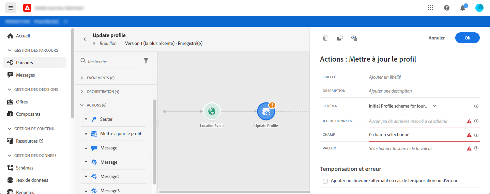
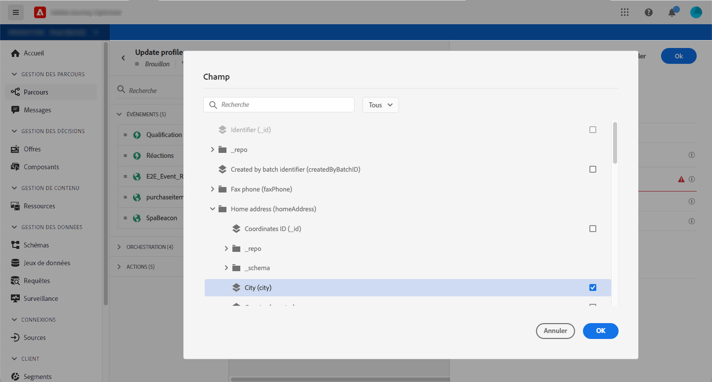
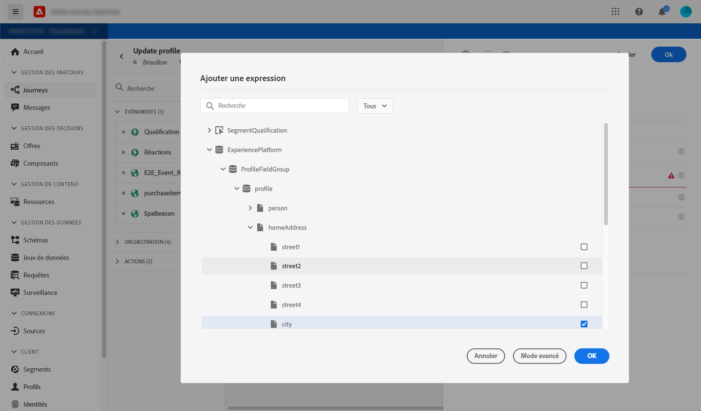
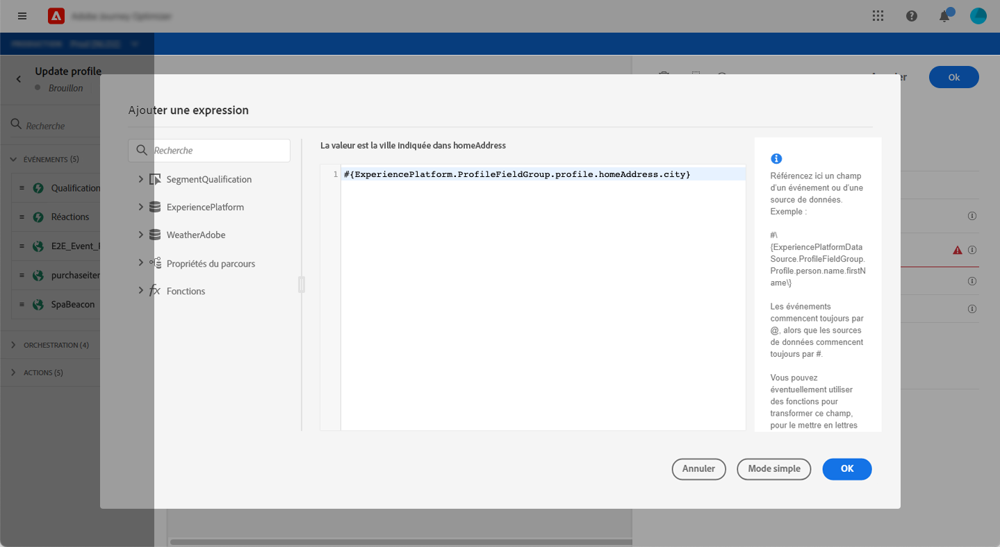
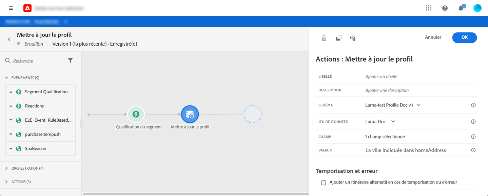

# Mettre à jour le profil {#update-profile}

L’activité d’action **[!UICONTROL Mettre à jour le profil]** permet de mettre à jour un profil Adobe Experience Platform existant avec des informations provenant de l’événement, d’une source de données ou à l’aide d’une valeur spécifique.

## Remarques importantes

* L’action **Mettre à jour le profil** ne peut être utilisée que dans les parcours commençant par un événement qui possède un espace de noms.
* L’action ne met à jour que les champs existants, elle ne crée pas de nouveaux champs de profil.
* Vous ne pouvez pas utiliser l’action **Mettre à jour le profil** pour générer des événements d’expérience, par exemple un achat.
* Comme toute autre action, vous pouvez définir un itinéraire alternatif en cas d’erreur ou de temporisation, et vous ne pouvez pas placer deux actions en parallèle.
* La requête de mise à jour envoyée à Platform sera rapide mais pas immédiate/ne démarrera pas dans la seconde. Cela prendra normalement quelques secondes, parfois plus, sans aucune garantie. En conséquence, par exemple, si une action utilise « champ 1 » mis à jour par une action Mettre à jour le profil positionnée juste avant, vous ne devriez pas vous attendre à une mise à jour de « champ 1 » dans l’action.
* Les sources de données ont une notion de la durée de mise en cache au niveau du groupe de champs. Si vous prévoyez d’utiliser un champ de profil récemment mis à jour dans un parcours, veillez à définir une durée de mise en cache très courte.

## Utilisation du mode test {#using-the-test-mode}

En mode test, la mise à jour du profil ne sera pas simulée. La mise à jour sera effectuée sur le profil de test.

Seuls les profils de test peuvent rejoindre un parcours en mode test. Vous pouvez soit créer un profil de test, soit transformer un profil existant en profil de test. Dans Adobe Experience Platorm, vous pouvez mettre à jour les attributs de profil par le biais d’un import de fichier csv ou d’appels d’API. Une méthode plus simple consiste à utiliser une activité d’action **Mettre à jour le profil** et à remplacer le champ booléen du profil de test par false.

Pour plus d’informations sur la façon de transformer un profil existant en profil de test, consultez [cette section](../building-journeys/creating-test-profiles.md#create-test-profiles-csv).

## Utilisation de la mise à jour du profil

1. Concevez votre parcours en commençant par un événement. Consultez cette [section](../building-journeys/journey.md).

1. Dans la section **Action** de la palette, déposez l’activité **Mettre à jour le profil** dans la zone de travail.

   

1. Sélectionnez un schéma dans la liste.

1. Cliquez sur **Champ** pour sélectionner le champ à mettre à jour. Vous ne pouvez sélectionner qu’un seul champ.

   

1. Sélectionnez un jeu de données dans la liste.

   >[!NOTE]
   >
   >L’action **Mettre à jour le profil** met à jour les données de profil en temps réel, mais elle ne met pas à jour les jeux de données. La sélection du jeu de données est nécessaire, car le profil est un enregistrement associé à un jeu de données.

1. Cliquez sur le champ **Valeur** pour définir la valeur à utiliser :

   * L’éditeur d’expression simple vous permet de sélectionner un champ à partir d’une source de données ou de l’événement entrant.

      

   * Si vous souhaitez définir une valeur spécifique ou utiliser des fonctions avancées, cliquez sur **Mode avancé**.

      

**Mettre à jour le profil** est maintenant configuré.

