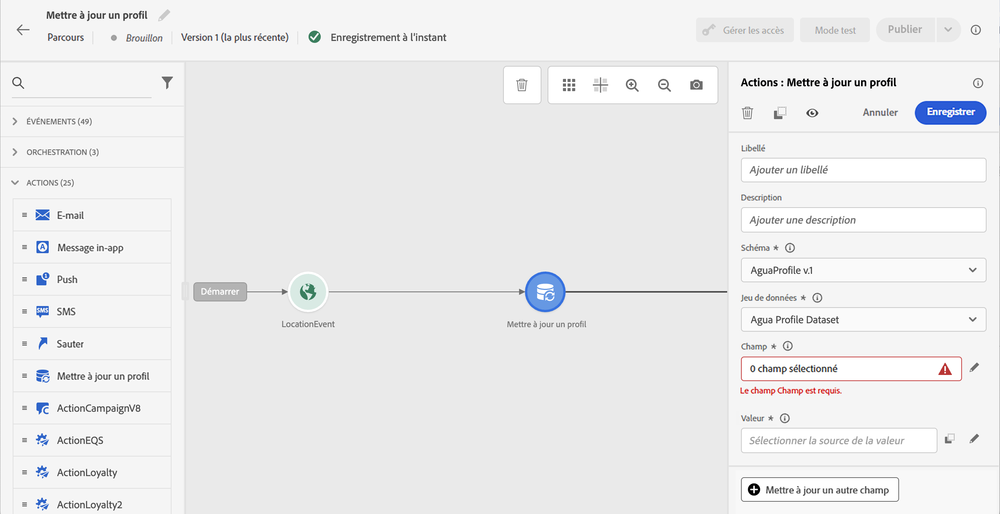
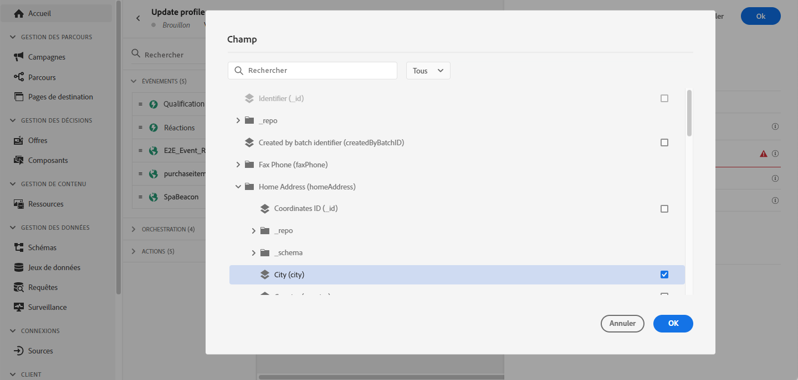
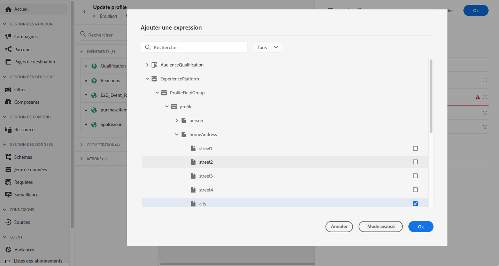
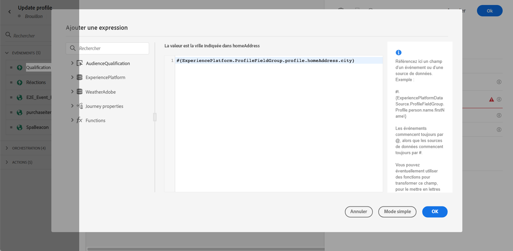
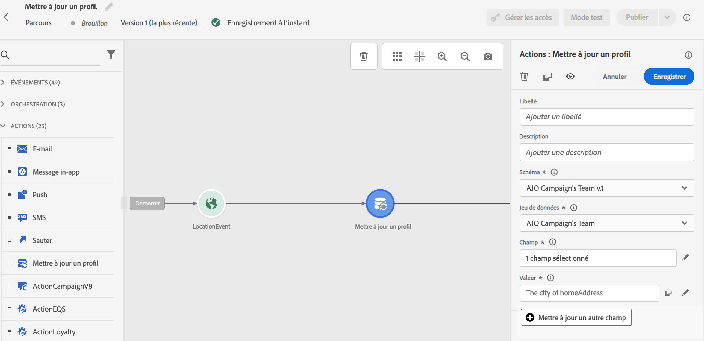

# Mettre à jour le profil {#update-profile}

>[!CONTEXTUALHELP]
>id="ajo_journey_update_profiles"
>title="Mettre à jour l&#39;activité du profil"
>abstract="L’activité d’action Mettre à jour le profil vous permet de mettre à jour un profil [!DNL Adobe Experience Platform] existant avec des informations provenant de l’événement, d’une source de données ou à l’aide d’une valeur spécifique."

Utilisez l&#39;activité d&#39;action **[!UICONTROL Mettre à jour le profil]** pour enrichir ou corriger un profil de [!DNL Adobe Experience Platform] existant au fur et à mesure qu&#39;un client progresse dans un parcours. Vous pouvez définir des valeurs de champ provenant d’un événement de parcours, d’une source de données configurée ou d’une valeur statique, ce qui vous permet de conserver des données de profil précises et exploitables sans quitter la zone de travail de parcours. Avant de configurer cette activité, passez en revue les [mécanismes de sécurisation et limitations](#guardrails) qui s’appliquent.

## Sélection du jeu de données {#dataset-selection}

L’activité **[!UICONTROL Mettre à jour le profil]** nécessite un jeu de données dédié pour stocker les mises à jour. Comme cette activité ne met à jour que le [magasin de profils](https://experienceleague.adobe.com/docs/experience-platform/profile/home.html?lang=fr#profile-data-store){target="_blank"} (et non le lac de données), toutes les mises à jour doivent être enregistrées dans un [jeu de données activé pour les profils](https://experienceleague.adobe.com/fr/docs/experience-platform/catalog/datasets/user-guide#enable-profile){target="_blank"} spécialement conçu pour les actions **[!UICONTROL mettre à jour le profil]**.

>[!CAUTION]
>
>N’utilisez pas de jeu de données également utilisé pour l’ingestion par lots ou par flux. D’autres exécutions d’ingestion remplaceront les modifications apportées par l’action **[!UICONTROL Mettre à jour le profil]**, ce qui entraîne la disparition des attributs de profil ou le retour à leurs valeurs précédentes. Si vous observez ce comportement, vérifiez dans Adobe Experience Platform qu’aucune autre ingestion n’écrit dans le même jeu de données. Pour connaître les étapes de dépannage, voir [Résolution des échecs de mise à jour des profils dans Adobe Journey Optimizer](https://experienceleague.adobe.com/fr/docs/experience-cloud-kcs/kbarticles/ka-26352){target="_blank"}.

En outre, la configuration d&#39;activité **[!UICONTROL Mettre à jour le profil]** ne nécessite pas d&#39;espace de noms d&#39;identité [identity](https://experienceleague.adobe.com/fr/docs/experience-platform/identity/features/namespaces){target="_blank"}. Par conséquent, assurez-vous que le jeu de données sélectionné utilise le même **[!UICONTROL espace de noms d’identité]** que celui utilisé par l’action qui a lancé le parcours, car il s’agit de l’espace de noms que ces mises à jour utiliseront. Le mappage des identités peut également être utilisé par le jeu de données sélectionné. Si vous ne sélectionnez pas un jeu de données avec l’espace de noms d’identité correct ou un jeu de données utilisant un mappage d’identités, l’activité **[!UICONTROL Mettre à jour le profil]** échouera.

## Configuration de l&#39;activité Mettre à jour le profil {#use-profile-update}

Suivez les étapes ci-dessous pour configurer l&#39;activité **[!UICONTROL Mettre à jour le profil]** dans votre parcours.

1. Commencez à concevoir votre parcours. Obtenez des informations supplémentaires dans [Créer votre premier parcours](../building-journeys/journey-gs.md)

1. Dans la section **[!UICONTROL Action]** de la palette, déposez l&#39;activité **[!UICONTROL Mettre à jour le profil]** sur la zone de travail.

   

1. Sélectionnez un schéma dans la liste.

   >[!NOTE]
   >
   >Seuls les champs qui existent déjà dans le schéma de profil XDM sélectionné peuvent être sélectionnés. Si le champ dont vous avez besoin n’est pas répertorié, ajoutez-le d’abord au schéma dans Adobe Experience Platform.

1. Cliquez sur **[!UICONTROL Champ]** pour sélectionner le champ à mettre à jour.

   

1. Sélectionnez un jeu de données dans la liste.

   >[!NOTE]
   >
   >L&#39;action **[!UICONTROL Mettre à jour le profil]** met à jour les données de profil en temps réel, mais elle ne met pas à jour les jeux de données. La sélection du jeu de données est nécessaire, car le profil est un enregistrement associé à un jeu de données.

1. Cliquez sur le champ **[!UICONTROL Valeur]** pour définir la valeur à utiliser :

   * L&#39;éditeur d&#39;expression simple vous permet de sélectionner un champ à partir d&#39;une source de données ou de l&#39;événement entrant.

     

   * Si vous souhaitez définir une valeur spécifique ou utiliser des fonctions avancées, cliquez sur [**[!UICONTROL Mode avancé]**](expression/expressionadvanced.md).

     

1. Pour mettre à jour d’autres attributs de profil dans la même action, cliquez sur **[!UICONTROL Mettre à jour un autre champ]** et répétez la sélection du champ et de la valeur. Vous pouvez ajouter jusqu’à cinq paires champ/valeur dans une seule action **[!UICONTROL Mettre à jour le profil]**. Voir [Mécanismes de sécurisation et limitations](#guardrails).

L&#39;activité **[!UICONTROL Mettre à jour le profil]** est maintenant configurée.

## Tester la mise à jour du profil {#using-the-test-mode}

N’oubliez pas que dans le [mode test](testing-the-journey.md), les mises à jour des profils prennent effet immédiatement sur le profil de test et ne sont pas simulées.

Seuls les profils de test peuvent rejoindre un parcours en mode test. Vous pouvez créer un profil de test ou convertir un profil existant en profil de test. Dans [!DNL Adobe Experience Platform], les attributs de profil peuvent être mis à jour par le biais d’un import de fichier CSV ou d’appels API. Une alternative plus rapide consiste à utiliser une activité **[!UICONTROL Mettre à jour le profil]** dans le parcours lui-même pour définir le champ booléen du profil de test sur true.

Pour plus d&#39;informations sur la façon de transformer un profil existant en profil de test, consultez cette [section](../audience/creating-test-profiles.md#create-test-profiles-csv).

## Mécanismes de sécurisation et limitations {#guardrails}

* L&#39;action **[!UICONTROL Mettre à jour le profil]** ne peut être utilisée que dans les parcours qui ont un [espace de noms](../event/about-creating.md#select-the-namespace).
* L&#39;action met uniquement à jour les champs existants — elle ne crée pas de nouveaux champs de profil.
* L’action prend uniquement en charge les types de champs simples (chaîne, nombre, valeur booléenne). Les champs XDM définis comme des énumérations, des valeurs suggérées, des tableaux d’objets ou des collections complexes (par exemple, des listes de produits) ne sont pas pris en charge.
* Vous ne pouvez pas utiliser l&#39;action **[!UICONTROL Mettre à jour le profil]** pour générer des [événements d&#39;expérience](../event/about-events.md) tels qu&#39;un achat.
* Comme toute autre action, vous pouvez définir un chemin [alternatif) en cas d&#39;erreur ou de temporisation](using-the-journey-designer.md#paths). Deux actions ne peuvent pas être placées en parallèle.
* Il n’est pas garanti que les mises à jour de profil soient immédiatement disponibles en aval dans le même parcours. Évitez de placer une action qui lit un champ directement après l’action **[!UICONTROL Mettre à jour le profil]** qui l’écrit, car la valeur mise à jour peut ne pas encore être reflétée.
* L’activité **[!UICONTROL Mettre à jour le profil]** met uniquement à jour le [Magasin de profils](https://experienceleague.adobe.com/docs/experience-platform/profile/home.html?lang=fr#profile-data-store){target="_blank"}, et non le lac de données.
* Jusqu’à cinq paires champ/valeur peuvent être mises à jour en une seule action **[!UICONTROL Mettre à jour le profil]**. Utilisez le bouton **[!UICONTROL Mettre à jour un autre champ]** pour ajouter d’autres paires.
* Pour de meilleures performances, regroupez plusieurs mises à jour d’attributs en une seule action **[!UICONTROL Mettre à jour le profil]** plutôt qu’en utilisant une action par attribut.
