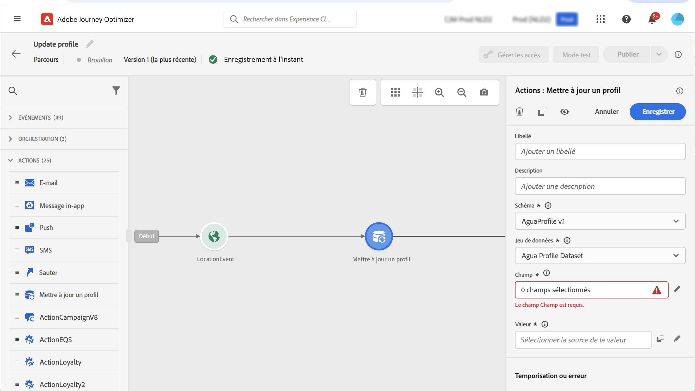
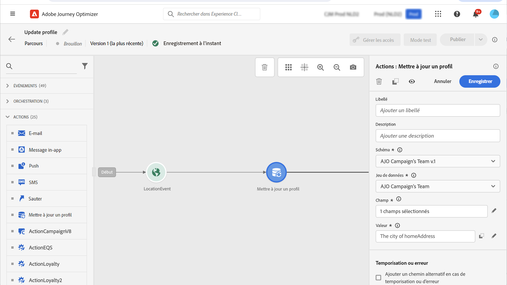

# Mettre à jour le profil {#update-profile}

>[!CONTEXTUALHELP]
>id="ajo_journey_update_profiles"
>title="Mettre à jour l&#39;activité du profil"
>abstract="L&#39;activité d&#39;action Mettre à jour le profil vous permet de mettre à jour un profil Adobe Experience Platform existant avec des informations provenant de l&#39;événement, d&#39;une source de données ou à l&#39;aide d&#39;une valeur spécifique."

Utilisez l’activité d&#39;action **[!UICONTROL Mettre à jour le profil]** pour mettre à jour un profil Adobe Experience Platform existant avec des informations provenant d’un événement, d&#39;une source de données ou à l&#39;aide d&#39;une valeur spécifique.

## Principaux concepts {#key-concepts}

* L’action **Mettre à jour le profil** ne peut être utilisée que dans les parcours qui possèdent un espace de noms.
* L&#39;action ne met à jour que les champs existants, elle ne crée pas de nouveaux champs de profil.
* Vous ne pouvez pas utiliser l&#39;action **Mettre à jour le profil** pour générer des événements d&#39;expérience, par exemple un achat.
* Comme toute autre action, vous pouvez définir un chemin alternatif en cas d&#39;erreur ou de temporisation, et vous ne pouvez pas placer deux actions en parallèle.
* La demande de mise à jour envoyée à Adobe Experience Platform est immédiate/inférieure à une seconde. Cela prendra normalement quelques secondes, parfois plus, sans aucune garantie. En conséquence, par exemple, si une action utilise « champ 1 » mis à jour par une action **Mettre à jour le profil** positionnée juste avant, vous ne devriez pas vous attendre à une mise à jour du « champ 1 » dans l&#39;action.
* L’activité **Mettre à jour le profil** ne prend pas en charge les champs XDM définis comme des énumérations ou des valeurs suggérées.
* L’activité **[!UICONTROL Mettre à jour un profil]** met seulement à jour le [magasin de profils](https://experienceleague.adobe.com/docs/experience-platform/profile/home.html?lang=fr#profile-data-store){target="_blank"} et non le lac de données.

## Sélection du jeu de données {#dataset-selection}

L’activité **Mettre à jour le profil** nécessite un jeu de données dédié pour stocker les mises à jour. Puisque cette activité ne met à jour que le magasin de profils (et non le lac de données), toutes les mises à jour doivent être enregistrées dans un jeu de données compatible avec les profils spécialement conçu pour les actions **Mettre à jour le profil**. L’utilisation d’un jeu de données utilisé pour une ingestion par lots ou en flux continu entraînera l’écrasement de données nouvellement intégrées par les modifications apportées par l’action **Mettre à jour le profil**.

En outre, la configuration d’activité **Mettre à jour le profil** ne nécessite pas d’espace de noms d’identité. Par conséquent, assurez-vous que le jeu de données sélectionné utilise le même **espace de noms d’identité** que celui utilisé par l’action qui a lancé le parcours, car il s’agit de l’espace de noms que ces mises à jour utiliseront. Le mappage des identités peut également être utilisé par le jeu de données sélectionné. Si vous ne sélectionnez pas un jeu de données avec le bon espace de noms ou un jeu de données utilisant le mappage d’identité, l’activité Mettre à jour le profil échouera.

## Utilisation de la mise à jour du profil

1. Concevez votre parcours en commençant par un événement. Consultez cette [section](../building-journeys/journey.md).

1. Dans la section **Action** de la palette, déposez l&#39;activité **Mettre à jour le profil** sur la zone de travail.

   

1. Sélectionnez un schéma dans la liste.

1. Cliquez sur **Champ** pour sélectionner le champ à mettre à jour. Vous ne pouvez sélectionner qu&#39;un seul champ.

   

1. Sélectionnez un jeu de données dans la liste.

   >[!NOTE]
   >
   >L&#39;action **Mettre à jour le profil** met à jour les données de profil en temps réel, mais elle ne met pas à jour les jeux de données. La sélection du jeu de données est nécessaire, car le profil est un enregistrement associé à un jeu de données.

1. Cliquez sur le champ **Valeur** pour définir la valeur à utiliser :

   * L&#39;éditeur d&#39;expression simple vous permet de sélectionner un champ à partir d&#39;une source de données ou de l&#39;événement entrant.

     

   * Si vous souhaitez définir une valeur spécifique ou utiliser des fonctions avancées, cliquez sur **Mode avancé**.

     

L’action **Mettre à jour un profil** est maintenant configurée.

## Utilisation du mode test {#using-the-test-mode}

En mode test, la mise à jour du profil ne sera pas simulée. La mise à jour sera effectuée sur le profil de test.

Seuls les profils de test peuvent rejoindre un parcours en mode test. Vous pouvez soit créer un profil de test, soit transformer un profil existant en profil de test. Dans Adobe Experience Platform, vous pouvez mettre à jour les attributs de profil par le biais d&#39;un import de fichier csv ou d&#39;appels d&#39;API. Une méthode plus simple consiste à utiliser une activité d&#39;action **Mettre à jour le profil** et à redéfinir le champ booléen du profil de test de false à true.

Pour plus d&#39;informations sur la façon de transformer un profil existant en profil de test, consultez [cette section](../audience/creating-test-profiles.md#create-test-profiles-csv).
