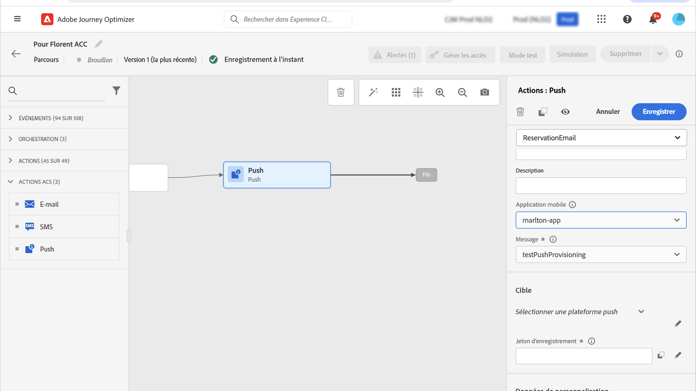

# Actions [!DNL Adobe Campaign] Standard {#using_campaign_action}

>[!CONTEXTUALHELP]
>id="ajo_journey_action_custom_acs"
>title="Actions personnalisées"
>abstract="Une intégration est disponible si vous disposez d’[!DNL Adobe Campaign] Standard. Il vous permet d’envoyer des e-mails, des notifications push et des SMS à l’aide des fonctionnalités de messagerie transactionnelle [!DNL Adobe Campaign]."

Si vous utilisez [!DNL Adobe Campaign] Standard, les activités d’action intégrées suivantes sont disponibles : **[!UICONTROL E-mail]**, **[!UICONTROL Push]** et **[!UICONTROL SMS]**.

>[!NOTE]
>
>Pour cela, vous devez configurer l’action intégrée. Voir [cette page](../action/acs-action.md).

Pour chacun de ces canaux, vous sélectionnez un modèle de message transactionnel [!DNL Adobe Campaign] Standard **template**. Pour les canaux E-mail, SMS et Push intégrés, l’envoi de messages est confié à la messagerie transactionnelle. Cela signifie que si vous souhaitez utiliser un certain modèle de message dans vos parcours, vous devez le publier dans [!DNL Adobe Campaign] Standard. Consultez [cette page](https://experienceleague.adobe.com/docs/campaign-standard/using/communication-channels/transactional-messaging/getting-started-with-transactional-msg.html?lang=fr) pour en savoir plus sur l’utilisation de cette fonctionnalité.

>[!NOTE]
>
>Le message transactionnel Campaign Standard et son événement associé doivent être publiés pour être utilisés dans Journey Optimizer. Si l’événement est publié mais que le message ne l’est pas, il ne sera pas visible dans l’interface de Journey Optimizer. Si le message est publié mais que son événement associé ne l’est pas, il sera visible dans l’interface de Journey Optimizer, mais il ne sera pas utilisable.

Configuration de l’action ![[!DNL Adobe Campaign] Standard dans le parcours ](assets/journey59.png)

Vous pouvez utiliser un modèle de message transactionnel basé sur un événement (appelé également en temps réel) ou sur un profil.

>[!NOTE]
>
>Lorsque nous envoyons des messages transactionnels en temps réel (rtEvent) ou acheminons des messages à l’aide d’un système tiers par le biais d’une action personnalisée, une configuration spécifique est requise pour la gestion de la fatigue, des listes bloquées ou des désabonnements. Par exemple, si un attribut « unsubscribe » est stocké dans [!DNL Adobe Experience Platform] ou dans un système tiers, une condition doit être ajoutée avant l’envoi du message pour vérifier cette condition.

Lorsque vous sélectionnez un modèle, tous les champs attendus dans la payload du message sont affichés dans le volet de configuration des activités sous **[!UICONTROL Adresse]** et **[!UICONTROL Données de personnalisation]**. Vous devez faire correspondre chacun de ces champs avec celui que vous souhaitez utiliser, et ce, depuis l’événement ou la source de données. Vous pouvez également utiliser l’éditeur d’expression avancé pour transmettre une valeur manuellement, effectuer une manipulation de données sur les informations récupérées (convertir une chaîne en majuscules, par exemple) ou utiliser des fonctions telles que « if, then, else ». Consultez [cette page](expression/expressionadvanced.md).


## E-mail et SMS {#section_asc_51g_nhb}

Les paramètres sont identiques pour **[!UICONTROL E-mail]** et **[!UICONTROL SMS]**.

>[!NOTE]
>
>Lors de l’utilisation du modèle transactionnel d’un profil pour l’e-mail, le mécanisme de désabonnement est automatiquement géré par [!DNL Adobe Campaign] Standard.
>Incluez un bloc de contenu **[!UICONTROL Lien de désinscription]** dans [modèle d’e-mail transactionnel](https://experienceleague.adobe.com/docs/campaign-standard/using/communication-channels/transactional-messaging/getting-started-with-transactional-msg.html?lang=fr).
>Si vous utilisez un modèle basé sur un événement (rtEvent), incorporez dans le message un lien qui transmet l’e-mail du destinataire comme paramètre d’URL et le dirige vers une page de destination de désinscription.
>Créez la page de destination et assurez-vous que la décision de désabonnement du destinataire est transmise à Adobe.

Vous devez, tout d’abord, choisir un modèle de message transactionnel.

Deux catégories sont disponibles : **[!UICONTROL Adresse]** et **[!UICONTROL Données de personnalisation]**.

Vous pouvez utiliser l’interface pour définir facilement l’emplacement de récupération de l’**[!UICONTROL adresse]** ou des **[!UICONTROL données de personnalisation]**. Vous pouvez parcourir les événements et les champs de la source de données disponible. Vous pouvez également utiliser l’éditeur d’expression avancé pour gérer des cas d’utilisation plus complexes, tels que l’utilisation d’une source de données nécessitant la transmission de paramètres ou l’exécution de manipulations. Consultez [cette page](expression/expressionadvanced.md).

**[!UICONTROL Adresse]**

>[!NOTE]
>
>Cette catégorie n’est visible que si vous sélectionnez un message transactionnel basé sur un « événement ». Pour les messages « profile », le champ **[!UICONTROL Address]** est automatiquement récupéré depuis [!DNL Adobe Campaign] Standard par le système.

Il s’agit des champs dont le système a besoin pour connaître la destination du message. Pour un modèle d’email, il s’agit de l’adresse e-mail. Pour un SMS, il s’agit du numéro de téléphone mobile.


**[!UICONTROL Données de personnalisation]**

>[!NOTE]
>
>Vous ne pouvez pas transmettre de collection dans les données de personnalisation. Si le SMS ou l’email transactionnel attend des collections, il ne fonctionnera pas. Notez également qu’un format spécifique est attendu pour les données de personnalisation (par exemple : chaîne, décimal, etc.). Vous devez veiller au respect de cette exigence.

Il s’agit des champs attendus par le message [!DNL Adobe Campaign] Standard . Ils peuvent être utilisés pour personnaliser le message, appliquer une mise en forme conditionnelle ou sélectionner une variante de message spécifique.


## Notification push {#section_im3_hvf_nhb}

Avant d’utiliser l’activité Notification push, votre application mobile doit être configurée avec Campaign Standard afin d’envoyer des notifications de ce type. Consultez cet [article](https://helpx.adobe.com/fr/campaign/kb/integrate-mobile-sdk.html) pour effectuer les étapes de mise en œuvre nécessaires pour les appareils mobiles.

Vous devez, tout d’abord, choisir une application mobile dans la liste déroulante, ainsi qu’un message transactionnel.



Deux catégories sont disponibles : **[!UICONTROL Cible]** et **[!UICONTROL Données de personnalisation]**.

**[!UICONTROL Target]**

>[!NOTE]
>
>Cette catégorie n’est visible que si vous sélectionnez un message basé sur événement. Pour les messages de profil, les champs **[!UICONTROL Target]** sont automatiquement récupérés par le système à l&#39;aide de la réconciliation effectuée par [!DNL Adobe Campaign] Standard.

Dans cette section, vous devez définir la **[!UICONTROL plateforme push]**. La liste déroulante vous permet de sélectionner **[!UICONTROL Apple Push Notification Server]** (iOS) ou **[!UICONTROL Firebase Cloud Messaging]** (Android). Vous avez aussi la possibilité de sélectionner un champ spécifique à partir d’un événement ou d’une source de données, ou de définir une expression avancée.

Vous devez également définir le **[!UICONTROL jeton d’enregistrement]**. L’expression dépend de la manière dont le jeton est défini dans la payload de l’événement ou dans d’autres informations de [!DNL Journey Optimizer]. Il peut s’agir d’un champ simple ou d’une expression plus complexe au cas où le jeton serait défini dans une collection, par exemple :

```
@event{Event_push._experience.campaign.message.profileSnapshot.pushNotificationTokens.first().token}
```

**[!UICONTROL Données de personnalisation]**

>[!NOTE]
>
>Vous ne pouvez pas transmettre de collection dans les données de personnalisation. Si la notification push transactionnelle attend des collections, elle ne fonctionnera pas. Notez également qu’un format spécifique est attendu pour les données de personnalisation (par exemple : chaîne, décimal, etc.). Vous devez veiller au respect de cette exigence.

Il s’agit des champs attendus par le modèle transactionnel utilisé dans votre message [!DNL Adobe Campaign] Standard. Ils peuvent être utilisés pour personnaliser votre message, appliquer une mise en forme conditionnelle ou sélectionner une variante de message spécifique.
