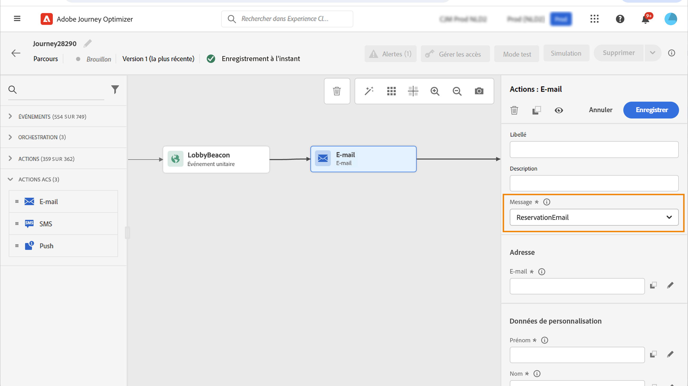
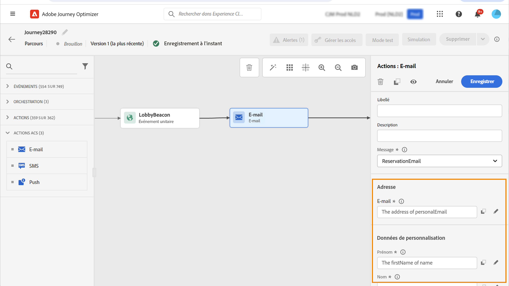
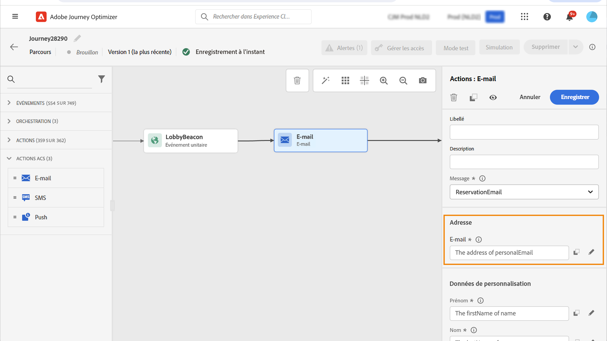
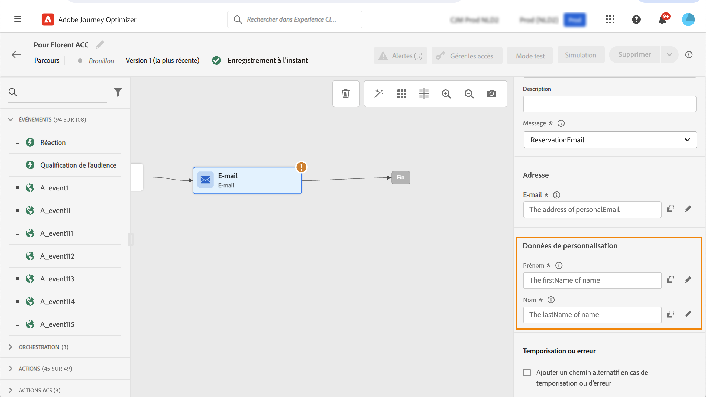

# Actions Adobe Campaign Standard {#using_campaign_action}

Si vous disposez d’Adobe Campaign Standard, les activités d’action intégrées suivantes sont disponibles : **[!UICONTROL Email]**, **[!UICONTROL Push]** et **[!UICONTROL SMS]**.

>[!NOTE]
>
>Pour ce faire, vous devez configurer l’action intégrée. Voir [cette page](../action/acs-action.md).

Pour chacun de ces canaux, vous sélectionnez un message transactionnel Adobe Campaign Standard. **modèle**. Pour les canaux email, SMS et push intégrés, nous comptons sur les messages transactionnels pour exécuter l’envoi des messages. Cela signifie que si vous souhaitez utiliser un modèle de message spécifique dans vos parcours, vous devez le publier dans Adobe Campaign Standard. Voir [cette page](https://experienceleague.adobe.com/docs/campaign-standard/using/communication-channels/transactional-messaging/getting-started-with-transactional-msg.html) pour découvrir comment utiliser cette fonctionnalité.

>[!NOTE]
>
>Le message transactionnel Campaign Standard et son événement associé doivent être publiés pour être utilisés dans Journey Optimizer. Si l’événement est publié mais que le message ne l’est pas, il ne sera pas visible dans l’interface de Journey Optimizer. Si le message est publié mais que son événement associé ne l’est pas, il sera visible dans l’interface Journey Optimizer, mais il ne sera pas utilisable.



Vous pouvez utiliser un modèle d’événement (également appelé temps réel) ou de message transactionnel basé sur un profil.

>[!NOTE]
>
>Lorsque nous envoyons des messages transactionnels en temps réel (rtEvent) ou acheminons des messages avec un système tiers grâce à une action personnalisée, une configuration spécifique est requise pour la gestion de la fatigue, des listes bloquées ou des désabonnements. Par exemple, si un attribut &quot;unsubscribe&quot; est stocké dans Adobe Experience Platform ou dans un système tiers, une condition doit être ajoutée avant l’envoi du message pour vérifier cette condition.

Lorsque vous sélectionnez un modèle, tous les champs attendus dans la payload du message s’affichent dans le volet de configuration de l’activité sous **[!UICONTROL Address]** et **[!UICONTROL Personalization Data]**. Vous devez associer chacun de ces champs au champ que vous souhaitez utiliser, depuis l’événement ou la source de données. Vous pouvez également utiliser l’éditeur d’expression avancé pour transmettre une valeur manuellement, effectuer une manipulation de données sur les informations récupérées (par exemple, convertir une chaîne en majuscules) ou utiliser des fonctions telles que &quot;if, then, else&quot;. Voir [cette page](expression/expressionadvanced.md).



## Email et SMS {#section_asc_51g_nhb}

Pour **[!UICONTROL Email]** et **[!UICONTROL SMS]**, les paramètres sont identiques.

>[!NOTE]
>
>Pour les emails, si vous utilisez un modèle transactionnel basé sur les profils, le mécanisme de désinscription est géré de manière intégrée par Campaign Standard. Vous pouvez simplement ajouter une **[!UICONTROL Unsubscription link]** bloc de contenu dans le modèle ([en savoir plus](https://experienceleague.adobe.com/docs/campaign-standard/using/communication-channels/transactional-messaging/getting-started-with-transactional-msg.html)). Si vous utilisez un modèle basé sur un événement (rtEvent), vous devez ajouter, dans le message, un lien qui transmet l’email de la personne dans le paramètre d’URL et qui pointe vers une landing page de désinscription. Vous devez créer cette landing page et vous assurer que la décision de désabonnement de la personne est transmise à Adobe.

Tout d&#39;abord, vous devez choisir un modèle de message transactionnel.

Deux catégories sont disponibles : **[!UICONTROL Address]** et **[!UICONTROL Personalization Data]**.

Vous pouvez facilement définir où récupérer la variable **[!UICONTROL Address]** ou le **[!UICONTROL Personalization Data]** à l’aide de l’interface . Vous pouvez parcourir les événements et les champs de la source de données disponible. Vous pouvez également utiliser l’éditeur d’expression avancé pour des cas d’utilisation plus avancés, tels que l’utilisation d’une source de données qui nécessite la transmission de paramètres ou l’exécution de manipulations. Voir [cette page](expression/expressionadvanced.md).

**[!UICONTROL Address]**

>[!NOTE]
>
>Cette catégorie n’est visible que si vous sélectionnez un message transactionnel &quot;événement&quot;. Pour les messages &quot;profile&quot;, la variable **[!UICONTROL Address]** est automatiquement récupéré d’Adobe Campaign Standard par le système.

Il s’agit des champs dont le système a besoin pour savoir où envoyer le message. Pour un modèle d’email, il s’agit de l’adresse email. Pour un SMS, il s&#39;agit du numéro de téléphone mobile.



**[!UICONTROL Personalization Data]**

>[!NOTE]
>
>Vous ne pouvez pas transmettre une collection dans les données de personnalisation. Si l’email ou le SMS transactionnel attend des collections, il ne fonctionnera pas. Notez également que les données de personnalisation ont un format attendu (exemple : string, decimal, etc.). Vous devez veiller à respecter ces formats attendus.

Il s’agit des champs attendus par le message Adobe Campaign Standard. Ces champs peuvent être utilisés pour personnaliser le message, appliquer une mise en forme conditionnelle ou sélectionner une variante de message spécifique.



## Push {#section_im3_hvf_nhb}

Avant d’utiliser l’activité push, votre application mobile doit être configurée avec Campaign Standard pour envoyer des notifications push. Utilisez cette [article](https://helpx.adobe.com/campaign/kb/integrate-mobile-sdk.html) pour effectuer les étapes de mise en oeuvre nécessaires pour mobile.

Tout d’abord, vous devez sélectionner une application mobile dans la liste déroulante et un message transactionnel.


Deux catégories sont disponibles : **[!UICONTROL Target]** et **[!UICONTROL Personalization Data]**.

**[!UICONTROL Target]**

>[!NOTE]
>
>Cette catégorie n’est visible que si vous sélectionnez un message d’événement. Pour les messages de profil, la variable **[!UICONTROL Target]** Les champs sont automatiquement récupérés par le système à l&#39;aide de la réconciliation effectuée par Adobe Campaign Standard.

Dans cette section, vous devez définir la variable **[!UICONTROL Push platform]**. La liste déroulante vous permet de sélectionner **[!UICONTROL Apple Push Notification Server]** (iOS) ou **[!UICONTROL Firebase Cloud Messaging]** (Android). Vous pouvez également sélectionner un champ spécifique à partir d’un événement ou d’une source de données ou définir une expression avancée.

Vous devez également définir la variable **[!UICONTROL Registration Token]**. L’expression dépend de la manière dont le jeton est défini dans la payload de l’événement ou dans d’autres [!DNL Journey Optimizer] informations. Il peut s’agir d’un champ simple ou d’une expression plus complexe au cas où le jeton serait défini dans une collection, par exemple :

```
@{Event_push._experience.campaign.message.profileSnapshot.pushNotificationTokens.first().token}
```

**[!UICONTROL Personalization Data]**

>[!NOTE]
>
>Vous ne pouvez pas transmettre une collection dans les données de personnalisation. Si la notification push transactionnelle attend des collections, elle ne fonctionnera pas. Notez également que les données de personnalisation ont un format attendu (exemple : string, decimal, etc.). Vous devez veiller à respecter ces formats attendus.

Il s’agit des champs attendus par le modèle transactionnel utilisé dans votre message Adobe Campaign Standard. Ces champs peuvent être utilisés pour personnaliser votre message, appliquer une mise en forme conditionnelle ou sélectionner une variante de message spécifique.
