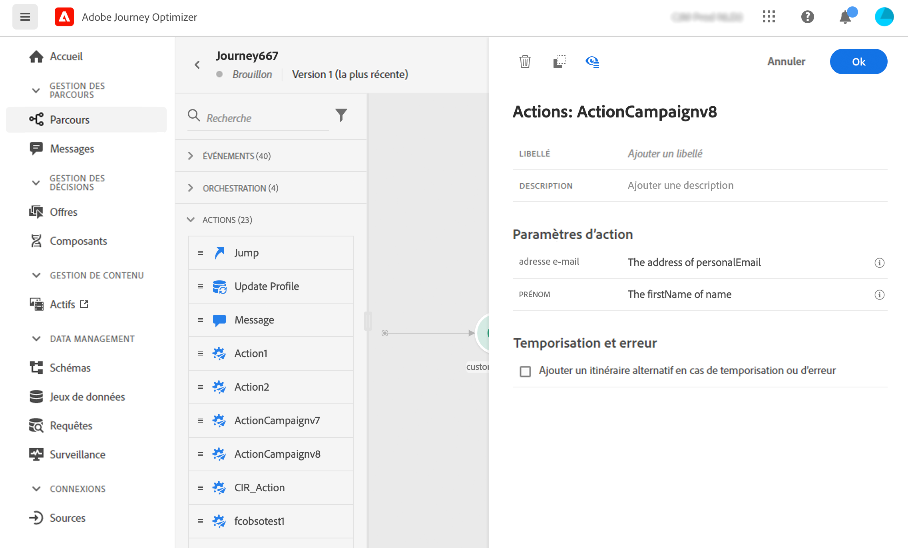

# Actions d’Adobe Campaign v7/v8 {#using_campaign_v7-v8}

>[!CONTEXTUALHELP]
>id="ajo_journey_action_custom_acc"
>title="Actions personnalisées"
>abstract="Une intégration est disponible si vous disposez d’Adobe Campaign v7 ou v8. Elle permet d’envoyer des e-mails, des notifications push et des SMS à l’aide des fonctionnalités de messagerie transactionnelle d’Adobe Campaign."

Une intégration est disponible si vous disposez d&#39;Adobe Campaign v7 ou v8. Elle permet d&#39;envoyer des e-mails, des notifications push et des SMS à l&#39;aide des fonctionnalités de messagerie transactionnelle d&#39;Adobe Campaign.

La connexion entre les instances Journey Optimizer et Campaign est configurée par Adobe au moment de l’approvisionnement. Contactez Adobe.

Pour que cela fonctionne, vous devez configurer une action dédiée. Reportez-vous à cette [section](../action/acc-action.md).

Un cas d&#39;utilisation complet est présenté dans cette [section](../building-journeys/ajo-ac.md).

1. Concevez votre parcours en commençant par un événement. Consultez cette [section](../building-journeys/journey.md).
1. Dans la section **Action** de la palette, sélectionnez une action Campaign et ajoutez-la à votre parcours.
1. Dans les **paramètres d’action**, tous les champs attendus dans la payload du message s’affichent. Vous devez faire correspondre chacun de ces champs avec celui que vous souhaitez utiliser, et ce, depuis l’événement ou la source de données. Cette opération est similaire aux actions personnalisées. Reportez-vous à cette [section](../building-journeys/using-custom-actions.md).

