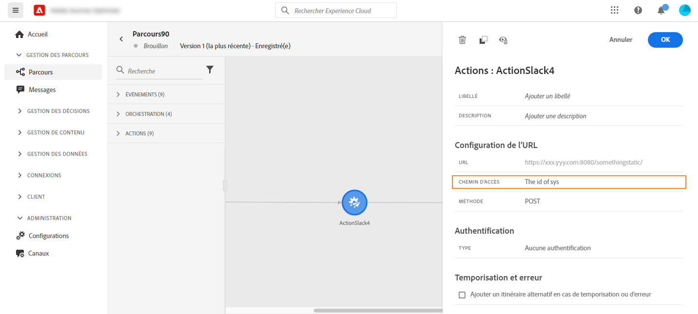
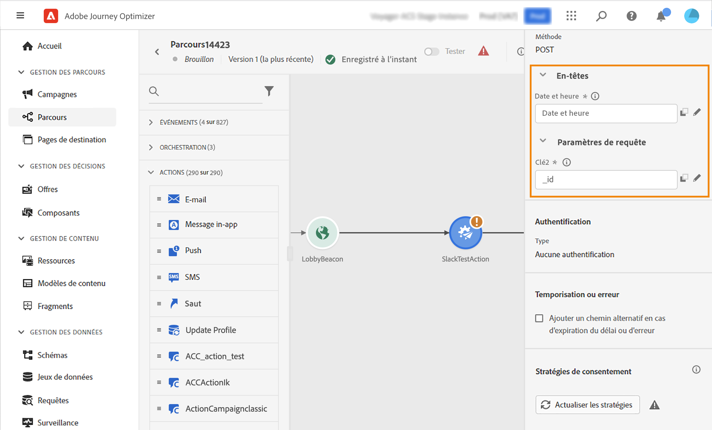

# Utiliser des actions personnalisées {#use-custom-actions}

>[!BEGINSHADEBOX]

**Sur cette page :** découvrez comment utiliser des actions personnalisées pour connecter un parcours à un système tiers par le biais d’un appel de l’API REST avec une payload JSON, tout en appliquant des politiques de gouvernance des données et de consentement.

>[!ENDSHADEBOX]

>[!CONTEXTUALHELP]
>id="ajo_journey_action_custom"
>title="Actions personnalisées"
>abstract="Les actions personnalisées vous permettent de configurer la connexion d&#39;un système tiers pour envoyer des messages ou des appels d&#39;API. Une action peut être configurée avec n’importe quel service de n’importe quel fournisseur qui peut être appelé via une API REST avec une payload au format JSON."

Utilisez des actions personnalisées pour permettre la connexion à un système tiers et envoyer des messages ou des appels API. Une action peut être configurée avec n’importe quel service de n’importe quel fournisseur qui peut être appelé via une API REST avec une payload au format JSON.

En savoir plus sur les actions personnalisées dans [cette section](../action/action.md).

Découvrez comment créer et configurer une action personnalisée sur [cette page](../action/about-custom-action-configuration.md).

Découvrez comment utiliser les réponses d’appel API des actions personnalisées pour la personnalisation sur [cette page](../action/action-response.md).

## Consentement et gouvernance des données {#privacy}

Dans Journey Optimizer, vous pouvez appliquer des politiques de gouvernance des données et de consentement à vos actions personnalisées, afin d’empêcher l’exportation de champs spécifiques vers des systèmes tiers ou d’exclure les clients qui n’ont pas consenti à recevoir des communications par e-mail, push ou SMS. Pour plus d’informations, consultez les pages suivantes :

* [Gouvernance des données](../action/action-privacy.md).
* [Consentement](../action/consent.md).

## Configurer des URL

Le volet de configuration de l’activité **Action personnalisée** affiche les paramètres de configuration des URL et les paramètres d’authentification configurés pour l’action personnalisée. Vous ne pouvez pas configurer la partie statique de l’URL dans le parcours, mais dans la configuration globale de l’action personnalisée. [En savoir plus](../action/about-custom-action-configuration.md).

### Chemin dynamique

Si l’URL contient un chemin dynamique, spécifiez le chemin dans le champ **[!UICONTROL Chemin]**.

Pour concaténer des champs et des chaînes de texte brut, utilisez les fonctions String ou le signe plus (+) dans l’éditeur d’expression avancé. Placez les chaînes de texte brut entre guillemets simples (’) ou entre guillemets doubles (&quot;). [En savoir plus](expression/expressionadvanced.md).

Ce tableau présente un exemple de configuration :

| Champ | Valeur |
| --- | --- |
| URL | `https://xxx.yyy.com:8080/somethingstatic/` |
| Chemin | `The _id + '/messages'` |

L’URL concaténée se présente comme suit :

`https://xxx.yyy.com:8080/somethingstatic/`\&lt;ID>`/messages`

### En-têtes et paramètres de requête {#headers}

La section **[!UICONTROL Configuration de l’URL]** affiche les champs d’en-tête dynamique et de paramètres de requête, mais pas les champs constants. Les champs d’en-tête dynamique et de paramètres de requête sont définis comme variables dans l’écran de configuration des actions. [En savoir plus](../action/about-custom-action-configuration.md#url-configuration)

Pour spécifier la valeur des champs d’en-tête dynamique et de paramètres de requête, cliquez dans le champ ou sur l’icône représentant un crayon et sélectionnez le champ de votre choix.

## Paramètres d’action

Dans la section **[!UICONTROL Paramètres d’action]**, vous verrez les paramètres de message définis comme _« Variable »_. Pour ces paramètres, vous pouvez définir où obtenir ces informations (événements, sources de données, par exemple), transmettre des valeurs manuellement ou utiliser l’éditeur d’expression avancé pour des cas d’utilisation avancés. Les cas d’utilisation avancés peuvent être la manipulation de données et d’autres utilisations de la fonction. Voir cette [page](expression/expressionadvanced.md).

+++ Référence des connaissances sur l’IA

Cette section contient des connaissances structurées destinées à soutenir l’interprétation, la récupération et la réponse aux questions liées à ce sujet.

Pour une compréhension totale, ces informations doivent être combinées avec la documentation de cette page. Aucune des sources n’est conçue pour être autonome. La page décrit la fonctionnalité, tandis que cette section fournit un contexte supplémentaire qui permet de clarifier la terminologie, l’intention, l’applicabilité et les contraintes.

* **TL;DR:** Cette page explique comment ajouter et configurer une activité d’action personnalisée dans un parcours pour appeler une API REST tierce avec une payload JSON, y compris la configuration d’URL, le mappage des paramètres d’en-tête/de requête, le mappage des paramètres d’action et l’application de la gouvernance des données et des politiques de consentement.

**Intentions:**

* Ajoutez une activité d’action personnalisée à un parcours pour envoyer des données à un système tiers via l’API REST
* Configurez un chemin URL dynamique en concaténant des champs et du texte statique dans l’éditeur d’expression
* Mapper des valeurs d’en-tête dynamique et de paramètres de requête à partir d’événements de parcours ou de sources de données
* Mappez les paramètres d’action (définis comme Variable) aux champs d’événement, aux champs de source de données ou aux valeurs statiques.
* Appliquez la gouvernance des données et les politiques de consentement pour contrôler les données exportées via des actions personnalisées

**Glossaire:**

* **Action personnalisée** : activité d’action de parcours qui appelle un point d’entrée externe de l’API REST avec une payload au format JSON pour intégrer des systèmes tiers *(spécifiques au produit)*
* **Chemin dynamique** : partie variable de l’URL de l’action personnalisée définie par exécution à l’aide de champs du *de contexte de parcours (spécifique au produit)*
* **Paramètres d’action** : champs de payload de message définis comme « Variable » dans la configuration de l’action personnalisée, mappés sur les données de parcours au niveau du parcours *(spécifiques au produit)*

**Mécanismes de sécurisation :**

* La partie statique de l’URL ne peut pas être modifiée dans le parcours. Elle doit être définie dans la configuration globale d’action personnalisée.
* Les champs d’en-tête dynamique et de paramètres de requête sont définis comme variables dans l’écran de configuration des actions, et non dans le parcours.
* Des politiques de gouvernance des données et de consentement peuvent être appliquées pour empêcher l’exportation de champs spécifiques ou pour exclure les clients et clientes non consentants.

**Terminologie:**

* Nom canonique : Action personnalisée — Acronyme : none — variantes : actions personnalisées, action tierce
* Synonymes : « action parameters » = « message parameters defined as Variable »
* Ne pas confondre : « partie d’URL statique » (définie dans la configuration d’action globale, non modifiable dans le parcours) ≠ « chemin dynamique » (défini dans le parcours par exécution)

**FAQ:**

* **Q : Puis-je modifier l’URL de base d’une action personnalisée dans le parcours ?** — Non, seule la partie de chemin dynamique peut être définie dans le parcours ; la partie statique de l’URL est configurée dans la configuration globale d’action personnalisée.
* **Q : Comment créer un chemin d’URL dynamique qui inclut un identifiant de profil ?** — Utilisez le champ Chemin avec l&#39;éditeur d&#39;expression avancé pour concaténer le champ ID avec des chaînes statiques, par exemple : `_id + '/messages'`.
* **Q : Comment appliquer des règles de consentement à une action personnalisée ?** — Configurez les politiques de consentement sur l’action personnalisée pour exclure les clients qui n’ont pas consenti à recevoir la communication appropriée. Reportez-vous à la page Consentement pour plus de détails.
* **Q : Où mapper les valeurs des en-têtes dynamiques ?** — Dans la section Configuration de l&#39;URL du volet d&#39;activité, cliquez dans le champ d&#39;en-tête dynamique ou utilisez l&#39;icône en forme de crayon pour sélectionner le champ de votre choix parmi les événements ou les sources de données.
* **Q : Quels types de valeurs puis-je affecter aux paramètres d’action ?** — Vous pouvez mapper des paramètres à des champs d&#39;événement ou de source de données, transmettre des valeurs manuellement ou utiliser l&#39;éditeur d&#39;expression avancé pour la manipulation de données.

+++
