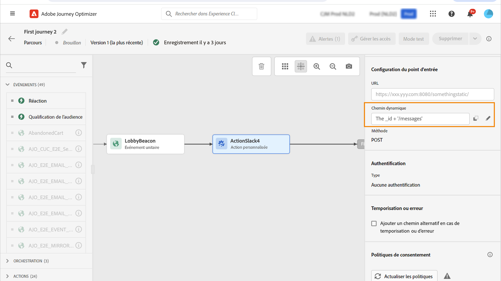

# Utiliser des actions personnalisées {#use-custom-actions}

>[!CONTEXTUALHELP]
>id="ajo_journey_action_custom"
>title="Actions personnalisées"
>abstract="Les actions personnalisées vous permettent de configurer la connexion d&#39;un système tiers pour envoyer des messages ou des appels d&#39;API. Une action peut être configurée avec n’importe quel service de n’importe quel fournisseur qui peut être appelé via une API REST avec une payload au format JSON."

Utilisez des actions personnalisées pour permettre la connexion à un système tiers et envoyer des messages ou des appels API. Une action peut être configurée avec n’importe quel service de n’importe quel fournisseur qui peut être appelé via une API REST avec une payload au format JSON.

En savoir plus sur les actions personnalisées dans [cette section](../action/action.md).

Découvrez comment créer et configurer une action personnalisée sur [cette page](../action/about-custom-action-configuration.md).

Découvrez comment utiliser les réponses d’appel API des actions personnalisées pour la personnalisation sur [cette page](../action/action-response.md).

## Consentement et gouvernance des données {#privacy}

Dans Journey Optimizer, vous pouvez appliquer des politiques de gouvernance des données et de consentement à vos actions personnalisées, afin d’empêcher l’exportation de champs spécifiques vers des systèmes tiers ou d’exclure les clients qui n’ont pas consenti à recevoir des communications par e-mail, push ou SMS. Pour plus d’informations, consultez les pages suivantes :

* [Gouvernance des données](../action/action-privacy.md).
* [Consentement](../action/consent.md).

## Configurer des URL

Le volet de configuration de l’activité **Action personnalisée** affiche les paramètres de configuration des URL et les paramètres d’authentification configurés pour l’action personnalisée. Vous ne pouvez pas configurer la partie statique de l’URL dans le parcours, mais dans la configuration globale de l’action personnalisée. [En savoir plus](../action/about-custom-action-configuration.md).

### Chemin dynamique

Si l’URL contient un chemin dynamique, spécifiez le chemin dans le champ **[!UICONTROL Chemin]**.

Pour concaténer des champs et des chaînes de texte brut, utilisez les fonctions String ou le signe plus (+) dans l’éditeur d’expression avancé. Placez les chaînes de texte brut entre guillemets simples (’) ou entre guillemets doubles (&quot;). [En savoir plus](expression/expressionadvanced.md).

Ce tableau présente un exemple de configuration :

| Champ | Valeur |
| --- | --- |
| URL | `https://xxx.yyy.com:8080/somethingstatic/` |
| Chemin | `The _id + '/messages'` |

L’URL concaténée se présente comme suit :

`https://xxx.yyy.com:8080/somethingstatic/`\&lt;ID>`/messages`

### En-têtes et paramètres de requête {#headers}

La section **[!UICONTROL Configuration de l’URL]** affiche les champs d’en-tête dynamique et de paramètres de requête, mais pas les champs constants. Les champs d’en-tête dynamique et de paramètres de requête sont définis comme variables dans l’écran de configuration des actions. [En savoir plus](../action/about-custom-action-configuration.md#url-configuration).

Pour spécifier la valeur des champs d’en-tête dynamique et de paramètres de requête, cliquez dans le champ ou sur l’icône représentant un crayon et sélectionnez le champ de votre choix.

## Paramètres d’action

Dans la section **[!UICONTROL Paramètres d’action]**, vous verrez les paramètres de message définis comme _« Variable »_. Pour ces paramètres, vous pouvez définir où obtenir ces informations (événements, sources de données, par exemple), transmettre des valeurs manuellement ou utiliser l’éditeur d’expression avancé pour des cas d’utilisation avancés. Les cas d’utilisation avancés peuvent être la manipulation de données et d’autres utilisations de la fonction. Voir cette [page](expression/expressionadvanced.md).

