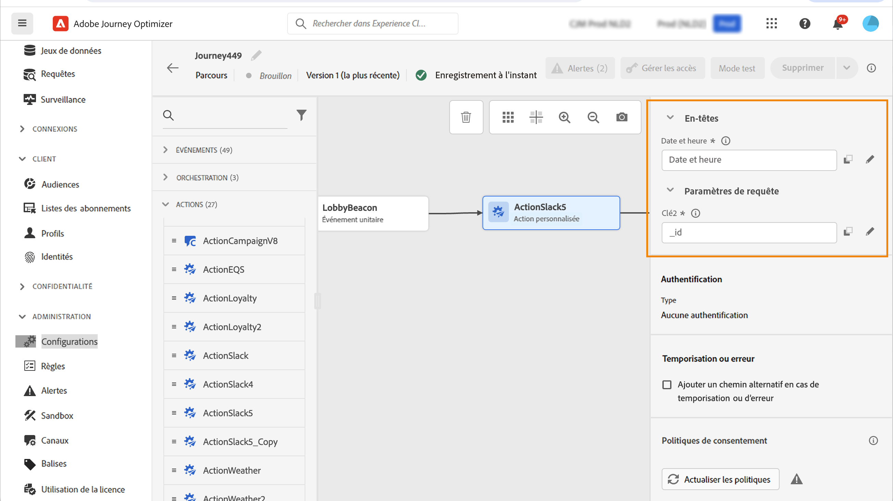

# Utilisation d’actions personnalisées {#use-custom-actions}

>[!CONTEXTUALHELP]
>id="ajo_journey_action_custom"
>title="Actions personnalisées "
>abstract="Les actions personnalisées vous permettent de configurer la connexion d&#39;un système tiers pour envoyer des messages ou des appels d&#39;API. Une action peut être configurée avec n&#39;importe quel service de n&#39;importe quel fournisseur qui peut être appelé via une API REST avec un payload au format JSON."

Les actions personnalisées vous permettent de configurer la connexion d&#39;un système tiers pour envoyer des messages ou des appels d&#39;API. Une action peut être configurée avec n&#39;importe quel service de n&#39;importe quel fournisseur qui peut être appelé via une API REST avec un payload au format JSON.

## Configurer des URL

Le volet de configuration de l’activité **Action personnalisée** affiche les paramètres de configuration des URL et les paramètres d’authentification configurés pour l’action personnalisée. Vous ne pouvez pas configurer la partie statique de l’URL dans le parcours, mais dans la configuration globale de l’action personnalisée. [En savoir plus](../action/about-custom-action-configuration.md).

### Chemin dynamique

Si l’URL contient un chemin dynamique, spécifiez le chemin dans le champ **[!UICONTROL Chemin]**.

Pour concaténer des champs et des chaînes de texte brut, utilisez les fonctions String ou le signe plus (+) dans l’éditeur d’expression avancé. Placez les chaînes de texte brut entre guillemets simples (’) ou entre guillemets doubles (&quot;). [En savoir plus](expression/expressionadvanced.md).

Ce tableau présente un exemple de configuration :

| Champ | Valeur |
| --- | --- |
| URL | `https://xxx.yyy.com:8080/somethingstatic/` |
| Chemin | `The id of marketingCampaign + '/messages'` |

L’URL concaténée se présente comme suit :

`https://xxx.yyy.com:8080/somethingstatic/`\&lt;Identifiant de campagne\>`/messages`

### En-têtes

La section **[!UICONTROL Configuration de l’URL]** affiche les champs d’en-tête dynamiques, mais pas les champs d’en-tête constants. Les champs d’en-tête dynamique sont des champs d’en-tête HTTP dont la valeur est configurée comme variable. [En savoir plus](../action/about-custom-action-configuration.md).

Si nécessaire, spécifiez la valeur des champs d’en-tête dynamique :

1. Sélectionnez l’action personnalisée dans le parcours.
1. Dans le volet de configuration, cliquez sur l’icône en forme de crayon en regard du champ d’en-tête de la section **[!UICONTROL Configuration de l’URL]**.

   

1. Sélectionnez un champ et cliquez sur **[!UICONTROL OK]**.

## Paramètres d’action

Dans la section **[!UICONTROL Paramètres d’action]**, les paramètres de message sont définis en tant que _« Variable »_. Pour ces paramètres, vous pouvez indiquer où obtenir ces informations (événements ou sources de données, par exemple), transmettre les valeurs manuellement ou utiliser l’éditeur d’expression avancé pour des cas d’utilisation plus complexes (tels qu’une manipulation de données et une autre utilisation des fonctions). Voir cette [page](expression/expressionadvanced.md).

**Rubriques connexes**

[Configurer une action](../action/about-custom-action-configuration.md)
