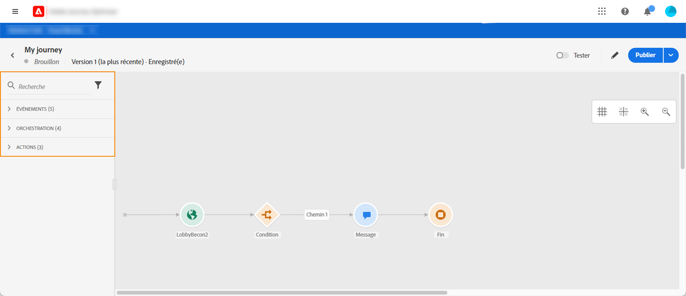
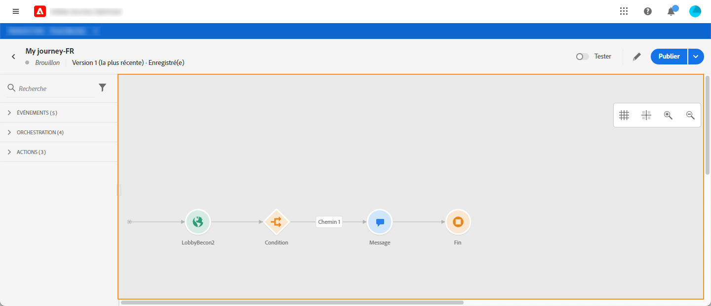
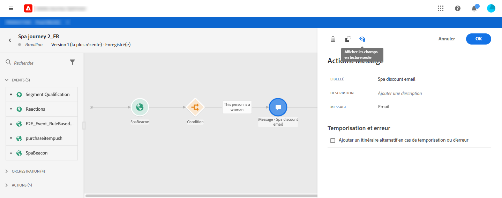
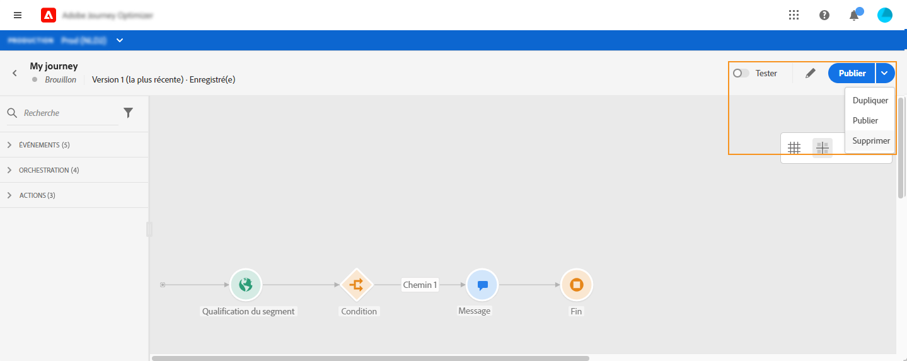
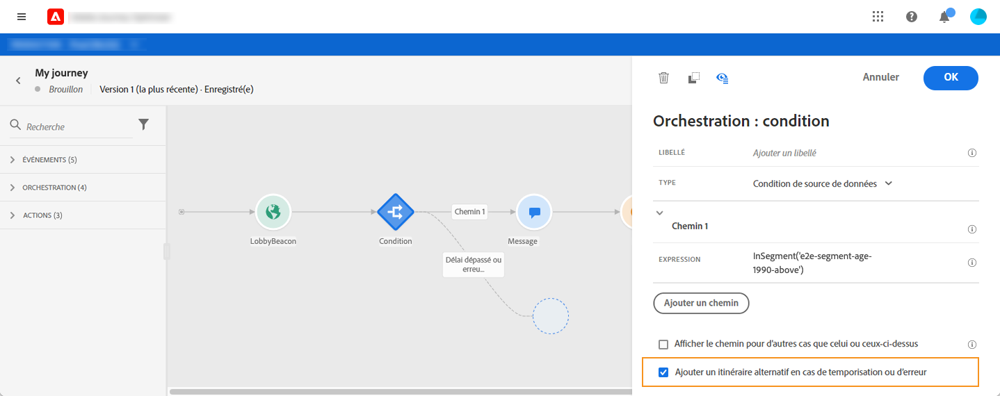
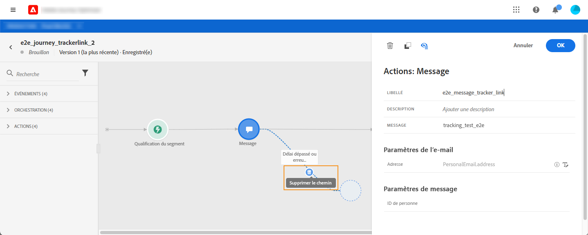
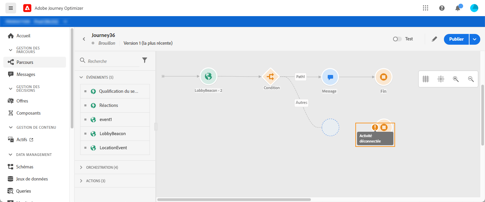
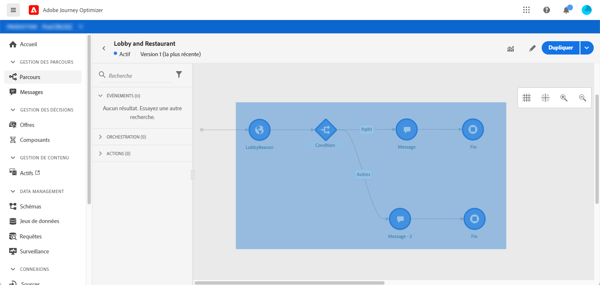
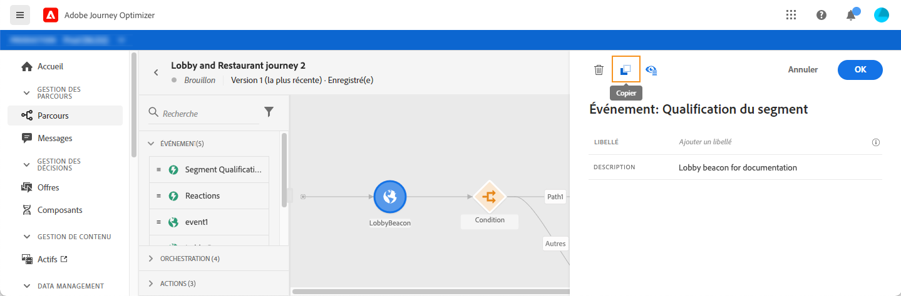
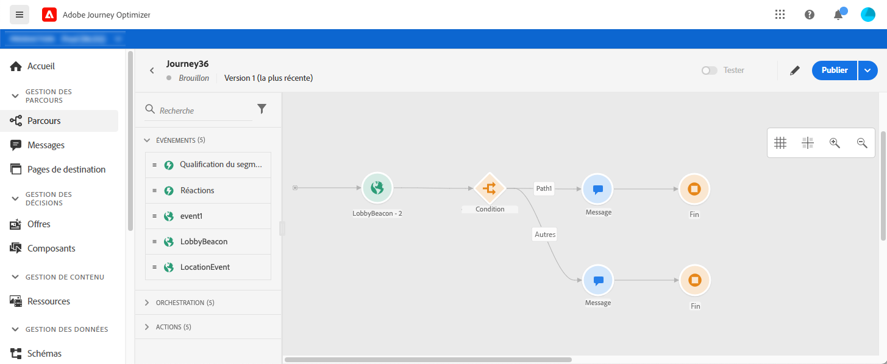

# Concevoir le parcours

L’interface de parcours vous permet de faire glisser facilement des activités de la palette vers la zone de travail. Vous pouvez également double-cliquer sur une activité pour l’ajouter dans la zone de travail à la prochaine étape disponible. Chaque activité possède un rôle et un emplacement précis dans le processus. Les activités sont séquencées. Cela signifie que lorsqu’une activité est terminée, le flux se poursuit et traite l’activité suivante, et ainsi de suite.

## Prise en main de la conception de parcours

La **palette** se situe sur la partie gauche de l’écran. Toutes les activités disponibles sont classées dans plusieurs catégories : **[!UICONTROL Événements]**, **[!UICONTROL Orchestration]** et **[!UICONTROL Actions]**. Vous pouvez développer/réduire les différentes catégories en cliquant sur leur nom. Pour utiliser une activité dans votre parcours, faites-la glisser de la palette vers la zone de travail.

Lors du démarrage d’un nouveau parcours, les éléments qui ne peuvent pas être déposés dans la zone de travail comme première étape sont masqués. Cela concerne toutes les actions, l’activité de la condition, l’attente et la réaction.

L’icône **[!UICONTROL Filtrer les éléments]** dans le coin supérieur gauche vous permet d’afficher les filtres suivants :

* **Afficher uniquement les éléments disponibles** : masquez ou affichez les éléments indisponibles dans la palette, par exemple les événements qui utilisent un espace de noms différent de ceux utilisés dans votre parcours. Par défaut, les éléments non disponibles sont masqués. Si vous choisissez de les afficher, ils apparaîtront grisés.

* **Afficher uniquement les éléments récents** : ce filtre vous permet d’afficher uniquement les cinq derniers événements et actions utilisés, en plus de ceux d’usine. Il est spécifique à chaque utilisateur. Par défaut, tous les éléments s’affichent.

Vous pouvez également utiliser le champ **[!UICONTROL Rechercher]**.

La **zone de travail** est la zone centrale du concepteur de parcours. C’est là que vous pouvez déposer vos activités et les configurer. Cliquez sur une activité de la zone de travail pour la configurer. Le volet de configuration de l’activité s’ouvre alors sur le côté droit.

Le **volet de configuration des activités** s’affiche lorsque vous cliquez sur une activité dans la palette. Renseignez les champs obligatoires. Cliquez sur l’icône **[!UICONTROL Supprimer]** pour supprimer l’activité. Cliquez sur **[!UICONTROL Annuler]** pour annuler les modifications ou sur **[!UICONTROL OK]** pour les confirmer. Vous pouvez également supprimer des activités en les sélectionnant, puis en appuyant sur la touche Retour arrière. Appuyez sur la touche d’échappement pour fermer le volet de configuration des activités.

Par défaut, les champs en lecture seule sont masqués. Pour les afficher, cliquez sur l’icône **Afficher les champs en lecture seule** en haut à gauche du volet de configuration de l’activité.

Selon le statut du parcours, vous pouvez effectuer différentes actions à l’aide des boutons disponibles dans le coin supérieur droit : **[!UICONTROL Publier]**, **[!UICONTROL Dupliquer]**, **[!UICONTROL Supprimer]**, afficher les **[!UICONTROL Propriétés du parcours]** et effectuer un **[!UICONTROL Test]**. Ces boutons s’affichent lorsqu’aucune activité n’est sélectionnée. Certains boutons s’affichent en fonction du contexte. Le bouton de journal du mode test s’affiche lorsque le mode test est activé.

## Démarrage de votre parcours

Lorsque vous concevez votre parcours, la première question à se poser est : comment les profils vont-ils entrer dans le parcours ? Il existe deux possibilités :

**Débuter avec un événement** : lorsqu&#39;un parcours est prêt à écouter les événements, les particuliers entrent dans le parcours **de façon unitaire** en temps réel. Les messages inclus dans votre parcours sont envoyés à la personne qui arrive actuellement dans le parcours. [En savoir plus sur les événements](../event/about-events.md)

**Débuter avec une Lecture de segment** : vous pouvez définir votre parcours pour écouter les segments Adobe Experience Platform. Dans ce cas, toutes les particuliers appartenant au segment spécifié entrent dans le parcours. Les messages inclus dans votre parcours sont envoyés aux particuliers appartenant au segment. [En savoir plus sur la lecture de segments](read-segment.md).

## Définir les étapes suivantes

Après votre premier événement ou votre première lecture de segment, vous pouvez combiner les différentes activités afin de créer vos scénarios cross-canal en plusieurs étapes. Choisissez, dans la palette, les étapes dont vous avez besoin.

**Événements**

Lorsque vous débutez votre parcours avec un événement, le parcours est déclenché à la réception de l&#39;événement. La personne suivra ensuite, individuellement, les étapes suivantes définies dans votre parcours.

Vous pouvez ajouter **plusieurs événements** dans votre parcours, à condition qu’ils utilisent le même espace de noms. Les événements sont configurés au préalable. [En savoir plus sur les événements](about-journey-activities.md#event-activities)

Vous pouvez également ajouter un événement de **réaction** après un message pour réagir aux données de suivi liées au message. Cela vous permet, par exemple, d’envoyer un autre message si le particulier a ouvert le message précédent ou cliqué dessus. En savoir plus dans cette [section](reaction-events.md).

L’activité d’événement **Qualification du segment**, vous permet de faire entrer des particuliers ou leur permettre de progresser dans un parcours en fonction des entrées et des sorties de segments Adobe Experience Platform. Vous pouvez faire entrer tous les nouveaux clients argent dans un parcours et envoyer des messages personnalisés. En savoir plus dans cette [section](segment-qualification-events.md).

**Orchestration**

Dans les activités d&#39;orchestration, vous trouverez l&#39;activité **Lecture de segment** qui vous permet de définir votre parcours pour écouter un segment Adobe Experience Platform. [En savoir plus sur l’activité Lecture de segment](read-segment.md).

Les autres activités vous permettent d’ajouter des conditions à votre parcours afin de définir plusieurs chemins, de définir un délai d’attente avant l’exécution de l’activité suivante, ou de terminer votre parcours. En savoir plus dans cette [section](about-journey-activities.md#orchestration-activities).

**Actions**

Vous trouverez ici l&#39;activité **Message** qui vous permet d&#39;inclure un message conçu dans [!DNL Journey Optimizer]. [En savoir plus sur l&#39;activité Message](journeys-message.md)

Vous trouverez également les actions personnalisées que vous avez configurées pour envoyer des messages avec des systèmes tiers. En savoir plus dans cette [section](about-journey-activities.md#action-activities).

## Utilisation des chemins dans la zone de travail {#paths}

Plusieurs activités (**[!UICONTROL Condition]**, **[!UICONTROL Action]**, etc.) vous permettent de définir une action de remplacement en cas d’erreur ou de temporisation. Dans le volet de configuration des activités, cochez la case **[!UICONTROL Ajouter un itinéraire alternatif en cas de temporisation ou d’erreur]**. Un autre chemin est alors ajouté après l’activité. La temporisation est définie dans les propriétés du parcours (voir [cette page](../building-journeys/journey-gs.md#change-properties) par un utilisateur administrateur. Par exemple, si l’envoi d’un e-mail prend trop de temps ou génère une erreur, vous pouvez décider d’envoyer un SMS.

Différentes activités (événement, action, attente) peuvent être suivies de plusieurs chemins. Pour ce faire, placez votre curseur sur l’activité en question et cliquez ensuite sur le symbole « + ». Seules les activités d’événement et d’attente peuvent être définies en parallèle. Si plusieurs événements sont définis en parallèle, le chemin choisi est celui du premier événement qui se produit.

Lorsque vous écoutez un événement, nous vous recommandons de ne pas attendre indéfiniment qu’il se produise. Notez qu’il s’agit d’une bonne pratique et que cela n’est, en aucun cas, obligatoire. Si vous souhaitez limiter l’écoute d’un ou de plusieurs événements à une période bien définie, vous devez placer en parallèle un ou plusieurs événements et une activité d’attente. Consultez [cette section](../building-journeys/general-events.md#events-specific-time).

Pour supprimer le chemin d’accès, placez votre curseur sur celui-ci et cliquez sur l’icône **[!UICONTROL Supprimer la flèche]**.

Dans la zone de travail, un avertissement s’affiche lorsque deux activités sont déconnectées. Placez le curseur sur l’icône d’avertissement pour afficher le message d’erreur. Pour résoudre le problème, il suffit de déplacer l’activité déconnectée et de la relier à l’activité précédente.

## Opérations de copier/coller d’activités {#copy-paste}

Vous pouvez copier une ou plusieurs activités d’un parcours et les coller soit dans le même parcours, soit dans un autre. C’est un gain de temps si vous souhaitez réutiliser de nombreuses activités déjà configurées lors d’un parcours précédent.

**Remarques importantes**

* Vous pouvez effectuer une opération copier/coller dans différents onglets et navigateurs. Vous ne pouvez copier/coller des activités que dans la même instance.
* Vous ne pouvez pas copier/coller un événement si le parcours de destination comporte un événement utilisant un autre espace de noms.
* Les activités collées peuvent référencer des données qui n’existent pas dans le parcours de destination, par exemple si vous copiez/collez des données dans différents environnements Sandbox. Recherchez toujours des erreurs et effectuez les ajustements nécessaires.
* Notez que vous ne pouvez pas annuler une action. Pour supprimer des activités collées, vous devez les sélectionner et les supprimer. Vous devez donc veiller, avant de les copier, à ne sélectionner que les activités dont vous avez besoin.
* Vous pouvez copier des activités issues de n’importe quel parcours, même celles qui sont en lecture seule.
* Vous pouvez sélectionner n’importe quelle activité, même celles qui ne sont pas liées. Les activités liées resteront liées après avoir été collées.

Pour copier/coller des activités, procédez comme suit :

1. Ouvrez un parcours.
1. Sélectionnez les activités à copier en déplaçant la souris tout en cliquant dessus. Vous pouvez également cliquer sur chaque activité tout en appuyant sur la touche **Ctrl/Commande**. Utilisez **Ctrl/Commande + A** pour sélectionner toutes les activités.
   
1. Appuyez sur **Ctrl/Commande + C**.
Si vous ne souhaitez copier qu’une seule activité, vous pouvez cliquer dessus et utiliser l’icône **Copier** en haut à gauche du volet de configuration de l’activité.
   
1. Dans un parcours quelconque, appuyez sur **Ctrl/Commande + V** pour coller les activités sans les lier à un nœud existant. Les activités collées sont placées dans le même ordre. Une fois collées, les activités restent sélectionnées pour que vous puissiez facilement les déplacer. Vous pouvez également placer le curseur sur un espace réservé vide et cliquer sur **Ctrl/Commande + V**. Les activités collées seront liées au nœud.
   
