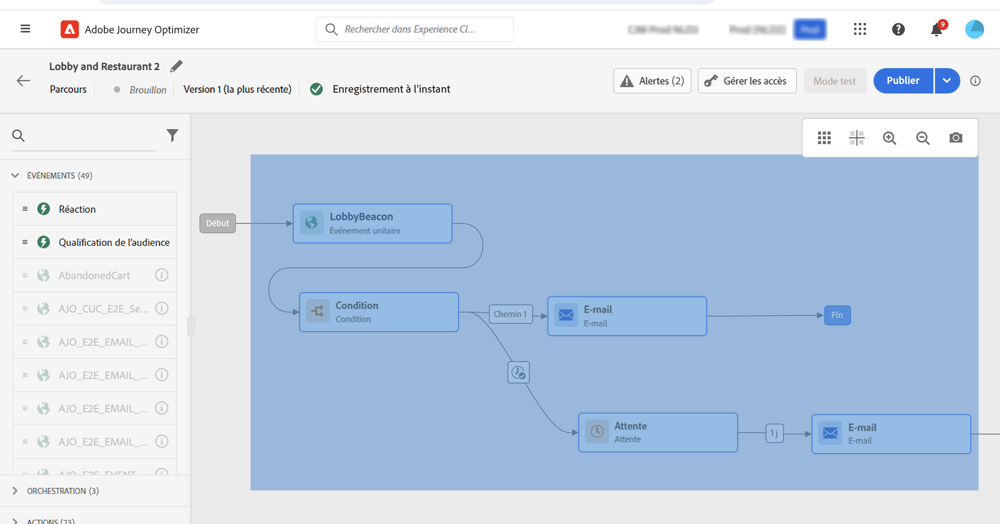
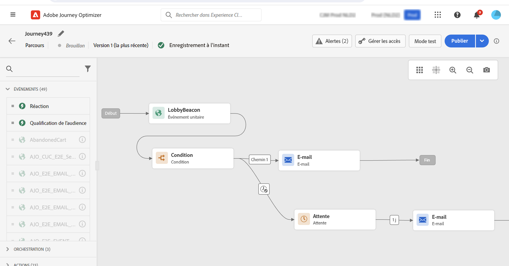

# Concevoir votre parcours {#design-your-journey}

>[!CONTEXTUALHELP]
>id="ajo_journey_canvas"
>title="Concevoir votre parcours"
>abstract="L’interface de parcours vous permet de faire glisser facilement des activités de la palette vers la zone de travail. Vous pouvez également double-cliquer sur une activité pour l’ajouter dans la zone de travail à l’étape suivante disponible."

Adobe Journey Optimizer comprend un canevas d’orchestration omnicanal qui permet aux marketeurs d’harmoniser la portée marketing avec l’engagement client individuel. L’interface utilisateur vous permet de faire glisser facilement des activités de la palette vers la zone de travail afin de créer votre parcours. Vous pouvez également double-cliquer sur une activité pour l’ajouter dans la zone de travail, à l’étape suivante disponible.

Les activités d’événement, d’orchestration et d’action ont un rôle et un rôle spécifiques dans le processus. L’ordre des activités est le suivant : lorsqu’une activité est terminée, le flux se poursuit et traite l’activité suivante, etc.

## Prise en main de la conception de parcours {#gs-journey-design}

Le **palette** se trouve sur le côté gauche de l’écran. Toutes les activités disponibles sont réparties en plusieurs catégories : [Événements](#jo-event), [Orchestration](#jo-orch) et [Actions](#jo-actions). Vous pouvez développer/réduire les différentes catégories en cliquant sur leur nom. Pour utiliser une activité dans votre parcours, faites-la glisser de la palette vers la zone de travail.

Lors du démarrage d’un nouveau parcours, les éléments qui ne peuvent pas être déposés dans la zone de travail comme première étape sont masqués. Cela concerne toutes les actions, l’activité de condition, l’attente et la réaction.

Le **[!UICONTROL Filter items]** dans le coin supérieur gauche, vous pouvez afficher les filtres suivants :

* **Afficher uniquement les éléments disponibles**: masquez ou affichez les éléments indisponibles dans la palette, par exemple les événements qui utilisent un espace de noms différent de ceux utilisés dans votre parcours. Par défaut, les éléments non disponibles sont masqués. Si vous choisissez de les afficher, elles apparaissent grisées.

* **Afficher uniquement les éléments récents**: ce filtre permet d’afficher uniquement les cinq derniers événements et actions utilisés, en plus des événements prêts à l’emploi. Cela est spécifique à chaque utilisateur. Par défaut, tous les éléments sont affichés.

Vous pouvez également utiliser la variable **[!UICONTROL Search]** champ . Seuls les événements et les actions sont filtrés.

Le **canevas** est la zone centrale du concepteur de parcours. C’est dans cette zone que vous pouvez déposer vos activités et les paramétrer. Cliquez sur une activité de la zone de travail pour la configurer. Le volet de configuration des activités s’ouvre alors sur le côté droit.

Le **volet de configuration des activités** s’affiche lorsque vous cliquez sur une activité de la palette. Renseignez les champs obligatoires. Cliquez sur le bouton **[!UICONTROL Delete]** pour supprimer l’activité. Cliquez sur **[!UICONTROL Cancel]** pour annuler les modifications ou **[!UICONTROL Ok]** pour confirmer. Pour supprimer des activités, vous pouvez également sélectionner une ou plusieurs activités et appuyer sur la touche Retour arrière. Appuyez sur la touche Échap pour fermer le volet de configuration de l’activité.

Par défaut, les champs en lecture seule sont masqués. Pour afficher les champs en lecture seule, cliquez sur le bouton **Afficher les champs en lecture seule** en haut à gauche du volet de configuration des activités. Ce paramètre s’applique à toutes les activités de tous les parcours.

Selon l’état du parcours, vous pouvez effectuer différentes actions à l’aide des boutons disponibles dans le coin supérieur droit : **[!UICONTROL Publish]**, **[!UICONTROL Duplicate]**, **[!UICONTROL Delete]**, **[!UICONTROL Journey properties]**, **[!UICONTROL Test]**. Ces boutons s’affichent lorsqu’aucune activité n’est sélectionnée. Certains boutons s’affichent de manière contextuelle. Le bouton de journal du mode test s’affiche lorsque le mode test est activé.

## Commencer votre parcours {#start-your-journey}

Lorsque vous concevez votre parcours, la première question que vous souhaitez poser est de savoir comment les profils entreront dans le parcours. Il existe deux possibilités :

1. **Commencer par un événement**: lorsqu’un parcours est défini pour écouter les événements, les individus y participent **unitairement** en temps réel. Les messages inclus dans votre parcours sont envoyés à la personne qui y participe actuellement. [En savoir plus sur les événements](../event/about-events.md)

1. **Commencer avec un segment de lecture**: vous pouvez définir votre parcours pour écouter les segments Adobe Experience Platform. Dans ce cas, toutes les personnes appartenant au segment spécifié entrent dans le parcours. Les messages inclus dans votre parcours sont envoyés aux individus appartenant au segment. [En savoir plus sur la lecture de segments](read-segment.md).

## Définir les étapes suivantes{#define-next-steps}

Après votre premier événement ou votre premier segment de lecture, vous pouvez combiner les différentes activités pour créer vos scénarios cross-canal à plusieurs étapes. Choisissez, dans la palette, les étapes dont vous avez besoin.

### Événements{#jo-event}

Les événements sont ce qui déclenche un parcours personnalisé, tel qu’un achat en ligne. Une fois qu’une personne entre dans un parcours, elle le traverse en tant qu’individu, et aucun de deux individus ne se déplace au même rythme ou le long du même chemin.

Lorsque vous commencez votre parcours avec un événement, celui-ci est déclenché à la réception de l’événement. Chaque personne du parcours suit ensuite, individuellement, les étapes suivantes définies dans le parcours.

Vous pouvez ajouter **plusieurs événements** dans votre parcours, à condition qu’ils utilisent le même espace de noms. Les événements sont configurés au préalable. [En savoir plus sur les événements de parcours](about-journey-activities.md#event-activities)

Vous pouvez également ajouter une **Réaction** après un message pour réagir aux données de suivi liées au message. Cela vous permet, par exemple, d’envoyer un autre message si l’individu a ouvert le message précédent ou a cliqué dedans. [En savoir plus sur les événements de réaction](reaction-events.md).

Utilisation **Qualification de segment** activité d’événement pour faire entrer ou avancer des individus dans un parcours en fonction des entrées et des sorties de segments Adobe Experience Platform. Vous pouvez faire entrer tous les nouveaux clients Silver dans un parcours et envoyer des messages personnalisés. En savoir plus à ce sujet [section](segment-qualification-events.md).

### Orchestration{#jo-orch}

Les activités d’orchestration sont des conditions différentes qui permettent de déterminer l’étape suivante du parcours.

Dans les activités d’orchestration, utilisez la méthode **Lecture de segment** pour définir votre parcours afin d’écouter un segment Adobe Experience Platform. [En savoir plus sur l’activité Lecture de segment](read-segment.md).

Les autres activités vous permettent d’ajouter des conditions à votre parcours pour définir plusieurs chemins, définir un délai d’attente avant d’exécuter l’activité suivante ou terminer votre parcours. [En savoir plus sur les activités d’orchestration](about-journey-activities.md#orchestration-activities).

### Actions{#jo-actions}

Les actions sont ce que vous voulez qu’il se produise à la suite d’un déclencheur, comme l’envoi d’un message. Il s’agit du parcours que le client traverse. Il peut s’agir d’un email, d’un SMS ou d’un message push, ou d’une action tierce, telle qu’un message Slack.

Les activités d’action de canal vous permettent d’inclure un message conçu dans [!DNL Journey Optimizer]. [En savoir plus sur les activités d’action de canal](journeys-message.md)

À partir des activités d’action, utilisez des actions personnalisées pour envoyer des messages avec des systèmes tiers. [En savoir plus sur les actions personnalisées](about-journey-activities.md#action-activities).

## Ajouter des chemins alternatifs{#paths}

Vous pouvez définir une action de secours en cas d’erreur ou de dépassement de délai pour les activités de parcours suivantes : **[!UICONTROL Condition]** et **[!UICONTROL Action]**.

Pour ajouter une action de secours pour une activité, sélectionnez l’option **[!UICONTROL Add an alternative path in case of a timeout or an error]** dans les propriétés de l’activité : un autre chemin est ajouté après l’activité. Le délai d’expiration est défini par les utilisateurs administrateurs dans la variable [Propriétés du parcours](../building-journeys/journey-gs.md#change-properties). Par exemple, si l&#39;envoi d&#39;un email prend trop de temps ou est en erreur, vous pouvez décider d&#39;envoyer une notification push.

Différentes activités (événement, action, attente) permettent d&#39;ajouter plusieurs chemins. Pour ce faire, placez le curseur sur l’activité et cliquez sur le symbole &quot;+&quot;. Seules les activités d’événement et d’attente peuvent être définies en parallèle. Si plusieurs événements sont définis en parallèle, le chemin choisi est celui du premier événement qui se produit.

Lors de l’écoute d’un événement, nous vous recommandons de ne pas attendre l’événement indéfiniment. Ce n&#39;est pas obligatoire, c&#39;est juste une bonne pratique. Si vous souhaitez n’écouter qu’un ou plusieurs événements pendant une certaine période, vous devez placer un ou plusieurs événements et une activité d’attente en parallèle. Voir [cette section](../building-journeys/general-events.md#events-specific-time).

Pour supprimer le chemin, placez le curseur dessus et cliquez sur le bouton **[!UICONTROL Delete path]** icône .

Dans la zone de travail, un avertissement s’affiche lorsque deux activités sont déconnectées. Positionnez-vous sur l&#39;icône d&#39;avertissement pour afficher le message d&#39;erreur. Pour résoudre le problème, déplacez simplement l’activité déconnectée et connectez-la à l’activité précédente.

## Copier et coller des activités {#copy-paste}

Vous pouvez copier une ou plusieurs activités d’un parcours et les coller dans le même parcours ou dans un autre. Cela vous permet de gagner du temps si vous souhaitez réutiliser de nombreuses activités déjà configurées dans un parcours précédent.

**Remarques importantes**

* Vous pouvez copier/coller dans différents onglets et navigateurs. Vous pouvez uniquement copier/coller des activités dans la même instance.
* Vous ne pouvez pas copier/coller un événement si le parcours de destination comporte un événement qui utilise un autre espace de noms.
* Les activités collées peuvent référencer des données qui n’existent pas dans le parcours de destination, par exemple si vous copiez/collez des données dans différents environnements de test. Vérifiez toujours les erreurs et effectuez les ajustements nécessaires.
* N’oubliez pas que vous ne pouvez pas annuler une action. Pour supprimer les activités collées, vous devez les sélectionner et les supprimer. Par conséquent, veillez à ne sélectionner que les activités dont vous avez besoin avant de les copier.
* Vous pouvez copier des activités de n’importe quel parcours, même celles qui sont en lecture seule.
* Vous pouvez sélectionner n’importe quelle activité, même celles qui ne sont pas liées. Les activités liées restent liées après avoir été collées.

Pour copier/coller des activités, procédez comme suit :

1. Ouvrez un parcours.
1. Sélectionnez les activités à copier en déplaçant la souris tout en cliquant. Vous pouvez également cliquer sur chaque activité tout en appuyant sur la touche **Ctrl/Commande** clé. Utilisation **Ctrl/Commande + A** si vous souhaitez sélectionner toutes les activités.
   
1. Press **Ctrl/Commande + C**.
Si vous ne souhaitez copier qu’une seule activité, vous pouvez cliquer dessus et utiliser la variable **Copier** en haut à gauche du volet de configuration des activités.
   
1. Dans n’importe quel parcours, appuyez sur **Ctrl/Commande + V** pour coller les activités sans les lier à un noeud existant. Les activités collées sont placées dans le même ordre. Une fois collées, les activités restent sélectionnées afin que vous puissiez facilement les déplacer. Vous pouvez également placer le curseur sur un espace réservé vide et appuyer sur **Ctrl/Commande + V**. Les activités collées seront liées au noeud .
   
