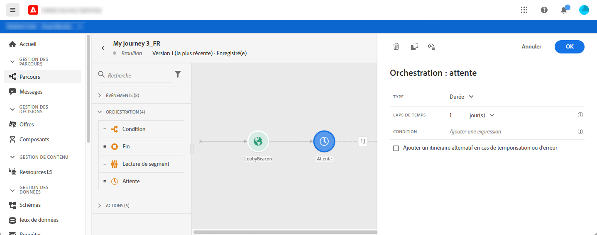
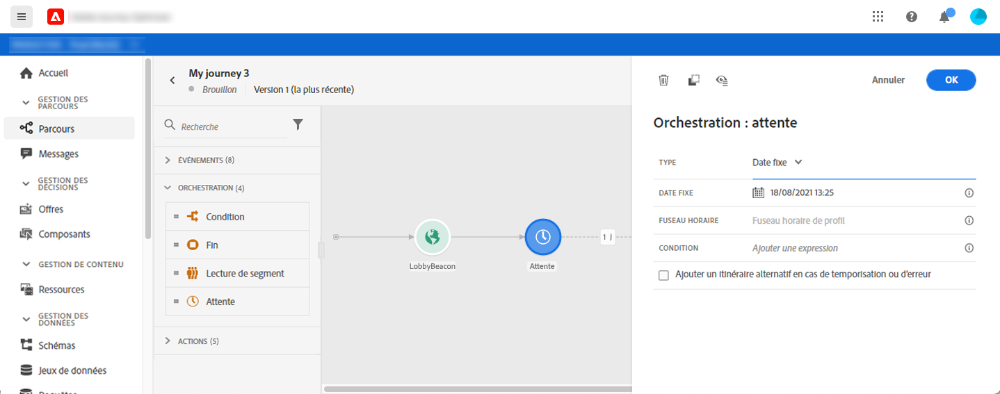
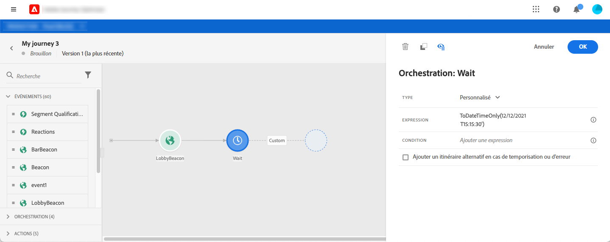

# Activité d’attente {#section_rlm_nft_dgb}


Si vous souhaitez attendre avant d’exécuter l’activité suivante dans le chemin d’accès, vous pouvez utiliser une activité **[!UICONTROL Wait]**. Il vous permet de définir le moment d’exécution de la prochaine activité. Quatre options sont disponibles :

* [Durée](#duration)
* [Date fixe](#fixed_date)
* [Personnalisé](#custom)

<!--* [Email send time optimization](#email_send_time_optimization)-->

## A propos de l’activité d’attente {#about_wait}

Voici comment les attentes sont hiérarchisées lorsque vous utilisez plusieurs attentes en parallèle. S’ils disposent de la même configuration temporelle et d’une condition différente, mais qui se chevauchent, l’attente placée ci-dessus sera celle qui sera prioritaire. Par exemple, la condition de la première attente est &quot;être une femme&quot; et la condition de la seconde attente en parallèle est &quot;être un VIP&quot;. La première activité d&#39;attente sera prioritaire

Notez également que si deux attentes différentes sont en parallèle, celle qui se produit en premier sera hiérarchisée, quelle que soit sa position verticale. Par exemple, si une attente d’une heure est supérieure et une attente de 30 minutes inférieure, après 30 minutes, l’attente de 30 minutes est traitée.

Vous pouvez définir une condition si vous souhaitez limiter l’attente à une certaine population.

>[!NOTE]
>
>La durée d’attente maximale est de 30 jours.
>
>En mode test, le paramètre **[!UICONTROL Durée d’attente dans test]** vous permet de définir la durée de chaque activité d’attente. La durée par défaut est de 10 secondes. Vous obtiendrez ainsi rapidement les résultats des tests. Voir [cette page](../building-journeys/testing-the-journey.md)

## Durée d’attente{#duration}

Sélectionnez la durée d’attente avant l’exécution de l’activité suivante.



## Date d’attente fixe{#fixed_date}

Sélectionnez la date d’exécution de l’activité suivante.



## Attente personnalisée {#custom}

Cette option vous permet de définir une date personnalisée, par exemple le 12 juillet 2020 à 17 heures, à l’aide d’une expression avancée basée sur un champ provenant d’un événement ou d’une source de données. Il ne vous permet pas de définir une durée personnalisée, par exemple, 7 jours. L’expression de l’éditeur d’expressions doit fournir un format dateTimeOnly. Voir [cette page](https://experienceleague.adobe.com/docs/journeys/using/building-advanced-conditions-journeys/expressionadvanced.html). Pour plus d’informations sur le format dateTimeOnly, voir [cette page](https://experienceleague.adobe.com/docs/journeys/using/building-advanced-conditions-journeys/syntax/data-types.html).

>[!NOTE]
>
>Vous pouvez exploiter une expression dateTimeOnly ou utiliser une fonction pour effectuer une conversion en dateTimeOnly. Par exemple : ```toDateTimeOnly(@{Event.offerOpened.activity.endTime})```, le champ du événement se présente sous la forme 2016-08-12T09:46:06Z.
>
>Le **fuseau horaire** est attendu dans les propriétés de votre parcours. Par conséquent, il n&#39;est pas possible aujourd&#39;hui de l&#39;interface à pointer directement à un horodatage ISO-8601 complet de mélange temps et fuseau horaire décalé comme 2016-08-12T09:46:06.982-05. Voir [cette page](../building-journeys/timezone-management.md).



<!--## Email send time optimization{#email_send_time_optimization}

>[!CAUTION]
>
>The email send time optimization capability is only available to customers who use the [Adobe Experience Platform Data Connector](https://docs.adobe.com/content/help/en/campaign-standard/using/developing/mapping-campaign-and-aep-data/aep-about-data-connector.html).

This type of wait uses a score calculated in Adobe Experience Platform. The score calculates the propensity to click or open an email in the future based on past behavior. Note that the algorithm calculating the score needs a certain amount of data to work. As a result, when it does not have enough data, the default wait time will apply. At publication time, you’ll be notified that the default time applies.

>[!NOTE]
>
>The first event of your journey must have a namespace.
>
>This capability is only available after an **[!UICONTROL Email]** activity. You need to have Adobe Campaign Standard.

1. In the **[!UICONTROL Amount of time]** field, define the number of hours to consider to optimize email sending.
1. In the **[!UICONTROL Optimization type]** field, choose if the optimization should increase clicks or opens.
1. In the **[!UICONTROL Default time]** field, define the default time to wait if the predictive send time score is not available.

    >[!NOTE]
    >
    >Note that the send time score can be unavailable because there is not enough data to perform the calculation. In this case, you will be informed, at publication time, that the default time applies.

-->
