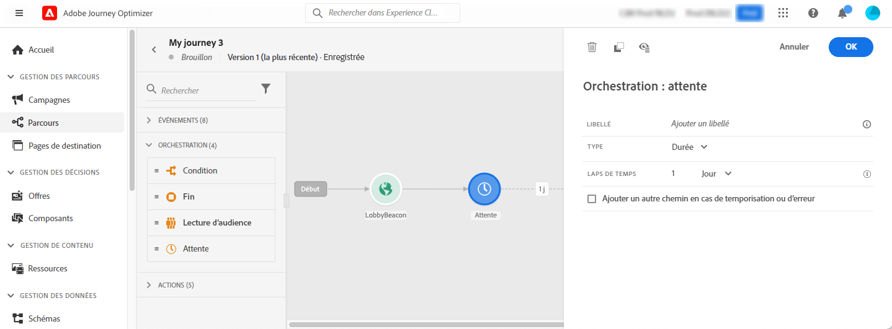
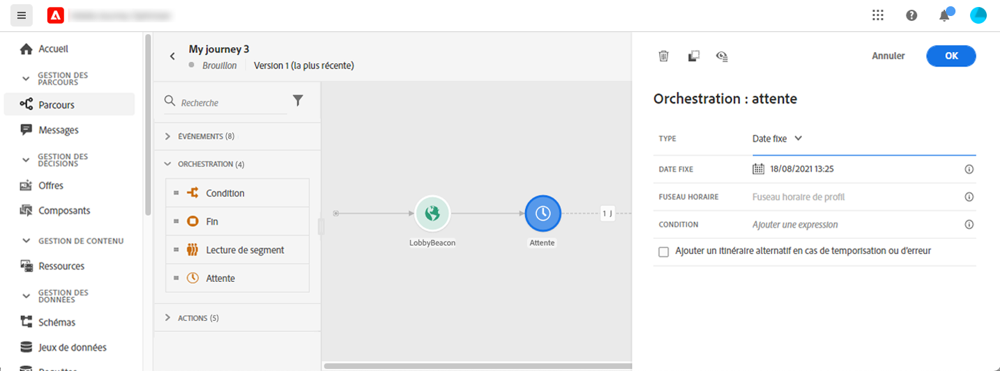
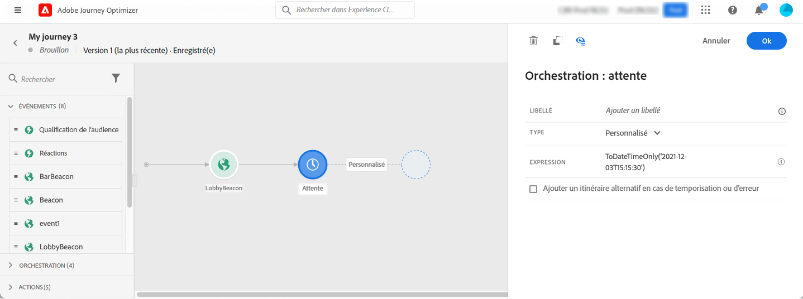

# Activité Attente {#wait-activity}

>[!CONTEXTUALHELP]
>id="ajo_journey_wait"
>title="Activité Attente"
>abstract="Si vous souhaitez observer un temps d&#39;attente avant d&#39;exécuter l&#39;activité suivante dans le chemin, vous pouvez utiliser une activité Attente. Cela vous permet de définir le moment d&#39;exécution de l&#39;activité suivante. Deux options sont disponibles : durée et personnalisation."

Vous pouvez utiliser une activité **[!UICONTROL Attente]** pour définir une durée avant l’exécution de l’activité suivante.  La durée d’attente maximale est de **90 jours**.

Vous pouvez définir deux types d’activité **Attente** :

* Attente en fonction d’une durée relative. [En savoir plus](#duration)
* Date personnalisée, avec des fonctions pour la calculer. [En savoir plus](#custom)

<!--
* [Email send time optimization](#email_send_time_optimization)
* [Fixed date](#fixed_date) 
-->

## Recommandations {#wait-recommendations}

### Activités Attente multiples {#multiple-wait-activities}

Lorsque vous utilisez plusieurs activités **Attente** dans un parcours, gardez à l’esprit que le [délai d’expiration global](journey-properties.md#global_timeout) du parcours est de 91 jours, ce qui signifie qu’un profil quittera toujours le parcours au maximum 91 jours après y être entré. En savoir plus sur [cette page](journey-properties.md#global_timeout).

Un individu ne peut rejoindre une activité **Attente** que s’il dispose de suffisamment de temps restant dans le parcours pour compléter la durée d’attente avant le délai d’expiration de 91 jours du parcours.

### Attente et rentrée {#wait-reentrance}

La bonne pratique est de ne pas utiliser d’activités **Attente** pour bloquer une rentrée. Utilisez plutôt l’option **Autoriser la rentrée** au niveau des propriétés du parcours. En savoir plus sur [cette page](../building-journeys/journey-properties.md#entrance).

### Attente et mode test {#wait-test-mode}

En mode test, le paramètre **[!UICONTROL Durée d’attente en test]** vous permet de définir la durée de chaque activité **Attente**. La valeur par défaut est de 10 secondes. Vous obtiendrez ainsi rapidement les résultats du test. En savoir plus sur [cette page](../building-journeys/testing-the-journey.md).

### Attente et canaux mobiles {#wait-mobile-channels}

Si vous souhaitez afficher un [message in-app](../in-app/create-in-app.md) peu après l’envoi d’une [notification push](../../rp_landing_pages/push-landing-page.md), utilisez une activité **Attente** pour permettre à la payload du message in-app de se propager. En règle générale, une attente de 5 à 15 minutes est recommandée, mais les heures exactes peuvent varier en fonction de la complexité de la payload et des besoins de personnalisation.

## Configuration {#wait-configuration}

### Durée de l’attente {#duration}

Sélectionnez le type de **Durée** pour définir la durée relative de l’attente avant l’exécution de l’activité suivante. La durée maximum est de **90 jours**.

<!--
## Fixed date wait{#fixed_date}

Select the date for the execution of the next activity.

-->

### Attente personnalisée {#custom}

Sélectionnez le type **Personnalisée** pour définir une date personnalisée à l’aide d’une expression avancée basée sur un champ provenant d’un événement ou d’une réponse d’action personnalisée. Vous ne pouvez pas définir directement une durée relative (par exemple, 7 jours) mais vous pouvez utiliser des fonctions pour la calculer si nécessaire (par exemple, 2 jours après l’achat).

L’expression figurant dans l’éditeur doit fournir un format `dateTimeOnly`. Consultez [cette page](expression/expressionadvanced.md). Pour plus d’informations sur le format dateTimeOnly, consultez [cette page](expression/data-types.md).

La bonne pratique consiste à utiliser des dates personnalisées spécifiques à vos profils, et d’éviter d’utiliser la même date pour tous les profils. Par exemple, ne définissez pas `toDateTimeOnly('2024-01-01T01:11:00Z')`, mais plutôt `toDateTimeOnly(@event{Event.productDeliveryDate})`, qui est spécifique à chaque profil. Gardez à l’esprit que l’utilisation de dates fixes peut entraîner des problèmes d’exécution de votre parcours. Découvrez l’impact des activités d’attente sur le taux de traitement des parcours dans [cette section](entry-management.md#wait-activities-impact).

>[!NOTE]
>
>Vous pouvez tirer parti d’une expression `dateTimeOnly` ou utiliser une fonction pour effectuer une conversion vers le format `dateTimeOnly`. Par exemple : `toDateTimeOnly(@event{Event.offerOpened.activity.endTime})`, le champ de l’événement se présentant sous la forme 2023-08-12T09:46:06Z.
>
>La définition du **fuseau horaire** est attendue dans les propriétés de votre parcours. Par conséquent, à partir de l’interface d’utilisation, il n’est actuellement pas possible de pointer directement vers un horodatage ISO-8601 complet associant l’heure et le fuseau horaire, tel que 2023-08-12T09:46:06.982-05. [En savoir plus](../building-journeys/timezone-management.md).

>[!CAUTION]
>
>Lors de la création d’une expression d’attente personnalisée avec `toDateTimeOnly()`, évitez d’ajouter « Z » ou tout décalage de fuseau horaire (par exemple, « -05 :00 ») dans le résultat de l’expression. L’expression doit utiliser une syntaxe date/heure ISO valide qui fait référence au fuseau horaire configuré du parcours sans indicateurs de fuseau horaire explicites.
>
>**Exemple correct :** `toDateTimeOnly(concat(toString(toDateOnly(nowWithDelta(2, "days"))),"T10:00:00"))`
>
>**Exemple incorrect :** `toDateTimeOnly(concat(toString(toDateOnly(nowWithDelta(2, "days"))),"T10:00:00Z"))` ❌ (contient &#39;Z&#39;)
>
>L’utilisation de indicateurs de fuseau horaire non pris en charge peut bloquer les profils dans l’activité d’attente au lieu de progresser comme prévu.

Pour vérifier que l’activité d’attente fonctionne comme prévu, vous pouvez utiliser des événements d’étape. [En savoir plus](../reports/query-examples.md#common-queries).

## Nœud d’attente automatique  {#auto-wait-node}

>[!CONTEXTUALHELP]
>id="ajo_journey_auto_wait_node "
>title="À propos du nœud d’attente automatique"
>abstract="Une activité **Attente** est automatiquement ajoutée après cette activité. Elle est définie pour 3 jours. Vous pouvez la modifier et la configurer selon vos besoins."

Chaque activité d’expérience entrante (message in-app, expérience basée sur du code ou vignette) est fournie avec une activité **Attente** de 3 jours. Comme les messages entrants se terminent automatiquement lorsqu’un profil atteint la fin du parcours, nous supposons que vous souhaitez que vos utilisateurs et utilisatrices la voient pendant au moins 3 jours. Vous pouvez supprimer cette activité **Attente** ou modifier sa configuration si nécessaire.
