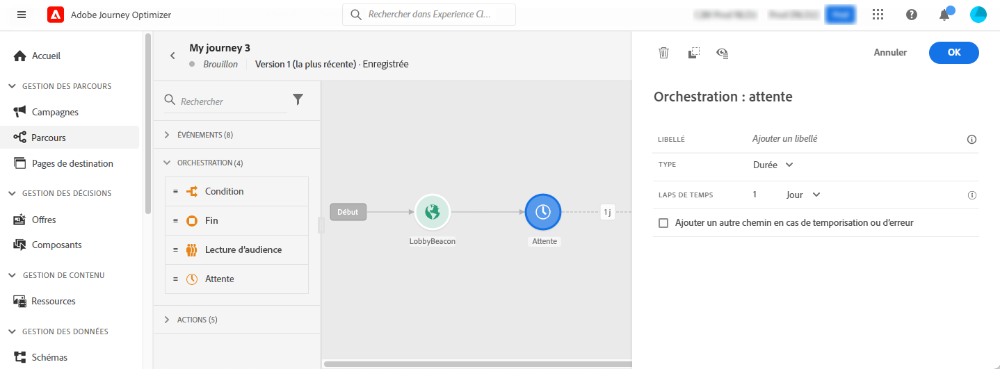
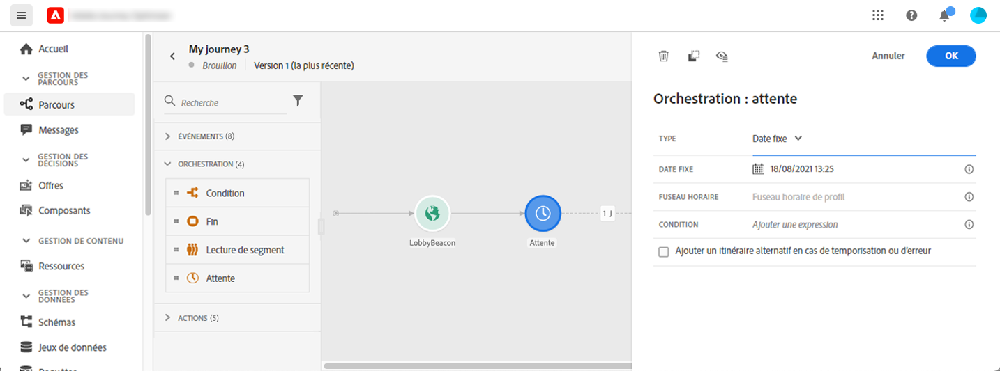
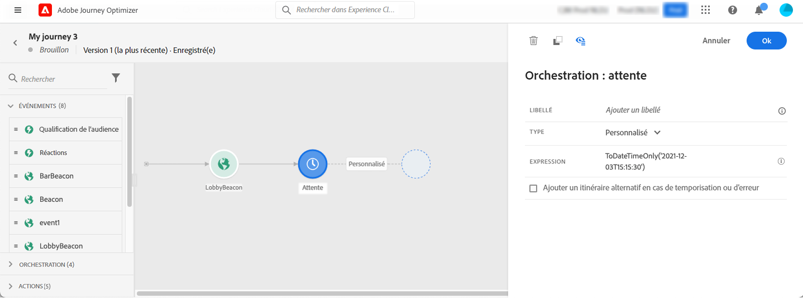

# Activité Attente {#wait-activity}

>[!BEGINSHADEBOX]

**Sur cette page :** découvrez comment configurer l’activité Attente pour suspendre un chemin d’accès pendant une durée relative ou jusqu’à une date calculée personnalisée avant l’exécution de l’activité suivante.

>[!ENDSHADEBOX]

>[!CONTEXTUALHELP]
>id="ajo_journey_wait"
>title="Activité Attente"
>abstract="L’activité Attente vous permet d’attendre avant d’exécuter l’activité suivante dans le chemin. Cela vous permet de définir le moment d’exécution de l’activité suivante. Deux options sont disponibles : durée et personnalisation."

Vous pouvez utiliser une activité **[!UICONTROL Attente]** pour définir une durée avant l’exécution de l’activité suivante.  La durée d’attente maximale est de **90 jours**.

Vous pouvez définir deux types d’activité **Attente** :

* Attente en fonction d’une durée relative. [En savoir plus](#duration)
* Date personnalisée, avec des fonctions pour la calculer. [En savoir plus](#custom)

<!--
* [Email send time optimization](#email_send_time_optimization)
* [Fixed date](#fixed_date) 
-->

## Recommandations {#wait-recommendations}

Utilisez ces recommandations pour garantir la prévisibilité et la sécurité des attentes.

### Activités Attente multiples {#multiple-wait-activities}

Lorsque vous utilisez plusieurs activités **Attente** dans un parcours, gardez à l’esprit que le [délai d’expiration global](journey-properties.md#global_timeout) du parcours est de 91 jours, ce qui signifie qu’un profil quittera toujours le parcours au maximum 91 jours après y être entré. En savoir plus sur [cette page](journey-properties.md#global_timeout).

Un individu ne peut rejoindre une activité **Attente** que s’il dispose de suffisamment de temps restant dans le parcours pour compléter la durée d’attente avant le délai d’expiration de 91 jours du parcours.

### Attente et rentrée {#wait-reentrance}

La bonne pratique est de ne pas utiliser d’activités **Attente** pour bloquer une rentrée. Utilisez plutôt l’option **Autoriser la rentrée** au niveau des propriétés du parcours. En savoir plus sur [cette page](../building-journeys/journey-properties.md#entrance).

### Attente et mode test {#wait-test-mode}

En mode test, le paramètre **[!UICONTROL Durée d’attente en test]** vous permet de définir la durée de chaque activité **Attente**. La valeur par défaut est de 10 secondes. Vous obtiendrez ainsi rapidement les résultats du test. En savoir plus sur [cette page](../building-journeys/testing-the-journey.md).

### Attente et canaux mobiles {#wait-mobile-channels}

Si vous souhaitez afficher un [message in-app](../in-app/create-in-app.md) peu après l’envoi d’une [notification push](../../rp_landing_pages/push-landing-page.md), utilisez une activité **Attente** pour permettre à la payload du message in-app de se propager. En règle générale, une attente de 5 à 15 minutes est recommandée, mais les heures exactes peuvent varier en fonction de la complexité de la payload et des besoins de personnalisation.

## Configuration {#wait-configuration}

Configurez la durée et le minutage de l’attente ici.

### Durée de l’attente {#duration}

Sélectionnez le type de **Durée** pour définir la durée relative de l’attente avant l’exécution de l’activité suivante. La durée maximum est de **90 jours**.

<!--
## Fixed date wait{#fixed_date}

Select the date for the execution of the next activity.

-->

### Attente personnalisée {#custom}

Sélectionnez le type **Personnalisée** pour définir une date personnalisée à l’aide d’une expression avancée basée sur un champ provenant d’un événement ou d’une réponse d’action personnalisée. Vous ne pouvez pas définir directement une durée relative (par exemple, 7 jours) mais vous pouvez utiliser des fonctions pour la calculer si nécessaire (par exemple, 2 jours après l’achat).

L’expression figurant dans l’éditeur doit fournir un format `dateTimeOnly`. Consultez [cette page](expression/expressionadvanced.md). Pour plus d’informations sur le format dateTimeOnly, consultez [cette page](expression/data-types.md).

La bonne pratique consiste à utiliser des dates personnalisées spécifiques à vos profils, et d’éviter d’utiliser la même date pour tous les profils. Par exemple, ne définissez pas `toDateTimeOnly('2024-01-01T01:11:00Z')`, mais plutôt `toDateTimeOnly(@event{Event.productDeliveryDate})`, qui est spécifique à chaque profil. Gardez à l’esprit que l’utilisation de dates fixes peut entraîner des problèmes d’exécution de votre parcours. Découvrez l’impact des activités d’attente sur le taux de traitement des parcours dans [cette section](entry-management.md#wait-activities-impact).

>[!CAUTION]
>
>Lorsque vous utilisez des expressions `dateTimeOnly`, tenez compte des points suivants :
>
>* Vous pouvez utiliser directement une expression de `dateTimeOnly` ou effectuer une conversion à l’aide d’une fonction, par exemple : `toDateTimeOnly(@event{Event.offerOpened.activity.endTime})` où la valeur du champ se trouve dans le `2023-08-12T09:46:06Z` de formulaire.
>* Le **fuseau horaire** est défini dans les propriétés du parcours. Par conséquent, il n’est pas possible à partir de l’interface utilisateur de pointer vers un horodatage ISO-8601 complet qui combine l’heure et le décalage de fuseau horaire, tel que `2023-08-12T09:46:06.982-05`. [En savoir plus](../building-journeys/timezone-management.md)
>* Lors de la création d’une expression d’attente personnalisée avec `toDateTimeOnly()`, n’ajoutez **pas** de `Z` ou de décalage de fuseau horaire (par exemple, `-05:00`). L’expression doit référencer le fuseau horaire configuré du parcours sans indicateurs de fuseau horaire explicites. Dans le cas contraire, les profils peuvent être bloqués dans l’activité d’attente.
>
>| | Exemple |
>| --- | --- |
>| **Correct** | `toDateTimeOnly(concat(toString(toDateOnly(nowWithDelta(2, "days"))),"T10:00:00"))` |
>| **Incorrect** | `toDateTimeOnly(concat(toString(toDateOnly(nowWithDelta(2, "days"))),"T10:00:00Z"))` ❌ (contient du `Z`) |

Pour vérifier que l’activité d’attente fonctionne comme prévu, vous pouvez utiliser des événements d’étape. [En savoir plus](../reports/query-examples.md#common-queries).

## Actualisation du profil après l’attente {#profile-refresh}

Lorsqu’un profil est mis dans une activité **Attente** dans un parcours commençant par une activité **Lecture d’audience**, le parcours actualise automatiquement les attributs du profil à partir du service de profil unifié (UPS) pour récupérer les dernières données disponibles.

* **À l’entrée du parcours** : les profils utilisent des valeurs d’attribut de l’instantané d’audience qui a été évalué au démarrage du parcours.
* **Après un nœud d’attente** : le parcours effectue une recherche pour récupérer les dernières données de profil d’UPS, et non les anciennes données d’instantané. Cela signifie que les attributs de profil peuvent avoir changé depuis le début du parcours.

Ce comportement garantit que les activités en aval utilisent les informations de profil actuelles après une période d’attente. Cependant, cela peut produire des résultats inattendus si vous prévoyez que le parcours n’utilise que les données d’instantané d’origine pendant l’exécution.

Exemple : si un profil est qualifié pour une audience « client ou cliente Silver » au début du parcours, mais passe à « client ou cliente Gold » pendant une attente de 3 jours, les activités après l’attente verront le statut « client ou cliente Gold » mis à jour.

## Nœud d’attente automatique  {#auto-wait-node}

>[!CONTEXTUALHELP]
>id="ajo_journey_auto_wait_node"
>title="À propos du nœud d’attente automatique"
>abstract="Un nœud d’**attente** est automatiquement inséré après cette action entrante. L’option est définie sur 3 jours par défaut, ce qui garantit que les profils restent dans le parcours suffisamment longtemps pour afficher le message ou l’expérience. La durée d’attente peut être mise à jour ou le nœud supprimé, si le cas d’usage le requiert."

Chaque activité d’expérience entrante (message in-app, expérience basée sur du code ou vignette) est fournie avec une activité **Attente** de 3 jours. Comme les messages entrants se terminent automatiquement lorsqu’un profil atteint la fin du parcours, nous supposons que vous souhaitez que vos utilisateurs et utilisatrices la voient pendant au moins 3 jours. Vous pouvez supprimer cette activité **Attente** ou modifier sa configuration si nécessaire.

+++ Référence des connaissances sur l’IA

Cette section contient des connaissances structurées destinées à soutenir l’interprétation, la récupération et la réponse aux questions liées à ce sujet.

Pour une compréhension totale, ces informations doivent être combinées avec la documentation de cette page. Aucune des sources n’est conçue pour être autonome. La page décrit la fonctionnalité, tandis que cette section fournit un contexte supplémentaire qui permet de clarifier la terminologie, l’intention, l’applicabilité et les contraintes.

* **TL;DR:** Cette page explique comment configurer l’activité Attente dans un parcours afin de suspendre la progression du profil pendant une durée relative ou jusqu’à une date calculée personnalisée avant d’exécuter l’étape suivante.

**Intentions:**

* Ajoutez une activité Attente pour suspendre un parcours pendant une durée relative fixe (jusqu’à 90 jours)
* Configurez une Attente personnalisée à l’aide d’une expression avancée pour retarder jusqu’à une date calculée spécifique au profil
* Découvrez comment les activités d’attente interagissent avec la temporisation globale par parcours (91 jours)
* Utilisez le paramètre Temps d’attente en test pour accélérer la validation du mode test
* Comprendre comment les attributs de profil sont actualisés après un nœud Attente dans les parcours Lecture d’audience

**Glossaire:**

* **Activité d’attente** : activité d’orchestration de parcours qui met le profil en pause pendant une durée spécifiée ou jusqu’à une date calculée avant que l’activité suivante n’exécute *(spécifique au produit)*
* **Durée d’attente** : type d’attente qui définit une période relative de pause, avec un maximum de 90 jours d’*(spécifique au produit)*
* **Attente personnalisée** : type d’attente qui utilise une expression de `dateTimeOnly` dérivée des données de profil ou d’événement pour définir une date/heure spécifique à venir pour la reprise *(spécifique au produit)*
* **Nœud d’attente automatique** : une activité d’attente de 3 jours automatiquement insérée après les activités d’expérience entrante (in-app, basées sur le code, carte) pour conserver le profil en parcours suffisamment longtemps pour afficher le *de contenu (spécifique au produit)*
* **Temps d’attente en test** : paramètre de mode test parcours qui remplace les durées d’attente réelles (10 secondes par défaut) afin que les résultats du test soient renvoyés rapidement *(spécifique au produit)*

**Mécanismes de sécurisation :**

* La durée d’attente maximale est de 90 jours.
* Les profils sont supprimés d’un parcours après 91 jours (temporisation globale), quelles que soient les activités d’attente en attente.
* Un profil ne peut entrer une activité d’attente que s’il reste suffisamment de temps dans le parcours pour terminer l’attente avant la temporisation de 91 jours.
* N’utilisez pas les activités d’attente pour bloquer une reprise. Utilisez plutôt l’option Autoriser une reprise dans les propriétés du parcours.
* Les expressions d’attente personnalisées doivent utiliser le format `dateTimeOnly` et ne doivent pas inclure de suffixe `Z` ni de décalage de fuseau horaire explicite.
* L’utilisation d’une date statique fixe (par exemple, `toDateTimeOnly('2024-01-01T01:11:00Z')`) dans une attente personnalisée peut entraîner des problèmes ; utilisez plutôt des dates dynamiques spécifiques au profil.
* Les attributs de profil sont actualisés à partir du service de profil unifié après un nœud d’attente dans les parcours Lecture d’audience, ce qui peut produire des résultats inattendus si la cohérence de l’instantané est attendue.

**Terminologie:**

* Nom canonique : Activité d’attente — Acronyme : none — variantes : nœud d’attente, étape d’attente
* Synonymes : « Attente de durée » = « attente relative » ; « Attente personnalisée » = « Attente basée sur l’expression »
* Ne pas confondre : « Attente de durée » (relative, par exemple, 3 jours à partir de maintenant) ≠ « Attente personnalisée » (date calculée absolue à partir des données de profil)

**FAQ:**

* **Q : Quelle est la durée maximale d’une activité d’attente ?** — La durée d’attente maximale est de 90 jours. Les profils sont également soumis à la temporisation globale de parcours de 91 jours.
* **Q : Comment le mode test gère-t-il les activités d’attente ?** — En mode test, le paramètre « Temps d&#39;attente en test » remplace la durée d&#39;attente réelle ; la valeur par défaut est de 10 secondes, de sorte que les tests se terminent rapidement.
* **Q : Pourquoi devrais-je éviter d’ajouter Z à une expression d’attente personnalisée ?** — L&#39;ajout d&#39;un Z ou d&#39;un décalage de fuseau horaire à une expression `toDateTimeOnly()` peut bloquer les profils dans l&#39;activité d&#39;attente ; l&#39;expression doit s&#39;appuyer sur le fuseau horaire configuré du parcours.
* **Q : Les attributs de profil sont-ils mis à jour après un nœud d’attente ?** — Oui, dans les parcours commençant par Lecture d’audience, le parcours actualise les attributs de profil à partir du service de profil unifié après l’attente, de sorte que les activités en aval peuvent voir les valeurs mises à jour plutôt que les données d’instantané d’audience d’origine.
* **Q : Qu’est-ce que le nœud d’attente automatique ?** — Une activité d’attente de 3 jours automatiquement insérée après les activités d’expérience entrante (in-app, basées sur le code, carte) pour s’assurer que les profils restent dans le parcours suffisamment longtemps pour voir le message ; elle peut être supprimée ou reconfigurée si nécessaire.

+++
