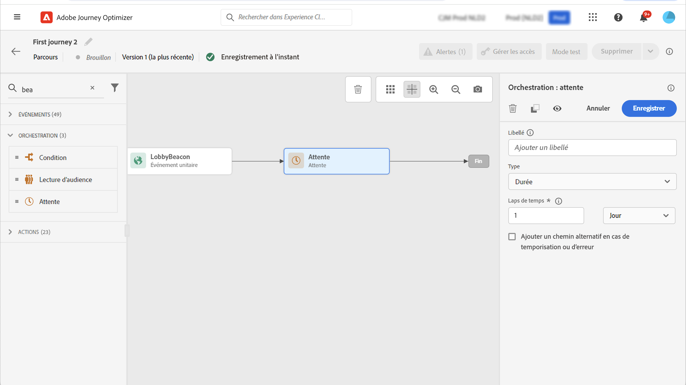

# Activité d’attente{#wait-activity}

>[!CONTEXTUALHELP]
>id="ajo_journey_wait"
>title="Activité d’attente"
>abstract="Si vous souhaitez attendre avant d’exécuter l’activité suivante dans le chemin, vous pouvez utiliser une activité Attente . Il vous permet de définir le moment d’exécution de l’activité suivante. Deux options sont disponibles : durée et personnalisé."

Si vous souhaitez attendre avant d’exécuter l’activité suivante dans le chemin, vous pouvez utiliser une **[!UICONTROL Wait]** activité. Il vous permet de définir le moment d’exécution de l’activité suivante. Trois options sont disponibles :

* [Durée](#duration)
* [Personnalisé](#custom)

<!--
* [Email send time optimization](#email_send_time_optimization)
* [Fixed date](#fixed_date) 
-->

## À propos de l’activité Attente{#about_wait}

La durée d’attente maximale est de 30 jours. En mode test, la variable **[!UICONTROL Wait time in test]** vous permet de définir la durée de chaque activité d’attente. La durée par défaut est de 10 secondes. Vous obtiendrez ainsi rapidement les résultats du test. Voir [cette page](../building-journeys/testing-the-journey.md)

Soyez prudent lorsque vous utilisez plusieurs activités Attente dans un parcours, car le délai d’expiration global du parcours est de 30 jours, ce qui signifie qu’un profil abandonnera toujours le parcours au maximum 30 jours après son entrée.

## Durée de l’attente{#duration}

Sélectionnez la durée d’attente avant l’exécution de l’activité suivante.

<!--
## Fixed date wait{#fixed_date}

Select the date for the execution of the next activity.

-->

## Attente personnalisée{#custom}

Cette option vous permet de définir une date personnalisée, par exemple le 12 juillet 2020 à 17h, à l’aide d’une expression avancée basée sur un champ provenant d’un événement ou d’une source de données. Il ne vous permet pas de définir une durée personnalisée, par exemple, de 7 jours. L’expression de l’éditeur d’expression doit fournir un format dateTimeOnly. Consultez cette section [page](expression/expressionadvanced.md). Pour plus d’informations sur le format dateTimeOnly, voir cette [page](expression/data-types.md).

>[!NOTE]
>
>Vous pouvez utiliser une expression dateTimeOnly ou une fonction pour effectuer une conversion en dateTimeOnly. Par exemple : toDateTimeOnly(@{Event.offerOpening.activity.endTime}), le champ de l’événement étant de la forme 2016-08-12T09:46:06Z.
>
>Le **fuseau horaire** est attendue dans les propriétés de votre parcours. Par conséquent, il n’est pas possible aujourd’hui, à partir de l’interface, de pointer directement vers un horodatage ISO-8601 complet associant l’heure et le décalage de fuseau horaire comme 2016-08-12T09:46:06.982-05. Voir [cette page](../building-journeys/timezone-management.md).

<!--## Email send time optimization{#email_send_time_optimization}

This type of wait uses a score calculated in Adobe Experience Platform. The score calculates the propensity to click or open an email in the future based on past behavior. Note that the algorithm calculating the score needs a certain amount of data to work. As a result, when it does not have enough data, the default wait time will apply. At publication time, you’ll be notified that the default time applies.

>[!NOTE]
>
>The first event of your journey must have a namespace.
>
>This capability is only available after an **[!UICONTROL Email]** activity. You need to have Adobe Campaign Standard.

1. In the **[!UICONTROL Amount of time]** field, define the number of hours to consider to optimize email sending.
1. In the **[!UICONTROL Optimization type]** field, choose if the optimization should increase clicks or opens.
1. In the **[!UICONTROL Default time]** field, define the default time to wait if the predictive send time score is not available.

    >[!NOTE]
    >
    >Note that the send time score can be unavailable because there is not enough data to perform the calculation. In this case, you will be informed, at publication time, that the default time applies.

-->
