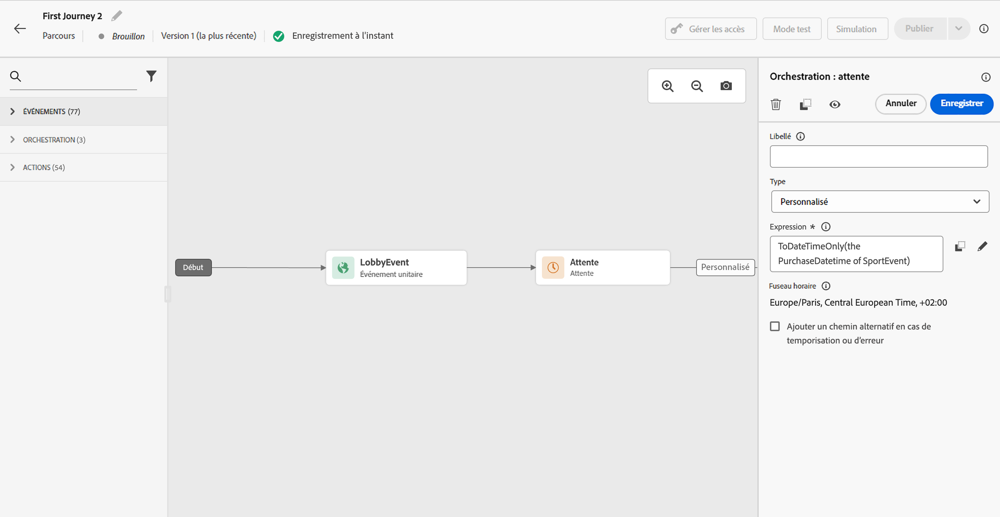

# Activité d&#39;attente{#wait-activity}

>[!CONTEXTUALHELP]
>id="ajo_journey_wait"
>title="Activité d&#39;attente"
>abstract="Si vous souhaitez observer un temps d&#39;attente avant d&#39;exécuter l&#39;activité suivante dans le chemin, vous pouvez utiliser une activité Attente. Cela vous permet de définir le moment d&#39;exécution de l&#39;activité suivante. Deux options sont disponibles : durée et personnalisation."

Si vous souhaitez observer un temps d&#39;attente avant d&#39;exécuter l&#39;activité suivante dans le chemin, vous pouvez utiliser une activité **[!UICONTROL Attente]**. Cela vous permet de définir le moment d&#39;exécution de l&#39;activité suivante. Les options disponibles sont les suivantes :

* [Durée](#duration)
* [Valeur](#custom) personnalisée

<!--
* [Email send time optimization](#email_send_time_optimization)
* [Fixed date](#fixed_date) 
-->

## À propos de l&#39;activité d&#39;attente{#about_wait}

La durée d&#39;attente maximale est de 29 jours. En mode test, le paramètre **[!UICONTROL Temps d&#39;attente en test]** vous permet de définir la durée de chaque activité d&#39;attente. La valeur par défaut est de 10 secondes. Vous obtiendrez ainsi rapidement les résultats du test. Consultez [cette page](../building-journeys/testing-the-journey.md).

Soyez prudent lorsque vous utilisez plusieurs activités d’attente dans un parcours, car la temporisation du parcours global est de 30 jours, ce qui signifie qu’un profil abandonnera toujours le parcours au maximum 30 jours après son entrée. Consultez [cette page](../building-journeys/journey-gs.md#global_timeout).

Un individu ne peut entrer dans une activité d’attente que s’il dispose de suffisamment de temps dans le parcours pour terminer la durée d’attente avant la temporisation de 30 jours du parcours. Par exemple, si vous ajoutez deux activités d’attente définies sur 20 jours chacune, le système détectera que la seconde attente se terminera après la temporisation de 30 jours. La seconde attente sera donc ignorée et l’individu quittera le parcours avant de le commencer. Dans cet exemple, la cliente ou le client restera 20 jours au total dans le parcours.

Il est recommandé de ne pas utiliser d’attente pour bloquer la reprise. Utilisez plutôt l’option **Autoriser la reprise** au niveau des propriétés du parcours. Consultez [cette page](../building-journeys/journey-gs.md#entrance).

## Durée de l&#39;attente{#duration}

Sélectionnez la durée d&#39;attente avant l&#39;exécution de l&#39;activité suivante. La durée maximale est de 29 jours.

<!--
## Fixed date wait{#fixed_date}

Select the date for the execution of the next activity.

-->

## Attente personnalisée{#custom}

Cette option vous permet de définir une date personnalisée (le 12 juillet 2023 à 17 heures, par exemple) à l’aide d’une expression avancée basée sur un champ provenant d’un événement ou d’une source de données. Elle ne vous permet pas de définir une durée personnalisée ; 7 jours, par exemple. L&#39;expression figurant dans l&#39;éditeur d&#39;expression doit fournir un format dateTimeOnly. Voir cette [page](expression/expressionadvanced.md). Pour plus d&#39;informations sur le format dateTimeOnly, voir cette [page](expression/data-types.md).

>[!NOTE]
>
>Vous pouvez tirer parti d&#39;une expression dateTimeOnly ou utiliser une fonction pour effectuer une conversion dans ce format. Par exemple : toDateTimeOnly(@event{Event.offerOpened.activity.endTime}), le champ de l’événement se présentant sous la forme 2023-08-12T09:46:06Z.
>
>La définition du **fuseau horaire** est attendue dans les propriétés de votre parcours. Par conséquent, il n’est pas possible actuellement de pointer directement, à partir de l’interface, vers un horodatage ISO-8601 complet associant l’heure et le décalage dû au fuseau horaire, tel que 2023-08-12T09:46:06.982-05. Consultez [cette page](../building-journeys/timezone-management.md).

Pour vérifier que l’activité d’attente fonctionne comme prévu, vous pouvez utiliser des événements d’étape. Consultez [cette page](../reports/query-examples.md#common-queries).

<!--## Email send time optimization{#email_send_time_optimization}

This type of wait uses a score calculated in Adobe Experience Platform. The score calculates the propensity to click or open an email in the future based on past behavior. Note that the algorithm calculating the score needs a certain amount of data to work. As a result, when it does not have enough data, the default wait time will apply. At publication time, you'll be notified that the default time applies.

>[!NOTE]
>
>The first event of your journey must have a namespace.
>
>This capability is only available after an **[!UICONTROL Email]** activity. You need to have Adobe Campaign Standard.

1. In the **[!UICONTROL Amount of time]** field, define the number of hours to consider to optimize email sending.
1. In the **[!UICONTROL Optimization type]** field, choose if the optimization should increase clicks or opens.
1. In the **[!UICONTROL Default time]** field, define the default time to wait if the predictive send time score is not available.

    >[!NOTE]
    >
    >Note that the send time score can be unavailable because there is not enough data to perform the calculation. In this case, you will be informed, at publication time, that the default time applies.

-->
