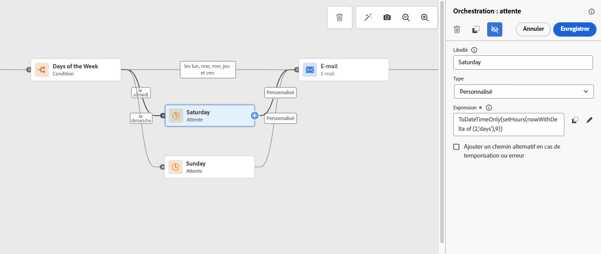

# Envoyer des e-mails uniquement les jours de la semaine {#send-emails-only-on-weekdays}

Ce cas pratique montre comment configurer un parcours dans [!DNL Adobe Journey Optimizer] qui envoie des e-mails uniquement les jours de la semaine (du lundi au vendredi). Pour les profils qui rejoignent le parcours le week-end (samedi ou dimanche), les e-mails sont automatiquement mis en file d’attente et envoyés le lundi à une heure spécifiée. Cela garantit un engagement optimal en diffusant des messages pendant la semaine de travail.

## Vue d’ensemble de cas d’utilisation

**Le défi** : veiller à ce que les e-mails ne soient envoyés que les jours de la semaine, même si les profils peuvent rejoindre le parcours le week-end. Pour les entrées pendant les week-ends, les e-mails doivent être placés en file d’attente et envoyés le lundi à une heure spécifique.

**La solution** : utiliser une activité de condition pour identifier le jour de la semaine. Pour les entrées pendant les week-ends, les activités d’attente avec des formules personnalisées retardent l’envoi de l’e-mail jusqu’au lundi. Les entrées pendant les jours de la semaine passent directement à l’étape d’envoi de l’e-mail.

Cette approche vous explique comment utiliser une activité de condition pour vérifier si le jour en cours est le samedi ou le dimanche, implémenter des activités d’attente avec des formules personnalisées pour les entrées pendant les week-ends, mettre en file d’attente les e-mails de week-end pour une diffusion le lundi à une heure spécifique et envoyer immédiatement les e-mails pour les entrées pendant les jours de la semaine (du lundi au vendredi).

Cette approche est idéale pour les campagnes par e-mail B2B (business-to-business), les newsletters et les communications professionnelles, les annonces liées à l’entreprise, les mises à jour de produits liés au travail et toute campagne marketing pour laquelle la diffusion pendant les week-ends n’est pas souhaitée.

>[!NOTE]
>
>Pour implémenter ce cas d’utilisation, vous avez besoin d’une instance [!DNL Adobe Journey Optimizer] active avec une [surface de canal e-mail](../configuration/channel-surfaces.md) configurée, une [audience](../audience/about-audiences.md) ou [événement](../event/about-events.md) pour déclencher le parcours, ainsi qu’une compréhension de base des [conditions de parcours &#x200B;](condition-activity.md) et des [expressions](expression/expressionadvanced.md).


## Étapes dʼimplémentation

Suivez ces étapes pour créer un flux d’e-mail en semaine uniquement.

### Étape 1 : créer votre parcours

1. Accédez à **[!UICONTROL Gestion des Parcours]** > **[!UICONTROL Parcours]** dans [!DNL Adobe Journey Optimizer].

1. Cliquez sur **[!UICONTROL Créer un parcours]** pour [créer un parcours](journey-gs.md).

1. Configurez les [propriétés du parcours](journey-properties.md).

1. Choisissez le point d’entrée de votre parcours :
   * **[Lecture d’audience](read-audience.md)** : pour les campagnes par lots ciblant une audience spécifique
   * **[Événement](../event/about-events.md)** : pour les parcours déclenchés en temps réel en fonction du comportement client

### Étape 2 : ajouter une activité Condition pour vérifier le jour de la semaine

Juste après le début du parcours, ajoutez une activité **[!UICONTROL Condition]** pour vérifier si le jour actuel est un samedi ou un dimanche. Le workflow sera ainsi divisé en conséquence.

1. Placez une activité [**[!UICONTROL Condition &#x200B;]**](condition-activity.md) sur la zone de travail après votre point d’entrée.

1. Cliquez sur l’activité **[!UICONTROL Condition]** pour ouvrir son panneau de configuration.

1. Sélectionnez **[!UICONTROL Condition temporelle]** comme type de condition.

1. Sélectionnez **[!UICONTROL Jour de la semaine]** comme option de filtrage temporel.

1. Pour le **premier chemin (samedi)**, sélectionnez **samedi** uniquement. Libellez ce chemin « Samedi ».

1. Cliquez sur **[!UICONTROL Ajouter un chemin]** pour créer une deuxième condition.

1. Pour le **deuxième chemin (dimanche)**, sélectionnez **[!UICONTROL Jour de la semaine]** et choisissez **Dimanche** uniquement. Libellez ce chemin « Dimanche ».

   


1. Cochez **[!UICONTROL Afficher le chemin pour d’autres cas que ceux ci-dessus]** pour créer un chemin pour les entrées pendant les jours de la semaine (lundi à vendredi).

>[!NOTE]
>
>Le fuseau horaire utilisé pour l’évaluation des jours de la semaine est défini au niveau du parcours dans les propriétés du parcours, et non au niveau de la condition. Le [fuseau horaire](timezone-management.md) du parcours utilisé dans la formule est le fuseau horaire configuré du parcours, et non celui des destinataires.

### Étape 3 : configurer les activités d’attente pour les entrées pendant les week-ends

Pour les profils qui rejoignent le parcours le samedi ou le dimanche, utilisez les activités **[!UICONTROL Attente]** avec des formules personnalisées pour reporter l’envoi de l’e-mail au lundi, à l’heure souhaitée.

Dans l’activité **[!UICONTROL Attente]**, utilisez la formule suivante :

```javascript
toDateTimeOnly(setHours(nowWithDelta(X, "days"), H))
```

Où :

* **X** correspond au nombre de jours d’attente :
   * Utiliser **2** pour le samedi (attendre jusqu’au lundi)
   * Utiliser **1** pour le dimanche (attendre jusqu’au lundi)
* **H** est l’heure d’envoi souhaitée (par exemple, **9** pour 9 h)


**Exemple pour le samedi :**

```javascript
toDateTimeOnly(setHours(nowWithDelta(2, "days"), 9))
```

**Exemple pour le dimanche :**

```javascript
toDateTimeOnly(setHours(nowWithDelta(1, "days"), 9))
```

Pour implémenter ceci dans votre parcours :

1. Sur le **chemin de samedi**, ajoutez une activité **[!UICONTROL Attente]** après la condition.

1. Sélectionnez **[!UICONTROL Durée]** comme type d’attente.

1. Cliquez sur **[!UICONTROL Mode avancé]** pour saisir la formule personnalisée.

1. Saisissez : `toDateTimeOnly(setHours(nowWithDelta(2, "days"), 9))`

   

1. Répétez les mêmes étapes pour le **chemin de dimanche**, en utilisant : `toDateTimeOnly(setHours(nowWithDelta(1, "days"), 9))`

>[!TIP]
>
>Pour les heures d’ouverture plus complexes (p. ex., envoyer seulement entre 9 h et 17 h les jours de semaine), vous pouvez améliorer davantage la formule et les conditions.

### Étape 4 : branche de jour de semaine

Pour les profils rejoignant le parcours du lundi au vendredi, passez à l’étape d’envoi d’e-mail comme d’habitude.

1. Dans le **chemin de jour de la semaine** (chemin « autres cas »), passez directement à l’ajout d’une activité d’action **[!UICONTROL E-mail]**. Aucune activité **[!UICONTROL Attente]** n’est nécessaire pour les entrées pendant les jours de la semaine.

1. Configurez votre e-mail selon vos besoins.

### Étape 5 : terminer le flux de parcours

Après les activités **[!UICONTROL Attente]** sur les chemins de samedi et dimanche, les trois chemins (samedi, dimanche et jours de la semaine) doivent tous être dirigés vers la même activité d’action **[!UICONTROL E-mail]**. Ajoutez une activité **[!UICONTROL Fin]** après l’e-mail.

### Vue d’ensemble des workflows visuels

Le workflow de parcours complet suit cette logique :

* **Début** → **[!UICONTROL Condition]** : est-ce le samedi ou le dimanche ?
   * **Oui (samedi) :** **[!UICONTROL attendre]** jusqu’au lundi 9 h → **[!UICONTROL Envoyer un e-mail]**
   * **Oui (dimanche) :** **[!UICONTROL attendre]** jusqu’au lundi 9 h → **[!UICONTROL Envoyer un e-mail]**
   * **Non (du lundi au vendredi) :** **[!UICONTROL envoyer un e-mail]** immédiatement

Ainsi, tous les e-mails sont envoyés uniquement les jours de la semaine, les entrées pendant les week-ends étant automatiquement mises en file d’attente pour la diffusion le lundi.

### Étape 6 : tester votre parcours

Avant de publier, testez minutieusement votre logique de parcours en mode test de [!DNL Adobe Journey Optimizer] pour confirmer que tout fonctionne comme prévu :

1. Cliquez sur le bouton **[!UICONTROL Tester]** en haut à droite.

1. Activez le [mode test](testing-the-journey.md).

1. Créez des [profils de test](../audience/creating-test-profiles.md) avec des heures d’entrée simulées pour différents jours de la semaine :
   * **Entrée le samedi** : vérifiez que le profil suit le chemin du samedi, attend et reçoit un e-mail le lundi à l’heure spécifiée.
   * **Entrée le dimanche** : vérifiez que le profil suit le chemin du dimanche, attend et reçoit un e-mail le lundi à l’heure spécifiée.
   * **Entrées du lundi au vendredi** : vérifiez que les e-mails sont envoyés immédiatement sans attente.

1. Examinez la visualisation du parcours pour vous assurer que les profils suivent les chemins d’accès conditionnels appropriés (samedi, dimanche ou jour de la semaine).

1. Recherchez des [erreurs ou avertissements](troubleshooting.md) dans le parcours.

1. Vérifiez que les formules d’attente calculent la durée correcte pour l’heure de diffusion souhaitée le lundi.

>[!IMPORTANT]
>
>Testez toujours votre logique de parcours en mode test pour vous assurer que les activités d’attente se comportent comme prévu. Utilisez le mode de test pour simuler différents scénarios d’entrée et vérifier que les entrées pendant les week-ends sont correctement placées en file d’attente pour la diffusion le lundi. Pour plus d’informations, consultez les [bonnes pratiques de test de parcours](testing-the-journey.md).

### Étape 7 : publier votre parcours

Une fois les tests effectués :

1. Cliquez sur **[!UICONTROL Publier]** en haut à droite.

1. Confirmez la [publication](publish-journey.md).

1. Surveillez les performances du parcours à l’aide des [rapports de parcours](report-journey.md) et des [rapports dynamiques](../reports/journey-live-report.md).


## Rubriques connexes

* [Activités de condition](condition-activity.md) : en savoir plus sur la création de différents chemins dans votre parcours
* [Utiliser des conditions dans un parcours](conditions.md) : guide détaillé sur les conditions de parcours
* [Activité d’attente](wait-activity.md) : configurer des durées d’attente et des formules
* [Fonctions de date](functions/date-functions.md) : référence complète pour les fonctions de date et d’heure
* [Éditeur d’expression](expression/expressionadvanced.md) : créer des expressions complexes
* [Bonnes pratiques relatives aux parcours &#x200B;](journey-gs.md#best-practices) : approches recommandées pour la conception de parcours
