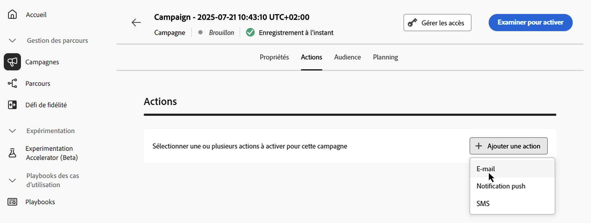
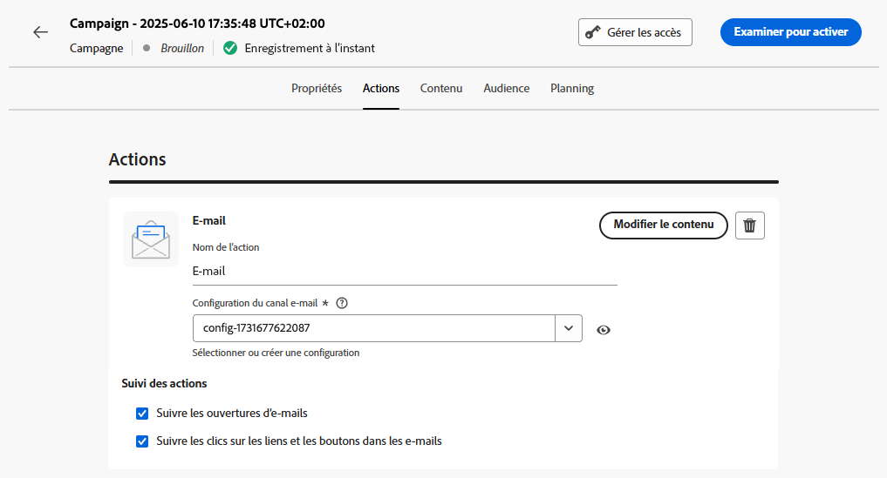

# Configurer l’action de campagne déclenchée par API {#api-action}

Utilisez l’onglet **[!UICONTROL Actions]** afin de sélectionner une configuration de canal pour votre message et configurer des paramètres supplémentaires, tels que le suivi, l’expérience de contenu ou le contenu multilingue.

1. **Choisissez le canal**.

   Accédez à l’onglet **[!UICONTROL Actions]**, cliquez sur le bouton **[!UICONTROL Ajouter une action]** et sélectionnez le canal de communication.

   

   >[!NOTE]
   >
   >Pour plus d’informations sur les canaux pris en charge, reportez-vous au tableau de cette section : [Canaux dans les parcours et les campagnes](../channels/gs-channels.md#channels). Les canaux disponibles varient en fonction de votre modèle d’attribution de licence et de vos modules complémentaires.
   >
   >Les campagnes déclenchées par API à haut débit prennent actuellement en charge uniquement le canal E-mail.

1. **Sélectionner une configuration de canal**

   Celle-ci est définie par une [équipe d’administration système](../start/path/administrator.md). Elle contient tous les paramètres techniques relatifs à l’envoi du message, tels que les paramètres d’en-tête, le sous-domaine, les applications mobiles, etc. [Découvrir comment configurer les canaux](../configuration/channel-surfaces.md)

   

1. **Utiliser l’optimisation**

   Utilisez la section **[!UICONTROL Optimisation des messages]** pour exécuter des expériences de contenu, tirer parti des règles de ciblage ou utiliser des combinaisons avancées d’expérimentation et de ciblage. Ces différentes options et les étapes à suivre sont présentées dans cette section : [Optimisation des campagnes](campaigns-message-optimization.md).
<!--
1. **Create a content experiment**

    Use the **[!UICONTROL Content experiment]** section to define multiple delivery treatments in order to measure which one performs best for your target audience. Click the **[!UICONTROL Create experiment]** button then follow the steps detailed in this section: [Create a content experiment](../content-management/content-experiment.md).-->

1. **Ajouter du contenu multilingue**

   Utilisez la section **[!UICONTROL Langues]** pour créer du contenu dans plusieurs langues au sein de votre campagne. Pour ce faire, cliquez sur le bouton **[!UICONTROL Ajouter des langues]** et sélectionnez l’option **[!UICONTROL Paramètres de langue]** souhaitée. Vous trouverez des informations détaillées sur la configuration et l’utilisation des fonctionnalités multilingues dans cette section : [Prise en main du contenu multilingue](../content-management/multilingual-gs.md).

Des paramètres supplémentaires sont disponibles en fonction du canal de communication sélectionné. Pour plus d’informations, développez les sections ci-dessous.

+++**Appliquer des règles de limitation** (e-mail, notification push ou SMS)

Dans la liste déroulante **[!UICONTROL Règles métier]**, sélectionnez un jeu de règles pour appliquer des règles de limitation à votre campagne. L’utilisation des jeux de règles de canal vous permet de définir un capping de fréquence par type de communication afin d’éviter d’envoyer trop de messages similaires aux clientes et aux clients. [Découvrir comment utiliser les jeux de règles](../conflict-prioritization/rule-sets.md)

+++

+++**Suivre l’engagement** (e-mail, SMS).

Utilisez la section **[!UICONTROL Suivi des actions]** pour suivre la réaction des personnes destinataires à vos diffusions e-mail ou SMS. Les résultats du suivi sont accessibles dans le rapport de la campagne, une fois celle-ci exécutée. [En savoir plus sur les rapports de campagne](../reports/campaign-global-report-cja.md)

+++

+++**Activer le mode de diffusion rapide** (notifications push).

Le mode de diffusion rapide est un module complémentaire [!DNL Journey Optimizer] qui permet d’envoyer très rapidement des messages push en grandes quantités dans le cadre d’une campagne. La diffusion rapide est utilisée lorsque le retard dans la diffusion des messages est critique pour l’entreprise, quand vous souhaitez envoyer une alerte push urgente sur les téléphones mobiles, par exemple une nouvelle de dernière minute aux personnes qui ont installé votre application d&#39;actualités. Découvrez comment activer le mode de diffusion rapide pour les notifications push [sur cette page](../push/create-push.md#rapid-delivery).

Pour plus d’informations sur les performances lors de l’utilisation du mode de diffusion rapide, reportez-vous à la section [Description du produit Adobe Journey Optimizer](https://helpx.adobe.com/fr/legal/product-descriptions/adobe-journey-optimizer.html){target="_blank"}.

+++

## Étapes suivantes {#next}

Une fois la configuration et le contenu de votre campagne prêts, vous pouvez configurer son contenu. [En savoir plus](api-triggered-campaign-content.md)
