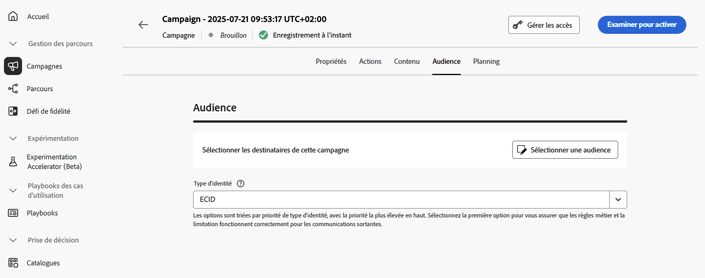
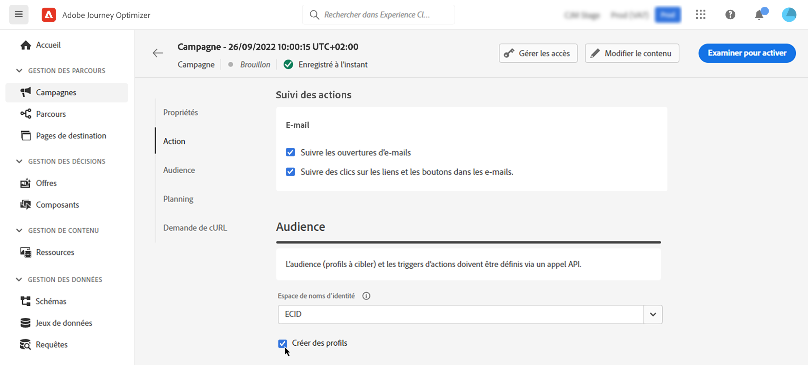
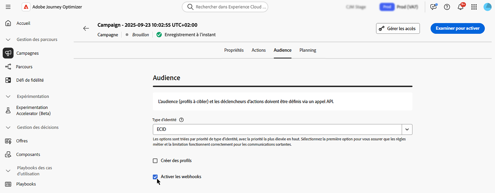

# Définir l’audience d’une campagne déclenchée par API {#api-audience}

Utilisez l’onglet **[!UICONTROL Audience]** pour définir l’audience de la campagne.

## Sélectionner l’audience

**Pour les campagnes marketing déclenchées par API**, cliquez sur le bouton **[!UICONTROL Sélectionner une audience]** pour afficher la liste des audiences Adobe Experience Platform disponibles. [En savoir plus sur les audiences](../audience/about-audiences.md).

>[!IMPORTANT]
>
>L’utilisation d’audiences et d’attributs de la [composition d’audiences](../audience/get-started-audience-orchestration.md) est actuellement indisponible avec Healthcare Shield ou Privacy and Security Shield.

**Pour les campagnes transactionnelles déclenchées par API**, les profils ciblés doivent être définis dans l’appel API. Un seul appel API prend en charge jusqu’à 20 personnes destinataires uniques. Chacune de ces personnes doit disposer d’un identifiant d’utilisateur ou d’utilisatrice unique, les doublons n’étant pas autorisés. Pour en savoir plus, consultez la [documentation de l’API Interactive Message Execution](https://developer.adobe.com/journey-optimizer-apis/references/messaging/#tag/execution/operation/postIMUnitaryMessageExecution){target="_blank"}.

## Sélectionner le type d’identité

Dans le champ **[!UICONTROL Type d’identité]**, choisissez le type de clé à utiliser pour identifier les personnes dans l’audience sélectionnée. Vous pouvez soit utiliser un type d’identité existant, soit en créer un nouveau à l’aide du service d’identités Adobe Experience Platform. Les espaces de noms d’identité standard sont répertoriés dans [cette page](https://experienceleague.adobe.com/fr/docs/experience-platform/identity/features/namespaces#standard){target="_blank"}.

Un seul type d’identité est autorisé par campagne. Les personnes appartenant à un segment qui ne dispose pas du type d’identité sélectionné parmi leurs différentes identités ne seront pas ciblées par la campagne. Pour en savoir plus sur les types d’identité et les espaces de noms, consultez la [documentation d’Adobe Experience Platform](https://experienceleague.adobe.com/docs/experience-platform/identity/home.html?lang=fr){target="_blank"}.

## Activer la création de profils lors de l’exécution de la campagne

Dans certains cas, vous devrez peut-être envoyer des messages transactionnels à des profils qui n’existent pas dans le système, Par exemple, si une personne inconnue tente de réinitialiser un mot de passe sur votre site web. Lorsqu’un profil n’existe pas dans la base de données, Journey Optimizer vous permet de le créer automatiquement lors de l’exécution de la campagne afin de permettre l’envoi du message à ce profil.

Pour activer la création des profils lors de l’exécution de la campagne, activez l’option **[!UICONTROL Créer de nouveaux profils]**. Si cette option est désactivée, les profils inconnus sont refusés pour tout envoi et l’appel API échoue.

>[!IMPORTANT]
>
>Cette fonctionnalité est fournie pour la **création de profils en très faible quantité** dans un cas d’utilisation d’envois transactionnels en grande quantité, avec la majorité des profils existant déjà dans la plateforme.
>
>Les profils inconnus sont créés dans le jeu de données **Jeu de données de profil de messagerie interactive AJO**, dans trois espaces de noms par défaut (e-mail, téléphone et ECID), respectivement pour chaque canal sortant (e-mail, SMS et notification push). Cependant, si vous utilisez un espace de noms personnalisé, l’identité est créée avec le même espace de noms personnalisé.
>
>La création de profils à l’exécution n’est pas disponible pour les [campagnes à débit élevé](../campaigns/api-triggered-high-throughput.md), car ce mode ne dépend pas des profils Adobe. Le système ne vérifie pas si les profils existent ou non.

## Activer les webhooks {#webhook}

Pour les campagnes transactionnelles déclenchées par API, vous pouvez permettre aux webhooks de recevoir des commentaires en temps réel sur le statut d’exécution de vos messages. Pour ce faire, activez/désactivez l’option **[!UICONTROL Activer les webhooks]** pour envoyer les événements de statut de diffusion à un webhook configuré.

Les configurations de webhook sont gérées de manière centralisée dans le menu **[!UICONTROL Administration]** > **[!UICONTROL Canaux]** > **[!UICONTROL Webhook de commentaires]**. À partir de là, les administrateurs et administratrices peuvent créer et modifier des points d’entrée de webhook. [Découvrez comment créer des webhooks de commentaires.](../configuration/feedback-webhooks.md)

## Étapes suivantes {#next}

Une fois la configuration et le contenu de votre campagne prêts, vous pouvez planifier son exécution. [En savoir plus](api-triggered-campaign-schedule.md)
