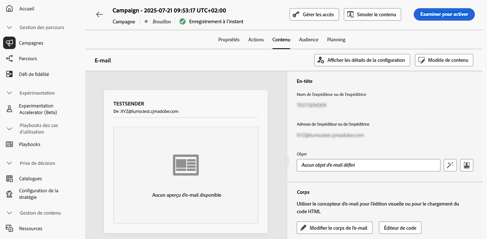
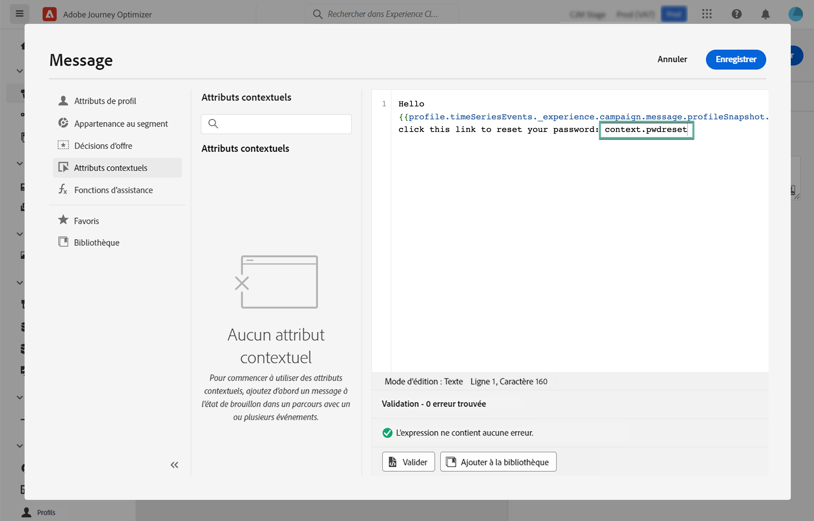
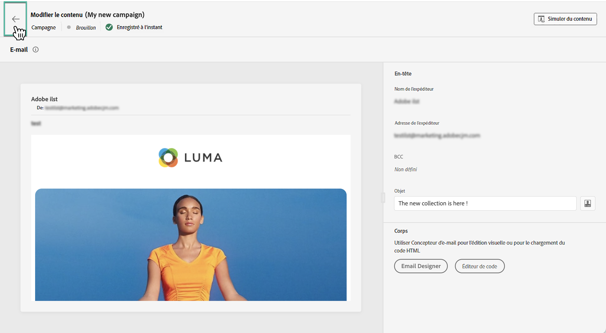

# Modifier le contenu d’une campagne déclenchée par API {#api-content}

Pour configurer le contenu du message, accédez à l’onglet **[!UICONTROL Contenu]** ou cliquez sur le bouton **[!UICONTROL Modifier le contenu]**.

## Concevoir le contenu {#design}

Le processus de création du contenu dépend du canal que vous avez sélectionné. Découvrez les étapes détaillées pour créer le contenu de votre message dans les pages suivantes :

<table style="table-layout:fixed"><tr style="border: 0;">
<td>

<a href="../email/create-email.md"><strong>E-mail</strong></a>
</td>
<td>

<a href="../sms/create-sms.md"><strong>SMS</strong></a>
</td>
<td>

<a href="../push/create-push.md"><strong>Notification push</strong></a>
</td>
</tr></table>

>[!IMPORTANT]
>
>Les [campagnes à haut débit](../campaigns/api-triggered-high-throughput.md) ne reposent pas sur les profils Adobe : toute personnalisation doit être incluse dans la payload de l’API en tant que données contextuelles, comme décrit ci-dessous. Ce mode est disponible uniquement pour le canal E-mail et aux États-Unis.

## Personnaliser du contenu à l’aide de données contextuelles {#contextual}

Vous pouvez transmettre des données supplémentaires dans la payload de l’API que vous pouvez ensuite utiliser pour personnaliser votre message.

Prenons un exemple où la clientèle souhaite réinitialiser son mot de passe et où vous souhaitez lui envoyer une URL de réinitialisation de mot de passe générée dans un outil tiers. Avec les campagnes déclenchées par API, vous pouvez transmettre cette URL générée dans la payload de l’API et l’utiliser dans la campagne pour l’ajouter au message.

Pour ce faire, vous devez les transmettre dans la payload de l’API et les ajouter dans votre message à l’aide de l’éditeur de personnalisation. Utilisez la syntaxe `{{context.<contextualAttribute>}}`, où `<contextualAttribute>` doit correspondre au nom de la variable dans votre payload d’API qui contient les données que vous souhaitez transmettre.

Notez que, pour l’instant, aucun attribut contextuel n’est disponible dans le menu du rail de gauche. Les attributs doivent être saisis directement dans votre expression de personnalisation, sans vérification effectuée par [!DNL Journey Optimizer].

**À lire absolument**

* Les attributs contextuels transmis dans la requête ne peuvent pas dépasser 200 Ko et sont toujours considérés comme étant de type chaîne.
* La syntaxe `context.system` est réservée à l’utilisation interne d’Adobe et ne doit pas être utilisée pour transmettre des attributs contextuels.
* Contrairement aux événements activés pour le profil, les données contextuelles transmises dans l’API REST sont utilisées pour une communication ponctuelle et ne sont pas stockées par rapport au profil. Au maximum, le profil est créé avec les détails de l’espace de noms, s’il a été détecté comme manquant.
* L’utilisation d’un grand nombre de données contextuelles importantes dans votre contenu peut avoir un impact sur les performances.

## Tester et vérifier votre contenu

Une fois votre contenu défini, utilisez le bouton **[!UICONTROL Simuler le contenu]** pour prévisualiser et tester votre contenu avec des profils de test ou des exemples de données d’entrée chargés à partir d’un fichier CSV/JSON ou ajoutés manuellement. [Découvrez comment prévisualiser et tester du contenu](../content-management/preview-test.md). Pour revenir à l’écran de création de campagne, cliquez sur la flèche pointant vers la gauche.

## Étapes suivantes {#next}

Une fois la configuration et le contenu de votre campagne prêts, vous pouvez définir l’audience de la campagne. [En savoir plus](api-triggered-campaign-audience.md)
