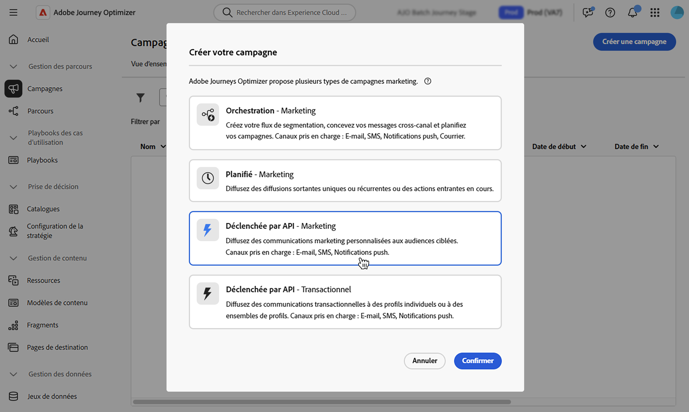
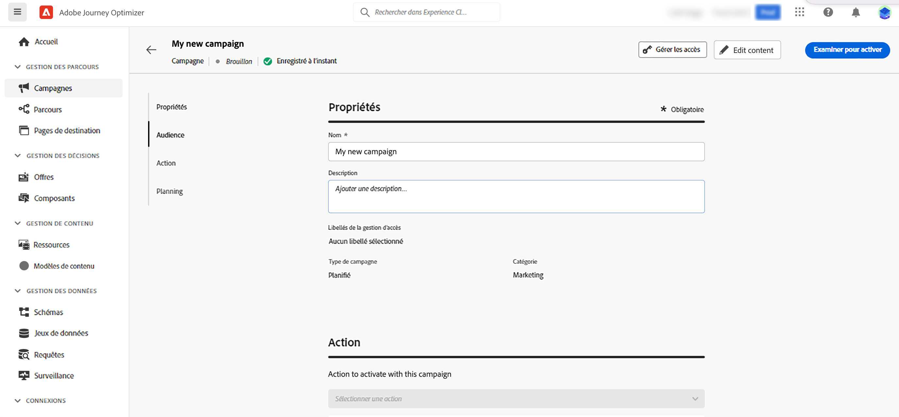

# Définir les propriétés d’une campagne déclenchée par API {#api-properties}

Pour créer une campagne déclenchée par API, procédez comme suit :

1. Accédez au menu **[!UICONTROL Campagnes]** et sélectionnez l’onglet **[!UICONTROL Déclenchée par API]**.

1. Cliquez sur le bouton **[!UICONTROL Créer une campagne]** et sélectionnez le type de campagne :

   * **[!UICONTROL Déclenchée par API - Marketing]** : sélectionnez ce type de campagne déclenchée par API pour envoyer des communications marketing personnalisées aux audiences ciblées.

   * **[!UICONTROL Déclenchées par API - Transactionnelles]** - Les campagnes transactionnelles sont destinées à envoyer des messages transactionnels, c’est-à-dire des messages envoyés suite à une action effectuée par une personne : demande de réinitialisation de mot de passe, achat de panier, etc.

   

1. Dans l’onglet **[!UICONTROL Propriétés]**, saisissez un nom et une description pour votre campagne.

   

1. Utilisez le champ **Balises** pour affecter des balises unifiées Adobe Experience Platform à votre campagne. Vous pouvez ainsi facilement les classer et améliorer la recherche à partir de la liste des campagnes. [Découvrez comment utiliser les balises](../start/search-filter-categorize.md#tags).

1. Vous pouvez limiter l’accès à cette campagne en fonction de libellés d’accès. Pour ajouter une limitation d’accès, cliquez sur le bouton **[!UICONTROL Gérer les accès]** en haut de cette page. Assurez-vous de sélectionner uniquement les libellés pour lesquels vous disposez des autorisations. [En savoir plus sur le contrôle d’accès au niveau de l’objet](../administration/object-based-access.md)

## Étapes suivantes {#next}

Une fois la configuration et le contenu de votre campagne prêts, vous pouvez configurer son action. [En savoir plus](api-triggered-campaign-action.md)
