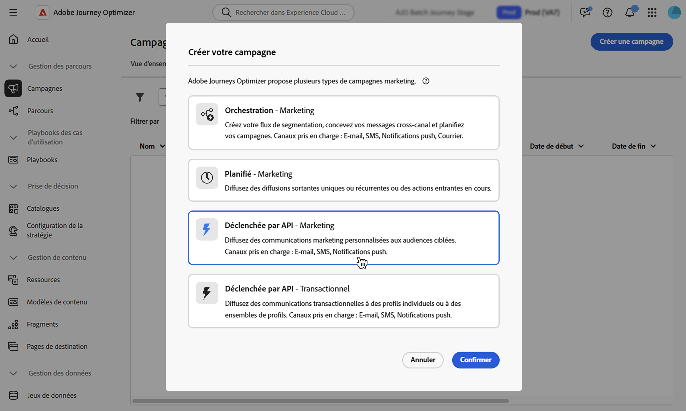

# Définir les propriétés d’une campagne déclenchée par API {#api-properties}

>[!BEGINSHADEBOX]

**Sur cette page :** créez une campagne déclenchée par une API et définissez son type, son nom, ses balises et ses libellés d’accès afin qu’elle soit correctement étendue et facile à trouver dès le départ.

>[!ENDSHADEBOX]

Pour créer une campagne déclenchée par API, procédez comme suit :

1. Accédez au menu **[!UICONTROL Campagnes]** et sélectionnez l’onglet **[!UICONTROL Déclenchée par API]**.

1. Cliquez sur le bouton **[!UICONTROL Créer une campagne]** et sélectionnez le type de campagne :

   * **[!UICONTROL Déclenchée par API - Marketing]** : sélectionnez ce type de campagne déclenchée par API pour envoyer des communications marketing personnalisées aux audiences ciblées.

   * **[!UICONTROL Déclenchée par API - Transactionnelle]** : les campagnes transactionnelles sont utilisées pour envoyer des messages transactionnels, c’est-à-dire des messages envoyés suite à une action effectuée par un individu : demande de réinitialisation du mot de passe, achat dans le panier, etc.

     +++Mode de débit élevé

     Pour les campagnes transactionnelles déclenchées par API, vous pouvez activer le mode de **[!UICONTROL débit élevé]**. Ce mode est conçu pour la messagerie en temps réel à grande échelle (jusqu’à 5 000 transactions par seconde) et offre une disponibilité supérieure avec une latence plus faible. [En savoir plus l’utilisation du mode de débit élevé](../campaigns/api-triggered-high-throughput.md)

     >[!AVAILABILITY]
     >
     >Actuellement, le mode de débit élevé est disponible uniquement pour le canal E-mail et aux États-Unis.
     >
     >Cette fonctionnalité n’est disponible que pour les organisations qui ont acheté le module complémentaire de **messagerie transactionnelle à débit élevé** d’Adobe. Pour plus d’informations, contactez votre représentant ou représentante Adobe.

     +++

   

1. Dans l’onglet **[!UICONTROL Propriétés]**, saisissez un nom et une description pour votre campagne.

   

1. Utilisez le champ **Balises** pour affecter des balises unifiées Adobe Experience Platform à votre campagne. Vous pouvez ainsi facilement les classer et améliorer la recherche à partir de la liste des campagnes. [Découvrez comment utiliser les balises](../start/search-filter-categorize.md#tags).

1. Vous pouvez limiter l’accès à cette campagne en fonction de libellés d’accès. Pour ajouter une limitation d’accès, cliquez sur le bouton **[!UICONTROL Gérer les accès]** en haut de cette page. Assurez-vous de sélectionner uniquement les libellés pour lesquels vous disposez des autorisations. [En savoir plus sur le contrôle d’accès au niveau de l’objet](../administration/object-based-access.md)

## Étapes suivantes {#next}

Une fois la configuration et le contenu de votre campagne prêts, vous pouvez configurer son action. [En savoir plus](api-triggered-campaign-action.md)
