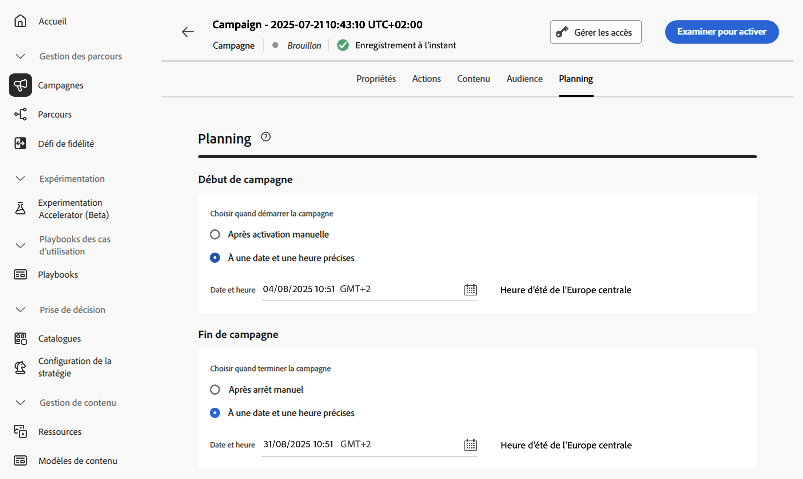

# Planifier la campagne déclenchée par API {#api-schedule}

Utilisez l’onglet **[!UICONTROL Planifier]** pour définir le planning de la campagne.

## Définir les dates de début et de fin

Par défaut, les campagnes déclenchées par API démarrent après avoir été déclenchées et se terminent dès que le message a été envoyé une fois. Si vous ne souhaitez pas exécuter votre campagne juste après son déclenchement, vous pouvez spécifier la date et l’heure auxquelles le message doit être envoyé à l’aide de l’option **[!UICONTROL Début de campagne]**.

L’option **[!UICONTROL Fin de la campagne]** vous permet de spécifier le moment où une campagne doit arrêter son exécution. En dehors des dates spécifiées, la campagne ne sera pas exécutée.

>[!NOTE]
>
>Lors de la planification de campagnes dans [!DNL Adobe Journey Optimizer], vérifiez que la date/l’heure de début correspond à la première diffusion souhaitée.

## Définir le contrôle du débit

[!DNL Journey Optimizer] vous permet d’activer le contrôle du débit pour les actions sortantes (e-mails, SMS, notifications push).

Cette fonctionnalité est particulièrement utile pour éviter la surcharge sur les systèmes en aval, tels que les pages de destination ou les plateformes d’assistance clientèle. Par exemple, vous pouvez définir une limite de débit de 165 messages par seconde pour garantir une diffusion régulière sans surcharger les systèmes en aval.

Pour définir le contrôle du débit, activez l’option **[!UICONTROL Limiter la diffusion]** dans la section **[!UICONTROL Paramètres de diffusion]** et indiquez le **[!UICONTROL Taux de diffusion]** par seconde souhaité.

* Taux de diffusion minimum pris en charge : 1 par seconde.
* Taux de diffusion maximal pris en charge : 2 000 par seconde lorsque l’option « Limiter la diffusion » est activée.

>[!IMPORTANT]
>
>Lors de la définition d’un taux de diffusion, le délai maximal d’exécution de l’audience de la campagne est de 12 heures. Si le taux de diffusion est défini sur une valeur qui ne permet pas d’envoyer le message à l’ensemble de l’audience dans un délai de 12 heures, les profils restants seront exclus de la campagne. Le nombre de ces profils exclus apparaît dans le rapport de campagne.

## Étapes suivantes {#next}

Une fois la configuration et le contenu de votre campagne prêts, vous pouvez les vérifier, puis les activer. [En savoir plus](../campaigns/review-activate-api-triggered-campaign.md)
