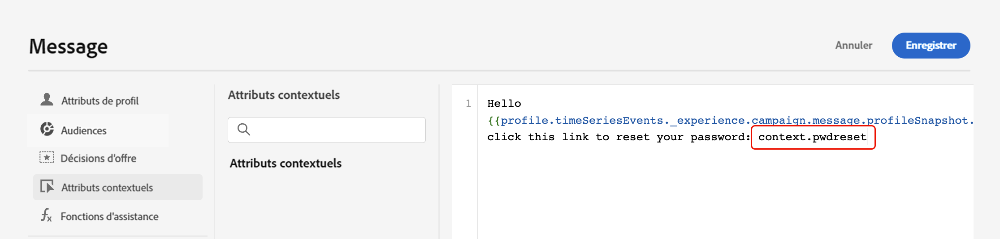

# Déclencher des campagnes à l’aide d’API {#trigger-campaigns}

## À propos des campagnes déclenchées par l’API {#about}

>[!NOTE]
>
>L’API d’exécution des messages interactifs est actuellement en version bêta et peut être fréquemment mise à jour sans préavis.

Avec [!DNL Journey Optimizer], vous pouvez créer des campagnes, puis les appeler à partir d’un système externe en fonction du déclencheur utilisateur à l’aide de la fonction [API REST d’exécution du message interactif](https://developer.adobe.com/journey-optimizer-apis/references/messaging/#tag/execution). Cela vous permet de couvrir divers besoins de messagerie opérationnelle et transactionnelle tels que les réinitialisations de mot de passe, le jeton OTP, etc.

Pour ce faire, vous devez d’abord créer une campagne déclenchée par une API dans Journey Optimizer, puis lancer son exécution via un appel API.

Les canaux disponibles pour les campagnes déclenchées par l’API sont les emails, les SMS et les messages push.

## Création d’une campagne déclenchée par une API {#create}

Le processus de création de campagnes déclenchées par l’API reste identique aux campagnes planifiées, à l’exception de la sélection d’audiences qui est effectuée dans la payload de l’API. Vous trouverez des informations détaillées sur la création d’une campagne dans la section [cette section](create-campaign.md).

Pour créer une campagne déclenchée par une API, procédez comme suit :

1. Créez une nouvelle campagne avec le **[!UICONTROL déclenché par l’API]** type.

1. Sélectionnez le canal et la surface du canal à utiliser pour envoyer votre message, puis cliquez sur **[!UICONTROL Créer]**.

   

1. Indiquez un titre et une description pour la campagne, puis configurez le message à envoyer.

   

   >[!NOTE]
   >
   >Vous pouvez transmettre des données supplémentaires dans la payload de l’API que vous pouvez exploiter pour personnaliser votre message. [En savoir plus](#contextual)

1. Indiquez l’espace de noms à utiliser pour identifier les individus du segment.

1. Configurez les dates de début et de fin de la campagne.

   Si vous configurez une date de début et/ou de fin spécifique pour une campagne, elle ne sera pas exécutée en dehors de ces dates et les appels d’API échoueront si la campagne est déclenchée par des API.

1. Dans le **[!UICONTROL requête cURL]** , récupérez la variable **[!UICONTROL Identifiant de campagne]** à utiliser dans la payload de l’API.

   

1. Cliquez sur **[!UICONTROL Réviser pour activer]** pour vérifier que votre campagne est correctement paramétrée, activez-la.

## Utilisation d’attributs contextuels dans des campagnes déclenchées par l’API {#contextual}

Avec les campagnes déclenchées par l’API, vous pouvez transmettre des données supplémentaires dans la payload de l’API et les utiliser dans la campagne pour personnaliser votre message.

Prenons cet exemple, où les clients souhaitent réinitialiser leur mot de passe et où vous souhaitez leur envoyer une URL de réinitialisation de mot de passe générée dans un outil tiers. Avec les campagnes déclenchées par l’API, vous pouvez transmettre cette URL générée dans la payload de l’API et l’exploiter dans la campagne pour l’ajouter au message.

>[!NOTE]
>
>Contrairement aux événements activés pour le profil, les données contextuelles transmises dans l’API REST sont utilisées pour une communication ponctuelle et ne sont pas stockées par rapport au profil. Au maximum, le profil est créé avec les détails de l’espace de noms, s’il a été détecté comme manquant.

Pour utiliser ces données dans vos campagnes, vous devez les transmettre dans la payload de l&#39;API et les ajouter dans votre message à l&#39;aide de l&#39;éditeur d&#39;expression. Pour ce faire, utilisez la méthode `{{context.<contextualAttribute>}}` syntaxe, où `<contextualAttribute>` doit correspondre au nom de la variable dans votre payload API contenant les données que vous souhaitez transmettre.

Le `{{context.<contextualAttribute>}}` La syntaxe est mappée à un type de données String uniquement.

>[!IMPORTANT]
>
>Le `context.system` La syntaxe est limitée à l’Adobe de l’utilisation interne uniquement et ne doit pas être utilisée pour transmettre des attributs contextuels.
Notez que, pour l’instant, aucun attribut contextuel n’est disponible dans le menu du rail de gauche. Les attributs doivent être saisis directement dans votre expression de personnalisation, sans vérification effectuée par [!DNL Journey Optimizer].

## Exécuter l&#39;opération {#execute}

Pour exécuter une campagne déclenchée par une API, vous devez d’abord récupérer son identifiant et le transmettre à la payload de l’API. Pour ce faire, ouvrez la campagne, puis copiez-collez l’identifiant à partir du **[!UICONTROL requête cURL]** .

Vous pouvez ensuite utiliser cet identifiant dans la charge utile de votre API pour déclencher la campagne. Reportez-vous à la section [Documentation de l’API d’exécution de message interactif](https://developer.adobe.com/journey-optimizer-apis/references/messaging/#tag/execution) pour plus d’informations.

Notez que si vous avez configuré une date de début et/ou de fin spécifique lors de la création de la campagne, elle ne sera pas exécutée en dehors de ces dates et les appels API échoueront.

>[!NOTE]
>
>Dans certains cas, vous devrez peut-être envoyer des messages transactionnels à des profils qui n’existent pas dans le système. Par exemple, si un utilisateur inconnu tente de se connecter à votre site web. Dans ce cas, le profil correspondant est automatiquement créé dans Adobe Experience Platform, dans la variable **Jeu de données de profil de messagerie interactive AJO** jeu de données.

## Ressources supplémentaires

* [Prise en main des campagnes](get-started-with-campaigns.md)
* [Créer une campagne](create-campaign.md)
* [Modifier ou arrêter une campagne](modify-stop-campaign.md)
* [Rapport dynamique de la campagne](campaign-live-report.md)
* [Rapport global de campagne](campaign-global-report.md)
