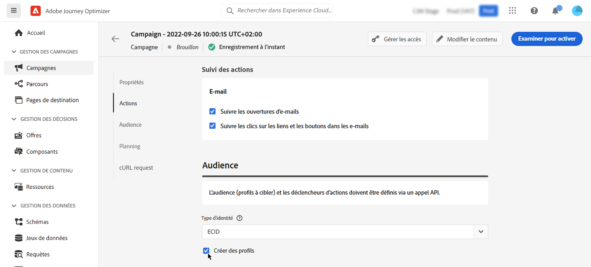

# Déclencher des campagnes à l’aide d’API {#trigger-campaigns}

## À propos des campagnes déclenchées par API {#about}

Avec [!DNL Journey Optimizer], vous pouvez créer des campagnes, puis les appeler à partir d’un système externe en fonction du déclencheur utilisateur à l’aide de la fonction [API REST d’exécution de message interactif](https://developer.adobe.com/journey-optimizer-apis/references/messaging/#tag/execution). Vous pouvez ainsi couvrir divers besoins de messagerie marketing et transactionnelle tels que les réinitialisations de mot de passe, le jeton OTP, etc.

Pour cela, vous devez d’abord créer une campagne déclenchée par une API dans Journey Optimizer, puis lancer son exécution via un appel API.

Les canaux disponibles pour les campagnes déclenchées par API sont E-mail, SMS et les messages push.

>[!NOTE]
>
>Pour l’instant, le mode Diffusion rapide n’est pas pris en charge pour les campagnes déclenchées par l’API de notification push.

➡️ [Découvrez cette fonctionnalité en vidéo.](#video)

## Créer une campagne déclenchée par API {#create}

### Configurer et activer la campagne {#create-activate}

Pour créer une campagne déclenchée par API, suivez les étapes ci-dessous. Vous trouverez des informations détaillées sur la création d’une campagne dans [cette section](create-campaign.md).

1. Créez une campagne avec le type **[!UICONTROL déclenché par API]**.

1. Choisissez la catégorie **[!UICONTROL Marketing]** ou **[!UICONTROL Transactionnelle]** selon le type de communication que vous souhaitez envoyer.

1. Sélectionnez l’un des canaux pris en charge et la surface de canal associée à utiliser pour envoyer votre message, puis cliquez sur **[!UICONTROL Créer]**.

   

1. Indiquez un titre et une description pour la campagne, puis cliquez sur **[!UICONTROL Modifier le contenu]** pour configurer le message à envoyer.

   >[!NOTE]
   >
   >Vous pouvez transmettre des données supplémentaires dans la payload de l’API que vous pouvez utiliser pour personnaliser votre message. [En savoir plus](#contextual)
   >
   >L’utilisation d’un grand nombre de données contextuelles importantes dans votre contenu peut avoir un impact sur les performances.

1. Dans la section **[!UICONTROL Audience]**, spécifiez l’espace de noms à utiliser pour identifier les personnes.

   * Si vous créez une campagne **transactionnelle**, les profils ciblés doivent être définis dans l’appel API. L’option **[!UICONTROL Créer de nouveaux profils]** permet de créer automatiquement des profils qui n’existent pas dans la base de données. [En savoir plus sur la création de profils lors de l’exécution de la campagne](#profile-creation)

   * Pour les campagnes **marketing**, cliquez sur le bouton **[!UICONTROL Audience]** pour sélectionner l’audience à cibler.

1. Configurez les dates de début et de fin de la campagne.

   Si vous configurez une date de début et/ou de fin spécifique pour une campagne, elle ne sera pas exécutée en dehors de ces dates et les appels API échoueront si la campagne est déclenchée par des API.

1. Cliquez sur **[!UICONTROL Examiner pour activer]** pour vérifier que votre campagne est correctement paramétrée, puis activez-la.

Vous pouvez maintenant exécuter la campagne à partir des API. [En savoir plus](#execute).

### Exécuter la campagne {#execute}

Une fois votre campagne activée, vous devez récupérer l’exemple de requête cURL généré et l’utiliser dans l’API pour créer votre payload et déclencher la campagne.

1. Ouvrez la campagne, puis copiez-collez la requête de payload depuis la section **[!UICONTROL requête cURL]**. Cette payload inclut toutes les variables de personnalisation (profil et contexte) utilisées dans le message. Elle est disponible une fois la campagne activée.

   

1. Utilisez cette requête cURL dans les API pour créer votre payload et déclencher la campagne. Pour plus d’informations, consultez la [documentation de l’API d’exécution de message interactif](https://developer.adobe.com/journey-optimizer-apis/references/messaging/#tag/execution).

   Des exemples d’appels API sont également disponibles sur [cette page](https://developer.adobe.com/journey-optimizer-apis/references/messaging-samples/).

   >[!NOTE]
   >
   >Si vous avez configuré une date de début et/ou de fin spécifique lors de la création de la campagne, elle ne sera pas exécutée en dehors de ces dates et les appels API échoueront.

## Utilisation d’attributs contextuels dans des campagnes déclenchées par API {#contextual}

Avec les campagnes déclenchées par API, vous pouvez transmettre des données supplémentaires dans la payload de l’API et les utiliser dans la campagne pour personnaliser votre message.

Prenons un exemple où les clients souhaitent réinitialiser leur mot de passe et où vous souhaitez leur envoyer une URL de réinitialisation de mot de passe générée dans un outil tiers. Avec les campagnes déclenchées par API, vous pouvez transmettre cette URL générée dans la payload de l’API et l’utiliser dans la campagne pour l’ajouter au message.

>[!NOTE]
>
>Contrairement aux événements activés pour le profil, les données contextuelles transmises dans l’API REST sont utilisées pour une communication ponctuelle et ne sont pas stockées par rapport au profil. Au maximum, le profil est créé avec les détails de l’espace de noms, s’il a été détecté comme manquant.

Pour utiliser ces données dans vos campagnes, vous devez les transmettre dans la payload de l’API et les ajouter dans votre message à l’aide de l’éditeur d’expression. Pour ce faire, utilisez la syntaxe `{{context.<contextualAttribute>}}`, où `<contextualAttribute>` doit correspondre au nom de la variable dans votre payload de l’API contenant les données que vous souhaitez transmettre.

La syntaxe `{{context.<contextualAttribute>}}` est mappée à un type de données String uniquement.

>[!IMPORTANT]
>
>Les attributs contextuels transmis dans la requête ne peuvent pas dépasser 50 Ko et sont toujours considérés de type chaîne.
>
>La syntaxe `context.system` est limitée à l’utilisation interne d’Adobe uniquement et ne doit pas être utilisée pour transmettre des attributs contextuels.

Notez que, pour l’instant, aucun attribut contextuel n’est disponible dans le menu du rail de gauche. Les attributs doivent être saisis directement dans votre expression de personnalisation, sans vérification effectuée par [!DNL Journey Optimizer].

## Création de profils lors de l’exécution de la campagne {#profile-creation}

Dans certains cas, vous devrez peut-être envoyer des messages transactionnels à des profils qui n’existent pas dans le système, par exemple si une personne inconnue tente de réinitialiser un mot de passe sur votre site web.

Lorsqu’un profil n’existe pas dans la base de données, Journey Optimizer vous permet de le créer automatiquement lors de l’exécution de la campagne afin de permettre l’envoi du message à ce profil.

>[!IMPORTANT]
>
>En cas de messages transactionnels, cette fonctionnalité est fournie pour la **création de profil à très petit volume** dans un cas d’utilisation d’envoi transactionnel à large volume, avec la majorité des profils déjà existants dans la plateforme.

Pour activer la création de profil lors de l’exécution de la campagne, activez l’option **[!UICONTROL Créer de nouveaux profils]** dans la section **[!UICONTROL Audience]**. Si cette option est désactivée, les profils inconnus sont refusés pour tout envoi et l’appel API échoue.

>[!NOTE]
>
>Les profils inconnus sont créés dans la variable **Jeu de données de profil de messagerie interactive AJO** jeu de données, dans trois espaces de noms par défaut (email, téléphone et ECID) pour chaque canal sortant (email, SMS et push). Cependant, si vous utilisez un espace de noms personnalisé, l’identité est créée avec le même espace de noms personnalisé.

## Vidéo pratique {#video}

Découvrez comment créer une campagne et la déclencher à partir d’un système externe en fonction des interactions des utilisateurs et utilisatrices, à l’aide de l’API REST d’exécution de message interactif.

>[!VIDEO](https://video.tv.adobe.com/v/3425358?quality=12)
