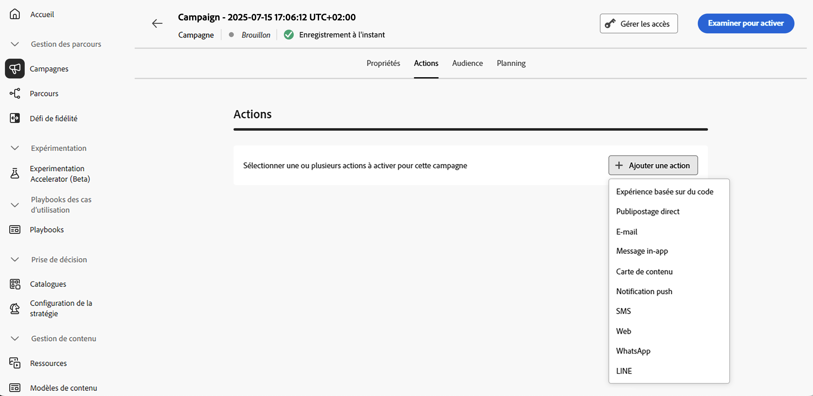
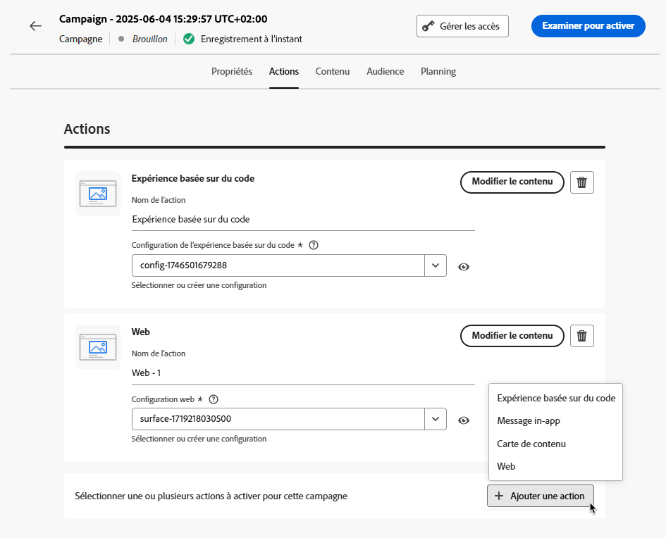

# Configurer l’action de campagne {#action-campaign-action}

Utilisez l’onglet **[!UICONTROL Actions]** afin de sélectionner une configuration de canal pour votre message et configurer des paramètres supplémentaires, tels que le suivi, l’expérience de contenu ou le contenu multilingue.

1. **Choisir le canal**

   Accédez à l’onglet **[!UICONTROL Actions]**, cliquez sur le bouton **[!UICONTROL Ajouter une action]** et sélectionnez le canal de communication.

   

   >[!NOTE]
   >
   >Pour plus d’informations sur les canaux pris en charge, reportez-vous au tableau de cette section : [Canaux dans les parcours et les campagnes](../channels/gs-channels.md#channels).
   >
   >Les canaux disponibles varient en fonction de votre modèle d’attribution de licence et de vos modules complémentaires.

   Si vous sélectionnez un canal entrant (expérience basée sur du code, message in-app, carte de contenu ou action web), vous pouvez ajouter d’autres actions entrantes, pour un total de 10 actions au maximum dans une seule campagne. [Voici comment procéder](#multi-action)

1. **Sélectionner une configuration de canal**

   Celle-ci est définie par une [équipe d’administration système](../start/path/administrator.md). Elle contient tous les paramètres techniques relatifs à l’envoi du message, tels que les paramètres d’en-tête, le sous-domaine, les applications mobiles, etc. [Découvrir comment configurer les canaux](../configuration/channel-surfaces.md)

   

1. **Utiliser l’optimisation**

   Utilisez la section **[!UICONTROL Optimisation]** pour exécuter des expériences de contenu, tirer parti des règles de ciblage ou utiliser des combinaisons avancées d’expérimentation et de ciblage. Ces différentes options et les étapes à suivre sont présentées dans [cette section](campaigns-message-optimization.md).
<!--
1. **Create a content experiment**

    Use the **[!UICONTROL Content experiment]** section to define multiple delivery treatments in order to measure which one performs best for your target audience. Click the **[!UICONTROL Create experiment]** button then follow the steps detailed in this section: [Create a content experiment](../content-management/content-experiment.md).-->

1. **Ajouter du contenu multilingue**

   Utilisez la section **[!UICONTROL Langues]** pour créer du contenu dans plusieurs langues au sein de votre campagne. Pour ce faire, cliquez sur le bouton **[!UICONTROL Ajouter des langues]** et sélectionnez l’option **[!UICONTROL Paramètres de langue]** souhaitée. Vous trouverez des informations détaillées sur la configuration et l’utilisation des fonctionnalités multilingues dans [cette section](../content-management/multilingual-gs.md).

Des paramètres supplémentaires sont disponibles en fonction du canal de communication sélectionné. Pour plus d’informations, développez les sections ci-dessous.

+++**Appliquer des règles de limitation** (e-mail, courrier, notification push, SMS)

Dans la liste déroulante **[!UICONTROL Règles métier]**, sélectionnez un jeu de règles pour appliquer des règles de limitation à votre campagne. L’utilisation des jeux de règles de canal vous permet de définir un capping de fréquence par type de communication afin d’éviter d’envoyer trop de messages similaires aux clientes et aux clients. [Découvrir comment utiliser les jeux de règles](../conflict-prioritization/rule-sets.md)

+++

+++**Suivre l’engagement** (e-mail, SMS).

Utilisez la section **[!UICONTROL Suivi des actions]** pour suivre la réaction des personnes destinataires à vos diffusions e-mail ou SMS. Les résultats du suivi sont accessibles dans le rapport de la campagne, une fois celle-ci exécutée. [En savoir plus sur les rapports de campagne](../reports/campaign-global-report-cja.md)

+++

+++**Activer le mode de diffusion rapide** (notifications push).

Le mode de diffusion rapide est un module complémentaire [!DNL Journey Optimizer] qui permet d’envoyer très rapidement des messages push en grandes quantités dans le cadre de campagnes. La diffusion rapide est utilisée lorsque le retard dans la diffusion des messages est critique pour l’entreprise, quand vous souhaitez envoyer une alerte push urgente sur les téléphones mobiles, par exemple une nouvelle de dernière minute aux personnes qui ont installé votre application d&#39;actualités. Découvrez comment activer le mode de diffusion rapide pour les notifications push [sur cette page](../push/create-push.md#rapid-delivery).

Pour plus d’informations sur les performances lors de l’utilisation du mode de diffusion rapide, reportez-vous à la section [Description du produit Adobe Journey Optimizer](https://helpx.adobe.com/fr/legal/product-descriptions/adobe-journey-optimizer.html){target="_blank"}.

+++

+++**Attribuer des scores de priorité** (web, in-app, basé sur du code)

L’attribution d’un score de priorité à la campagne vous permet de donner la priorité à une campagne entrante en cas de contrainte imposée, par exemple un capping de fréquence. Saisissez une valeur numérique (comprise entre 0 et 100). Notez que plus le nombre est élevé, plus la priorité est importante. [Découvrir comment attribuer des scores de priorité aux parcours et campagnes](../conflict-prioritization/priority-scores.md)

+++

+++**Définir des règles de diffusion supplémentaires** (cartes de contenu)

Pour les campagnes par cartes de contenu, vous pouvez activer des règles de diffusion supplémentaires afin de choisir les événements et critères qui déclenchent votre message. [Découvrir comment créer des cartes de contenu](../content-card/create-content-card.md)

+++

+++**Définir des déclencheurs** (in-app)

Pour les messages in-app, vous pouvez utiliser le bouton **[!UICONTROL Modifier les déclencheurs]** pour choisir les événements et les critères qui déclenchent votre message. [Découvrir comment créer un message in-app](../in-app/create-in-app.md)

+++

## Ajouter plusieurs actions entrantes {#multi-action}

>[!CONTEXTUALHELP]
>id="ajo_multi_action"
>title="Ajouter plusieurs actions entrantes"
>abstract="Vous pouvez sélectionner plusieurs actions entrantes au sein d’une même campagne. Cette fonctionnalité permet de diffuser plusieurs expériences basées sur du code, messages in-app, cartes de contenu ou actions web à différents emplacements en même temps, chaque action comportant du contenu spécifique."

Pour simplifier votre orchestration des campagnes, vous pouvez définir plusieurs actions entrantes au sein d’une seule campagne, chaque action contenant un contenu spécifique.

>[!NOTE]
>
>Cette fonctionnalité est uniquement disponible pour les canaux entrants. Actuellement, les canaux sortants comme l’E-mail ne sont pas pris en charge.

Cette fonctionnalité permet de diffuser plusieurs expériences basées sur du code, messages in-app, cartes de contenu ou actions web à différents emplacements en même temps, sans avoir besoin de créer plusieurs campagnes. Le déploiement de votre campagne en est facilité et les rapports sont plus fluides, toutes les données étant consolidées dans une seule campagne.

Par exemple, vous pouvez envoyer une expérience basée sur du code à plusieurs points d’entrée avec des contenus légèrement différents. Pour ce faire, créez plusieurs actions basées sur du code dans la même campagne, chacune avec une configuration de point d’entrée différente.

Pour définir plusieurs actions entrantes dans une campagne, procédez comme suit.

1. Sélectionnez une action entrante (**Expérience basée sur du code**, **message in-app**, **carte de contenu** ou **web**) dans la section **[!UICONTROL Actions]**.

1. Sélectionnez la configuration des canaux et définissez un contenu spécifique pour cette action.

1. Utilisez le bouton **[!UICONTROL Ajouter une action]** pour sélectionner une autre action entrante dans la liste déroulante.

   {width="80%"}

1. Procédez de la même manière pour ajouter d’autres actions. Vous pouvez ajouter jusqu’à 10 actions entrantes dans une campagne.

Une fois la campagne [en ligne](review-activate-campaign.md), toutes les actions sont activées simultanément.

## Étapes suivantes {#next}

Une fois votre action de campagne créée, vous pouvez concevoir son contenu. [En savoir plus](campaign-content.md)
