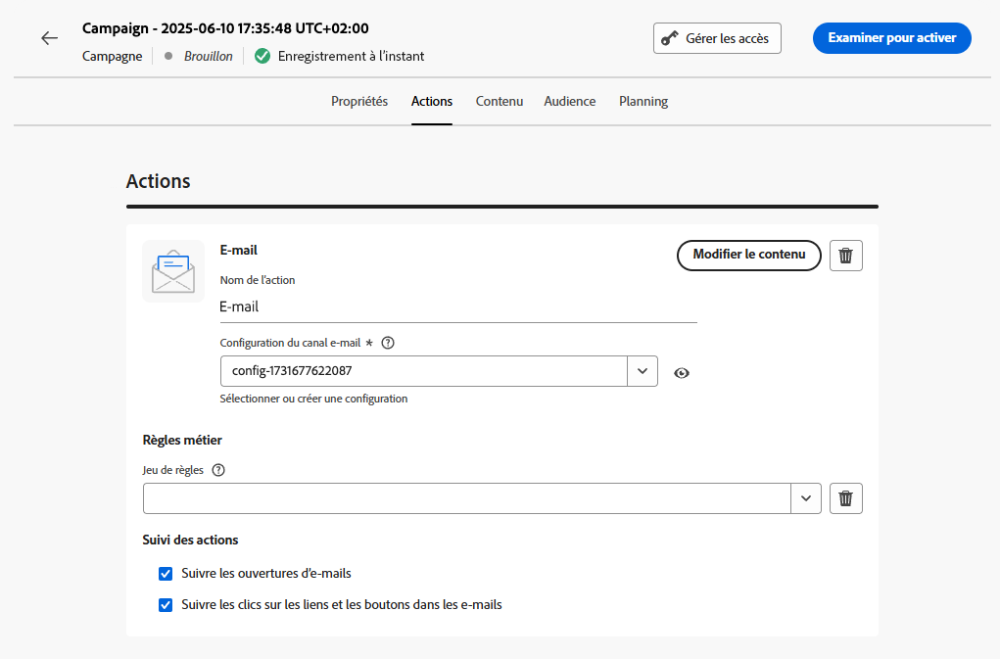

# Configurer l’action de campagne {#action-campaign-action}

Utilisez l’onglet **[!UICONTROL Actions]** pour sélectionner une configuration de canal pour votre message et configurer des paramètres supplémentaires tels que le suivi, l’expérience de contenu ou le contenu multilingue.

1. **Choisir le canal**

   Accédez à l’onglet **[!UICONTROL Actions]**, cliquez sur le bouton **[!UICONTROL Ajouter une action]** et sélectionnez le canal de communication.

   

   >[!NOTE]
   >
   >Les canaux disponibles varient en fonction de votre modèle de licence et de vos modules complémentaires.

1. **Sélectionner une configuration de canal**

   Celle-ci est définie par une [équipe d’administration système](../start/path/administrator.md). Elle contient tous les paramètres techniques relatifs à l’envoi du message, tels que les paramètres d’en-tête, le sous-domaine, les applications mobiles, etc. [Découvrez comment configurer des canaux](../configuration/channel-surfaces.md)

   

1. **Créer une expérience de contenu**

   Utilisez la section **[!UICONTROL Expérience de contenu]** pour définir plusieurs traitements de diffusion afin de mesurer celui qui fonctionne le mieux pour votre audience cible. Cliquez sur le bouton **[!UICONTROL Créer une expérience]** puis suivez les étapes détaillées dans cette section : [Créer une expérience de contenu](../content-management/content-experiment.md).

1. **Ajouter du contenu multilingue**

   Utilisez la section **[!UICONTROL Langues]** pour créer du contenu dans plusieurs langues au sein de votre campagne. Pour ce faire, cliquez sur le bouton **[!UICONTROL Ajouter des langues]** et sélectionnez l’option **[!UICONTROL Paramètres de langue]** souhaitée. Vous trouverez des informations détaillées sur la configuration et l’utilisation des fonctionnalités multilingues dans cette section : [Prise en main du contenu multilingue](../content-management/multilingual-gs.md)

Des paramètres supplémentaires sont disponibles en fonction du canal de communication sélectionné. Pour plus d’informations, développez les sections ci-dessous.

+++**Appliquer des règles de limitation** (e-mail, publipostage direct, notification push, SMS)

Dans la liste déroulante **[!UICONTROL Règles métier]**, sélectionnez un ensemble de règles pour appliquer des règles de limitation à votre campagne. L’utilisation des jeux de règles de canal vous permet de définir un capping de fréquence par type de communication afin d’éviter de surcharger les clients avec des messages similaires. [Découvrir comment utiliser les jeux de règles](../conflict-prioritization/rule-sets.md)

+++

+++**Suivre l’engagement** (e-mail, SMS).

Utilisez la section **[!UICONTROL Tracking des actions]** pour suivre la réaction des destinataires à vos diffusions e-mail ou SMS. Les résultats du suivi sont accessibles dans le rapport de la campagne, une fois celle-ci exécutée. [En savoir plus sur les rapports de campagne](../reports/campaign-global-report-cja.md)

+++

+++**Activer le mode de diffusion rapide** (notification push).

Le mode de diffusion rapide est un module complémentaire [!DNL Journey Optimizer] qui permet d’envoyer très rapidement des messages push en grande quantité dans le cadre d’une campagne. La diffusion rapide est utilisée lorsque le retard de diffusion des messages est critique pour l’entreprise, lorsque vous souhaitez envoyer une alerte push urgente sur les téléphones mobiles, par exemple des nouvelles importantes aux utilisateurs qui ont installé votre application de canal d’actualités. Pour plus d’informations sur les performances lors de l’utilisation du mode de diffusion rapide, reportez-vous à la section [Description du produit Adobe Journey Optimizer](https://helpx.adobe.com/fr/legal/product-descriptions/adobe-journey-optimizer.html).

+++

+++**Attribuer des scores de priorité** (web, in-app, basé sur du code)

L’attribution d’un score de priorité à la campagne vous permet de donner la priorité à une campagne entrante en cas de contrainte imposée telle qu’une limitation de fréquence. Saisissez une valeur numérique (comprise entre 0 et 100). Notez que plus le nombre est élevé, plus la priorité l’est aussi. [Découvrir comment attribuer des scores de priorité aux parcours et campagnes](../conflict-prioritization/priority-scores.md)

+++

+++**Définir des règles de diffusion supplémentaires** (cartes de contenu)

Pour les campagnes par cartes de contenu, vous pouvez activer des règles de diffusion supplémentaires afin de choisir le ou les événements et critères qui déclenchent votre message. [Découvrez comment créer des cartes de contenu](../content-card/create-content-card.md)

+++

+++**Définir des déclencheurs** (in-app)

Pour les messages in-app, vous pouvez utiliser le bouton **[!UICONTROL Modifier les déclencheurs]** pour choisir le ou les événements et les critères qui déclenchent votre message. [Découvrez comment créer un message in-app](../in-app/create-in-app.md)

+++

## Étapes suivantes {#next}

Une fois votre action de campagne prête, vous pouvez concevoir son contenu. [En savoir plus](campaign-content.md)
