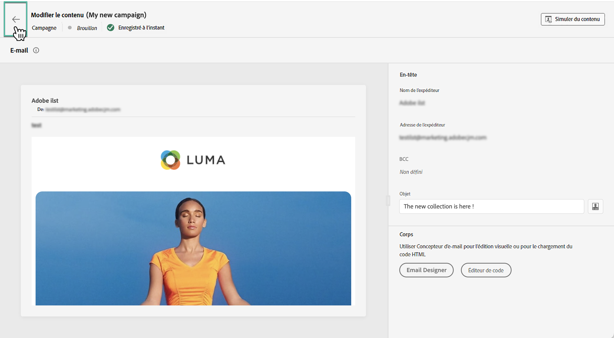

# Modifier le contenu d’une campagne d’action {#action-campaign-content}

Pour configurer le contenu du message, accédez à l’onglet **[!UICONTROL Contenu]** ou cliquez sur le bouton **[!UICONTROL Modifier le contenu]**.

## Concevoir le contenu {#action-campaign-channels}

Le processus de création du contenu dépend du canal que vous avez sélectionné. Découvrez les étapes détaillées pour créer le contenu de votre message dans les pages suivantes :

<table style="table-layout:fixed"><tr style="border: 0;">
<td>

<a href="../email/create-email.md"><strong>E-mail</strong></a>
</td>
<td>

<a href="../mobile/create-mobile-message.md"><strong>SMS</strong></a>
</td>
<td>

<a href="../push/create-push.md"><strong>Notification push</strong></a>
</td>
<td>

<a href="../direct-mail/create-direct-mail.md"><strong>Courrier</strong></a>
</td>
</tr></table>

<table style="table-layout:fixed"><tr style="border: 0;">
<td>

<a href="../in-app/create-in-app.md"><strong>In-app</strong></a>
</td>
<td>

<a href="../web/create-web.md"><strong>Web</strong></a>
</td>
<td>

<a href="../code-based/create-code-based.md"><strong>Expérience basée sur du code</strong></a>
</td>
<td>

<a href="../content-card/create-content-card.md"><strong>Cartes de contenu</strong></a>
</td>
</tr></table>

<table style="table-layout:fixed"><tr style="border: 0;">
<td></td>
<td>

<a href="../line/get-started-line.md"><strong>LINE</strong></a>
</td>
<td>

<a href="../whatsapp/get-started-whatsapp.md"><strong>WhatsApp</strong></a>
</td>
<td></td>
</tr></table>

## Tester et vérifier votre contenu

Une fois votre contenu défini, cliquez sur le bouton **[!UICONTROL Simuler du contenu]** pour prévisualiser et tester votre contenu. Vous pouvez utiliser l’une des méthodes de simulation suivantes :

* Cliquez sur **[!UICONTROL Simuler du contenu]** pour tester les variations de contenu avec des exemples de données d’entrée ou la génération automatique d’IA.
* Cliquez sur **[!UICONTROL Simuler du contenu]** puis sélectionnez **[!UICONTROL Simuler du contenu (profils AEP)]** dans la liste déroulante pour afficher un aperçu avec des profils de test.

[Découvrez comment prévisualiser et tester du contenu.](../content-management/preview-test.md)

Pour revenir à l’écran de création de campagne, cliquez sur la flèche pointant vers la gauche.

## Étapes suivantes {#next}

Une fois que le contenu de votre campagne d’action est prêt, vous pouvez définir l’audience de la campagne. [En savoir plus](campaign-audience.md)
